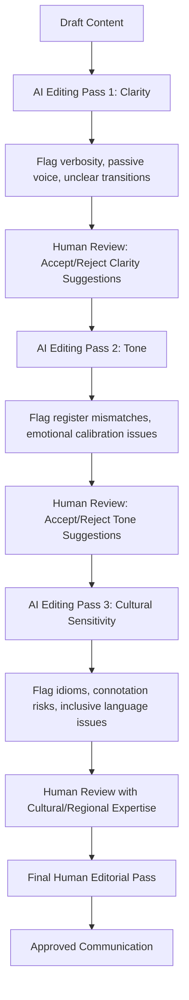

## AI-Assisted Editing for Clarity, Tone, and Cultural Sensitivity

### Definition and Scope

This topic covers the use of AI language tools in the editing and refinement phase of executive communication — after initial drafting — specifically for improving clarity (readability, conciseness, structural coherence), tone (register, emotional calibration, audience appropriateness), and cultural sensitivity (avoiding language that could alienate, offend, or be misunderstood across diverse or global audiences). This is distinct from AI-assisted drafting; the focus here is refinement of existing human- or AI-generated content.

### Positioning AI Editing in the Communication Workflow

**Key Points**

- AI editing tools function most effectively as a diagnostic and suggestion layer — flagging potential issues (ambiguous phrasing, tonal mismatches, culturally loaded terms) — with final judgment remaining human, particularly for high-stakes or nuanced content.
- Unlike grammar-only tools, modern AI language models can evaluate tone, register, and cultural connotation holistically across a document, not just at the sentence level, making them useful for consistency checks across long documents.
- The output quality of AI editing is highly dependent on how the task is framed (the prompt/instructions given); vague requests ("make this better") produce less useful results than specific, criteria-based requests.

### Core Editing Applications

#### 1. Clarity Editing

- **Redundancy and verbosity reduction**: AI tools can identify and suggest trimming of redundant phrasing, filler words, and overly complex sentence structures common in first drafts.
- **Readability calibration**: Adjusting sentence length, vocabulary complexity, and structure to match the target audience's expected reading level (e.g., a board memo vs. an all-employee announcement warrant different complexity levels).
- **Logical flow and structure**: Identifying gaps in argument sequencing or unclear transitions between ideas, useful for long-form documents like strategic memos or board decks.

**Example prompt pattern**: "Review this paragraph for clarity. Flag any sentence over 25 words, any passive voice construction, and any place where the logical connection between sentences is unclear."

#### 2. Tone Editing

- **Register calibration**: Adjusting formality level to match context (e.g., converting an internally-drafted, casual update into board-appropriate formal register, or vice versa).
- **Emotional calibration**: For sensitive content (layoffs, restructuring, crisis communication), AI tools can help identify phrasing that may read as cold, dismissive, or insufficiently empathetic — though final judgment on emotionally sensitive content should rest with experienced human communicators given the stakes involved.
- **Consistency checking**: Flagging tonal inconsistency within a single document (e.g., a memo that shifts unexpectedly from formal to casual register mid-document).

#### 3. Cultural Sensitivity Editing

- **Idiom and metaphor flagging**: Identifying culturally specific idioms, sports metaphors, or references that may not translate or may confuse non-native-English readers or international audiences.
- **Inclusive language checking**: Flagging outdated, gendered, or non-inclusive terminology against current style guide standards (verify against current, region-specific guidance, since terminology norms evolve and vary geographically).
- **Connotation checking for global audiences**: Identifying words or phrases that carry different connotations across cultural contexts (e.g., directness that could read as rude in high-context cultures, discussed further under cross-cultural communication frameworks).

### Diagram: AI-Assisted Editing Pipeline

### Prompt Design for Effective AI Editing

#### Criteria-Based Prompting

Effective editing prompts specify explicit criteria rather than vague quality judgments, since AI models perform more reliably against concrete, checkable criteria than open-ended aesthetic requests.

| Vague Prompt | Criteria-Based Prompt |
| --- | --- |
| "Make this sound better" | "Reduce average sentence length to under 20 words and eliminate passive voice" |
| "Check for cultural issues" | "Flag any American-specific idioms, sports metaphors, or references that would be unfamiliar to a non-US audience" |
| "Fix the tone" | "Adjust this from a casual internal tone to a formal register appropriate for a board audience; flag any contractions or informal phrasing" |

#### Audience-Specific Editing Instructions

**Example**: "Review this announcement for a global audience spanning North America, Western Europe, and East Asia. Flag any phrasing that assumes low-context, direct communication norms and may read as overly blunt in high-context cultural settings. Suggest alternative phrasing that preserves the core message while softening directness."

### Limitations and Risk Considerations

- **Cultural nuance depth**: AI tools can flag commonly known cultural sensitivities and idioms but should not be treated as a substitute for review by someone with direct cultural or regional expertise for high-stakes, multi-region communications — model training data reflects general patterns, not necessarily current, region-specific, or subculture-specific nuance. [Inference — reliability varies significantly by specific cultural context and how well-represented it is in training data.]
- **False confidence risk**: A clean AI-edited pass with no flagged issues does not guarantee the content is free of cultural sensitivity problems; absence of a flag reflects the tool's detection scope, not a verified absence of risk.
- **Overcorrection risk**: Aggressive tone or clarity editing can flatten distinctive executive voice into generic corporate language if applied without calibration against the executive's established style.
- **Context blindness**: AI editing tools generally lack awareness of specific organizational history, prior incidents, or internal sensitivities (e.g., a phrase that's fine generally but loaded given a recent internal event) that a human reviewer with institutional knowledge would catch.

### Governance Recommendations

- For any communication reaching external, multi-region, or otherwise diverse audiences, AI-flagged cultural sensitivity issues should be treated as a first-pass filter, with final review by regional communications staff, employee resource groups, or cultural consultants where available and appropriate for the stakes involved.
- High-stakes emotionally sensitive content (crisis communication, layoffs, disciplinary matters) should use AI editing only for clarity/structure support, with tone and cultural judgment resting primarily with experienced human communicators and, where relevant, HR/legal input.
- Maintaining a documented style guide (organizational tone preferences, approved/avoided terminology, inclusive language standards) that can be fed into AI editing prompts improves consistency and reduces reliance on the tool's generic defaults.

### Practical Checklist

- [ ] Editing prompt specifies concrete criteria (sentence length, register, specific terminology) rather than vague quality requests
- [ ] Clarity, tone, and cultural sensitivity treated as distinct editing passes with different evaluation criteria
- [ ] AI-flagged cultural sensitivity issues reviewed by regional/cultural expertise for high-stakes, multi-region content
- [ ] Organizational style guide and terminology standards incorporated into editing prompts where available
- [ ] Final human pass confirms voice authenticity has not been flattened by editing suggestions
- [ ] High-emotional-stakes content receives human-led tone judgment, with AI limited to structural/clarity support

### Common Pitfalls

- **Treating AI clearance as final sign-off**: Assuming content is culturally safe because an AI editing pass flagged no issues, without independent review for high-stakes content.
- **Losing authentic voice**: Applying AI tone-smoothing so heavily that distinctive executive voice is replaced with generic, homogenized corporate language.
- **Single-pass editing**: Attempting to address clarity, tone, and cultural sensitivity in one undifferentiated editing request, which tends to produce shallower results than sequential, criteria-specific passes.
- **Assuming universal cultural coverage**: Relying on AI cultural sensitivity checks without recognizing that model training data may underrepresent specific regions, subcultures, or recent shifts in terminology norms.

### Related Topics

- Using AI for Research and First Drafts
- Building Inclusive, Culturally Aware Communication
- Written Digital Communication and Tone in Chat
- Crisis Communication and Sensitive Announcements
- Data Governance and Confidentiality in AI Tool Adoption
- Style Guide Development for Organizational Communication