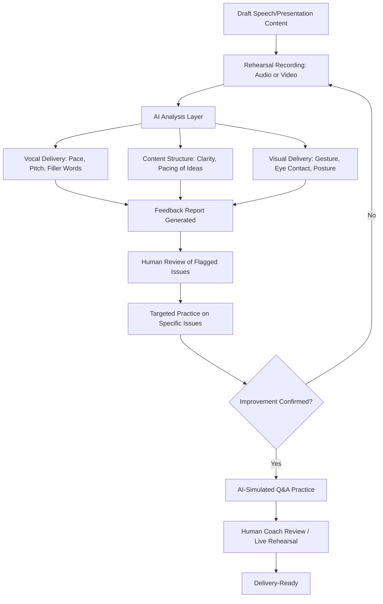

## AI-Assisted Rehearsal and Delivery Feedback

### Definition and Scope

This topic covers the use of AI-powered tools to support rehearsal and delivery refinement for spoken executive communication — speeches, presentations, town halls, media interviews — through automated analysis of vocal delivery, pacing, filler words, body language, and content structure, as well as AI-simulated Q&A and audience-response practice. This is distinct from AI-assisted drafting/editing; the focus here is on the performance and delivery layer rather than written content.

### Categories of AI-Assisted Rehearsal Tools

**Key Points**

- These tools generally fall into three functional categories: (1) vocal/verbal delivery analysis, (2) simulated audience/Q&A practice, and (3) visual/body language feedback via video analysis.
- Most current tools function as automated coaching aids that flag patterns for human self-correction, rather than fully autonomous replacements for human coaching or live audience testing.
- Effectiveness depends heavily on how rehearsal feedback is applied — flagging an issue (e.g., excessive filler words) is only useful if paired with deliberate practice to address it.

### Diagram: AI-Assisted Rehearsal Workflow

### Vocal and Verbal Delivery Analysis

#### Common Metrics AI Tools Analyze

| Metric | What It Measures | Why It Matters |
| --- | --- | --- |
| Speaking pace (words per minute) | Rate of speech delivery | Too fast reduces comprehension; too slow can lose engagement |
| Filler word frequency | "Um," "uh," "like," "you know" | High frequency reduces perceived confidence and polish |
| Pitch variation | Vocal monotone vs. dynamic range | Monotone delivery reads as disengaged or unprepared |
| Pause patterns | Strategic pauses vs. hesitation pauses | Distinguishes deliberate emphasis from uncertainty |
| Volume consistency | Variation and projection | Affects perceived confidence and audibility |

**Example**: A tool might flag "47 filler words in a 5-minute rehearsal, concentrated in the Q&A transition section" — actionable because it identifies both the pattern and the specific location for targeted practice, rather than a generic "reduce filler words" note.

#### Practical Application

- Recording multiple rehearsal passes and comparing metrics over time (e.g., filler word count trending down across three rehearsals) provides an objective progress indicator that supplements subjective self-assessment.
- Transcription-based analysis (converting speech to text for pattern analysis) underlies most vocal delivery tools; accuracy depends on transcription quality, which can be affected by accent, audio quality, and background noise. [Inference — general limitation of speech-to-text technology; varies by specific tool and audio conditions.]

### Content Structure and Pacing Feedback

- AI analysis of rehearsal transcripts can flag structural issues: uneven time allocation across sections, unclear transitions, or a mismatch between planned outline and actual delivered content (common when speakers improvise away from prepared structure).
- Useful for identifying whether key messages are actually being delivered with appropriate emphasis and timing, versus buried or rushed in practice compared to the written plan.

### Simulated Q&A and Audience Practice

#### AI-Generated Question Simulation

- AI tools can generate likely audience questions based on the content of a speech or presentation, useful for stress-testing preparedness for Q&A segments, particularly for anticipating difficult or adversarial questions in high-stakes settings (earnings calls, media interviews, crisis briefings).
- **Example prompt pattern**: "Based on this town hall announcement about restructuring, generate 10 likely employee questions, including at least 3 difficult or skeptical questions we should be prepared to address directly."

#### Adversarial/Stress-Test Practice

- For media training and crisis communication rehearsal specifically, AI can simulate adversarial interview questioning (following up, challenging inconsistencies, pressing on sensitive points) as a practice tool, though experienced human media trainers typically remain the gold standard for this due to the ability to adapt dynamically and read real-time reactions in ways current tools may not fully replicate. [Inference — relative effectiveness compared to human coaching is context-dependent and evolving as tools improve.]

### Visual and Body Language Feedback

- Video-based analysis tools can flag patterns such as excessive stillness, repetitive gestures, inconsistent eye contact with camera, or posture issues, using computer vision techniques to track movement and gaze direction across a recorded rehearsal.
- Particularly relevant for video-based delivery (see related topic on video call presence), where camera eye-line and framing consistency are more measurable and correctable than in live in-person settings.

### Integration Into Rehearsal Practice

#### Recommended Workflow Structure

1. **Initial run-through**: Record a full rehearsal without interruption to get a baseline.
2. **AI analysis review**: Review the flagged metrics and identify 2-3 highest-priority issues rather than attempting to address every flagged item simultaneously.
3. **Targeted practice**: Rehearse specific segments where issues were concentrated (e.g., re-practicing just the opening if filler words clustered there).
4. **Follow-up recording and comparison**: Re-record and compare against baseline metrics to confirm improvement.
5. **Human coaching layer**: For high-stakes delivery, supplement AI feedback with human coaching (communications staff, executive coach) for nuanced judgment AI tools may miss (audience-specific calibration, organizational context, genuine emotional authenticity).

### Limitations and Risk Considerations

- **Metric-chasing risk**: Over-optimizing for measurable metrics (filler word count, pace) can produce technically "clean" but emotionally flat delivery if pursued at the expense of natural authenticity and genuine connection with the audience.
- **Context blindness**: AI tools generally cannot assess whether content is strategically appropriate, organizationally sensitive, or accurately represents the executive's actual position — they assess delivery mechanics, not message substance or judgment.
- **Overreliance on simulated Q&A**: AI-generated practice questions, while useful for breadth of preparation, may not fully anticipate organization-specific political dynamics or highly specific insider knowledge that a human colleague familiar with the actual stakeholders would surface.
- **Privacy and data considerations**: Rehearsal recordings, particularly for sensitive content (unreleased financial results, restructuring announcements, crisis statements), involve the same data governance considerations as other AI tool usage — verify what happens to recorded/uploaded rehearsal content with the specific tool provider before using it for sensitive material. [Verify current data handling policies with the specific tool provider, as these vary by product and change over time.]

### Practical Checklist

- [ ] Baseline rehearsal recorded before applying AI feedback for comparison
- [ ] 2-3 highest-priority issues identified from AI feedback rather than attempting to fix everything at once
- [ ] Targeted practice applied to specific flagged segments, not just general awareness
- [ ] AI-simulated Q&A supplemented with human-generated questions reflecting organization-specific context
- [ ] High-stakes rehearsal content checked against tool's data handling/privacy policy before use
- [ ] Human coaching layer applied for nuanced judgment beyond delivery mechanics, especially for high-stakes settings
- [ ] Final rehearsal pass prioritizes natural authenticity over purely metric-optimized delivery

### Common Pitfalls

- **Over-mechanizing delivery**: Producing technically polished but emotionally disconnected delivery from excessive metric optimization.
- **Treating AI Q&A simulation as comprehensive**: Assuming AI-generated practice questions cover the full range of likely difficult questions without supplementing with human, context-specific insight.
- **Ignoring transcription/analysis accuracy limits**: Taking flagged metrics as fully precise without accounting for potential transcription errors, especially with accents, technical vocabulary, or challenging audio conditions.
- **Skipping human coaching for high-stakes delivery**: Relying solely on AI feedback for genuinely high-stakes communication (major crisis response, critical investor presentations) where experienced human coaching judgment remains valuable.
- **Recording sensitive content without checking data policy**: Uploading rehearsal footage containing confidential or material nonpublic information to tools without verifying data handling practices.

### Related Topics

- Presence and Delivery on Video Calls
- Media Training for Video Interviews
- Using AI for Research and First Drafts
- AI-Assisted Editing for Clarity, Tone, and Cultural Sensitivity
- Managing Q&A and Live Audience Interaction Remotely
- Data Governance and Confidentiality in AI Tool Adoption