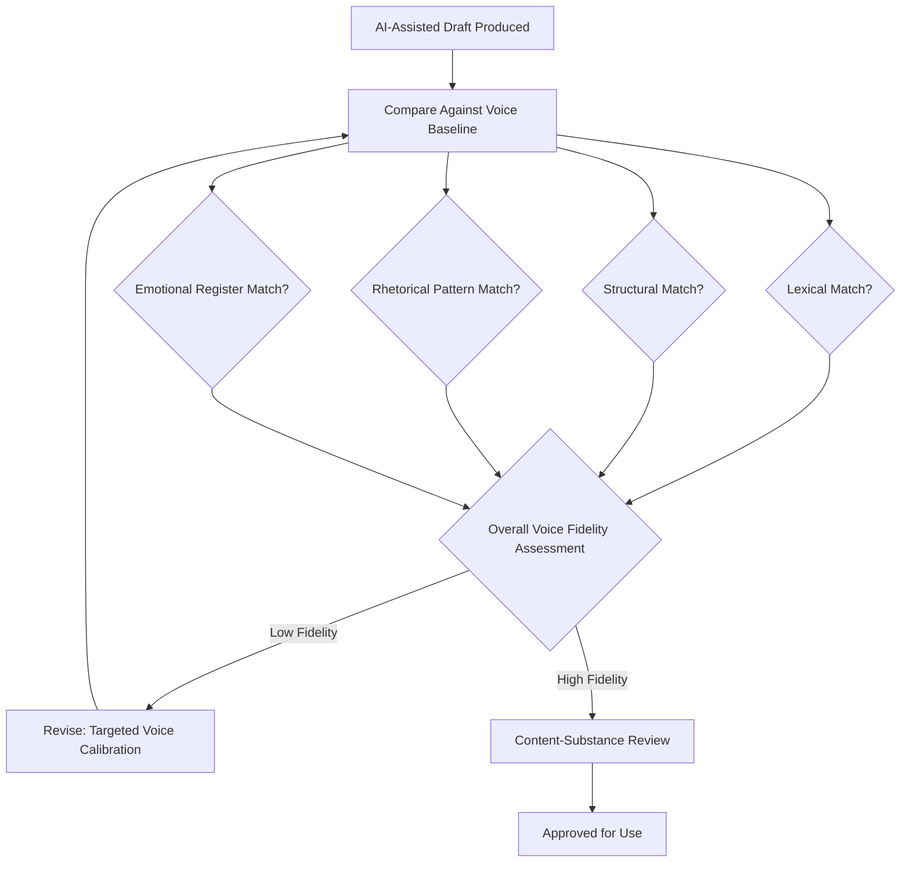

## Evaluating Authenticity and Voice in AI-Assisted Content

### Definition and Scope

This topic addresses how to assess whether AI-assisted communication content genuinely reflects an executive's authentic voice, values, and judgment, as distinct from generic, templated, or algorithmically homogenized output. As AI tools become embedded in drafting and editing workflows, the ability to evaluate and preserve authenticity becomes a distinct communication competency, separate from the mechanics of using the tools themselves.

### Why Voice Authenticity Matters

**Key Points**

- Audiences — employees, investors, media, customers — develop expectations of an executive's characteristic communication style over time; content that deviates noticeably from this established pattern can create a credibility gap or prompt questions about who is "really" speaking.
- The gap between polished written content and live, unscripted delivery (interviews, Q&A, town halls) becomes more visible and consequential when written content is heavily AI-generated without sufficient calibration to the individual's actual voice.
- Authenticity concerns extend beyond aesthetics into trust: audiences that perceive communication as inauthentic or "committee-written" may discount its sincerity, particularly for emotionally significant content (crisis response, values statements, culture communication).

### What "Voice" Consists Of

#### Components of Individual Communication Voice

| Component | Description | Example Variation |
| --- | --- | --- |
| Lexical choices | Characteristic vocabulary, favored phrases, avoided words | Formal vs. colloquial word choice |
| Sentence structure | Typical sentence length, complexity, rhythm | Short, punchy sentences vs. longer, layered ones |
| Rhetorical habits | Use of questions, analogies, storytelling, directness | Frequent use of personal anecdotes vs. data-led argument |
| Emotional register | Characteristic warmth, formality, humor use | Reserved and measured vs. expressive and candid |
| Structural preferences | How ideas are typically sequenced and emphasized | Leads with vision vs. leads with data/evidence |

**Example**: An executive whose authentic voice favors short, direct sentences and occasional self-deprecating humor will read as inauthentic if AI-assisted drafts consistently produce long, formal, hedge-heavy sentences — even if the content is factually accurate and well-organized.

### Diagram: Voice Authenticity Evaluation Process

### Establishing a Voice Baseline

#### Building a Reference Corpus

- Compiling a representative sample of the executive's authentic past communication — speeches, emails, interview transcripts, internal memos — provides a concrete reference point against which AI-assisted drafts can be compared, rather than relying on subjective impression alone.
- A documented "voice guide" capturing characteristic phrasing, typical structural habits, and explicit examples of "on-voice" vs. "off-voice" content gives both human editors and AI tools (via prompting) a clearer target.

#### Distinguishing Voice From Message

- Voice (how something is said) and message (what is being said) are separable evaluation dimensions; a draft can have accurate, well-reasoned content while still failing a voice authenticity check, and vice versa.
- Evaluation should assess these dimensions separately rather than treating "good draft" as a single undifferentiated judgment.

### Evaluation Criteria and Methods

#### Read-Aloud Test

Reading AI-assisted content aloud in the executive's own voice, or having the executive read it aloud themselves, surfaces phrasing that looks acceptable on the page but doesn't match natural spoken cadence or characteristic word choice — a practical, low-tech evaluation method commonly used in speechwriting generally, not specific to AI-assisted content.

#### Blind Comparison

Presenting reviewers (who know the executive's typical voice) with a mix of authentic past content and AI-assisted drafts, without labeling which is which, can reveal whether the AI-assisted content is distinguishable — if reviewers can reliably identify the AI-assisted piece, that signals a voice-fidelity gap requiring further calibration.

#### Consistency Auditing Across Content

Reviewing a body of AI-assisted content over time for internal consistency (not just individual pieces against baseline) helps catch drift — a gradual homogenization toward generic AI-default phrasing across many pieces, which may not be obvious in any single draft but becomes apparent in aggregate.

### Calibration Techniques

#### Prompt Engineering for Voice Fidelity

- Providing the AI tool with explicit voice-guide instructions and reference examples ("write in a style similar to these three sample paragraphs, favoring short sentences and direct address") improves output fidelity compared to generic drafting requests.
- Iterative refinement prompts targeting specific voice elements ("this reads too formal — make the tone more conversational, similar to how I'd talk in a team meeting") allow targeted correction rather than wholesale regeneration.

#### Human Editorial Layer as Non-Negotiable Step

- Regardless of how well-calibrated the AI tool's initial output is, a final human editorial pass focused specifically on voice (not just accuracy or clarity) remains standard practice, since even well-prompted AI output tends toward statistically average patterns that can subtly erode distinctive voice markers over repeated use.
- This is particularly critical for content the executive will need to deliver live or be quoted on directly, where any gap between written voice and actual speaking voice becomes immediately apparent to the audience.

### Organizational and Governance Considerations

- **Disclosure norms**: Organizations vary in whether and how they disclose the use of AI assistance in executive communication; this is an evolving area without a single settled convention, and organizational policy and audience expectations should guide the approach. [Unverified — disclosure norms are still developing and vary by industry, region, and audience; no single standard currently exists.]
- **Ghostwriting precedent**: The underlying practice of using assistance (human speechwriters, communications staff) to help draft executive communication predates AI tools significantly; evaluation frameworks for authenticity in this context draw on long-established ghostwriting and speechwriting practice, adapted for the specific failure modes of AI-generated text (e.g., generic phrasing, statistical "averageness").
- **Accountability**: Regardless of drafting assistance (human or AI), the executive remains accountable for the content's accuracy and implications; authenticity evaluation should not be conflated with reducing this accountability.

### Practical Checklist

- [ ] Voice baseline established from representative sample of authentic past communication
- [ ] Voice and message-substance evaluated as separate dimensions, not conflated
- [ ] Read-aloud test applied to check natural cadence and word choice fit
- [ ] Explicit voice-guide instructions used in AI prompting where available
- [ ] Final human editorial pass specifically focused on voice fidelity, not just accuracy/clarity
- [ ] Consistency audited across a body of content over time, not just individual pieces
- [ ] Organizational disclosure norms and policy consulted for AI-assistance transparency

### Common Pitfalls

- **Conflating polish with authenticity**: Assuming well-written, grammatically clean AI output is automatically "on-voice," when polish and voice fidelity are distinct qualities.
- **No baseline reference**: Evaluating AI-assisted drafts against a vague subjective sense of "sounds right" rather than a concrete reference corpus of authentic past communication.
- **Gradual homogenization drift**: Failing to audit content in aggregate over time, allowing subtle voice erosion to accumulate across many individually-acceptable pieces.
- **Voice-substance conflation**: Treating a strong, accurate draft as fully approved without a distinct check on whether it authentically sounds like the executive.
- **Skipping the live-delivery stress test**: Approving written content as on-voice without considering whether the executive can deliver it naturally and convincingly in live, unscripted settings.

### Related Topics

- Using AI for Research and First Drafts
- AI-Assisted Editing for Clarity, Tone, and Cultural Sensitivity
- Personal Brand and Visibility on Professional Platforms
- Speechwriting Fundamentals and Structure
- Media Training for Video Interviews
- AI-Assisted Rehearsal and Delivery Feedback