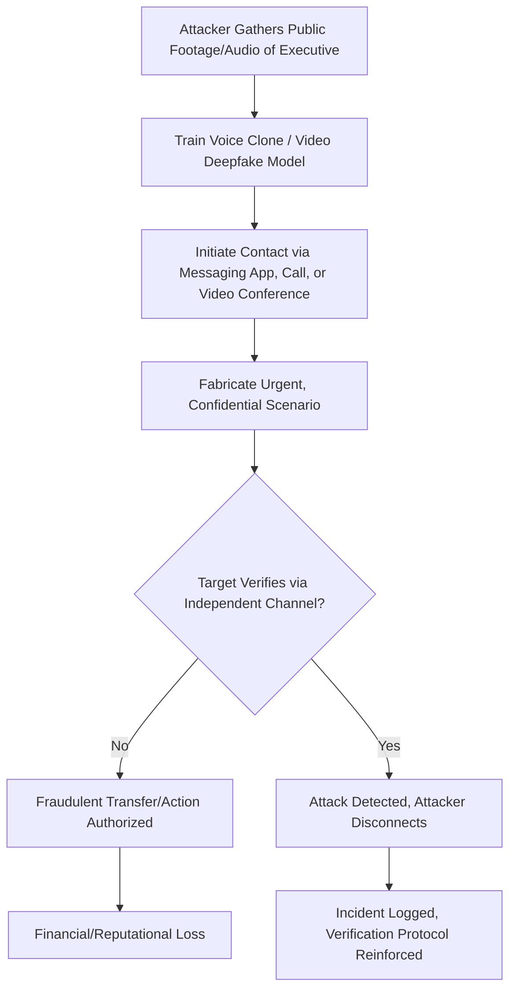

## Deepfakes and Synthetic Media Risks for Leaders

### Definition and Scope

Deepfakes are synthetic media — video, audio, or images — generated or manipulated using AI to convincingly depict a real person saying or doing something they did not actually say or do. For executive leaders, this topic covers both the organizational risk of being impersonated (executive impersonation fraud) and the reputational/communications risk of managing public trust in an environment where audiences can no longer assume audio or video is authentic. This sits at the intersection of communication strategy, cybersecurity, and crisis preparedness.

### The Current Threat Landscape

**Key Points**

- Deepfake-enabled fraud has grown sharply as a financial crime vector; reported global deepfake-fraud losses have reached at least $3.7 billion as of 2026, with roughly 89% of that recorded across 2025 and the first half of 2026, though this figure is understood to be an undercount since most victims never report incidents. [Brightside AI](https://brside.com/blog/deepfake-fraud-losses-2026)[Brightside AI](https://brside.com/blog/deepfake-fraud-losses-2026)
- Deepfake fraud attempts increased 2,137 percent over the three years leading into 2026 according to Signicat data, and freely available open-source generators and low-cost tools have put high-quality executive impersonation within reach of low-skill attackers. [defend-id](https://blog.defend-id.com/2026/08/05/deepfake-scams/)[Adaptive Security](https://www.adaptivesecurity.com/blog/deepfake-statistics-2026-the-data-security-leaders-need-to-know)
- Deepfake CEO fraud is characterized as one of the fastest-growing financial crime categories targeting US enterprises in 2026, with a Deloitte projection of losses reaching $40 billion as the underlying technology becomes cheaper and more convincing. [Note: this is a forward-looking industry projection, not a confirmed outcome.] [CybelAngel](https://cybelangel.com/blog/deepfake-ceo-fraud-how-voice-cloning-targets-us-executives/)[CybelAngel](https://cybelangel.com/blog/deepfake-ceo-fraud-how-voice-cloning-targets-us-executives/)
- Regulatory coverage remains limited — as of 2026, no U.S. federal law specifically criminalizes deepfake-enabled financial fraud, though Tennessee's ELVIS Act (effective July 2024) established the first U.S. state law protecting an individual's AI-cloned voice and likeness from unauthorized commercial use, though narrow in scope and limited to Tennessee residents. [Verify current state and federal regulatory status, as this area is evolving rapidly.] [Adaptive Security](https://www.adaptivesecurity.com/blog/deepfake-statistics-2026-the-data-security-leaders-need-to-know)[Adaptive Security](https://www.adaptivesecurity.com/blog/deepfake-statistics-2026-the-data-security-leaders-need-to-know)

### Primary Attack Vectors

#### 1. Voice Cloning / CEO Voice Fraud

Current voice-cloning tools can produce a convincing match from as little as three to ten seconds of clean audio, often sourced from public material like a LinkedIn video, webinar recording, or voicemail greeting. [defend-id](https://blog.defend-id.com/2026/08/05/deepfake-scams/)[defend-id](https://blog.defend-id.com/2026/08/05/deepfake-scams/)

**Documented example**: Criminals cloned the voice of a German CEO using AI-generated audio and instructed a UK subsidiary employee to transfer €220,000 to a Hungarian supplier; the voice was indistinguishable from the real executive. [DeepFakeCheck](https://deepfakecheck.io/blog/deepfake-fraud-real-cases/)

#### 2. Live Video Deepfake During Meetings

Attackers use real-time video manipulation to impersonate an executive's face and voice during an actual video call, not just pre-recorded audio.

**Documented example**: In the Arup case, an employee attended a video conference where every participant on screen — including the CFO and multiple colleagues — was a deepfake; Hong Kong police confirmed attackers used publicly available footage of executives to clone their appearances and voices, fabricating an urgent wire transfer authorization. The employee ultimately authorized 15 separate transactions totaling $25.6 million. [Adaptive Security](https://www.adaptivesecurity.com/blog/11-deepfake-attack-examples-2026)[CybelAngel](https://cybelangel.com/blog/deepfake-ceo-fraud-how-voice-cloning-targets-us-executives/)

**Documented example**: In a 2026 incident, a CFO received a video call from what appeared to be the CEO — matching appearance, voice, and verbal mannerisms built from a decade of familiarity — who cited a pending acquisition and confidentiality to pressure urgent wire transfers; three transfers totaling $2.3 million were authorized before the deception was discovered, while the real CEO was on a flight without connectivity. [iSECTECH](https://isectech.org/ceo-deepfake-fraud-executive-playbook-2026/)

#### 3. Attempted But Failed Impersonation

Not all attempts succeed — verification discipline matters. In a 2024 incident, Ferrari narrowly avoided fraud when attackers used AI-generated voice cloning to impersonate CEO Benedetto Vigna over a WhatsApp call, targeting a senior executive with urgent requests tied to a confidential acquisition. The attempt failed when the executive challenged the caller with a personal verification question, forcing the attacker to disconnect; no funds were transferred. [Bright Defense](https://www.brightdefense.com/resources/deepfake-statistics/)[Bright Defense](https://www.brightdefense.com/resources/deepfake-statistics/)

### Diagram: Executive Impersonation Attack Pattern

### Organizational Risk Categories

| Risk Category | Description | Example |
| --- | --- | --- |
| Financial fraud | Direct monetary loss from fraudulent transfers authorized via impersonation | Arup case ($25.6M), German CEO voice clone (€220K) |
| Reputational/misinformation | Fabricated statements attributed to a leader damage trust or move markets | Synthetic video of an executive announcing false news |
| Identity/KYC bypass | Synthetic identity used to bypass verification in hiring or onboarding | FBI warnings about candidates using deepfake video during remote job interviews to impersonate others and gain system access |
| Market manipulation | Fake endorsements or statements used to influence stock price or investor sentiment | Fake investment endorsements accounted for roughly 52% of losses in one analyzed phase, the single largest attack category |

### Sector Vulnerability

Financial services organizations remain a primary target, with the three most targeted industries in 2024 being banking, lending, and cryptocurrency according to the Entrust 2025 Identity Fraud Report — reflecting both high financial rewards and heavy reliance on digital identity verification processes vulnerable to synthetic media. [Adaptive Security](https://www.adaptivesecurity.com/blog/11-deepfake-attack-examples-2026)[Adaptive Security](https://www.adaptivesecurity.com/blog/11-deepfake-attack-examples-2026)

### Defensive Communication Protocols

#### Out-of-Band Verification

The consistent lesson across documented incidents: video and voice calls are no longer sufficient proof of identity on their own, and any unusual financial or high-stakes request — regardless of who appears to be asking — requires verification through a secondary, independent channel. Practical implementation includes: [DeepFakeCheck](https://deepfakecheck.io/blog/deepfake-fraud-real-cases/)

- **Callback protocols**: using a known, independently verified phone number rather than any number or channel provided during the suspicious contact itself. [DeepFakeCheck](https://deepfakecheck.io/blog/deepfake-fraud-real-cases/)
- **Personal verification questions**: Pre-established, non-public challenge questions that only the genuine executive would know, as demonstrated in the Ferrari case.
- **Multi-person authorization**: Requiring a second independent approver for high-value or urgent financial requests, removing single-point-of-failure vulnerability to a single deceived individual.

#### Organizational Preparedness

- **Tabletop exercises**: Rehearsing organizational response to a CEO deepfake fraud attempt with boards, CFOs, and relevant stakeholders builds verification discipline that holds under real pressure, rather than relying on general awareness alone. [iSECTECH](https://isectech.org/ceo-deepfake-fraud-executive-playbook-2026/)
- **Reducing public voice/video exposure surface**: Awareness that source material for cloning is often pulled from public-facing content like LinkedIn videos, webinars, or voicemail greetings should inform (though not eliminate, given the personal-brand and visibility priorities discussed elsewhere) how much unscripted audio/video exposure is treated as a security consideration, not just a communications one. [defend-id](https://blog.defend-id.com/2026/08/05/deepfake-scams/)
- **Established emergency contact protocols**: Predefined, verified channels for genuinely urgent executive communications reduce the effectiveness of urgency-based social engineering, which consistently appears as a weaponized pattern across documented cases. [DeepFakeCheck](https://deepfakecheck.io/blog/deepfake-fraud-real-cases/)

### Crisis Communication Response If Targeted

#### If the Organization Is Defrauded

- Rapid, transparent internal and (where legally appropriate) external communication limits secondary damage from rumor or incomplete information.
- Coordination with legal, cybersecurity, and law enforcement (given the FBI's Internet Crime Complaint Center now tracking AI-related complaints as a distinct category) is standard incident response practice. [defend-id](https://blog.defend-id.com/2026/08/05/deepfake-scams/)

#### If a Leader Is Falsely Depicted in Synthetic Media

- Rapid public correction through verified, established channels (the executive's own authenticated accounts, official company channels) helps establish a clear authoritative counter-record.
- Pre-established relationships with platforms for content takedown requests reduce response time when fabricated content spreads.
- Having an established, recognizable authentic voice and communication pattern (see related topic on voice authenticity) gives audiences a baseline against which fabricated content is more readily questioned.

### Detection Limitations

Current deepfake detection tools are engaged in an ongoing technical arms race with generation tools; detection accuracy is not guaranteed and should not be treated as a sole safeguard — the verification protocols above (independent-channel confirmation) are generally considered more reliable than attempting to visually or aurally detect fabrication in real time. [Inference — general consensus in the cited industry sources; specific detection tool accuracy claims should be independently verified against current benchmarks given the rapid pace of change in this area.]

### Practical Checklist

- [ ] Out-of-band verification protocol established for any high-value or urgent financial request
- [ ] Personal verification questions or challenge phrases pre-established with key finance/executive personnel
- [ ] Multi-person authorization required for high-stakes transfers regardless of apparent authorization source
- [ ] Tabletop exercise conducted simulating a CEO/executive deepfake fraud attempt
- [ ] Public voice/video exposure reviewed as a security consideration, not communications-only
- [ ] Rapid-response protocol established for correcting fabricated synthetic media depicting leadership
- [ ] Legal and cybersecurity coordination plan in place for reporting and responding to incidents

### Common Pitfalls

- **Treating video/voice as sufficient identity proof**: The core failure mode across nearly all documented cases — assuming a familiar voice or face confirms identity without independent verification.
- **Underestimating urgency-based social engineering**: Fabricated urgency (confidential acquisitions, time pressure) is a consistent manipulation tactic designed to bypass normal verification caution.
- **Single-point-of-failure authorization**: Relying on one individual's judgment for high-stakes financial decisions without a required second, independent check.
- **Underreporting and lack of shared learning**: Low victim reporting rates (fewer than 5% of voice-clone victims report incidents, per cited research) mean organizations often lack visibility into the true scale and evolving tactics of this threat. [Brightside AI](https://brside.com/blog/deepfake-fraud-losses-2026)
- **No rehearsed response plan**: Facing a live deepfake attempt without pre-established verification protocols or team familiarity with the scenario significantly increases vulnerability compared to organizations that have rehearsed the response.

### Related Topics

- Crisis Communication and Sensitive Announcements
- Evaluating Authenticity and Voice in AI-Assisted Content
- Data Governance and Confidentiality in AI Tool Adoption
- Media Training for Video Interviews
- Personal Brand and Visibility on Professional Platforms
- Managing Reputational Risk in Public Statements