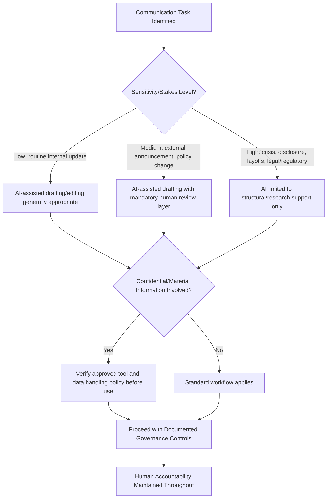

## Ethical and Strategic Use of AI in Executive Communication

### Definition and Scope

This topic addresses the governance framework, ethical principles, and strategic decision-making that should guide how AI tools are adopted and applied across executive communication broadly — synthesizing considerations from AI-assisted drafting, editing, rehearsal, and authenticity evaluation into a coherent organizational policy and leadership judgment framework. Where prior topics addressed specific applications, this topic addresses the overarching "should we" and "how should we govern this" questions.

### Core Ethical Tensions

**Key Points**

- **Efficiency vs. authenticity**: AI tools offer substantial time savings, but heavy reliance risks producing communication that is polished but generically homogenized, undermining the trust that authentic leadership voice builds over time.
- **Transparency vs. practicality**: Full disclosure of every instance of AI assistance may be impractical (echoing long-standing ghostwriting norms), but audiences increasingly expect some baseline honesty about the nature of leadership communication, particularly as synthetic media risks make authenticity itself a live public concern.
- **Accountability**: AI assistance does not diminish executive accountability for accuracy, tone, and implications of communication issued under their name — this principle should anchor all downstream policy decisions.
- **Equity of access and capability**: Uneven AI tool adoption across an organization's communications function can create disparities in output quality and speed, raising questions about fair resourcing.

### Diagram: Ethical Decision Framework for AI Use in Executive Communication

### Principles for Ethical AI Use

#### 1. Proportionality to Stakes

The appropriate degree of AI involvement should scale inversely with the sensitivity and stakes of the communication — routine updates tolerate higher AI involvement with lighter review, while crisis communication, layoffs, legal disclosures, and other high-stakes content warrant AI use restricted to lower-risk functions (research synthesis, structural scaffolding) with substantive human authorship and judgment.

#### 2. Non-Delegation of Judgment

AI tools can inform and accelerate, but strategic judgment — what to say, what to emphasize, how to balance competing stakeholder interests, when to take an unpopular position — remains a human leadership responsibility that should not be outsourced to algorithmic output, both because current AI tools lack access to the full context of organizational relationships and nonpublic considerations, and because accountability for these judgments cannot be meaningfully delegated to a tool.

#### 3. Verification as Non-Negotiable

Given the well-documented tendency of AI language models to generate plausible but inaccurate content, independent verification of any factual claim, statistic, or attribution remains a required step regardless of how the content was drafted — this is a floor, not a best-practice suggestion, for any communication that will be publicly attributed to executive leadership.

#### 4. Preserving Authentic Voice

As detailed under voice authenticity evaluation, systematic practices (voice baselines, human editorial passes focused specifically on voice fidelity) should be maintained to prevent AI-assisted content from drifting toward generic, homogenized output that erodes the distinctiveness and trust associated with an individual leader's established communication style.

#### 5. Data Governance and Confidentiality

Organizational policy should clearly define which AI tools are approved for which sensitivity levels of content, addressing the risk of inputting confidential or material nonpublic information into third-party tools without adequate data handling guarantees — this connects directly to legal and securities disclosure considerations for public companies.

### Strategic Considerations for AI Adoption in Executive Communication

#### Building Organizational Governance

| Governance Element | Purpose |
| --- | --- |
| Approved tool list | Defines which AI tools meet organizational data security and quality standards |
| Sensitivity classification | Tiers content by stakes/confidentiality to determine appropriate AI involvement level |
| Mandatory review layers | Specifies who must review AI-assisted content before use, calibrated to sensitivity tier |
| Disclosure policy | Establishes organizational stance on when/how AI assistance is acknowledged, if at all |
| Voice/style guide | Provides reference material to improve AI output fidelity to authentic leadership voice |
| Incident response | Addresses what happens when AI-assisted content contains errors, bias, or inappropriate content post-publication |

#### Change Management for Communications Teams

- Introducing AI tools into an established communications function requires deliberate change management — addressing legitimate concerns from communications professionals about role displacement, quality control, and skill development, rather than treating adoption as a purely technical rollout.
- Training communications staff not just in tool operation but in the judgment layer — when AI assistance is appropriate, how to evaluate output critically, and how to maintain the verification and voice-authenticity disciplines discussed in related topics — builds sustainable capability rather than dependency on unreviewed automation.

### Strategic Risk-Benefit Framework

**Example** application: A CEO's quarterly all-hands address (high visibility, moderate sensitivity, significant voice-authenticity stakes) might appropriately use AI for initial research synthesis and structural drafting, with substantial human refinement for tone, voice, and strategic emphasis, plus a dedicated voice-fidelity review pass — whereas a public statement responding to a active workplace investigation (high sensitivity, legal exposure, reputational stakes) would appropriately restrict AI involvement to background research only, with drafting and all judgment calls handled by experienced human communicators and legal counsel.

### Regulatory and Legal Context

- Securities disclosure regulations (e.g., Regulation FD in the U.S. context) constrain what can be communicated about material nonpublic information regardless of drafting method; AI-assisted workflows do not change these underlying legal obligations and should incorporate the same legal review processes as any other drafting method. [Verify current regulatory requirements with legal counsel, as specifics vary by jurisdiction and evolve over time.]
- Emerging AI-specific regulation (varying significantly by jurisdiction) may introduce disclosure or transparency requirements for AI-generated or AI-assisted content in certain contexts; organizations should monitor applicable regulatory developments given the rapidly evolving policy landscape in this area as of 2026. [Unverified — regulatory landscape for AI-generated content disclosure is actively evolving and varies substantially by jurisdiction; consult current legal guidance.]

### Building an Organizational AI Communication Policy

#### Recommended Policy Components

1. **Scope statement**: What communication types and channels the policy covers.
2. **Sensitivity tiering**: Clear criteria for classifying content by stakes/confidentiality.
3. **Approved tools and data handling requirements**: Specific tools cleared for use, with corresponding data sensitivity boundaries.
4. **Review and approval workflows**: Who must review AI-assisted content at each sensitivity tier before publication.
5. **Voice and authenticity standards**: Reference to voice guides and required fidelity review processes.
6. **Disclosure guidelines**: Organizational stance on acknowledging AI assistance, calibrated to audience and content type.
7. **Incident response procedures**: Steps to take if AI-assisted content is later found to contain errors or inappropriate content.
8. **Training and capability-building requirements**: Ongoing education for communications staff on responsible AI use.

### Practical Checklist

- [ ] Sensitivity tiering framework established to calibrate appropriate AI involvement by content type
- [ ] Approved AI tools list maintained with corresponding data handling/confidentiality boundaries
- [ ] Mandatory human review and accountability maintained regardless of AI involvement level
- [ ] Voice authenticity and fact-verification disciplines embedded as standard practice, not optional steps
- [ ] Legal/compliance coordination confirmed for regulated disclosures regardless of drafting method
- [ ] Organizational disclosure stance on AI assistance use documented and consistently applied
- [ ] Communications team trained in critical evaluation of AI output, not just tool operation
- [ ] Policy reviewed periodically given the pace of change in both AI capability and regulatory landscape

### Common Pitfalls

- **Uniform policy across all stakes levels**: Applying the same light-touch AI review process to both routine updates and high-stakes crisis communication, rather than calibrating governance to sensitivity.
- **Treating governance as purely technical**: Focusing AI adoption policy solely on tool selection and data security while neglecting the human judgment, voice-authenticity, and change-management dimensions.
- **Accountability diffusion**: Allowing the involvement of AI tools to create ambiguity about who is accountable for a communication's accuracy and implications, when accountability should remain clearly with the human executive and reviewing team regardless of drafting method.
- **Static policy in a moving landscape**: Establishing AI governance policy once without a mechanism for periodic review, given how rapidly both tool capability and regulatory expectations are changing.
- **Underinvesting in the judgment layer**: Training staff on tool mechanics without building the critical evaluation skills (verification discipline, voice-fidelity assessment) needed to use AI output responsibly.

### Related Topics

- Using AI for Research and First Drafts
- AI-Assisted Editing for Clarity, Tone, and Cultural Sensitivity
- AI-Assisted Rehearsal and Delivery Feedback
- Evaluating Authenticity and Voice in AI-Assisted Content
- Deepfakes and Synthetic Media Risks for Leaders
- Data Governance and Confidentiality in AI Tool Adoption
- Crisis Communication and Sensitive Announcements