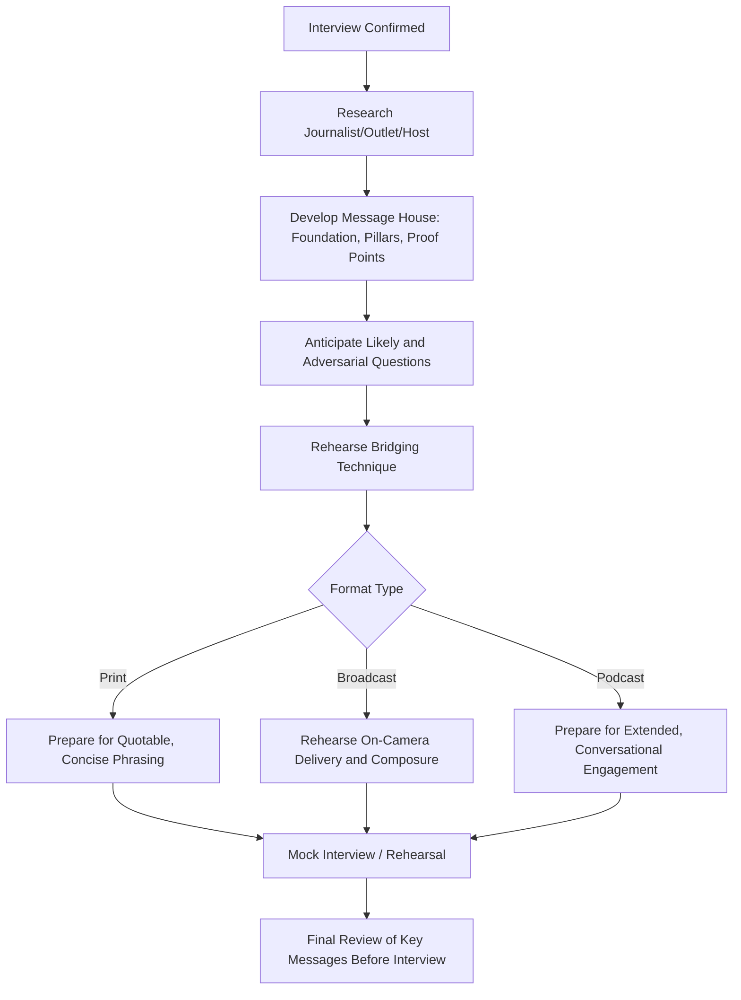

## Preparing for Print, Broadcast, and Podcast Interviews

### Definition and Scope

This topic covers the preparation process executives undertake before engaging with journalists and media hosts across three primary formats — print/written media, broadcast (television/radio), and podcast — each of which carries distinct risks, opportunities, and preparation requirements. Effective preparation spans message development, format-specific technique, and anticipation of adversarial or difficult questioning.

### Why Format Distinctions Matter

**Key Points**

- Print interviews are typically the most forgiving format for the interviewee since responses can be clarified, expanded, or revisited before publication, but carry the highest risk of quotes being taken out of context or condensed in ways that shift meaning.
- Broadcast interviews (especially live) offer no opportunity for correction after the fact and are evaluated on both verbal content and nonverbal delivery simultaneously, raising the stakes for composure and message discipline.
- Podcast interviews typically run longer and more conversationally than broadcast news formats, creating both an opportunity for nuanced, personality-driven communication and a risk of extended exposure leading to off-message tangents or reduced guard over time.

### Comparative Format Overview

| Format | Typical Length | Editing Control | Nonverbal Stakes | Primary Risk |
| --- | --- | --- | --- | --- |
| Print | Interview: 20-60 min; published: excerpted | Journalist controls final excerpts/framing | None (text only) | Quotes taken out of context or condensed |
| Broadcast (live) | 3-10 min segment | None — live, unedited | High — visible/audible in real time | No opportunity to correct misstatements |
| Broadcast (taped) | Interview: 15-45 min; aired: 2-8 min | Producer controls final edit/cuts | High | Selective editing shapes narrative |
| Podcast | 30-90+ min | Varies — some edited, many unedited | Moderate (audio, sometimes video) | Extended exposure, tangents, reduced guard over time |

### Universal Preparation Framework

#### 1. Message House Development

A "message house" is a structured preparation document organizing the core things to communicate, typically consisting of:

- **Foundation message**: One overarching statement capturing the single most important takeaway.
- **3 supporting pillars**: Key themes or points that reinforce the foundation message, each with supporting evidence or examples.
- **Proof points**: Specific facts, data, or anecdotes supporting each pillar, ready for use regardless of the specific question asked.

**Example** message house for an executive discussing a company restructuring:

- **Foundation**: "This restructuring positions us for sustainable long-term growth while honoring our commitment to affected employees."
- **Pillar 1**: Business rationale (with specific proof points on market conditions).
- **Pillar 2**: Employee support measures (with specific proof points on severance, transition support).
- **Pillar 3**: Forward-looking vision (with specific proof points on strategic priorities post-restructuring).

#### 2. Bridging Technique

Bridging is the practice of acknowledging a question, then deliberately transitioning ("bridging") to one of the prepared message pillars, regardless of whether the question directly invited that content.

**Example bridging phrases**: "That's an important question, and I think it connects to something broader worth addressing..." / "I understand the concern — what I'd emphasize is..." Overuse of obvious bridging phrases can appear evasive, so natural, varied transition language is preferable to repetitive formulaic bridges.

#### 3. Anticipated Question Preparation

Developing a comprehensive list of likely questions — including the most difficult or adversarial ones the interviewer might ask — and rehearsing concise, message-aligned responses reduces the risk of being caught unprepared on sensitive topics.

### Diagram: Interview Preparation Workflow

### Print Interview Preparation

#### Distinct Considerations

- **Quotability**: Journalists often select the most concise, vivid statement from a longer answer; practicing tight, quotable phrasing of key messages (rather than lengthy, hedge-heavy answers) increases the likelihood that published quotes accurately reflect intended meaning.
- **On-the-record clarity**: Understanding and explicitly confirming the terms of the conversation (on-the-record, on background, off-the-record) before the interview begins, since assumptions about these terms can lead to unintended disclosure.
- **Follow-up availability**: Offering to follow up with additional detail or clarification after the interview provides a safety net for complex topics that may not have been fully addressed in the moment.

#### Written Correspondence Interviews

For interviews conducted via email or written questions rather than live conversation, responses can be drafted with more deliberation, but should still maintain a natural, conversational voice rather than reading as an overly polished press release, which can undermine authenticity.

### Broadcast Interview Preparation

#### On-Camera/On-Air Technique

- **Composure under pressure**: Live broadcast format offers zero opportunity for correction, making rehearsal of maintaining composure through unexpected or aggressive questioning particularly valuable.
- **Concise verbal responses**: Broadcast segments are time-constrained; rehearsing the ability to deliver a complete, message-aligned answer in 15-30 seconds prevents important points from being cut off or lost in an overly long response.
- **Physical and vocal delivery**: Applies the same principles covered under video call presence and delivery — camera eye-line, vocal pacing, and controlled body language — though broadcast settings often involve a dedicated studio camera operator and different technical considerations (in-ear IFB audio feed, teleprompter use for scripted portions) than standard video calls.

#### Handling Difficult Live Questions

- Acknowledging a difficult question directly rather than appearing to dodge it, then bridging to a substantive response, tends to be perceived as more credible than visible evasion.
- Silence or a brief pause before responding to a difficult question is acceptable and often preferable to a rushed, poorly considered answer — extended live silence reads differently on radio (dead air) than on television (visible thinking pause), a format-specific consideration worth rehearsing.

### Podcast Interview Preparation

#### Distinct Considerations

- **Extended engagement**: Longer format allows for more nuanced, story-driven communication than broadcast soundbites, but also increases the risk of extended exposure leading to tangential or off-message content as the conversation relaxes over time.
- **Conversational register**: Podcast audiences generally expect a more casual, personality-forward register than formal broadcast news interviews; overly rehearsed or press-release-style answers can read as stiff and inauthentic in this format.
- **Host research**: Understanding the specific podcast's typical format, audience, and the host's interviewing style (adversarial vs. collaborative, structured vs. free-flowing) allows for more accurately calibrated preparation than generic interview prep.
- **Sustained message discipline**: Since podcast interviews often range across many topics over an extended period, maintaining awareness of core message priorities throughout the full conversation (not just the opening minutes) requires deliberate ongoing attention.

### Mock Interview Rehearsal

**Example** rehearsal structure:

1. A colleague or media trainer plays the role of interviewer, asking a mix of anticipated and deliberately difficult/unexpected questions.
2. The executive practices full responses, including bridging technique, under simulated time or format pressure (e.g., a 20-second response limit for broadcast prep).
3. Recorded rehearsal (video/audio) allows for review of both content and delivery, similar to AI-assisted rehearsal feedback tools but with the added value of a human coach's contextual judgment.
4. Debrief identifies specific areas for refinement — a rushed answer, an unclear bridge, a moment where message discipline broke down.

### Research and Context-Gathering Checklist

- [ ] Journalist/host's prior work and typical angle or style researched
- [ ] Outlet's audience and editorial stance understood
- [ ] Message house developed with foundation, pillars, and proof points
- [ ] Comprehensive list of anticipated questions prepared, including adversarial ones
- [ ] Format-specific technique rehearsed (quotability for print, concise delivery for broadcast, sustained discipline for podcast)
- [ ] On-the-record/background/off-the-record terms clarified before the interview, where applicable
- [ ] Mock interview or rehearsal conducted, ideally recorded for review
- [ ] Key statistics, dates, and facts verified and readily available for accurate citation during the interview

### Common Pitfalls

- **Overly rehearsed, robotic delivery**: Responses that sound memorized or press-release-like can undermine authenticity and audience trust, particularly in the more conversational podcast format.
- **Ignoring format-specific constraints**: Giving broadcast-length rambling answers in a time-constrained segment, or giving print-style terse answers in a podcast format expecting conversational depth.
- **Unclear on-the-record terms**: Assuming a conversation is off-the-record without explicit prior agreement, risking unintended disclosure of sensitive information.
- **Visible evasion**: Obviously dodging difficult questions without acknowledgment, which tends to be perceived as less credible than direct acknowledgment followed by a bridged response.
- **Neglecting sustained discipline in long-format interviews**: Maintaining message focus in the interview's opening minutes but drifting into unguarded or tangential territory as a podcast conversation extends and rapport builds.

### Related Topics

- Presence and Delivery on Video Calls
- Media Training for Crisis and Adversarial Interviews
- Personal Brand and Visibility on Professional Platforms
- Crisis Communication and Sensitive Announcements
- AI-Assisted Rehearsal and Delivery Feedback
- Message House Development and Strategic Positioning