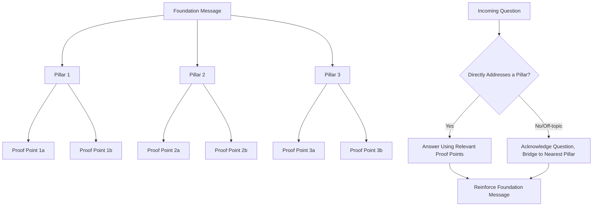

## Message Mapping and Staying on Message

### Definition and Scope

Message mapping is the structured process of identifying, prioritizing, and organizing the core messages a leader needs to communicate before engaging in any public-facing or high-stakes communication situation. "Staying on message" refers to the disciplined execution of consistently returning to and reinforcing these core messages regardless of the specific questions, distractions, or tangents that arise during the actual communication event. Together these form a foundational technique underlying interview preparation, crisis communication, and public speaking.

### Why Message Mapping Matters

**Key Points**

- Without deliberate mapping, communicators tend to answer each question as an isolated event, producing scattered, reactive communication that fails to build a coherent, memorable narrative across an entire interaction.
- Audiences (journalists, employees, investors) retain a small number of key takeaways from any communication event; message mapping ensures those few retained points are the ones the communicator actually intended to emphasize, rather than whatever happened to be said most vividly or most recently.
- In adversarial or high-pressure settings (hostile interviews, crisis Q&A), a clear message map provides a stable anchor that reduces the risk of improvised, poorly considered responses under pressure.

### The Message Map Structure

#### Core Components

| Component | Description | Typical Count |
| --- | --- | --- |
| Foundation message | The single most important overarching statement | 1 |
| Key message pillars | Major supporting themes reinforcing the foundation | 3 (commonly) |
| Proof points | Specific facts, data, or examples supporting each pillar | 2-4 per pillar |
| Bridging phrases | Prepared transitions from off-message questions back to pillars | Several, varied |

The "rule of three" for message pillars is a common convention in message mapping practice — reflecting a widely observed pattern that audiences retain roughly three distinct points more reliably than a longer list, though this is a practical heuristic rather than a strict requirement, and some contexts warrant more or fewer pillars. [Inference — the retention pattern is a commonly cited communication heuristic; exact optimal number varies by context and audience.]

#### Example Message Map

**Scenario**: A CEO addressing a product recall.

- **Foundation message**: "Customer safety is our top priority, and we are taking immediate, comprehensive action to address this issue."
- **Pillar 1 — Immediate action**: Proof points: specific recall scope, timeline, customer notification process already underway.
- **Pillar 2 — Root cause and prevention**: Proof points: what caused the issue, specific process changes implemented to prevent recurrence.
- **Pillar 3 — Customer support**: Proof points: specific remedies offered (refund, replacement, repair), dedicated support channel established.

### Diagram: Message Map Structure and Application

### The Message Mapping Process

#### Step 1: Identify the Communication Objective

Before drafting any messages, clarify what the communication event needs to accomplish — inform, reassure, persuade, correct a record — since the foundation message and pillar selection should serve this objective rather than being generated generically.

#### Step 2: Draft the Foundation Message

The foundation message should be a single, clear, memorable sentence capturing the most important takeaway — testable by asking "if the audience remembers only one thing, what should it be?"

#### Step 3: Identify Supporting Pillars

Pillars should be selected based on what the audience most needs or wants to know, not simply what the organization wants to emphasize — effective message maps anticipate audience priorities and concerns, not just organizational talking points.

#### Step 4: Develop Proof Points

Each pillar requires concrete, specific, verifiable support — vague or unsupported pillar statements are less persuasive and more vulnerable to challenge than pillars backed by specific facts, data, or examples.

#### Step 5: Prepare Bridging Language

Developing varied, natural-sounding bridge phrases in advance (rather than improvising in the moment) reduces the risk of relying on repetitive, obviously evasive-sounding transitions during actual delivery.

#### Step 6: Stress-Test Against Difficult Questions

Reviewing the message map against a list of anticipated difficult or adversarial questions confirms whether the pillars and proof points genuinely address likely audience concerns, or whether gaps exist that need to be addressed before the actual communication event.

### Staying on Message: Execution Techniques

#### Bridging Technique in Practice

**Example** bridging sequence: Question: "Why should employees trust this won't happen again?" → Acknowledge: "That's exactly the right question to be asking." → Bridge: "Which is why we've made specific changes to our process..." → Deliver pillar content with proof points.

#� Avoiding Repetition Fatigue

Repeating the exact same phrasing for the foundation message across many questions can sound robotic or evasive; varying the specific wording while maintaining consistent core content preserves message discipline without sounding mechanically repetitive.

#### Balancing Message Discipline With Genuine Engagement

Over-rigid adherence to a message map — ignoring the actual substance of questions asked, or bridging so aggressively that answers seem non-responsive — can itself damage credibility; effective message discipline involves genuinely addressing the question's substance where possible while still ensuring core messages are reinforced, rather than treating the map as a script to recite regardless of what's asked.

### Message Mapping for Different Contexts

| Context | Emphasis |
| --- | --- |
| Media interviews | Concise, quotable pillar statements; heavy bridging preparation for adversarial questions |
| Crisis communication | Foundation message often centers on acknowledgment/action; pillars address immediate response, cause, and remediation |
| Internal town halls | Pillars may be more detailed/nuanced given a captive, informed internal audience versus external media |
| Investor communication | Proof points weighted toward quantitative data and forward-looking clarity |
| Public speeches | Message map often structures the entire speech architecture, not just Q&A responses |

### Common Failure Modes in Message Mapping

- **Too many pillars**: Attempting to convey five or more key themes dilutes retention and makes disciplined execution harder to sustain under pressure.
- **Vague foundation message**: A foundation message that's too abstract or generic ("We're committed to excellence") fails to provide a genuinely memorable, specific anchor for the communication.
- **Pillars disconnected from audience concerns**: Building a message map around what the organization wants to say rather than what the audience needs to know, resulting in messaging that feels evasive or tone-deaf regardless of how disciplined the execution is.
- **Insufficient proof points**: Pillars asserted without concrete supporting evidence are more easily challenged and less persuasive than specifically substantiated claims.

### Practical Checklist

- [ ] Communication objective clearly defined before drafting the message map
- [ ] Foundation message tested for memorability and specificity (not generic)
- [ ] 3 (or context-appropriate number of) pillars identified, reflecting audience priorities
- [ ] Concrete, verifiable proof points developed for each pillar
- [ ] Varied bridging phrases prepared in advance
- [ ] Message map stress-tested against anticipated difficult/adversarial questions
- [ ] Balance confirmed between message discipline and genuine responsiveness to actual questions
- [ ] Message map reviewed and rehearsed before the actual communication event, not drafted and used unreviewed

### Common Pitfalls

- **Scripted, robotic delivery**: Repeating identical phrasing for the foundation message across every question, producing a mechanical, evasive impression.
- **Non-responsiveness perception**: Bridging so aggressively or frequently that audiences perceive the communicator as dodging rather than answering questions.
- **Organization-centric pillar selection**: Building message pillars around what leadership wants to emphasize without genuinely addressing what the audience is concerned about.
- **Skipping the stress-test step**: Finalizing a message map without testing it against genuinely difficult anticipated questions, leaving gaps exposed during actual high-pressure delivery.
- **Treating the map as fixed regardless of context**: Reusing an identical message map across substantively different audiences or situations without adapting pillars and proof points to the specific context.

### Related Topics

- Preparing for Print, Broadcast, and Podcast Interviews
- Crisis Communication and Sensitive Announcements
- Media Training for Crisis and Adversarial Interviews
- Executive Presence in Virtual Town Halls
- Speechwriting Fundamentals and Structure
- Building Inclusive, Culturally Aware Communication