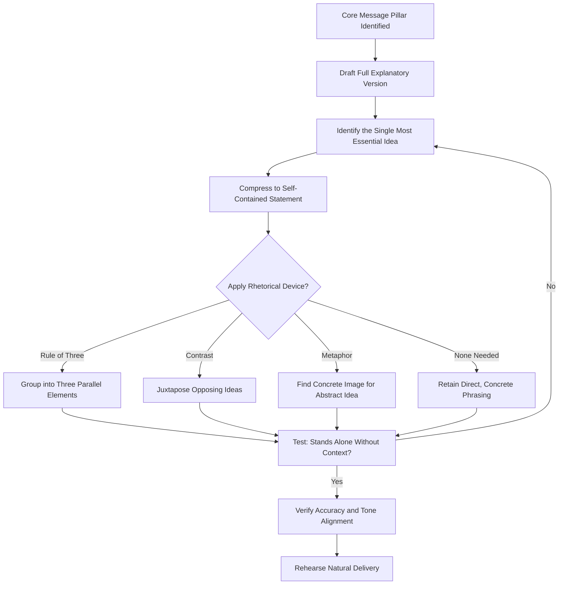

## Creating Quotable, Memorable Soundbites

### Definition and Scope

A soundbite is a short, self-contained, memorable statement designed to be extracted and used independently of its surrounding context — in a news clip, printed quote, or social media excerpt. Creating quotable soundbites is the applied craft of compressing a message pillar into language concise and vivid enough to be selected, retained, and repeated by journalists, audiences, and secondary reporting, without distorting the intended meaning.

### Why Soundbite Craft Matters

**Key Points**

- Journalists and editors actively select the most concise, vivid, and self-contained statement from a longer response for publication or broadcast; if a communicator does not proactively craft quotable language, the selected quote may be an unintended, less carefully considered fragment.
- A well-crafted soundbite increases the likelihood that the extracted quote accurately reflects the intended core message, rather than an editor's necessarily compressed interpretation of a longer, more hedged answer.
- Memorable phrasing extends a message's reach beyond the original audience — quotable lines are more likely to be repeated in secondary coverage, social sharing, and internal recirculation than lengthy, technical explanations.

### Structural Techniques for Soundbite Construction

#### 1. Brevity and Self-Containment

An effective soundbite should make sense as a standalone statement, without requiring the preceding question or surrounding context to be understood — this is what allows it to be lifted cleanly into a headline, chyron, or pull-quote.

**Example**: Rather than "Well, I think what we're really trying to do here, given the circumstances, is focus on making sure that our customers ultimately come first in every decision," a self-contained version: "Every decision we make starts with one question: what's right for the customer."

#### 2. Rhetorical Devices That Aid Memorability

| Device | Description | Example Pattern |
| --- | --- | --- |
| Rule of three | Grouping ideas in sets of three | "Faster, safer, simpler." |
| Contrast/antithesis | Juxtaposing opposing ideas | "We're not cutting corners — we're cutting complexity." |
| Alliteration | Repeated initial sounds | "Precision, performance, purpose." |
| Metaphor/analogy | Concrete image standing in for an abstract idea | "This isn't a pivot — it's a homecoming to what we do best." |
| Repetition/anaphora | Repeating a phrase for emphasis | "We built this company on trust. We grew it on trust. We will not compromise that trust now." |

These are long-established rhetorical techniques from classical rhetoric and modern speechwriting practice, not recent inventions — their effectiveness in aiding retention and repeatability is well documented in communication and rhetoric literature.

#### 3. Concrete Language Over Abstraction

Specific, concrete language is more memorable and quotable than abstract corporate phrasing — "we shipped 2 million units without a single safety recall" is more quotable and credible than "we maintained a strong quality record."

#### 4. Active Voice and Strong Verbs

Active constructions with vivid verbs tend to produce more energetic, quotable language than passive constructions — "We're rebuilding this from the ground up" carries more rhetorical force than "This is being rebuilt from the ground up."

### Diagram: Soundbite Development Process

### The Compression Process

#### From Explanation to Soundbite

**Example** progression:

1. **Full explanation** (natural first draft): "So what we've done is really looked hard at our supply chain over the last year, and we've made some pretty significant changes to reduce our dependency on any single supplier or region, because we learned some important lessons during the disruptions a few years back."
2. **Identify the essential idea**: Diversified supply chain reduces future disruption risk.
3. **Compressed soundbite**: "We learned the hard way that resilience beats efficiency when the world gets unpredictable."

This compression preserves the core substantive claim while producing a self-contained, quotable statement — the goal is compression of language, not distortion of meaning.

### Balancing Quotability With Accuracy

- A soundbite must accurately represent the underlying substance; crafting a memorable phrase that overstates, oversimplifies, or misrepresents the actual position creates downstream risk if the claim is later challenged or found inconsistent with fuller context.
- Overly clever or cute phrasing on serious topics (crisis response, layoffs, safety issues) can misfire, reading as tone-deaf or insincere when audiences expect gravity rather than rhetorical polish — soundbite craft should be calibrated to the emotional register of the underlying content, not applied uniformly regardless of context.

### Soundbite Application by Format

| Context | Soundbite Considerations |
| --- | --- |
| Print interview | Aim for a complete, quotable sentence a journalist can lift directly |
| Broadcast | Extremely short — a single clause often works best for a chyron or clip |
| Social media | Should work as a standalone post/quote card independent of any article |
| Speeches | Often placed strategically at openings, closings, or key transition points for audience retention |
| Internal communication | Can be slightly longer/more nuanced given a captive, context-aware audience, but retains value for building shared internal language |

### Rehearsal and Natural Delivery

- A soundbite crafted in writing but delivered stiffly or robotically in conversation undermines its own effectiveness; rehearsing natural, conversational delivery of prepared soundbites (so they don't sound obviously scripted) is a necessary complement to the writing craft itself.
- Testing a soundbite by saying it aloud, not just reading it silently, reveals whether the phrasing flows naturally in spoken delivery or reads better than it sounds — written and spoken rhythm can differ significantly.

### Common Failure Modes

- **Overuse and predictability**: Relying on the same rhetorical device (e.g., rule of three) repeatedly across a single communication event can become noticeably formulaic and undermine authenticity.
- **Sounding pre-packaged**: A soundbite that is too polished or clever can read as insincere or overly managed, particularly in emotionally sensitive contexts where audiences expect authenticity over rhetorical craft.
- **Sacrificing accuracy for punch**: Compressing language so aggressively that the resulting statement overstates or misrepresents the underlying substance, creating legal, reputational, or credibility risk if challenged.
- **Context-mismatched tone**: Applying upbeat, punchy soundbite techniques to grave or sensitive subject matter, producing a jarring tonal mismatch.

### Practical Checklist

- [ ] Core message pillar identified before attempting soundbite compression
- [ ] Draft tested for self-containment — does it make sense without surrounding context?
- [ ] Rhetorical device applied only where it aids clarity and memorability, not forced
- [ ] Concrete, specific language favored over abstract corporate phrasing
- [ ] Accuracy verified — compression has not distorted or overstated the underlying claim
- [ ] Tone calibrated to the emotional register of the subject matter
- [ ] Soundbite rehearsed aloud for natural, non-robotic delivery
- [ ] Variation prepared to avoid identical repeated phrasing across multiple questions or venues

### Related Topics

- Message Mapping and Staying on Message
- Preparing for Print, Broadcast, and Podcast Interviews
- Speechwriting Fundamentals and Structure
- Rhetorical Devices in Executive Communication
- Crisis Communication and Sensitive Announcements
- Personal Brand and Visibility on Professional Platforms