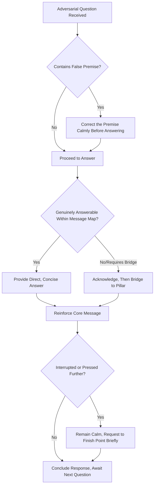

## Handling Hostile or Adversarial Questioning

### Definition and Scope

Hostile or adversarial questioning refers to interview or Q&A situations in which the questioner's intent is to challenge, destabilize, corner, or provoke the respondent — through aggressive framing, repeated interruption, false premises, leading questions, or deliberately provocative statements. This topic covers the specific techniques for maintaining composure, credibility, and message discipline under this heightened form of pressure, building on the foundational skills of message mapping and soundbite construction.

### Why Adversarial Questioning Requires Distinct Technique

**Key Points**

- Adversarial questioning is often designed to provoke an emotional or defensive reaction, since a flustered or angry response is itself a more compelling and damaging media moment than the underlying substantive answer.
- The goal of a hostile questioner may not be information-gathering but narrative-building — seeking a specific reaction, contradiction, or soundbite that serves a predetermined story angle rather than genuine inquiry.
- Executives who have only prepared for good-faith, substantive questions are significantly more vulnerable to being destabilized when confronted with genuinely adversarial technique, making dedicated preparation for this scenario a distinct and necessary skill.

### Common Adversarial Questioning Tactics

| Tactic | Description | Example Pattern |
| --- | --- | --- |
| Loaded/leading question | Question contains an embedded false or unfavorable premise | "Given that your company has clearly failed its customers, how do you explain..." |
| False dichotomy | Frames only two extreme options, excluding nuance | "So either you knew about this or you were completely negligent — which is it?" |
| Interruption | Cutting off answers before completion | Repeated interjection before a full response is given |
| Rapid-fire sequencing | Multiple questions asked in quick succession, no room to fully answer any | Stacking follow-ups before the previous answer concludes |
| Hypothetical trap | Asking the respondent to speculate on damaging scenarios | "What if it turns out this was intentional?" |
| Silence pressure | Pausing after an answer, implying it was inadequate, inviting over-explanation | Extended pause with expectant expression after a complete answer |
| Personal/emotional provocation | Direct challenge to character, competence, or integrity | "Do you even care about the people affected by this?" |

### Diagram: Adversarial Question Response Framework

### Core Techniques for Handling Hostile Questions

#### 1. Correcting False Premises

When a question contains an inaccurate or unfair embedded assumption, addressing that premise directly and calmly before proceeding prevents implicitly accepting a false framing by answering as though the premise were true.

**Example**: Question: "Given that leadership clearly ignored the warning signs, why should employees trust you now?" Response: "I'd actually push back on that characterization — here's what we knew and when we acted on it..." followed by substantive answer.

#### 2. Refusing False Dichotomies

When presented with an artificially narrow either/or framing, explicitly naming the false choice and offering the more accurate, nuanced position avoids being trapped into an unfavorable binary.

**Example**: "That framing suggests it's one or the other, but the reality is more nuanced — what actually happened was..."

#### 3. Maintaining Composure Under Interruption

- Remaining calm and measured when interrupted, rather than escalating volume or visible frustration, tends to be perceived more favorably by observing audiences than matching an aggressive tone.
- A brief, polite assertion ("If I could just finish this point...") allows continuation without appearing combative, though this should be used judiciously rather than repeatedly, which can itself appear evasive.

#### 4. Strategic Use of Pause

Taking a brief, deliberate pause before responding to a provocative question signals composure and consideration rather than a rushed, reactive response — this also provides a moment to select message-aligned language rather than responding in the same emotional register as the question.

#### 5. Not Repeating Negative Framing

Avoiding repetition of loaded or negative language embedded in a hostile question (even to deny it) reduces the risk of that language being isolated and quoted; responding in the communicator's own constructive framing rather than the questioner's negative framing is generally more effective.

**Example**: Rather than "No, we are not a company that doesn't care about safety," which repeats "doesn't care about safety" in a quotable form, a reframe: "Safety has been the top priority in every decision we've made through this process."

#### 6. Bridging to Substantive Ground

As detailed under message mapping, bridging from an adversarial or off-message question back to prepared pillars remains a core technique here, though execution under adversarial pressure requires more rehearsal than in a standard interview, given the added cognitive load of managing composure simultaneously.

### Handling Personal or Character-Based Attacks

- Personal attacks or character challenges are often best addressed by refusing to engage on the same personal/emotional register, instead redirecting to substantive facts and actions — matching emotional intensity tends to escalate rather than de-escalate the exchange and can appear defensive.
- Acknowledging genuine emotion where authentic and appropriate (e.g., in a crisis involving real harm) differs from being provoked into defensive reactivity — the distinction lies in maintaining control and intentionality of tone rather than reacting purely to the provocation.

### Preparation Specific to Adversarial Scenarios

#### Adversarial Mock Interview Rehearsal

Rehearsing specifically against a trained adversarial questioner (media trainer, colleague briefed to be genuinely difficult) — rather than only friendly or neutral mock questions — builds the specific composure and technique needed for the actual pressure of a hostile encounter, since general interview prep does not fully substitute for this targeted rehearsal.

#### Identifying Likely Attack Lines in Advance

Anticipating the specific angles a hostile questioner is likely to pursue (based on known criticisms, prior controversies, competitor narratives) allows for pre-drafted, tested responses rather than improvisation under pressure.

### When to Decline to Answer

- In some cases, explicitly declining to answer a specific question (e.g., due to legal constraints, ongoing investigation, or genuinely not having verified information) is more credible than attempting to answer with incomplete or speculative information.
- A clear, brief explanation for declining ("I can't comment on specifics of an ongoing legal matter, but I can tell you...") tends to be better received than a vague deflection with no stated reason, which can appear evasive.

### Post-Interview Considerations

- Reviewing adversarial exchanges after the fact (ideally with a recording) to identify what worked and what didn't builds capability for future high-pressure encounters, similar to the review process in AI-assisted or human-coached rehearsal.
- In cases of genuinely unfair or inaccurate coverage following an adversarial interview, organizations typically have established escalation paths (corrections requests, follow-up statements) distinct from the live interview technique itself.

### Practical Checklist

- [ ] Likely adversarial angles and attack lines identified and researched in advance
- [ ] Mock interview rehearsal conducted with a genuinely adversarial questioner, not only friendly practice
- [ ] Technique rehearsed for correcting false premises and refusing false dichotomies
- [ ] Composure-under-interruption technique practiced, including brief assertive phrases for continuing a point
- [ ] Strategy prepared for personal/character-based attacks that avoids matching emotional escalation
- [ ] Clear criteria established for when to decline answering vs. attempting an incomplete answer
- [ ] Post-interview review process planned to build capability for future adversarial encounters

### Common Pitfalls

- **Visible defensiveness or anger**: Matching a hostile questioner's aggressive tone, which tends to become the dominant story regardless of the underlying substantive answer.
- **Repeating negative framing**: Echoing loaded or damaging language from the question, even while denying it, creating an easily isolated damaging quote.
- **Over-explaining under silence pressure**: Filling an intentional pause with excessive, unplanned elaboration that introduces new risk beyond the original prepared answer.
- **Accepting false premises implicitly**: Answering a loaded question's substance without first addressing its inaccurate framing, which can be read as tacit agreement with the premise.
- **Insufficiently adversarial rehearsal**: Preparing only for reasonable, good-faith questions and being genuinely destabilized by the first truly hostile question encountered live.

### Related Topics

- Message Mapping and Staying on Message
- Creating Quotable, Memorable Soundbites
- Preparing for Print, Broadcast, and Podcast Interviews
- Crisis Communication and Sensitive Announcements
- Presence and Delivery on Video Calls
- AI-Assisted Rehearsal and Delivery Feedback