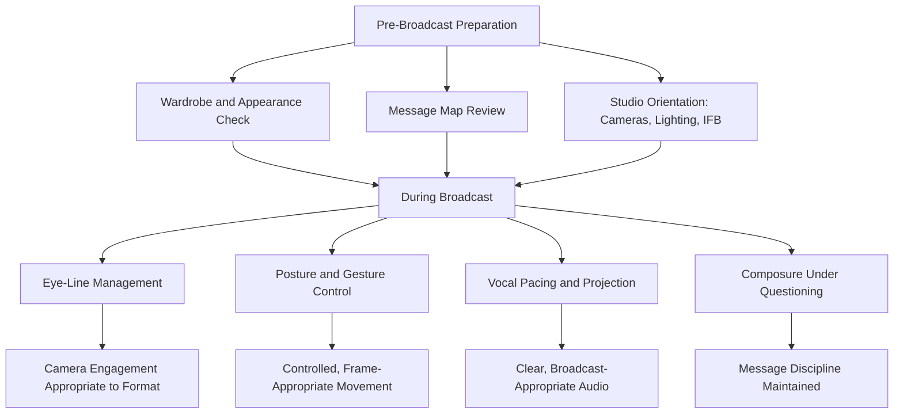

## On-Camera Presence and Technique

### Definition and Scope

On-camera presence and technique covers the specific delivery skills required for broadcast, filmed, and studio media appearances — television interviews, press conferences, recorded corporate video, and filmed public statements. While related to video call presence, this topic addresses the distinct conditions of professional broadcast/filmed settings: studio lighting and camera crews, teleprompters, in-ear audio feeds, multi-camera setups, and the heightened production values and public distribution scale of broadcast media.

### How Broadcast Settings Differ From Video Calls

**Key Points**

- Broadcast and filmed settings typically involve professional crew, dedicated lighting, and camera operators, removing much of the technical setup burden present in video calls but introducing new elements (teleprompters, IFB earpieces, studio blocking) requiring their own familiarity.
- Broadcast appearances are often distributed to much larger, more diverse, and less context-aware audiences than a video call, raising the stakes for clarity and self-contained, quotable communication.
- Multi-camera studio setups may involve switching between camera angles the on-camera subject cannot always predict, requiring different eye-line discipline than the single-camera video call context.

### Core Physical Technique

#### Camera Eye-Line and Engagement

- In a single-camera interview (e.g., seated interview with one host), maintaining primary eye contact with the interviewer (not the camera) is generally standard practice, since this replicates natural conversational engagement for the viewing audience.
- In a direct-to-camera format (e.g., a solo statement, some news anchor-style setups), sustained eye contact with the lens itself is required, and locating the lens precisely (rather than looking at a nearby monitor or the crew) takes deliberate practice.
- With multiple cameras, following the guidance of the floor director or producer regarding which camera is "live" prevents confusion — attempting to track this independently without crew guidance can result in inconsistent or distracted-looking eye contact.

#### Posture and Composure

- Seated broadcast interviews typically call for an upright but relaxed posture, avoiding both a slouched, disengaged appearance and an overly rigid, tense posture.
- Hand and gesture use should remain moderate and controlled — broadcast framing is often tighter than a casual video call, so large or frequent gestures can appear exaggerated or move outside the frame.
- Stillness during listening moments (while the interviewer is speaking) should avoid both fidgeting and an unnaturally frozen appearance; natural, occasional small movements (nodding, subtle shifts) read as more authentically engaged than either extreme.

### Diagram: On-Camera Technique Components

### Vocal Technique for Broadcast

- **Projection and pacing**: Broadcast microphones and audio processing generally handle volume well, but clear articulation and a measured pace remain important given that broadcast audio is often consumed in variable listening conditions (car radios, background television, mobile playback).
- **Managing the IFB earpiece**: For live television, an in-ear IFB (interruptible foldback) feed allows producers to communicate timing cues or breaking information during the interview; briefly acknowledging and processing an interruption through the earpiece without losing composure or train of thought on camera is a specific skill requiring practice or prior experience.
- **Soundbite-length responses**: As detailed under soundbite construction, broadcast interviews reward concise, self-contained answers; rehearsing the discipline of completing a full thought within a broadcast-appropriate time window (often 15-30 seconds per response) prevents important points from being cut for time or interrupted mid-thought.

### Teleprompter Technique

- Reading from a teleprompter while maintaining natural vocal delivery and eye contact with the camera is a distinct skill from either extemporaneous speaking or reading printed notes — effective teleprompter use requires familiarity with the script well before delivery so the reading feels conversational rather than visibly recited.
- Practicing with variable teleprompter scroll speed, and being prepared to depart briefly from scripted text if needed (e.g., to respond naturally to something just said), maintains authenticity rather than a rigid, robotic read-through.

### Wardrobe and Visual Considerations for Broadcast

| Consideration | Guidance |
| --- | --- |
| Patterns | Avoid fine patterns (tight stripes, small checks) which can create a visual "moiré" flickering effect on camera |
| Solid colors | Generally render more predictably on camera than busy patterns |
| Contrast with background | Avoid colors that closely match the set/background, which can create an unintentional blending effect |
| Reflective jewelry/accessories | Can create distracting glare under studio lighting |
| Makeup for camera | Studio lighting is typically harsher than ambient light; broadcast-appropriate makeup (often applied by a professional for major appearances) compensates for this, applying to all genders in professional broadcast contexts |

### Handling Studio and Production Elements

#### Working With Hosts and Producers

- Brief pre-interview conversations with the host or producer about format, expected topics, and timing help calibrate preparation, though live interview content can still deviate from any pre-discussed outline.
- Understanding studio cues (floor director countdowns, wrap-up signals) prevents confusion during live segments where verbal communication from crew is limited once recording begins.

#### Remote/Satellite Interview Technique

For remote broadcast interviews (appearing via satellite or video link into a studio broadcast, common when the guest is not physically present with the host), specific additional challenges apply:

- **No visual feedback from the host**: The guest typically cannot see the host's reactions in real time, requiring sustained, confident direct-to-camera engagement without the natural feedback cues available in an in-person interview.
- **Audio delay management**: Satellite or remote connections can introduce slight audio delay; being aware of this and avoiding talking over the host due to delayed audio cues prevents awkward interruptions.

### Preparation Checklist for On-Camera Appearances

- [ ] Message map and key soundbites reviewed and rehearsed before arrival
- [ ] Wardrobe checked against broadcast guidance (solid colors, appropriate contrast, no fine patterns)
- [ ] Studio orientation completed — camera positions, IFB use, floor director cues understood
- [ ] Eye-line approach clarified for the specific format (interviewer-focused vs. direct-to-camera vs. multi-camera)
- [ ] Response length calibrated to the segment's time constraints
- [ ] Teleprompter (if used) rehearsed sufficiently for natural, non-robotic delivery
- [ ] Remote/satellite-specific considerations addressed if applicable (audio delay, no visual host feedback)

### Common Pitfalls

- **Eye-line confusion**: Looking at the wrong camera in a multi-camera setup, or splitting attention between the interviewer and a monitor, producing an unfocused or distracted appearance.
- **Wardrobe distraction**: Wearing patterns or colors that create visual artifacts or blend with the background, distracting from the substantive content.
- **Rigid, over-scripted delivery**: Reading from a teleprompter or over-rehearsed script in a way that sounds visibly recited rather than natural.
- **Losing composure under IFB interruption**: Being visibly thrown off by a producer's audio cue during a live segment rather than smoothly incorporating or briefly acknowledging it.
- **Ignoring broadcast time constraints**: Giving answers too long for the segment's format, resulting in important points being cut off or edited out.
- **Talking over remote/satellite delay**: Interrupting the host due to unaccounted audio lag in a remote broadcast setup.

### Related Topics

- Presence and Delivery on Video Calls
- Preparing for Print, Broadcast, and Podcast Interviews
- Handling Hostile or Adversarial Questioning
- Creating Quotable, Memorable Soundbites
- Camera Framing, Lighting, and Virtual Setup
- Media Training for Crisis and Adversarial Interviews