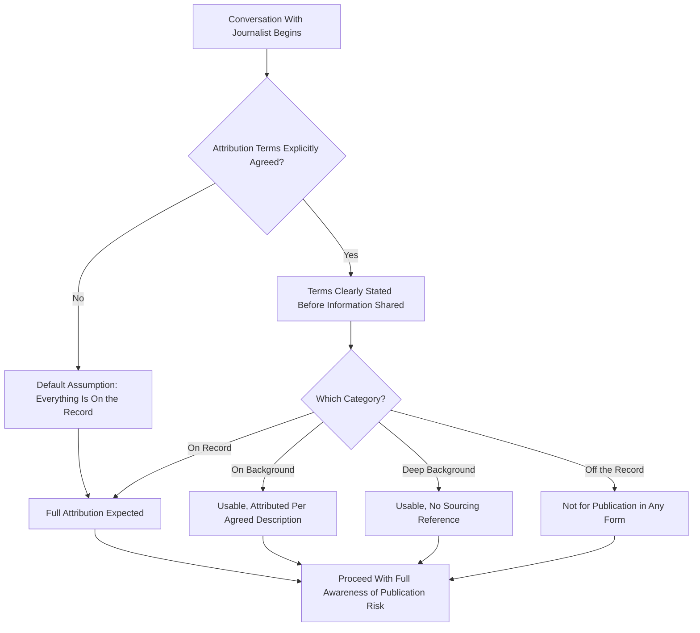

## Managing Off-the-Record and Background Remarks

### Definition and Scope

This topic covers the conventions, risks, and practical management of communication with journalists conducted outside the standard on-the-record framework — including off-the-record remarks, background information, deep background, and embargo agreements. Executives and their communications teams must understand these distinctions precisely, since misunderstanding or misapplying them creates significant risk of unintended disclosure or damaged press relationships.

### The Standard Attribution Framework

**Key Points**

- These terms originated in journalism practice and, despite widespread use, do not have a single universally enforced legal definition — their meaning rests on mutual understanding and agreement between source and journalist, established explicitly before the exchange, not on any formal legal protection.
- Because these terms are matters of convention and trust rather than binding contract, ambiguity or disagreement about which terms applied to a given conversation is a recurring source of media relations problems.
- The safest practice is explicit, unambiguous agreement on terms *before* sharing any information, not an assumption that a general relationship or informal conversational tone implies particular protections.

#### The Four Standard Categories

| Term | Definition | Attribution Risk |
| --- | --- | --- |
| On the record | Everything said can be quoted and attributed by name | Full attribution risk — treat as fully public |
| On background | Information can be used but not attributed to the named individual, typically attributed to a general description (e.g., "a company spokesperson," "a person familiar with the matter") | Content usable, identity protected per agreed description |
| Deep background | Information can inform the story's content or context but cannot be attributed to any source, even generically | Content usable, no sourcing reference at all |
| Off the record | Information cannot be published or used in the story at all | Should not appear in any form in resulting coverage |

### Diagram: Establishing and Managing Attribution Terms

### Core Principles for Managing These Conversations

#### 1. Explicit Agreement Before Disclosure

The critical procedural rule: attribution terms must be proposed and agreed upon *before* the sensitive information is shared, not retroactively requested after the fact. A journalist is generally not obligated to honor a request to reclassify something as off-the-record after it has already been said on the record — the agreement must precede the disclosure.

**Example**: Rather than sharing information and then saying "that was off the record," the correct sequence is: "Can I share something with you on background?" — pause for the journalist's agreement — then proceed.

#### 2. Default to On-the-Record Assumption

In the absence of an explicit, mutually understood agreement otherwise, executives and spokespeople should assume anything said to a journalist may be used and attributed — this defensive default significantly reduces risk compared to assuming informal conversational context implies protection.

#### 3. Journalist Discretion and Relationship Trust

Because these categories rest on convention rather than enforceable rule, the actual protection depends significantly on the individual journalist's professional practice and the trust built in the relationship — a reason organizations often cultivate longer-term relationships with specific reporters where mutual understanding of these terms is well-established, rather than relying on these protections with unfamiliar journalists in high-stakes situations.

### Strategic Uses of Background and Off-the-Record Communication

#### Providing Context Without Attribution

Background conversations are commonly used to help a journalist understand complex context, technical detail, or organizational nuance that improves the accuracy of eventual reporting, without the source wanting individual attribution for characterizing sensitive internal matters.

#### Correcting Misunderstandings Pre-Publication

Off-the-record or background conversations are sometimes used to correct a journalist's factual misunderstanding before publication, reducing the risk of inaccurate reporting, without the source being quoted directly on a sensitive point.

#### Building Long-Term Press Relationships

Consistent, honest engagement — including judicious, well-managed background conversations — can build a foundation of trust with specific journalists that benefits future coverage accuracy and fairness, though this should be balanced against the discipline of not over-sharing simply to build rapport.

### Risks and Failure Modes

#### Misattribution Risk

Even with agreed terms, journalists can make errors, or an editor unfamiliar with the specific agreement made with a reporter may not honor it during the editing process — this residual risk means background/off-the-record arrangements are risk-reducing, not risk-eliminating.

#### The "Not Technically Off the Record" Trap

A specific and common failure: assuming a casual, informal, or seemingly friendly conversational moment (e.g., small talk before or after a formal interview, a conversation at a social event) is protected, when no explicit agreement was made — courts and journalism ethics conventions generally treat unstated assumptions as insufficient, placing the burden on the source to establish terms explicitly.

#### Multiple-Party Complications

When multiple people are present in a conversation (e.g., a background briefing involving several company representatives and several journalists), ensuring all parties share the same understanding of the agreed terms is more complex and more prone to breakdown than a single-source, single-journalist arrangement.

#### Legal and Regulatory Considerations

For public companies, background or off-the-record conversations touching material nonpublic information carry the same securities disclosure risk (e.g., Regulation FD considerations in the U.S. context) as on-the-record statements — attribution status does not exempt the underlying information from disclosure regulations, and legal/investor relations coordination remains necessary regardless of the conversational framing. [Verify current regulatory requirements with legal counsel, as specifics vary by jurisdiction.]

### Embargo Agreements

A related but distinct convention: an embargo is an agreement that a journalist can have advance access to information (a report, an announcement) on the condition that publication is held until a specified date/time — unlike background/off-the-record terms which govern attribution, embargoes govern timing. Common in product launches, research publication, and coordinated announcement strategies, embargoes similarly rely on mutual trust and convention rather than legal enforcement, though breaking an agreed embargo can seriously damage a journalist's standing with sources and is generally taken seriously within professional journalism norms.

### Organizational Governance Recommendations

- **Spokesperson training**: Not all individuals authorized to speak with media should assume they understand these distinctions correctly without specific training — this is a common gap, particularly for executives not regularly engaged with press.
- **Clear internal policy**: Establishing organizational guidance on who is authorized to have background/off-the-record conversations with media, and under what circumstances, reduces the risk of inconsistent or uncoordinated engagement across different spokespeople.
- **Communications team coordination**: Involving professional communications/PR staff in establishing and managing these arrangements, rather than executives independently negotiating attribution terms in the moment, reduces risk given the specialized judgment required.

### Practical Checklist

- [ ] Attribution terms explicitly proposed and agreed before any sensitive information is shared
- [ ] Default assumption maintained that anything said may be used and attributed absent clear agreement
- [ ] Relationship and track record with the specific journalist considered when assessing reliability of informal arrangements
- [ ] Legal/compliance considerations addressed for any background conversation touching material nonpublic information
- [ ] Spokesperson training completed on the distinctions between on-record, background, deep background, and off-the-record
- [ ] Organizational policy established on who is authorized to engage in background/off-the-record conversations
- [ ] Multiple-party briefings confirmed to have consistent understanding of terms among all participants

### Common Pitfalls

- **Retroactive off-the-record requests**: Attempting to reclassify already-shared information as off-the-record after the fact, which journalists are not obligated to honor.
- **Assuming informal context implies protection**: Treating casual conversational moments as automatically off-the-record without explicit agreement.
- **Confusing background with off-the-record**: Using these terms interchangeably in practice when they carry meaningfully different implications for what can appear in resulting coverage.
- **Overlooking regulatory exposure**: Treating background conversations as exempt from securities disclosure obligations simply because attribution is not direct.
- **Uncoordinated spokesperson engagement**: Multiple organizational representatives independently establishing inconsistent terms with the same or different journalists, creating confusion and risk.
- **Overreliance without relationship basis**: Assuming background/off-the-record protection with an unfamiliar journalist with the same confidence as an established, trusted relationship.

### Related Topics

- Preparing for Print, Broadcast, and Podcast Interviews
- Handling Hostile or Adversarial Questioning
- Crisis Communication and Sensitive Announcements
- Message Mapping and Staying on Message
- Ethical and Strategic Use of AI in Executive Communication
- Personal Brand and Visibility on Professional Platforms