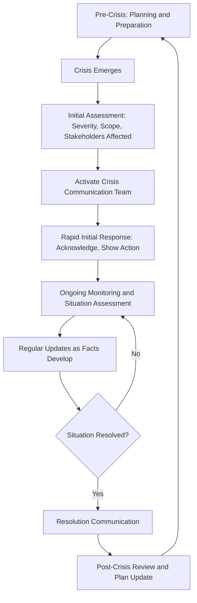

## Principles of Crisis Communication Planning

### Definition and Scope

Crisis communication planning is the systematic, pre-established process of preparing an organization and its leadership to communicate effectively during events that threaten reputation, operations, safety, legal standing, or stakeholder trust. Effective crisis communication depends heavily on preparation completed before a crisis occurs — planning frameworks, decision structures, and message templates developed in advance — since the compressed timelines and high stakes of an actual crisis leave little room for building foundational capability in the moment.

### Foundational Principles

**Key Points**

- **Speed with accuracy**: In a crisis, information vacuums are quickly filled by speculation, rumor, and competing narratives; rapid initial response is valuable, but speed should not come at the cost of releasing inaccurate information that later requires correction, which compounds credibility damage.
- **Consistency across channels and spokespeople**: Contradictory statements from different organizational representatives or across different communication channels during a crisis significantly undermine credibility and can themselves become a secondary story.
- **Empathy and accountability precede explanation**: Audiences in crisis situations generally expect acknowledgment of impact and, where appropriate, accountability before detailed technical or legal explanation — leading with defensive explanation before acknowledgment often reads as dismissive of genuine harm or concern.
- **Transparency within legal constraints**: While legal counsel appropriately constrains what can be said in certain situations (litigation, regulatory investigation), excessive legalistic hedging or evasiveness beyond what's genuinely required tends to damage trust more than the underlying facts would on their own.

### Core Framework: Crisis Communication Lifecycle

### Pre-Crisis Planning Components

#### 1. Crisis Communication Team Structure

A defined team with clear roles reduces confusion and delay when an actual crisis occurs, typically including:

| Role | Responsibility |
| --- | --- |
| Crisis lead/decision-maker | Final authority on messaging and response decisions, often the CEO or designated senior executive |
| Communications lead | Drafts and coordinates messaging, manages media relationships |
| Legal counsel | Reviews messaging for legal risk, advises on disclosure constraints |
| Subject matter experts | Provide technical/operational accuracy for the specific crisis type |
| Spokesperson(s) | Designated individual(s) authorized to speak publicly, trained specifically for this role |

#### 2. Scenario Planning and Risk Mapping

Identifying plausible crisis scenarios specific to the organization's industry, operations, and known vulnerabilities (product safety issues, data breaches, executive misconduct, workplace incidents, financial irregularities) allows for scenario-specific message templates and response protocols developed calmly in advance, rather than drafted for the first time under crisis pressure.

#### 3. Pre-Approved Communication Templates

Draft holding statements and message frameworks for common crisis categories — acknowledging an issue is occurring while details are still being gathered — allow for rapid initial response without requiring full message development from scratch in the crisis's earliest, most time-pressured hours.

**Example** holding statement structure: "We are aware of [issue] and are actively investigating. Our immediate priority is [safety/affected parties/etc.]. We will share additional information as soon as we are able to confirm the facts."

#### 4. Stakeholder Mapping

Identifying all stakeholder groups who will need communication during a crisis (employees, customers, investors, regulators, media, local community) and the appropriate channel and messaging for each prevents gaps where a stakeholder group learns of a crisis through an inappropriate or delayed channel.

### The First-Hours Response

#### Immediate Priorities

1. **Verify before communicating**: Confirming the basic facts of what has occurred, even briefly, prevents the more damaging error of communicating inaccurate initial information.
2. **Acknowledge quickly, even without full details**: A holding statement acknowledging awareness and active investigation, issued quickly, is generally more effective than delaying all communication until complete information is available — silence itself is often interpreted as evasion or indifference.
3. **Activate the crisis team**: Following pre-established activation protocols reduces the ad hoc decision-making delay of determining who should be involved after a crisis has already begun.
4. **Determine severity and scope**: Initial assessment of who is affected and how seriously shapes the appropriate tone, channel, and urgency of subsequent communication.

### Message Principles During Active Crisis

#### Leading With Human Impact

Particularly for crises involving safety, harm, or significant stakeholder disruption, leading communication with acknowledgment of impact on affected people — before organizational process, legal positioning, or technical explanation — tends to be better received and more accurately reflects appropriate priority.

#### Avoiding Speculation

Communicating only confirmed facts, and explicitly noting what remains under investigation or unknown, reduces the risk of having to walk back speculative statements later — a correction cycle that compounds credibility damage beyond the original crisis.

#### Consistency Across Spokespeople and Channels

Ensuring all authorized spokespeople work from the same approved messaging, and that statements across different channels (press release, social media, internal communication, spokesperson interviews) remain consistent, prevents the appearance of confusion or dishonesty that contradictory statements create.

#### Regular Update Cadence

Committing to and delivering regular updates, even when there is limited new information to share ("we don't yet have confirmation on X, but wanted to update you that Y remains ongoing"), maintains stakeholder trust better than long communication gaps that create space for speculation to fill.

### Distinguishing Crisis Types and Calibrating Response

| Crisis Type | Distinct Considerations |
| --- | --- |
| Safety/harm incident | Human impact and accountability lead; legal caution balanced against perceived evasiveness |
| Data breach/security incident | Regulatory notification requirements often dictate specific timelines and disclosures |
| Executive misconduct | Governance and accountability signals matter significantly; independence of any investigation is often scrutinized |
| Financial/operational crisis | Investor and regulatory disclosure obligations (e.g., securities law) heavily shape what and when communication occurs |
| Product/service failure | Customer-facing remediation and clear corrective action often central to rebuilding trust |
| Misinformation/reputational attack | Rapid, factual correction through credible channels; avoiding amplification of the false claim through overreaction |

### Legal and Communications Coordination

Crisis communication planning requires close, pre-established coordination between communications and legal functions — legal counsel appropriately manages litigation, regulatory, and disclosure risk, while communications professionals manage stakeholder trust and reputation; tension between these priorities (e.g., legal caution favoring minimal statement vs. communications favoring transparency) is common and benefits from pre-established protocols for resolving disagreement quickly during an actual crisis, rather than negotiating the balance for the first time under pressure. [Verify specific disclosure obligations and legal constraints with qualified counsel, as these vary significantly by jurisdiction, industry, and crisis type.]

### Post-Crisis Review

- **After-action review**: A structured review of what worked and what didn't in the actual crisis response, conducted after resolution, informs updates to the crisis communication plan for future preparedness.
- **Plan updates**: Crisis communication plans should be treated as living documents, updated based on both post-crisis learnings and changes in organizational risk profile, regulatory environment, or media landscape over time.
- **Relationship repair**: For crises involving significant stakeholder trust damage, post-crisis communication addressing longer-term corrective action and rebuilding trust extends beyond the acute crisis response phase itself.

### Practical Checklist

- [ ] Crisis communication team roles and activation protocol defined before any crisis occurs
- [ ] Scenario planning completed for plausible crisis types specific to the organization
- [ ] Holding statement templates pre-drafted for rapid initial response
- [ ] Stakeholder map completed with appropriate channels identified for each group
- [ ] Legal/communications coordination protocol established for resolving disclosure tension quickly
- [ ] Spokesperson(s) identified and trained specifically for crisis scenarios
- [ ] Regular update cadence commitment built into the response plan, not just initial statement
- [ ] Post-crisis review process defined to inform plan updates

### Common Pitfalls

- **Silence during the information gap**: Delaying all communication until complete facts are available, allowing speculation and rumor to fill the vacuum.
- **Speculative early statements**: Communicating unconfirmed details that later require correction, compounding credibility damage.
- **Inconsistent messaging across spokespeople**: Different organizational representatives providing contradictory information, creating a secondary "confusion" story.
- **Leading with legal/technical defense over human impact**: Prioritizing organizational positioning over acknowledgment of affected stakeholders, which reads as prioritizing self-protection over genuine concern.
- **No pre-established plan**: Attempting to build crisis communication structure and messaging for the first time during an active crisis, significantly increasing response time and error risk.
- **Treating the plan as static**: Failing to update crisis communication plans based on post-crisis learnings or evolving organizational risk.

### Related Topics

- Handling Hostile or Adversarial Questioning
- Message Mapping and Staying on Message
- Managing Off-the-Record and Background Remarks
- Deepfakes and Synthetic Media Risks for Leaders
- Ethical and Strategic Use of AI in Executive Communication
- Rebuilding Trust After a Reputational Crisis