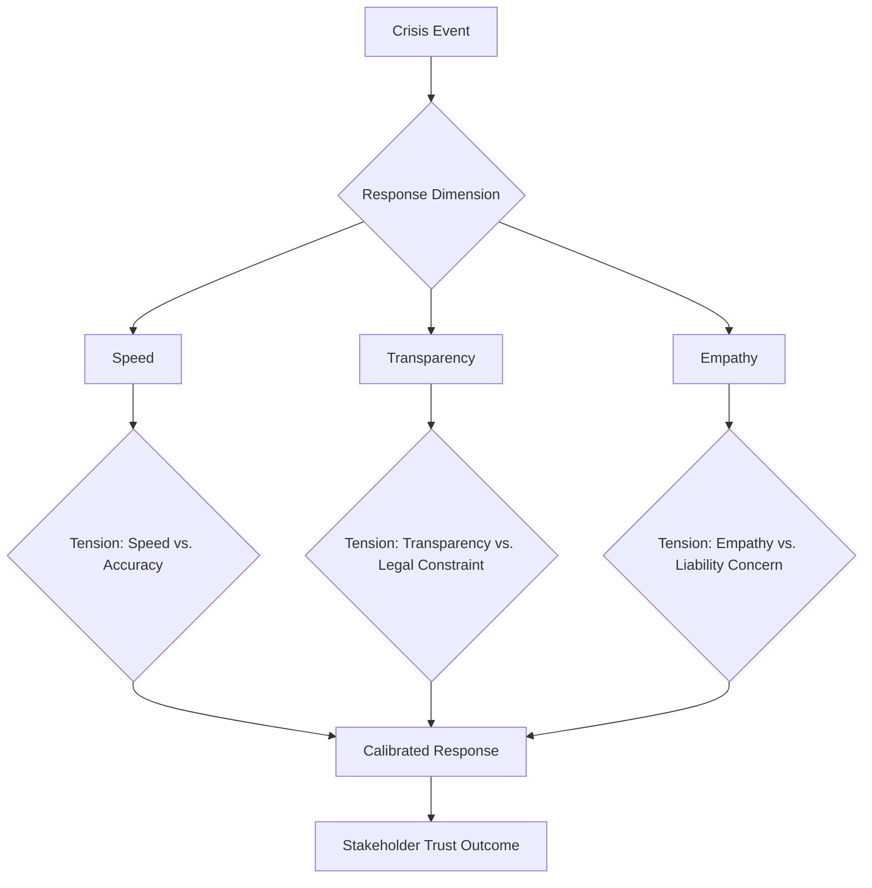
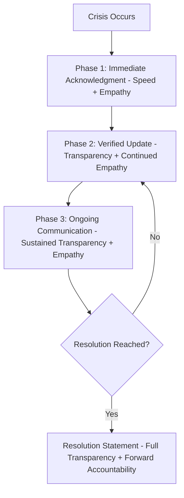

## Speed, Transparency, and Empathy in Response

### Definition and Scope

This topic examines the three interlocking response principles that determine crisis communication effectiveness in the acute response phase: speed (how quickly an organization communicates), transparency (how much and how honestly information is shared), and empathy (how the human impact of a crisis is acknowledged and centered). While introduced as foundational principles in crisis communication planning generally, this topic provides deeper technical treatment of how these three dimensions interact, sometimes in tension, and how to calibrate them in practice.

### Why These Three Dimensions Define Crisis Response Quality

**Key Points**

- Speed, transparency, and empathy are frequently cited together in crisis communication literature and practice because deficiency in any one undermines the effectiveness of the other two — a fast but cold response reads as procedural rather than genuine; a transparent but slow response arrives after the narrative has already been shaped by speculation; an empathetic but opaque response can feel performative without substantive follow-through.
- These dimensions frequently create genuine tension with each other and with legal/operational constraints, making the skill of calibration — not just awareness of the principles — the core competency this topic addresses.

### Diagram: The Three-Dimension Tension Model

### Speed: Principles and Calibration

#### Why Speed Matters

In the absence of timely organizational communication, affected stakeholders, media, and social platforms fill the information gap with speculation, secondhand accounts, and competing narratives — and once an alternative narrative has taken hold, subsequent correction is markedly more difficult than establishing an accurate account early referred to in crisis communication practice as "getting ahead of the story."

#### The Speed-Accuracy Tension

- Responding quickly with confirmed, verified information is the goal; responding quickly with speculation or unverified claims trades short-term narrative control for longer-term credibility risk if the initial statement requires correction.
- The practical resolution is not choosing between speed and accuracy but distinguishing between a substantive statement (which requires verification) and an acknowledgment statement (which requires only confirming that something has occurred and that the organization is responding) — the latter can and should be fast even when the former cannot.

**Example**: Within the first hour, "We are aware of reports regarding [X] and are actively gathering information; our priority is [affected stakeholders]" can be issued quickly and accurately, even while the specific facts of what happened remain under verification.

### Transparency: Principles and Calibration

#### What Transparency Requires

- Sharing what is known, clearly distinguishing it from what remains unknown or under investigation, rather than implying more certainty or completeness than actually exists.
- Proactively disclosing unfavorable facts relevant to stakeholder understanding, rather than waiting to be asked or for facts to emerge through other channels — the latter pattern (information emerging piecemeal or being extracted rather than volunteered) is a well-documented driver of secondary credibility crises layered on top of the original issue.

#### The Transparency-Legal Constraint Tension

- Legal counsel appropriately constrains certain disclosures during active litigation, ongoing regulatory investigation, or before facts are sufficiently confirmed to state with confidence — this is a legitimate constraint, not merely an obstacle to overcome.
- The calibration challenge is distinguishing genuinely necessary legal caution from excessive hedging that exceeds what's actually required — audiences generally can distinguish appropriate, explained limitation ("we can't share specifics while this is under active investigation, but here's what we can tell you") from vague, unexplained evasiveness, and respond to these differently.

#### Transparency About Uncertainty

Explicitly stating what is not yet known, rather than only communicating confirmed facts and remaining silent on open questions, demonstrates a more complete form of transparency — audiences generally respond better to "we don't yet know X, and will update you when we do" than to an information vacuum on that specific question.

### Empathy: Principles and Calibration

#### Why Empathy Must Come First Structurally

Leading a crisis response with acknowledgment of impact on affected people, before organizational process or technical explanation, reflects both genuine appropriate priority and a documented pattern in audience reception — communications that lead with defensive or procedural framing before acknowledging harm are frequently perceived as prioritizing organizational self-protection over genuine concern, regardless of the substantive content that follows.

**Example** structural comparison:

- **Process-first (generally less effective)**: "Our investigation protocol was immediately activated upon notification, in accordance with our incident response procedures..."
- **Empathy-first (generally more effective)**: "We are deeply concerned about the impact this has had on [affected group]. Here is what we are doing to address it..."

#### The Empathy-Liability Tension

- A commonly cited concern is that empathetic or apologetic language could be construed as an admission of legal liability — this is a genuine consideration requiring legal input, but the distinction between expressing genuine concern for those affected and making a specific factual or legal admission is one legal counsel can typically help navigate without requiring the complete absence of human acknowledgment. [Inference — specific legal risk varies significantly by jurisdiction and case specifics; consult qualified legal counsel for guidance on a specific situation.]
- Many jurisdictions have specific legal frameworks addressing this tension directly (e.g., some healthcare contexts have "apology laws" limiting the evidentiary use of expressions of sympathy) — the applicable framework depends heavily on jurisdiction and industry. [Verify current applicable law with qualified legal counsel, as this varies significantly by jurisdiction and context.]

### Integration: Calibrating All Three Together

#### The Sequencing Approach

A commonly recommended structural approach sequences these three dimensions rather than treating them as competing priorities requiring a single tradeoff:

1. **Immediate (speed-prioritized)**: Fast acknowledgment statement, empathy-forward, minimal specific factual claims requiring verification.
2. **Short-term (transparency-building)**: As facts are verified, substantive updates sharing confirmed information and explicitly noting what remains under investigation.
3. **Ongoing (sustained empathy and transparency)**: Regular updates maintaining both the human-impact framing and honest disclosure of developing information through resolution.

#### Calibration by Crisis Type

| Crisis Type | Speed Priority | Transparency Priority | Empathy Priority |
| --- | --- | --- | --- |
| Safety/harm incident | Very high | High, within legal bounds | Very high — leads the response |
| Data breach | High, often legally mandated timelines | High on scope/impact, more caution on technical vulnerability details | Moderate-high, focused on affected individuals |
| Financial/regulatory issue | Moderate, often governed by disclosure rules | High but legally structured | Moderate — professional register generally expected |
| Reputational/misinformation attack | Very high — narrative control matters most | High on factual correction | Moderate, focused on affected stakeholders if any |

### Common Tensions and Resolution Approaches

#### When Legal Caution Conflicts With Stakeholder Expectation

Pre-established protocols for rapid legal-communications coordination (as discussed under crisis communication planning) allow real-time resolution of this tension during an actual crisis rather than prolonged internal deliberation that delays response beyond what stakeholders will find acceptable.

#### When Facts Are Genuinely Unknown

Distinguishing between "we cannot share this due to legal/investigative constraints" and "we genuinely do not yet know this" and communicating which applies, rather than defaulting to vague non-answers that don't distinguish between these different reasons for incomplete information.

### Practical Checklist

- [ ] Rapid acknowledgment statement prepared that requires no unverified factual claims
- [ ] Clear internal distinction maintained between "acknowledgment" statements (fast) and "substantive" statements (require verification)
- [ ] Empathy and human-impact framing leads the response structure, before process/technical explanation
- [ ] Explicit language prepared for communicating genuine uncertainty ("we don't yet know X")
- [ ] Legal-communications coordination protocol activated to resolve transparency/liability tension quickly
- [ ] Ongoing update cadence maintains all three dimensions through to resolution, not just in the initial statement

### Common Pitfalls

- **Conflating acknowledgment with full disclosure**: Delaying the fast, simple acknowledgment statement while waiting to have complete, verified facts ready, when these can and should be decoupled.
- **Defaulting to legalistic evasiveness**: Applying maximum legal caution regardless of actual necessity, producing a response that reads as evasive beyond what's genuinely legally required.
- **Process-first structuring**: Leading crisis communication with organizational procedure or technical explanation rather than acknowledgment of human impact.
- **Treating empathy as incompatible with legal caution**: Assuming any expression of concern necessarily constitutes legal admission, without seeking specific legal guidance on the actual distinction in the applicable jurisdiction.
- **Abandoning the three dimensions after the initial statement**: Applying speed, transparency, and empathy principles rigorously to the first response but allowing them to lapse during the ongoing crisis communication that follows.

### Related Topics

- Principles of Crisis Communication Planning
- Handling Hostile or Adversarial Questioning
- Rebuilding Trust After a Reputational Crisis
- Managing Off-the-Record and Background Remarks
- Message Mapping and Staying on Message
- Ethical and Strategic Use of AI in Executive Communication