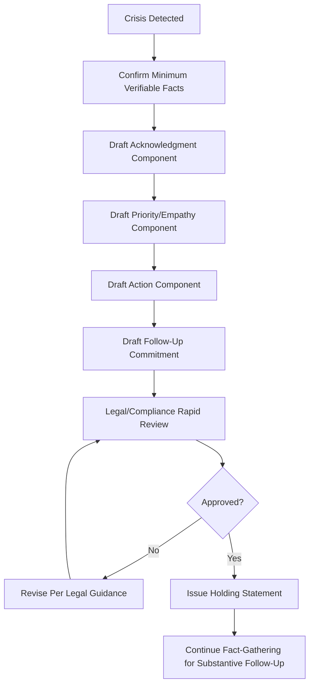

## Drafting Holding Statements and Initial Responses

### Definition and Scope

A holding statement is a brief, pre-drafted or rapidly-drafted communication issued in the earliest hours of a crisis, designed to acknowledge awareness of a situation and signal appropriate response without requiring complete, verified facts. This topic covers the specific drafting technique, structure, and practical construction of holding statements and other initial crisis responses, building on the speed-transparency-empathy framework established in the broader crisis communication principles.

### Purpose and Function of a Holding Statement

**Key Points**

- A holding statement's primary function is to fill the information gap quickly with an accurate, if incomplete, acknowledgment — preventing the vacuum that would otherwise be filled by speculation, rumor, or unfavorable external framing.
- Holding statements are explicitly not intended to be comprehensive; their value lies in being fast, accurate as far as they go, and setting appropriate expectations for further communication, not in fully explaining or resolving the situation.
- A well-constructed holding statement buys time for the crisis team to verify facts and develop a fuller substantive response without appearing unresponsive or evasive during that verification period.

### Core Structural Components

#### The Standard Holding Statement Framework

| Component | Function | Example Language Pattern |
| --- | --- | --- |
| Acknowledgment | Confirms awareness of the situation | "We are aware of [situation/reports of X]." |
| Priority statement | Signals appropriate immediate concern | "Our immediate priority is the safety/wellbeing of [affected group]." |
| Action statement | Indicates active response is underway | "We are actively investigating/gathering information/working to address this." |
| Commitment to follow-up | Sets expectation for further communication | "We will provide additional information as soon as we are able to confirm the facts." |
| Contact/channel information | Directs stakeholders to appropriate follow-up channel | "For questions, please contact [designated channel]." |

**Example — complete holding statement**:

"We are aware of reports regarding [issue] affecting [group]. Our immediate priority is the safety and wellbeing of everyone involved. We are actively gathering information and will share confirmed details as soon as possible. For updates, please [channel]."

### Diagram: Holding Statement Development Process

### Drafting Principles

#### 1. Precision About What Is and Isn't Claimed

A holding statement should carefully avoid asserting facts that haven't been verified, while still conveying appropriate seriousness and responsiveness — this requires precise language distinguishing between "we are aware of reports of X" (acknowledging the report exists, not confirming its content) and "X occurred" (an assertion of fact requiring verification).

**Example distinction**:

- Premature factual claim: "A safety incident occurred at our facility this morning affecting 12 employees."
- Appropriately calibrated: "We are aware of an incident at our facility this morning and are actively assessing the situation, including the wellbeing of everyone involved."

#### 2. Leading With Appropriate Concern

Consistent with the empathy-first structural principle discussed under crisis response dimensions, holding statements should generally lead with or closely follow the acknowledgment with a statement of appropriate concern or priority, rather than leading with organizational process or defensive framing.

#### 3. Avoiding Overcommitment

Holding statements should avoid specific commitments (timelines, outcomes, remedies) that cannot yet be confirmed as achievable — a vague but honest "as soon as possible" is preferable to a specific timeline that may need to be walked back if circumstances change.

#### 4. Calibrated Length

Holding statements are deliberately brief — typically 3-5 sentences — reflecting their function as a rapid acknowledgment rather than a comprehensive explanation; excessive length in an initial statement can dilute the clarity of the core acknowledgment and slow the drafting/approval process during time-sensitive early hours.

### Pre-Drafting Templates by Crisis Category

#### Category-Specific Considerations

| Crisis Category | Holding Statement Emphasis |
| --- | --- |
| Safety/injury incident | Immediate emphasis on affected individuals' wellbeing; avoid speculation on cause |
| Data/security breach | Acknowledge awareness, emphasize investigation is underway; avoid premature scope claims |
| Product/service failure | Acknowledge customer impact; avoid premature root-cause claims |
| Executive/personnel matter | Careful, often legally-reviewed language; frequently shorter and more procedurally framed given HR/legal sensitivity |
| External allegation/misinformation | Acknowledge awareness of the claim; indicate fact-checking or response is underway without amplifying the claim unnecessarily |

Maintaining pre-drafted template structures (not full pre-written statements, since specifics can't be known in advance, but structural templates with placeholder language) for each plausible crisis category allows for rapid customization rather than drafting the full structure from scratch under time pressure.

### The Legal Review Step

- Even brief holding statements typically require rapid legal review before issuance, given that specific word choices can carry legal implications (e.g., language that could be construed as admitting fault or liability).
- Establishing a pre-agreed rapid-review protocol (e.g., a designated legal contact available for expedited review of crisis statements) prevents the legal review step from becoming a bottleneck that delays the statement beyond the window where speed still matters.

### Multi-Channel Adaptation

A single holding statement's core content often needs adaptation across channels:

- **Press statement**: Formal register, complete structural components.
- **Social media**: Condensed version maintaining the same core acknowledgment and empathy, adapted to platform length constraints.
- **Internal employee communication**: May include additional detail or reassurance appropriate for an internal audience, issued through internal channels, often simultaneously with or just before external statements to avoid employees learning of a crisis through external media first.
- **Direct stakeholder communication** (e.g., affected customers): Often more personal and specific than the general public statement, where appropriate and legally permissible.

### From Holding Statement to Substantive Follow-Up

- The holding statement explicitly commits to further communication; failing to follow through on that commitment in a reasonable timeframe undermines the credibility established by the initial rapid response.
- As facts are verified, subsequent statements should build directly on the holding statement's framing (maintaining message consistency) while adding substantive, confirmed detail — the transition from holding statement to fuller substantive response should feel like a continuation of the same narrative, not a shift in framing or tone.

### Practical Checklist

- [ ] Minimum verifiable facts confirmed before drafting (even if incomplete)
- [ ] Structural components included: acknowledgment, priority/empathy, action, follow-up commitment
- [ ] Language precisely distinguishes confirmed facts from claims still under verification
- [ ] Statement leads with appropriate concern/empathy rather than organizational process
- [ ] No overcommitment to specific timelines or outcomes not yet confirmed achievable
- [ ] Rapid legal review protocol activated and completed before issuance
- [ ] Statement adapted appropriately across relevant channels (press, social, internal, direct stakeholder)
- [ ] Internal stakeholders (especially employees) informed via appropriate internal channel, ideally simultaneous with or ahead of external release
- [ ] Plan in place for timely substantive follow-up honoring the holding statement's commitment

### Common Pitfalls

- **Premature factual assertion**: Including unverified details in the rush to appear responsive, creating correction risk later.
- **Excessive length or complexity**: Drafting an overly comprehensive initial statement that delays issuance and dilutes the core acknowledgment.
- **Missing the empathy component**: Structuring the statement around organizational process without adequately acknowledging affected stakeholders.
- **Overcommitting on specifics**: Promising particular timelines or remedies that may not be achievable, creating a second credibility issue if unmet.
- **Bottlenecked legal review**: Lacking a pre-established rapid review protocol, causing the legal approval step to delay the statement past the window where speed still provides value.
- **Inconsistent channel adaptation**: Issuing materially different messaging across channels rather than a consistent core message adapted appropriately in length and register.
- **Failing to follow through**: Not delivering the promised substantive follow-up in a reasonable timeframe, undermining trust built by the initial rapid acknowledgment.

### Related Topics

- Principles of Crisis Communication Planning
- Speed, Transparency, and Empathy in Response
- Message Mapping and Staying on Message
- Handling Hostile or Adversarial Questioning
- Managing Off-the-Record and Background Remarks
- Rebuilding Trust After a Reputational Crisis