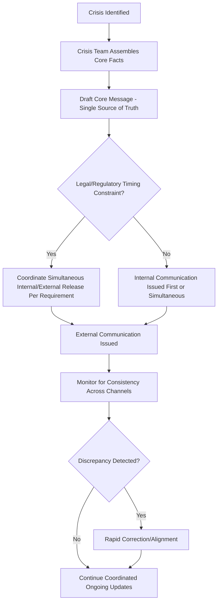

## Coordinating Internal and External Crisis Messaging

### Definition and Scope

This topic covers the strategic and operational discipline of aligning communication to internal audiences (employees, leadership, board members) with communication to external audiences (media, customers, investors, regulators, the public) during a crisis, ensuring consistency, appropriate sequencing, and channel-specific calibration while managing the practical challenges of controlling information flow across both spheres simultaneously.

### Why Coordination Is a Distinct Challenge

**Key Points**

- Internal and external audiences often receive information through different channels and timelines, but in the modern environment (social media, employee-to-press leaks, screenshots) internal communication is never truly separable from external exposure, meaning internal messaging must be drafted with the assumption it could become public.
- Employees who learn about a crisis affecting their own organization through external media before internal channels experience this as a trust breach distinct from the crisis itself, often generating secondary reputational and morale damage.
- Inconsistency between internal and external messaging — even unintentional differences in emphasis or framing — creates vulnerability, since any employee has the practical ability to share internal communication externally, exposing discrepancies.

### Core Sequencing Principle: Internal First (or Simultaneous)

#### The Standard Practice

A widely followed principle in crisis communication practice holds that internal stakeholders — particularly employees — should generally be informed before or simultaneously with external public communication, not after, particularly for crises directly affecting the organization's own operations, workforce, or conduct.

**Example rationale**: If employees learn about a significant crisis affecting their own company through a news alert rather than from their own organization, this signals either poor organizational awareness or a deliberate choice to prioritize external optics over internal trust — both interpretations damage internal morale and trust independent of the underlying crisis.

#### Practical Exceptions and Complications

- **Fast-moving external events**: When a crisis breaks externally first (e.g., investigative journalism publishing before the organization is aware), simultaneous rather than sequential internal/external communication may be the practical reality rather than the ideal internal-first sequence.
- **Regulatory or legal timing constraints**: Certain disclosures (e.g., securities-related material events) may have specific external timing requirements that constrain the ability to fully brief internal audiences first — legal counsel guidance is necessary to navigate these constraints appropriately. [Verify specific disclosure timing requirements with qualified legal counsel, as these vary by jurisdiction and circumstance.]

### Diagram: Internal-External Coordination Workflow

### Building a Single Source of Truth

#### Core Message Consistency

Developing one core factual narrative and message framework that both internal and external communications derive from — with format, length, and register adapted per audience but substantive content consistent — reduces the risk of unintentional discrepancy between what employees are told and what the public sees.

#### Format and Register Adaptation

| Audience | Typical Adaptations |
| --- | --- |
| Employees | More operational detail, guidance on how to respond to external inquiries, reassurance relevant to their specific role/security |
| Media/public | More concise, quotable, focused on public-facing facts and organizational response |
| Investors | Emphasis on financial/material impact, often subject to specific regulatory disclosure format requirements |
| Customers | Focused on direct impact to them and specific remediation steps |
| Regulators | Formal, detailed, often following specific mandated reporting formats |

While format and emphasis differ, the underlying facts and core narrative should remain consistent — differing facts (as opposed to differing emphasis or detail level) across audiences is the specific failure mode to avoid.

### Preparing Employees as Communication Agents

#### Equipping Employees to Handle External Inquiries

Employees are frequently approached directly by press, customers, or the public during a crisis, regardless of whether they are designated spokespeople; providing clear guidance on how to handle these approaches (typically directing inquiries to the designated communications channel rather than answering personally) prevents unauthorized or inconsistent statements from circulating.

**Example internal guidance**: "If you're contacted by media or asked about this situation outside the company, please direct them to [communications contact] rather than responding directly, even informally. This helps ensure we're providing accurate, consistent information."

#### Addressing the Leak/Screenshot Reality

Given that internal communications can be — and frequently are — shared externally (intentionally or not), drafting internal crisis communication with the assumption it may become public is a practical risk-management discipline, not merely an aspirational ideal; this doesn't mean sanitizing internal communication to external-facing blandness, but does mean avoiding language internally that would be significantly more damaging or embarrassing if it became public than the organization's actual external position.

### Managing the Internal Communication Channel Itself

#### Channel Selection for Internal Crisis Communication

- High-severity crises often warrant live, synchronous internal communication (town hall, direct manager cascades) over purely asynchronous written communication, given the higher trust and clarity synchronous formats can provide during high-anxiety situations — connecting to considerations discussed under facilitating engagement in hybrid/virtual settings and managing asynchronous announcements.
- Manager cascades (briefing managers first, who then relay to their teams) can provide more personalized, question-responsive communication than a single broad announcement, but require careful coordination to ensure consistent messaging across managers and rapid timing to avoid the broad announcement outpacing the cascade.

#### Employee Q&A and Feedback Channels

Providing employees a channel to ask questions and receive timely answers during a crisis (rather than one-way broadcast only) supports both genuine information needs and morale, reducing the likelihood that unanswered internal questions surface as external leaks or public employee commentary (e.g., on social media, anonymous platforms).

### Board and Senior Leadership Coordination

For crises with significant governance, financial, or legal implications, coordinating communication to the board of directors is a distinct layer, often preceding or running in close parallel with broader internal/external communication, given board members' governance and fiduciary oversight role — specific protocols for board notification timing are typically established as part of broader crisis communication and governance planning.

### Common Coordination Failure Points

#### Timing Misalignment

External communication released before internal briefing is complete, or internal communication significantly delayed relative to external release, both create the trust and consistency problems this topic addresses — pre-established sequencing protocols (as part of crisis communication planning) reduce the risk of this happening due to coordination gaps under pressure rather than deliberate choice.

#### Tonal Inconsistency

Internal communication that is markedly more casual, more alarmed, or more candid in a way that would read very differently if it became public than the external statement, creating a credibility gap if the discrepancy surfaces.

#### Spokesperson Confusion

Without clear internal guidance, well-meaning employees may attempt to informally reassure external contacts (customers, press) with information that isn't authorized or accurate, creating exactly the inconsistency problem coordination is meant to prevent.

### Practical Checklist

- [ ] Core message and factual narrative developed as a single source of truth for all audiences
- [ ] Internal communication sequenced before or simultaneous with external release, absent specific legal/regulatory constraints requiring otherwise
- [ ] Format and register adapted per audience while maintaining consistent underlying facts
- [ ] Employee guidance issued on handling external inquiries, directing to designated channels
- [ ] Internal communication drafted with awareness that it may become externally visible
- [ ] Channel selection (synchronous vs. asynchronous, cascade vs. broad announcement) calibrated to crisis severity
- [ ] Employee Q&A/feedback channel established, not purely one-way broadcast
- [ ] Board/senior leadership notification protocol coordinated with broader crisis communication timing

### Common Pitfalls

- **External-first sequencing**: Employees learning about a crisis affecting their own organization from external media rather than internal channels, generating a distinct trust breach.
- **Substantive factual inconsistency**: Differing core facts (not just format/detail level) between internal and external messaging, creating vulnerability if the discrepancy is discovered.
- **Unprepared employees fielding inquiries**: Lack of clear guidance leading employees to informally respond to external inquiries with unauthorized or inaccurate information.
- **Treating internal communication as inherently private**: Drafting internal messaging without considering the realistic possibility of external exposure via leaks or screenshots.
- **One-way broadcast only**: Failing to provide employees a channel for questions, increasing the likelihood of unanswered concerns surfacing through informal or external channels.
- **Uncoordinated board notification**: Board members learning of a crisis through the same channels as the general public, rather than through an appropriately prioritized governance-specific protocol.

### Related Topics

- Principles of Crisis Communication Planning
- Drafting Holding Statements and Initial Responses
- Speed, Transparency, and Empathy in Response
- Managing Asynchronous Updates and Announcements
- Facilitating Engagement in Hybrid Meetings
- Rebuilding Trust After a Reputational Crisis