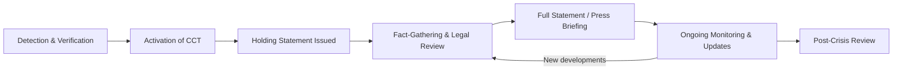

## Managing Media and Public Scrutiny During a Crisis

### Overview

Managing media and public scrutiny during a crisis is the discipline of controlling information flow, framing, and organizational visibility while an organization is under acute reputational, operational, or legal threat. It sits at the intersection of crisis communication, media relations, and reputation management, and it requires synchronized action across legal, executive, communications, and operational teams within a compressed timeframe — often minutes to hours rather than days.

The core tension in this discipline is between two competing imperatives: the legal/risk imperative to limit liability exposure through caution and precision, and the reputational imperative to demonstrate transparency, competence, and empathy quickly enough to prevent a vacuum that media and public speculation will fill.

### Key Points

- **The golden hour**: The first 60–90 minutes after a crisis becomes public (or threatens to) disproportionately determine the narrative trajectory. Organizations that fail to issue any acknowledgment in this window typically lose narrative control to journalists, social media, and competitors.
- **Information vacuum principle**: When an organization is silent, the vacuum is filled by speculation, leaks, competitor commentary, and unverified sources — rarely to the organization's benefit.
- **Holding statement vs. full statement**: A holding statement acknowledges awareness and commitment to investigate without conceding facts or liability; a full statement follows once facts are verified.
- **Single-source-of-truth discipline**: All spokespeople, channels, and materials must be traceable to one approved messaging document to avoid contradictory statements that erode credibility.
- **Media scrutiny escalates non-linearly**: Coverage volume tends to follow a spike-and-decay pattern, but a poorly handled response (evasion, contradiction, perceived dishonesty) can trigger a second, larger spike — the "cover-up is worse than the crime" dynamic.
- **Public scrutiny ≠ media scrutiny**: Social media, forums, and stakeholder communities can sustain and amplify a story independent of, or even ahead of, traditional press coverage.

### Core Components

#### 1. Crisis Communication Command Structure

A functioning response requires a designated command structure before a crisis hits, not during one.

- **Crisis Communication Team (CCT)**: Typically composed of the CEO or senior executive sponsor, Head of Communications/PR, General Counsel, Head of Operations/relevant business unit, and a scribe/coordinator.
- **Single spokesperson principle**: One primary, trained spokesperson (with a designated backup) speaks externally to prevent message drift. Executives who are untrained in media handling should not field unscripted questions.
- **Decision rights matrix**: Pre-defined authority for who can approve statements, who can speak to which media tier (trade press vs. national press vs. regulators), and escalation thresholds.

#### 2. The Crisis Communication Lifecycle

**Detection & Verification**: Confirm the crisis is real, scope its severity, and identify who is affected before any external communication. Premature statements based on unverified facts are a leading cause of credibility loss.

**Activation**: The CCT convenes, typically via a pre-established rapid-activation protocol (phone tree, dedicated channel, or incident management tool).

**Holding Statement**: A brief, factual, empathetic statement issued within the golden hour. It does not speculate on cause or liability.

**Fact-Gathering & Legal Review**: Parallel workstream where legal counsel screens statements for liability exposure while communications drafts substantive messaging.

**Full Statement/Briefing**: Delivered once facts are sufficiently verified, typically including cause (to the extent known), impact, corrective action, and accountability language.

**Ongoing Monitoring**: Media sentiment tracking, social listening, and stakeholder inquiry management continue until the story de-escalates.

**Post-Crisis Review**: After-action analysis to refine playbooks.

#### 3. Message Architecture During Crisis

Crisis messaging typically follows a structural pattern rather than ad hoc composition:

1. **Acknowledgment** — "We are aware of [event]."
2. **Empathy/concern** — Direct statement of concern for those affected, stated early and without hedging.
3. **Action** — What is being done right now (containment, investigation, support).
4. **Commitment** — What will follow (updates, accountability, remediation timeline).
5. **Channel for more information** — Where stakeholders can get updates (hotline, website, press contact).

**Example** (holding statement template):

> "We are aware of [incident] that occurred at [time/location]. Our immediate priority is the safety and wellbeing of everyone affected. We have activated our incident response team and are working to establish the facts. We will provide updates as soon as we have verified information. For immediate concerns, please contact [channel]."

Note that this template avoids assigning cause, admitting fault, or making commitments the organization cannot verify it can keep — this is a deliberate structural choice, not evasiveness, and should be explained to executives who may resist its caution.

#### 4. Media Tiering and Channel Strategy

Not all media inquiries warrant the same response depth or speed:

| Tier | Example | Response Approach |
| --- | --- | --- |
| Tier 1 (high-reach, high-scrutiny) | National broadcast, major wire services | Prepared spokesperson, on-record statement, possible press conference |
| Tier 2 (trade/industry) | Sector-specific publications | Written statement, background briefing available |
| Tier 3 (local/niche) | Local news, niche blogs | Standard written statement, self-serve press kit |
| Owned channels | Company website, social media, email | Direct-to-stakeholder updates bypassing media filter entirely |

**Owned-channel primacy**: A growing practice is to publish the authoritative account on owned channels (statement page, X/Twitter thread, LinkedIn post) simultaneously with or before media outreach, so the organization's own words are the first indexed/cited version of events.

#### 5. Handling Adversarial Interviews and Press Conferences

- **Bridging technique**: Redirect from a hostile or speculative question back to a key message ("What I can tell you is...").
- **Flagging technique**: Signal importance before delivering a key message ("The most important thing for people to understand is...").
- **Non-denial pitfalls**: Avoid "no comment," which is widely read as an implicit admission; instead use "we're not able to confirm that yet because..."
- **Never speculate on cause, blame, or numbers** (casualties, financial losses) before verified — retracted figures are more damaging than a delayed accurate figure.
- **Anticipate the hardest question first** in prep sessions ("murder board" or "red team" prep), since the actual interview rarely exceeds prepped difficulty.

#### 6. Digital and Social Media Scrutiny Management

- **Social listening**: Real-time monitoring of sentiment, volume, and key influencers/journalists discussing the event, using tools such as Brandwatch, Meltwater, or Sprinklr.
- **Comment moderation policy**: Pre-defined rules for which comments on owned channels get responses, hidden, or escalated — applied consistently to avoid accusations of censorship.
- **Correcting misinformation**: Rapid, factual correction of falsehoods without amplifying them unnecessarily (avoid repeating false claims verbatim in rebuttals where possible, per the "backfire effect" literature — findings here are mixed and context-dependent [Inference]).
- **Employee communication as a control point**: Employees often post on personal social media during a crisis; internal guidance (not gag orders, which tend to leak and backfire) should be issued early to keep internal and external messaging aligned.

### Illustration: Crisis Response Decision Flow (svg_diagram)

<svg xmlns="http://www.w3.org/2000/svg" viewBox="0 0 900 560" font-family="Arial, sans-serif">
<text x="450" y="30" text-anchor="middle" font-size="18" font-weight="bold" fill="#1a1a1a">Crisis Media Response Decision Flow (svg_diagram)</text>
<rect x="360" y="55" width="180" height="50" rx="8" fill="#2c3e50" stroke="#1a1a1a" />
<text x="450" y="85" text-anchor="middle" font-size="13" fill="#ffffff">Crisis Detected</text>
<line x1="450" y1="105" x2="450" y2="140" stroke="#333" stroke-width="2" marker-end="url(#arrow)" />
<rect x="330" y="140" width="240" height="55" rx="8" fill="#34495e" stroke="#1a1a1a" />
<text x="450" y="163" text-anchor="middle" font-size="12" fill="#ffffff">Is public/media awareness</text>
<text x="450" y="180" text-anchor="middle" font-size="12" fill="#ffffff">imminent or already occurring?</text>
<line x1="450" y1="195" x2="280" y2="240" stroke="#333" stroke-width="2" marker-end="url(#arrow)" />
<line x1="450" y1="195" x2="620" y2="240" stroke="#333" stroke-width="2" marker-end="url(#arrow)" />
<text x="330" y="220" font-size="12" fill="#c0392b">Yes</text>
<text x="580" y="220" font-size="12" fill="#27ae60">No / Not yet</text>
<rect x="160" y="240" width="240" height="55" rx="8" fill="#c0392b" stroke="#1a1a1a" />
<text x="280" y="263" text-anchor="middle" font-size="12" fill="#ffffff">Issue holding statement</text>
<text x="280" y="280" text-anchor="middle" font-size="12" fill="#ffffff">within golden hour</text>
<rect x="500" y="240" width="240" height="55" rx="8" fill="#27ae60" stroke="#1a1a1a" />
<text x="620" y="263" text-anchor="middle" font-size="12" fill="#ffffff">Prepare proactively;</text>
<text x="620" y="280" text-anchor="middle" font-size="12" fill="#ffffff">monitor for escalation</text>
<line x1="280" y1="295" x2="280" y2="330" stroke="#333" stroke-width="2" marker-end="url(#arrow)" />
<rect x="160" y="330" width="240" height="55" rx="8" fill="#2980b9" stroke="#1a1a1a" />
<text x="280" y="353" text-anchor="middle" font-size="12" fill="#ffffff">Legal review + fact</text>
<text x="280" y="370" text-anchor="middle" font-size="12" fill="#ffffff">verification (parallel track)</text>
<line x1="280" y1="385" x2="280" y2="420" stroke="#333" stroke-width="2" marker-end="url(#arrow)" />
<rect x="160" y="420" width="240" height="55" rx="8" fill="#8e44ad" stroke="#1a1a1a" />
<text x="280" y="443" text-anchor="middle" font-size="12" fill="#ffffff">Full statement /</text>
<text x="280" y="460" text-anchor="middle" font-size="12" fill="#ffffff">press briefing</text>
<line x1="280" y1="475" x2="280" y2="510" stroke="#333" stroke-width="2" marker-end="url(#arrow)" />
<rect x="140" y="510" width="280" height="40" rx="8" fill="#16a085" stroke="#1a1a1a" />
<text x="280" y="535" text-anchor="middle" font-size="12" fill="#ffffff">Continuous monitoring &amp; updates</text>
</svg>

### Common Pitfalls

- **The "no comment" trap**: Perceived as evasive even when legally motivated; use a substantive, bounded non-answer instead.
- **Premature blame assignment**: Naming a cause or individual before investigation concludes creates legal exposure and credibility risk if the initial account changes.
- **Message fragmentation**: Multiple executives giving slightly different accounts to different outlets undermines the single-source-of-truth principle.
- **Over-legalizing statements**: Statements drafted purely for liability minimization often read as cold or evasive to the public; the CCT must balance legal precision with human tone.
- **Ignoring owned channels**: Relying solely on media pickup instead of publishing directly to stakeholders cedes framing control.
- **Silence mistaken for prudence**: Waiting for "complete" facts before any statement, when a well-crafted holding statement requires only minimal verified facts.
- **Failure to update**: Issuing one statement and going dark; ongoing crises require a visible cadence of updates even when there is "nothing new" ("we are still investigating and will update by [time]" is itself a valid update).

### Worked Example

**Scenario**: A mid-sized logistics company experiences a data breach affecting customer payment information, discovered internally at 9:00 AM. A journalist emails the press office at 11:30 AM asking for comment, indicating the story will run regardless of response.

**Response sequence**:

1. **9:00–9:30 AM**: Internal detection confirmed by IT security; CCT activated via incident protocol.
2. **9:30–10:30 AM**: Scope assessment (how many records, what data types) run in parallel with legal review of breach notification obligations (e.g., relevant data protection law timelines).
3. **11:30 AM**: Journalist inquiry received. Communications lead confirms this is now a Tier 1 situation (imminent public awareness).
4. **11:45 AM**: Holding statement issued to the journalist and simultaneously posted to the company's status page:

> "We are aware of a security incident affecting a subset of customer data. We take this extremely seriously and have engaged our incident response team, including external security specialists. We are working to determine the scope and will notify affected customers directly as soon as we have verified information. Updates will be posted at [status page]."

5. **12:00–4:00 PM**: Scope confirmed; legal finalizes notification language; executive spokesperson prepped for possible broadcast interview requests.
6. **5:00 PM**: Full statement issued including scope, remediation steps (credit monitoring offer, password reset mandate), and a named point of contact.
7. **Following days**: Daily or twice-daily updates on the status page until the investigation closes; post-incident report published once complete.

### Related Topics

- Crisis Communication Planning and Preparedness (pre-crisis playbooks, simulation drills)
- Stakeholder Mapping and Prioritization in a Crisis
- Legal-Communications Coordination During Litigation-Adjacent Crises
- Social Listening and Digital Reputation Monitoring
- Spokesperson Media Training and Message Discipline
- Post-Crisis Reputation Recovery and Trust Rebuilding
- Regulatory Notification Obligations (data breach, safety incidents)
- Internal Communications During External Crises
- Apology and Accountability Framing in Executive Communication