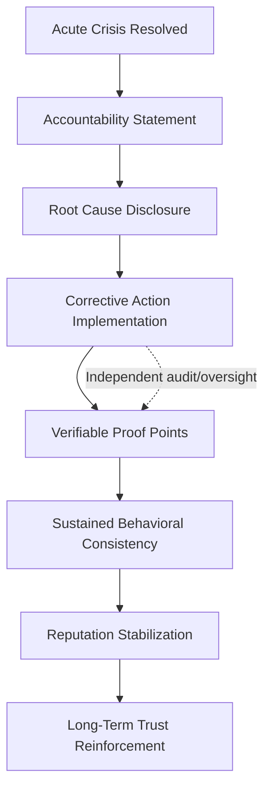

## Rebuilding Trust and Reputation After a Crisis

### Overview

Rebuilding trust and reputation after a crisis is the sustained, structured effort an organization undertakes once the acute phase of a crisis has passed and the focus shifts from containment to recovery. Where crisis response is measured in hours and days, reputation rebuilding is measured in months and years. It requires converting a demonstrated failure into demonstrated, verifiable change — trust is not restored through communication alone, but through communication that accurately narrates underlying operational and behavioral change.

The discipline draws on trust-repair theory from organizational psychology, stakeholder theory, and reputation management, and it applies distinctly different strategies depending on the attribution of the crisis: whether the organization was a victim (e.g., natural disaster), accidental cause (e.g., unintentional product defect), or was preventable/intentional (e.g., negligence, misconduct).

### Key Points

- **Trust is asymmetric**: Trust is built slowly through consistent behavior but destroyed quickly through a single violation — reputational capital does not restore at the same rate it was depleted.
- **Attribution of responsibility determines strategy**: Situational Crisis Communication Theory (SCCT), developed by W. Timothy Coombs, holds that the appropriate response strategy depends on the level of organizational responsibility perceived by stakeholders — denial, diminishment, rebuilding, or bolstering strategies map to different crisis types.
- **Competence trust vs. integrity trust**: Competence-based trust violations (we made an error) are typically easier to repair than integrity-based violations (we deceived you), which require more sustained and visible corrective action (this distinction is well-established in trust-repair literature, though repair timelines vary by context [Inference]).
- **Actions must precede or accompany claims**: Statements of change unaccompanied by visible evidence are read as further reputation management rather than genuine repair, often deepening skepticism.
- **Silence has a half-life**: A period of reduced visibility after acute crisis communication is normal and often advisable, but prolonged organizational silence during the recovery phase can be misread as lack of accountability.

### Core Components

#### 1. Situational Crisis Communication Theory (SCCT) Response Strategies

| Crisis Cluster | Attributed Responsibility | Primary Strategy |
| --- | --- | --- |
| Victim cluster (natural disaster, rumor, workplace violence by outsider) | Low | Denial or minimal response; provide instructing/adjusting information |
| Accidental cluster (technical error, product harm without prior warning) | Moderate | Excuse, justification, or diminishment strategies |
| Preventable cluster (human error with prior knowledge, management misconduct) | High | Rebuilding strategies: apology, compensation, corrective action |
| Any cluster | — | Bolstering strategies (reminding of past good works, expressing gratitude) can supplement but not replace the primary strategy |

Applying a bolstering-only strategy to a preventable crisis (e.g., citing past charitable work after a negligence finding) is a well-documented misstep that intensifies backlash [Inference — outcome varies by stakeholder and context, but the pattern is consistently observed in case literature].

#### 2. The Trust Repair Lifecycle

**Accountability Statement**: A clear, unhedged acknowledgment of what went wrong and who is responsible, distinct from the earlier holding/full statements which may have been more provisional.

**Root Cause Disclosure**: Publishing findings (often via internal or third-party investigation) that explain mechanism of failure, not just impact.

**Corrective Action Implementation**: Concrete changes — policy revision, personnel changes, process redesign, technology investment.

**Verifiable Proof Points**: External validation such as audits, certifications, regulatory sign-off, or independent monitor reports that substantiate claimed changes.

**Sustained Behavioral Consistency**: Repeated demonstration over time, since a single corrective act is read as reactive rather than reformed.

**Reputation Stabilization**: Media and stakeholder sentiment normalize; the crisis ceases to be the dominant association with the brand.

**Long-Term Trust Reinforcement**: The organization proactively uses the recovery as a credibility asset (e.g., "since [incident], we have...") if handled with restraint and not turned into self-congratulation.

#### 3. The Anatomy of an Effective Apology

Research on organizational apologies (e.g., work by Roy Lewicki and colleagues on the components of an effective apology) identifies distinct elements, most of which are necessary but not universally sufficient on their own:

1. **Acknowledgment of the offense** — specific, not vague ("we failed to secure customer data" vs. "mistakes were made").
2. **Explanation** — context without excuse-making; explaining is not the same as excusing.
3. **Acknowledgment of responsibility** — explicit ownership, avoiding passive voice constructions that obscure agency.
4. **Declaration of regret** — genuine expression of remorse, distinct from legal or reputational regret.
5. **Offer of repair** — concrete remedy (compensation, restitution, policy change).
6. **Request for forgiveness** — optional and context-dependent; can read as presumptuous if used too early.

**Example** (rebuilding-phase statement, following a preventable data breach):

> "Three months ago, we failed to protect our customers' data because we had not implemented multi-factor authentication on legacy systems despite internal recommendations to do so in [year]. That is our failure, not an external attack we could not have anticipated. Since then, we have completed an independent security audit, implemented MFA across all systems, and established a customer data advisory board that includes external security experts. We are publishing the full audit findings today and will report progress quarterly for the next two years."

Note the structural shift from the earlier holding statement: this version names the specific failure, accepts sole responsibility, and cites verifiable, time-bound proof points rather than general commitments.

#### 4. Stakeholder-Specific Rebuilding Strategies

Different stakeholder groups require differentiated trust-repair approaches; a single public statement is necessary but not sufficient.

| Stakeholder | Rebuilding Focus | Typical Mechanism |
| --- | --- | --- |
| Customers/consumers | Restored confidence in product/service safety | Direct outreach, compensation, product changes, loyalty gestures |
| Employees | Restored confidence in leadership and workplace safety | Internal town halls, transparent internal reporting, leadership accountability (including departures where warranted) |
| Investors/board | Restored confidence in governance and risk management | Governance reforms, board committee oversight, financial remediation disclosure |
| Regulators | Demonstrated compliance and good faith | Consent decrees, compliance monitors, voluntary disclosure |
| Media | Restored access and credibility | Sustained transparency, availability for follow-up, no stonewalling on progress updates |
| General public | Restored brand association | Long-term narrative reinforcement, third-party validation, community engagement |

#### 5. Measurement of Reputation Recovery

Reputation recovery should be tracked quantitatively, not assumed:

- **Media sentiment analysis**: Tone and volume of coverage over time relative to crisis baseline.
- **Share of voice**: Proportion of brand-related conversation still dominated by the crisis vs. other topics.
- **Net Promoter Score (NPS) / brand trust indices**: Longitudinal tracking against pre-crisis baseline.
- **Search behavior**: Search volume correlating brand name with crisis-related terms, tracked over time as a leading indicator of public association.
- **Stock price and analyst sentiment** (for public companies): A partial and noisy proxy, since market reaction reflects many confounding factors [Inference].
- **Employee retention and engagement scores**: Internal trust often lags or leads external trust recovery depending on how the crisis was handled internally.

#### 6. Common Failure Modes in Reputation Rebuilding

- **Premature declaration of "moving forward"**: Announcing the crisis is resolved before stakeholders perceive sufficient accountability, which can trigger renewed scrutiny.
- **Apology without change ("apology theater")**: Ritualistic apologies unaccompanied by structural change are increasingly recognized by media and the public, and tend to be called out explicitly.
- **Change without communication**: Making genuine improvements but failing to communicate them, leaving stakeholders unaware that trust conditions have changed.
- **Overcorrection burnout**: Excessive, repetitive self-referential messaging about the crisis recovery that keeps the crisis salient in public memory longer than necessary.
- **Leadership incongruence**: Retaining leadership widely perceived as responsible without acknowledgment or change, undermining all other repair efforts regardless of their substance.
- **Inconsistent stakeholder treatment**: Compensating one stakeholder group generously while neglecting another (e.g., generous customer settlements alongside opaque treatment of affected employees) — perceived unfairness compounds distrust.

### Illustration: Trust Repair Strategy Selection (svg_diagram)

<svg xmlns="http://www.w3.org/2000/svg" viewBox="0 0 900 480" font-family="Arial, sans-serif">
<text x="450" y="30" text-anchor="middle" font-size="18" font-weight="bold" fill="#1a1a1a">Trust Repair Strategy Selection (svg_diagram)</text>
<rect x="340" y="55" width="220" height="50" rx="8" fill="#2c3e50" stroke="#1a1a1a" />
<text x="450" y="85" text-anchor="middle" font-size="13" fill="#ffffff">Assess attributed responsibility</text>
<line x1="450" y1="105" x2="450" y2="135" stroke="#333" stroke-width="2" marker-end="url(#arrow2)" />
<line x1="450" y1="135" x2="180" y2="185" stroke="#333" stroke-width="2" marker-end="url(#arrow2)" />
<line x1="450" y1="135" x2="450" y2="185" stroke="#333" stroke-width="2" marker-end="url(#arrow2)" />
<line x1="450" y1="135" x2="720" y2="185" stroke="#333" stroke-width="2" marker-end="url(#arrow2)" />

<text x="220" y="150" font-size="12" fill="`#27ae60`">Low (victim)</text>

<text x="420" y="150" font-size="12" fill="`#e67e22`">Moderate (accidental)</text>

<text x="680" y="150" font-size="12" fill="`#c0392b`">High (preventable)</text>

<rect x="80" y="185" width="200" height="65" rx="8" fill="#27ae60" stroke="#1a1a1a" />
<text x="180" y="208" text-anchor="middle" font-size="12" fill="#ffffff">Denial / minimal response</text>
<text x="180" y="225" text-anchor="middle" font-size="12" fill="#ffffff">Instructing &amp; adjusting</text>
<text x="180" y="242" text-anchor="middle" font-size="12" fill="#ffffff">information</text>
<rect x="350" y="185" width="200" height="65" rx="8" fill="#e67e22" stroke="#1a1a1a" />
<text x="450" y="208" text-anchor="middle" font-size="12" fill="#ffffff">Justification /</text>
<text x="450" y="225" text-anchor="middle" font-size="12" fill="#ffffff">diminishment +</text>
<text x="450" y="242" text-anchor="middle" font-size="12" fill="#ffffff">corrective action</text>
<rect x="620" y="185" width="200" height="65" rx="8" fill="#c0392b" stroke="#1a1a1a" />
<text x="720" y="205" text-anchor="middle" font-size="12" fill="#ffffff">Full rebuilding:</text>
<text x="720" y="222" text-anchor="middle" font-size="12" fill="#ffffff">apology + compensation</text>
<text x="720" y="239" text-anchor="middle" font-size="12" fill="#ffffff">+ structural change</text>
<line x1="180" y1="250" x2="450" y2="310" stroke="#333" stroke-width="1.5" stroke-dasharray="4,3" marker-end="url(#arrow2)" />
<line x1="450" y1="250" x2="450" y2="310" stroke="#333" stroke-width="1.5" stroke-dasharray="4,3" marker-end="url(#arrow2)" />
<line x1="720" y1="250" x2="450" y2="310" stroke="#333" stroke-width="1.5" stroke-dasharray="4,3" marker-end="url(#arrow2)" />
<rect x="300" y="310" width="300" height="55" rx="8" fill="#8e44ad" stroke="#1a1a1a" />
<text x="450" y="333" text-anchor="middle" font-size="12" fill="#ffffff">Optional bolstering strategy</text>
<text x="450" y="350" text-anchor="middle" font-size="12" fill="#ffffff">(supplement only, never primary)</text>
<line x1="450" y1="365" x2="450" y2="400" stroke="#333" stroke-width="2" marker-end="url(#arrow2)" />
<rect x="290" y="400" width="320" height="50" rx="8" fill="#16a085" stroke="#1a1a1a" />
<text x="450" y="430" text-anchor="middle" font-size="12" fill="#ffffff">Monitor sentiment; sustain consistency</text>
</svg>

### Worked Example

**Scenario**: A regional airline suffers a preventable safety incident (a maintenance oversight causing an emergency landing, no fatalities) attributed to cost-cutting on maintenance schedules revealed by an internal whistleblower to media six weeks after the incident.

**Rebuilding sequence**:

1. **Week 1 (acute phase, already handled via crisis response protocol)**: Holding and full statements issued; passengers compensated; regulator (aviation authority) investigation begins.
2. **Week 6, whistleblower story breaks**: This escalates the crisis cluster from "accidental" to "preventable," requiring a strategy shift from justification/diminishment to full rebuilding — a common trajectory when new information surfaces post-resolution.
3. **Week 7**: CEO issues an unhedged accountability statement naming the specific maintenance scheduling decision as the root cause, distinct from earlier statements calling it a "mechanical issue."
4. **Week 8–12**: Independent third-party audit of maintenance practices commissioned; findings published in full, including uncomfortable details.
5. **Month 4**: Structural changes announced — reversal of the cost-cutting policy, creation of an independent safety oversight board with external members, and reporting relationship changes so the maintenance function no longer reports through commercial/cost-focused leadership.
6. **Months 4–24**: Quarterly public safety reports published; safety metrics tracked against pre-incident baseline; CEO gives periodic media availability rather than going silent.
7. **Year 2**: Brand trust index and NPS tracked back to pre-incident baseline; the incident is referenced by the company proactively in safety marketing only once external validation (regulator closure of investigation, clean audit cycles) is achieved — not before.

### Next Steps

- **Related Topics**: Situational Crisis Communication Theory (SCCT) in depth; Stakeholder Theory and Prioritization; Apology Rhetoric and Image Restoration Theory (Benoit's typology); Governance Reform Communication; Crisis Simulation and Post-Mortem Methodology; Internal Trust Repair and Employee Engagement Post-Crisis; Third-Party Validation and Independent Oversight Mechanisms; Long-Term Brand Narrative Reconstruction