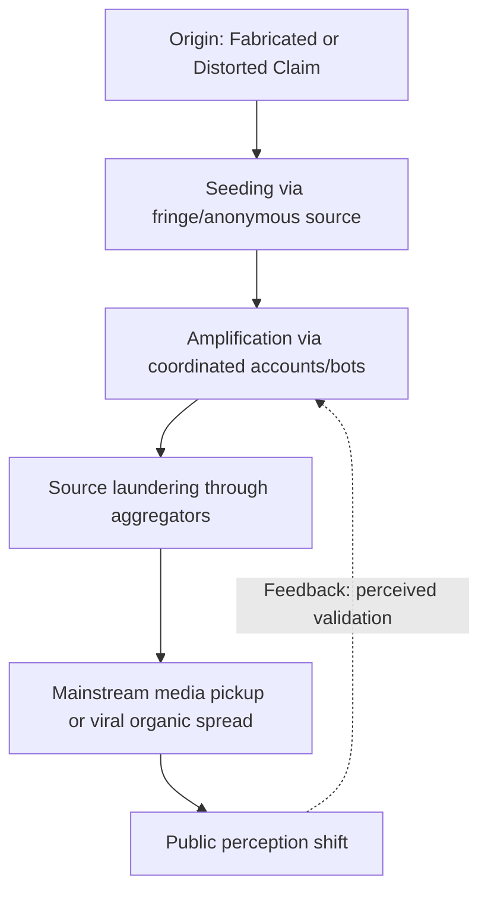

## Recognizing Propaganda and Disinformation Techniques

### Overview

Recognizing propaganda and disinformation techniques is the applied skill of identifying communication strategies designed to shape beliefs or behavior through distortion, selective presentation, or fabrication rather than through legitimate argumentation. This field draws on propaganda studies (rooted in the work of Jacques Ellul and Edward Bernays), media literacy research, and contemporary computational disinformation studies. It is distinct from, but closely related to, the persuasion/manipulation boundary: propaganda and disinformation represent a systematic, often institutional or coordinated, application of manipulative techniques at scale, frequently in political, ideological, or commercial contexts.

Precise terminology matters in this field: **misinformation** is false information spread without deliberate intent to deceive; **disinformation** is false information spread deliberately; **malinformation** is genuine information deliberately shared out of context or with malicious intent to cause harm; **propaganda** is a broader category encompassing systematic efforts (not always false) to shape opinion in service of an agenda, which may use true, false, or selectively true information.

### Key Points

- **Propaganda need not be false**: Classical propaganda studies (Ellul, 1965) emphasize that propaganda often uses accurate facts, selectively arranged and repeated, rather than outright fabrication — this makes it harder to counter with simple fact-checking.
- **Repetition and saturation are core mechanisms**: The "illusory truth effect," well-documented in cognitive psychology, shows repeated exposure to a claim increases perceived truthfulness independent of the claim's actual validity.
- **Emotional activation outperforms factual density**: Disinformation research (e.g., work associated with MIT's study of true and false news spread on social media, Vosoughi, Roy & Aral, 2018) has found falsehoods often spread faster and further than accurate information, correlating with higher novelty and emotional intensity of false content — this is a well-replicated empirical finding, though the underlying causal mechanisms remain an active research area [Inference on causal specifics].
- **Source laundering obscures origin**: Disinformation is frequently "laundered" through a chain of intermediary sources (fringe outlet → aggregator → mainstream mention) to obscure its origin and gain false legitimacy.
- **Technique recognition ≠ automatic immunity**: Awareness of a technique reduces but does not eliminate susceptibility to it — "inoculation theory" research suggests pre-exposure to weakened forms of a technique (prebunking) is more effective than post-hoc correction (debunking).

### Classical Propaganda Technique Taxonomy

Derived largely from Institute for Propaganda Analysis (1937) categories, still widely used as a teaching framework:

| Technique | Mechanism | Example Pattern |
| --- | --- | --- |
| **Name-calling** | Attaching a negative label to a person/idea to trigger rejection without argument | Labeling an opposing policy "radical" or "extremist" without substantive engagement |
| **Glittering generalities** | Associating an idea with vague, virtuous terms ("freedom," "progress") to bypass scrutiny | Using "common sense reform" without specifying content |
| **Transfer** | Borrowing the authority/prestige of a respected symbol or institution for an unrelated claim | Using national symbols or religious imagery to endorse a commercial or political product |
| **Testimonial** | Using a (often irrelevant) authority or celebrity endorsement to substitute for evidence | Celebrity endorsing a policy position outside their expertise |
| **Plain folks** | Presenting a claim as coming from "ordinary people" to build relatability and trust | Politicians emphasizing humble origins irrespective of relevance to policy substance |
| **Card stacking** | Selective presentation of facts, omitting disconfirming evidence | Citing only favorable statistics while omitting contrary data |
| **Bandwagon** | Implying an idea is validated because many people accept it | "Everyone knows..." / "join the majority who agree..." |
| **Fear appeal** | Exploiting fear disproportionate to actual risk to compel action | Exaggerated threat framing to justify a policy without evidentiary basis |

### Contemporary Digital Disinformation Techniques

#### 1. Coordinated Inauthentic Behavior (CIB)

Networks of fake or misrepresented accounts (bots, sockpuppets, troll farms) that artificially inflate the apparent popularity or consensus around a claim. Platforms such as Meta and X publish periodic CIB takedown reports; independent researchers (e.g., the Stanford Internet Observatory, the Atlantic Council's DFRLab) analyze network patterns including synchronized posting times, templated language, and abnormal follower/following ratios as detection signals.

#### 2. Astroturfing

Manufactured grassroots-appearing support for a position, funded or organized by an interested party while concealing that organization. Distinguished from genuine grassroots activity by funding opacity and top-down message coordination.

#### 3. Deepfakes and Synthetic Media

AI-generated or AI-manipulated audio/video/images designed to fabricate statements or events. Detection relies on a combination of technical forensics (compression artifacts, unnatural blinking/lighting patterns in earlier-generation deepfakes, though newer generative models increasingly evade naive visual detection [Inference — detection is an active arms race]) and provenance verification (e.g., the Coalition for Content Provenance and Authenticity's C2PA standard for content credentials).

#### 4. Firehose of Falsehood

A term from RAND Corporation research describing a strategy (associated with state-sponsored disinformation operations) of high-volume, multi-channel, rapid, and often internally inconsistent messaging — the goal is not necessarily to convince audiences of any single claim, but to overwhelm fact-checking capacity and induce information fatigue and cynicism about the possibility of establishing truth at all.

#### 5. Selective/Decontextualized Framing (Malinformation)

Genuine footage, quotes, or data presented outside their original context to imply a false narrative — harder to detect than outright fabrication because the underlying content is technically accurate.

#### 6. Microtargeting and Algorithmic Amplification

Use of granular audience data to deliver tailored persuasive or disinforming content to specific psychographic segments, combined with recommendation algorithm dynamics that tend to favor high-engagement (often emotionally activating) content, which can disproportionately favor disinformation's spread characteristics.

### Detection Framework: SIFT Method

A widely taught practical framework, developed by digital literacy researcher Mike Caulfield, structured as four moves:

1. **Stop** — Before reacting, sharing, or believing, pause; note your emotional reaction as a signal to slow down (strong emotional pull is a documented disinformation design feature).
2. **Investigate the source** — Determine who is behind the claim and their track record/expertise before evaluating the claim itself ("lateral reading": checking what other independent sources say about the source, rather than only reading the source's own "About" page).
3. **Find better coverage** — Search for how credible, independent outlets are covering the same claim; look for consensus or documented disagreement among reliable sources.
4. **Trace claims, quotes, and media to the original context** — Follow a claim, image, or video back to its original source to check for selective editing or decontextualization.

### Structural Red Flags Checklist

- **Emotional intensity disproportionate to evidentiary weight**: Claims designed to provoke strong immediate reaction with minimal substantiating detail.
- **Urgency to share before verifying**: Explicit or implicit pressure ("share before this gets taken down") discouraging the verification step.
- **Anonymous or unverifiable sourcing**: Claims attributed to "insiders," "experts say," or unnamed sources without traceable attribution.
- **Absence of falsifiability**: Claims structured so that any counter-evidence can be dismissed as part of the conspiracy/cover-up itself.
- **Us-vs-them framing**: Binary framing that forecloses nuance and casts skepticism of the claim as moral or tribal betrayal.
- **Suspiciously perfect narrative fit**: Information that confirms pre-existing beliefs with unusual neatness, which should raise (not lower) scrutiny per confirmation-bias awareness.
- **Manipulated visual/audio artifacts**: Inconsistent lighting, unnatural mouth movement, audio-visual sync issues in video; metadata inconsistencies in images.

### Illustration: Disinformation Detection Decision Tree (svg_diagram)

<svg xmlns="http://www.w3.org/2000/svg" viewBox="0 0 900 520" font-family="Arial, sans-serif">
<text x="450" y="28" text-anchor="middle" font-size="18" font-weight="bold" fill="#1a1a1a">Disinformation Detection Decision Tree (svg_diagram)</text>
<rect x="350" y="50" width="200" height="45" rx="8" fill="#2c3e50" stroke="#1a1a1a" />
<text x="450" y="77" text-anchor="middle" font-size="12" fill="#ffffff">Claim encountered</text>
<line x1="450" y1="95" x2="450" y2="125" stroke="#333" stroke-width="2" marker-end="url(#a3)" />
<rect x="330" y="125" width="240" height="50" rx="8" fill="#34495e" stroke="#1a1a1a" />
<text x="450" y="145" text-anchor="middle" font-size="11" fill="#ffffff">STOP: note emotional reaction</text>
<text x="450" y="162" text-anchor="middle" font-size="11" fill="#ffffff">before sharing/believing</text>
<line x1="450" y1="175" x2="450" y2="205" stroke="#333" stroke-width="2" marker-end="url(#a3)" />
<rect x="310" y="205" width="280" height="50" rx="8" fill="#2980b9" stroke="#1a1a1a" />
<text x="450" y="225" text-anchor="middle" font-size="11" fill="#ffffff">INVESTIGATE source via</text>
<text x="450" y="242" text-anchor="middle" font-size="11" fill="#ffffff">lateral reading</text>
<line x1="450" y1="255" x2="450" y2="285" stroke="#333" stroke-width="2" marker-end="url(#a3)" />
<rect x="310" y="285" width="280" height="50" rx="8" fill="#16a085" stroke="#1a1a1a" />
<text x="450" y="305" text-anchor="middle" font-size="11" fill="#ffffff">FIND independent</text>
<text x="450" y="322" text-anchor="middle" font-size="11" fill="#ffffff">corroborating coverage</text>
<line x1="450" y1="335" x2="450" y2="365" stroke="#333" stroke-width="2" marker-end="url(#a3)" />
<rect x="310" y="365" width="280" height="50" rx="8" fill="#8e44ad" stroke="#1a1a1a" />
<text x="450" y="385" text-anchor="middle" font-size="11" fill="#ffffff">TRACE to original</text>
<text x="450" y="402" text-anchor="middle" font-size="11" fill="#ffffff">source/context</text>
<line x1="450" y1="415" x2="280" y2="460" stroke="#333" stroke-width="2" marker-end="url(#a3)" />
<line x1="450" y1="415" x2="620" y2="460" stroke="#333" stroke-width="2" marker-end="url(#a3)" />
<text x="300" y="440" font-size="11" fill="#c0392b">Fails checks</text>
<text x="580" y="440" font-size="11" fill="#27ae60">Corroborated</text>
<rect x="140" y="460" width="280" height="45" rx="8" fill="#c0392b" stroke="#1a1a1a" />
<text x="280" y="487" text-anchor="middle" font-size="11" fill="#ffffff">Treat as likely disinformation</text>
<rect x="480" y="460" width="280" height="45" rx="8" fill="#27ae60" stroke="#1a1a1a" />
<text x="620" y="487" text-anchor="middle" font-size="11" fill="#ffffff">Proceed with reasonable confidence</text>
</svg>

### Prebunking vs. Debunking

- **Debunking** (reactive): Correcting false claims after exposure. Research shows debunking is often only partially effective due to the "continued influence effect," where corrected misinformation continues to influence judgment even after the correction is accepted as true.
- **Prebunking** (proactive, "inoculation theory"): Exposing audiences to a weakened, forewarned version of a manipulation technique before encountering the real thing, analogous to a vaccine — studies associated with researchers such as Sander van der Linden and Jon Roozenbeek (e.g., the "Bad News" and "Harmony Square" game-based interventions) show this approach can improve technique-recognition and resistance at scale [Inference — effect sizes and durability vary across studies and populations].

### Applications for Executive and Organizational Communication

- **Defensive application**: Recognizing when an organization's own reputation is being targeted by coordinated disinformation, enabling faster, better-targeted response (see also crisis communication protocols) rather than treating every falsehood as requiring the same rebuttal intensity.
- **Ethical constraint on offensive use**: Executives should recognize that classical propaganda techniques (bandwagon, transfer, testimonial) remain available tools in legitimate corporate communication — the ethical line, per the persuasion/manipulation framework, is whether their use involves concealment, fabrication, or disproportionate exploitation of bias rather than transparent, evidence-based argument.
- **Internal media literacy**: Training communications and executive teams in SIFT-style verification before internal or external claims are repeated, to avoid inadvertently amplifying disinformation through organizational channels.

### Related Topics

- Ethical Boundaries Between Persuasion and Manipulation
- Media Literacy and the SIFT Method in Practice
- Cognitive Biases Exploited in Mass Persuasion (illusory truth effect, confirmation bias)
- Coordinated Inauthentic Behavior Detection Methodologies
- Deepfake Detection and Content Provenance Standards (C2PA)
- Crisis Communication Response to Targeted Disinformation Campaigns
- Inoculation Theory and Prebunking Interventions
- Historical Case Studies in State-Sponsored Propaganda
- Platform Policy and Regulation of Disinformation (content moderation frameworks)