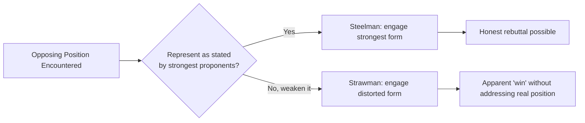

## Truthfulness and Intellectual Honesty in Argument

### Overview

Truthfulness and intellectual honesty in argument constitute the normative core of ethical rhetoric: the commitment to representing evidence, reasoning, and opposing positions accurately even when doing so is strategically inconvenient. This discipline draws on virtue epistemology, argumentation theory (particularly the pragma-dialectical tradition of Frans van Eemeren and Rob Grootendorst), and philosophy of testimony. It differs from the persuasion/manipulation boundary in emphasis: that framework centers on respect for audience autonomy, while intellectual honesty centers on the arguer's own epistemic conduct — the internal discipline of reasoning and presenting claims in good faith, independent of whether the audience could detect a lapse.

Intellectual honesty is best understood as a virtue (in the Aristotelian sense) — a stable disposition, cultivated through practice, rather than a single rule applied mechanically to each statement.

### Key Points

- **Intellectual honesty is agent-centered; persuasion ethics is audience-centered**: One can be manipulative in an audience-facing sense while sincerely believing the claim (self-deception), and one can be intellectually dishonest even when the audience never detects it — the two frameworks overlap but are not identical.
- **The steelman/strawman distinction is a primary diagnostic**: Representing an opposing position in its strongest, most defensible form (steelmanning) is a core marker of honest argument; representing it in a weakened, distorted, or easily-refuted form (strawmanning) is a primary marker of dishonest argument.
- **Calibrated confidence is a component of honesty**: Overstating certainty beyond what evidence supports is a form of intellectual dishonesty even when the underlying claim later turns out to be true — the dishonesty lies in the confidence-evidence mismatch, not the outcome.
- **Motivated reasoning is a distinct failure mode from deliberate lying**: Much intellectual dishonesty is not conscious deception but unconscious bias toward conclusions that serve one's interests — psychological research (e.g., work by Ziva Kunda on motivated reasoning) shows this operates without the reasoner necessarily perceiving themselves as dishonest.
- **Honesty about uncertainty strengthens rather than weakens credible arguments**: Contrary to a common strategic intuition, disclosing genuine limitations and counter-evidence tends to increase perceived credibility with sophisticated audiences (a documented pattern in persuasion research on "two-sided messages" dating to Hovland and Weiss-era studies, though effects vary by audience sophistication and topic [Inference]).

### Core Components of Intellectually Honest Argument

#### 1. The Steelman Standard

The practice of engaging with the strongest available version of an opposing argument rather than its weakest or most easily dismissed variant.

**Diagnostic questions for steelmanning**:

- Could a thoughtful proponent of the opposing view recognize this description as fair?
- Have I addressed the strongest version of their evidence, or only their weakest spokesperson/moment?
- Am I responding to what they actually argue, or to a more extreme position I find easier to refute?

**Example** (executive context — responding to internal dissent on a strategic pivot):

- *Strawman*: "Those who oppose this pivot just don't want to leave their comfort zone."
- *Steelman*: "The strongest objection to this pivot is that our current revenue base depends on the segment we'd be deprioritizing, and the transition risk in the first two quarters is real. I want to address that risk directly rather than dismiss the concern."

#### 2. Calibrated Confidence and Epistemic Humility

Intellectual honesty requires that stated confidence track actual evidentiary support — a distinction between what one *knows*, what one *believes with reasonable confidence*, and what one *suspects or hopes*.

| Evidentiary State | Honest Framing | Dishonest Framing (Overclaiming) |
| --- | --- | --- |
| Single supporting data point, no replication | "An initial finding suggests..." | "Research proves..." |
| Expert consensus with known dissent | "The consensus view holds X, though some experts note Y" | "Everyone agrees that X" |
| Personal projection/forecast | "I estimate/project..." | "It is certain that..." |
| Correlation only | "X is associated with Y" | "X causes Y" |

Explicit labeling conventions (as used throughout technical and academic writing) — flagging inference, speculation, or unverified claims — are themselves a structural technique for maintaining calibrated honesty, since they force the arguer to classify each claim by evidentiary status rather than presenting all claims with uniform confidence.

#### 3. Distinguishing Motivated Reasoning from Deliberate Deception

| Feature | Deliberate Deception | Motivated Reasoning |
| --- | --- | --- |
| Awareness | Speaker knows the claim is false/misleading | Speaker sincerely believes the biased conclusion |
| Mechanism | Conscious selection of misleading framing | Unconscious selective evidence-gathering, disproportionate scrutiny of disconfirming evidence |
| Remedy | Requires addressing intent/incentives (accountability structures) | Requires structural correctives (devil's advocate roles, pre-registered criteria, external review) |
| Ethical weight | Generally judged more severely | Still an honesty failure, but treated as requiring different institutional safeguards rather than only individual blame |

Executive and organizational contexts are particularly susceptible to motivated reasoning because incentive structures (career advancement, sunk-cost investment in past decisions, board pressure) create systematic pressure toward favorable interpretations of ambiguous evidence, independent of anyone's conscious intent to deceive.

#### 4. Two-Sided Argumentation and Disclosed Counter-Evidence

Persuasion research distinguishes one-sided messages (presenting only supporting evidence) from two-sided messages (acknowledging counter-evidence or opposing arguments, typically while explaining why the overall conclusion still holds).

- **One-sided risk**: More vulnerable to being undermined the moment the audience encounters omitted counter-evidence elsewhere, and reads as advocacy rather than analysis to skeptical or sophisticated audiences.
- **Two-sided approach**: Tends to build durable credibility, particularly with audiences who are already aware alternative views exist, though it can be less immediately persuasive with less engaged or less sophisticated audiences in low-stakes contexts [Inference — this moderation effect is documented but its magnitude varies across studies and contexts].
- **Refutational two-sided messages** (acknowledging the counter-argument *and* explicitly refuting it) generally outperform simple acknowledgment alone for building resistance to later counter-persuasion — this pattern is consistent with inoculation theory's broader logic.

#### 5. Honest Use of Statistics and Evidence

Common technical failure modes that violate intellectual honesty even without outright fabrication:

- **Cherry-picking**: Selecting only data points, time windows, or comparison groups that support the desired conclusion.
- **Base rate neglect**: Presenting a relative change (e.g., "risk doubled") without the absolute base rate, creating a misleading impression of magnitude.
- **Correlation-causation conflation**: Presenting correlational data using causal language without appropriate hedging.
- **Survivorship bias**: Drawing conclusions from a dataset that has already been filtered by the outcome of interest (e.g., studying only "successful" companies to derive success factors).
- **Unfalsifiable framing**: Structuring a claim so that no possible evidence could disconfirm it — a well-established marker of poor epistemic practice in philosophy of science (associated with Karl Popper's falsifiability criterion).

### Illustration: Honest vs. Dishonest Argument Construction (svg_diagram)

<svg xmlns="http://www.w3.org/2000/svg" viewBox="0 0 900 440" font-family="Arial, sans-serif">
<text x="450" y="28" text-anchor="middle" font-size="18" font-weight="bold" fill="#1a1a1a">Honest vs. Dishonest Argument Construction (svg_diagram)</text>
<rect x="60" y="60" width="360" height="340" rx="8" fill="#eafaf1" stroke="#27ae60" stroke-width="2" />
<text x="240" y="90" text-anchor="middle" font-size="14" font-weight="bold" fill="#1e8449">Intellectually Honest</text>

<text x="80" y="120" font-size="12" fill="`#1e8449`">✓ Steelmans opposing views</text>

<text x="80" y="150" font-size="12" fill="`#1e8449`">✓ Confidence matches evidence</text>

<text x="80" y="180" font-size="12" fill="`#1e8449`">✓ Discloses counter-evidence</text>

<text x="80" y="210" font-size="12" fill="`#1e8449`">✓ Distinguishes correlation/causation</text>

<text x="80" y="240" font-size="12" fill="`#1e8449`">✓ Reports full relevant data range</text>

<text x="80" y="270" font-size="12" fill="`#1e8449`">✓ Claims are falsifiable</text>

<text x="80" y="300" font-size="12" fill="`#1e8449`">✓ Updates position on new evidence</text>

<text x="80" y="330" font-size="12" fill="`#1e8449`">✓ Cites sources checkable by audience</text>

<rect x="480" y="60" width="360" height="340" rx="8" fill="#fdedec" stroke="#c0392b" stroke-width="2" />
<text x="660" y="90" text-anchor="middle" font-size="14" font-weight="bold" fill="#943126">Intellectually Dishonest</text>

<text x="500" y="120" font-size="12" fill="`#943126`">✗ Strawmans opposing views</text>

<text x="500" y="150" font-size="12" fill="`#943126`">✗ Overclaims certainty</text>

<text x="500" y="180" font-size="12" fill="`#943126`">✗ Omits inconvenient evidence</text>

<text x="500" y="210" font-size="12" fill="`#943126`">✗ Implies causation from correlation</text>

<text x="500" y="240" font-size="12" fill="`#943126`">✗ Cherry-picks favorable data</text>

<text x="500" y="270" font-size="12" fill="`#943126`">✗ Frames claims unfalsifiably</text>

<text x="500" y="300" font-size="12" fill="`#943126`">✗ Ignores disconfirming evidence</text>

<text x="500" y="330" font-size="12" fill="`#943126`">✗ Vague/unattributable sourcing</text>

</svg>

### Institutional Safeguards Against Dishonest Argument

Because much intellectual dishonesty stems from motivated reasoning rather than conscious deceit, individual willpower is an insufficient safeguard; organizations benefit from structural correctives:

1. **Designated dissent roles** ("devil's advocate," red-teaming) — formally assigning someone to argue the strongest counter-case before a decision is finalized.
2. **Pre-registration of decision criteria** — defining what evidence would change the decision *before* gathering data, reducing post-hoc rationalization.
3. **Blind or structured review processes** — separating evidence evaluation from the identity/seniority of who is proposing a conclusion, reducing authority-driven confirmation bias.
4. **External/independent review** — bringing in parties without a stake in the outcome to audit reasoning and evidence use.
5. **Explicit uncertainty documentation** — requiring confidence levels or evidentiary labels on claims in decision memos, forcing calibration discipline.

### Common Objections and Responses

- **"Steelmanning wastes time on weak arguments"** — The steelman standard applies to the strongest form of an opposing view, not to every version of it; it is a discipline against convenient dismissal, not a requirement to engage every fringe variant equally.
- **"Admitting uncertainty undermines executive authority"** — Evidence on two-sided messaging suggests the opposite is more often true with informed audiences: calibrated honesty about limitations tends to build durable credibility, while overclaiming creates acute vulnerability the moment a gap is discovered publicly.
- **"Everyone frames data favorably; total neutrality is impossible"** — True and largely accepted in the literature: intellectual honesty does not require the impossible standard of view-from-nowhere neutrality, but it does require that framing choices not cross into misrepresenting the underlying evidence or foreclosing falsifiability.

### Related Topics

- Ethical Boundaries Between Persuasion and Manipulation
- Recognizing Propaganda and Disinformation Techniques
- Argumentation Theory and Fallacy Identification
- Motivated Reasoning and Cognitive Bias in Decision-Making
- Calibration and Uncertainty Communication in Executive Reporting
- Devil's Advocacy and Structured Dissent in Organizational Decision-Making
- Two-Sided Messaging and Inoculation Theory in Persuasion
- Virtue Epistemology and the Ethics of Belief
- Statistical Literacy for Executive Communication