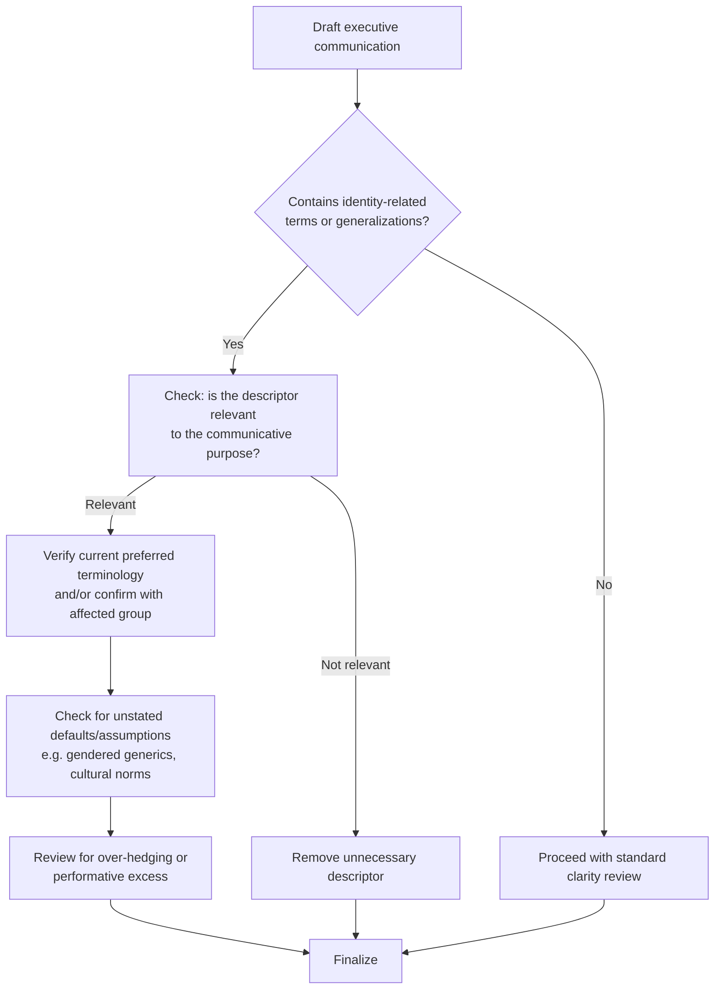

## Inclusive and Bias-Aware Language

### Overview

Inclusive and bias-aware language is the practice of constructing communication that accurately represents diverse audiences, avoids reinforcing stereotypes or exclusionary assumptions, and remains accessible across differences in ability, culture, and identity. In executive communication specifically, this discipline intersects rhetoric, sociolinguistics, and organizational communication: language choices at the leadership level carry disproportionate signaling weight, shaping perceived organizational values, psychological safety, and — measurably in some research — recruitment and retention outcomes.

This is a genuinely contested area of active public and academic debate, distinct from more settled technical topics: there is broad professional consensus on core principles (accuracy, avoiding unnecessary generalization, respecting stated preferences) but ongoing disagreement about specific terminology, scope, and implementation across political and cultural contexts. This section presents the frameworks and evidence as they exist, flags areas of genuine dispute, and avoids treating contested specifics as settled fact.

### Key Points

- **Bias-aware language rests on a linguistic mechanism, not just etiquette**: Sociolinguistic and cognitive research on generic masculine forms and markedness (e.g., work on how "he" as a generic pronoun affects mental representation) provides empirical grounding for claims that language shapes cognitive default assumptions about who is included — this is a documented linguistic phenomenon, though the practical significance and appropriate response are contested.
- **Precision and inclusion are often complementary, not competing, goals**: Vague generalizations ("normal families," "manpower") frequently reduce precision as well as inclusivity; specifying accurately ("households," "staffing" or "workforce") often improves clarity as a side effect.
- **Terminology preferences evolve and vary by community and individual**: There is no single fixed vocabulary; organizations and speakers should treat current guidance as a snapshot rather than a permanent standard, and should prioritize direct, stated preferences of the people being discussed over external style guides where they conflict.
- **Over-correction and hypercorrection carry their own communication costs**: Excessive hedging, euphemism-stacking, or performative language can reduce clarity, appear inauthentic, and in some documented cases produce backlash effects — this is a genuine tension in the field, not a fringe concern.
- **This is an area of legitimate political and cultural disagreement**: Reasonable people and institutions differ on the appropriate scope, mandatory vs. voluntary status, and specific terminology of inclusive language policies; this material presents the linguistic and communication-theory basis for the practice without adjudicating the broader political debate.

### Core Linguistic Mechanisms

#### 1. Generic Masculine and Markedness Theory

Linguistic markedness theory distinguishes "unmarked" default forms from "marked" forms that require additional specification. Historically, many languages treat masculine forms as the unmarked default (e.g., "chairman," generic "he," "mankind"), which research has associated with reduced cognitive representation of women and non-binary people as included in the reference class.

- **Empirical basis**: Studies on generic pronoun comprehension (e.g., work following from Wendy Martyna and later researchers) found readers more often mentally pictured male referents when generic "he" was used, compared to "he or she" or singular "they."
- **Practical alternatives**: Singular "they" (now accepted by major style guides including AP and Chicago Manual of Style for its generic and individual referential uses), gender-neutral role terms ("chairperson"/"chair," "salesperson," "flight attendant" replacing "stewardess").

#### 2. Markedness in Identity Descriptors

A parallel pattern occurs with racial, ethnic, and other identity descriptors: default/unmarked identity categories are often left unstated while non-default categories are marked ("the doctor" vs. "the female doctor," "the team" vs. "the all-女 team" pattern in various languages/contexts).

- **Precision principle**: Include identity descriptors only when relevant to the communicative purpose; gratuitous marking implies the marked category is an exception to a norm.
- **Counter-consideration**: In some contexts (e.g., highlighting underrepresentation, DEI reporting, medical relevance), explicit identity marking is directly relevant and its omission would reduce accuracy — the same principle (relevance-based inclusion) can point in different directions depending on context.

#### 3. Person-First vs. Identity-First Language (Disability Context)

A well-documented area of genuine, unresolved community disagreement:

- **Person-first language** ("person with autism," "person with a disability") emphasizes the individual before the condition, historically promoted to counter reductive labeling.
- **Identity-first language** ("autistic person," "disabled person") is preferred by significant portions of certain communities (notably widely documented within autistic self-advocacy communities) as affirming disability as an integral identity rather than an incidental attribute to be minimized.
- **Practical guidance**: No single universal rule applies across all disability communities; the most defensible practice is following the stated preference of the specific individual or community being addressed, and defaulting to person-first language in general audience contexts where no specific preference is known, while remaining open to correction.

#### 4. Cultural and Linguistic Localization Beyond Translation

Bias-awareness extends beyond identity terminology to cultural assumptions embedded in examples, idioms, and defaults:

- **Idiom and metaphor bias**: Sports metaphors, religious-holiday defaults (assuming Christmas as "the holidays"), and culturally specific references can implicitly exclude audiences unfamiliar with or outside that frame.
- **Name and format bias**: Assuming Western name order (first/last), single surnames, or specific honorific conventions in forms and communications can misrepresent or exclude global audiences.
- **Accessibility as inclusive language**: Plain-language principles (short sentences, avoiding unexplained jargon, clear structure) function as a form of inclusive language for audiences with cognitive disabilities, non-native language speakers, and low literacy contexts — this overlaps substantially with general communication-clarity best practice.

### Executive Communication Applications

#### Case 1: Recruitment and Job Descriptions

Research on job posting language (e.g., studies on "gendered wording" in job ads, associated with work by Danielle Gaucher and colleagues) found that masculine-coded words (e.g., "dominant," "competitive," "ninja," "rockstar") in postings correlate with reduced application rates from women, independent of actual job requirements — an example of language effects with measurable organizational consequences, though effect sizes vary across studies and industries [Inference on magnitude].

#### Case 2: Town Halls and All-Hands Communication

- **Avoid unearned universalizing**: Phrases like "we all" or "everyone agrees" can inadvertently erase dissent or minority experience within the organization; more precise framing ("many of you," "based on the survey results, a majority...") maintains both inclusivity and factual accuracy.
- **Avoid tokenizing specific employees or groups** as spokespeople for an entire identity category in Q&A or panel settings unless they have explicitly agreed to that role.

#### Case 3: Crisis and Sensitive Topic Communication

- Bias-aware language is particularly consequential when discussing layoffs, harassment investigations, or diversity-related incidents, where imprecise or loaded language can itself become a secondary controversy independent of the underlying event (see also crisis communication frameworks).

### Illustration: Precision-Inclusion Overlap Model (svg_diagram)

<svg xmlns="http://www.w3.org/2000/svg" viewBox="0 0 900 420" font-family="Arial, sans-serif">
<text x="450" y="28" text-anchor="middle" font-size="18" font-weight="bold" fill="#1a1a1a">Precision-Inclusion Overlap Model (svg_diagram)</text>
<circle cx="360" cy="230" r="150" fill="#3498db" fill-opacity="0.35" stroke="#2980b9" stroke-width="2" />
<circle cx="540" cy="230" r="150" fill="#e67e22" fill-opacity="0.35" stroke="#d35400" stroke-width="2" />

<text x="280" y="150" text-anchor="middle" font-size="13" font-weight="bold" fill="`#1a5276`">Linguistic Precision</text>

<text x="620" y="150" text-anchor="middle" font-size="13" font-weight="bold" fill="`#a04000`">Inclusivity</text>

<text x="260" y="200" font-size="11" fill="`#1a1a1a`">Avoids vague</text>

<text x="260" y="215" font-size="11" fill="`#1a1a1a`">generalizations</text>

<text x="620" y="200" font-size="11" fill="`#1a1a1a`">Respects stated</text>

<text x="620" y="215" font-size="11" fill="`#1a1a1a`">identity preferences</text>

<text x="450" y="220" text-anchor="middle" font-size="12" font-weight="bold" fill="`#1a1a1a`">Overlap zone:</text>

<text x="450" y="240" text-anchor="middle" font-size="11" fill="`#1a1a1a`">"staffing" instead of "manpower"</text>

<text x="450" y="258" text-anchor="middle" font-size="11" fill="`#1a1a1a`">"they" for unspecified individual</text>

<text x="450" y="276" text-anchor="middle" font-size="11" fill="`#1a1a1a`">"households" instead of</text>

<text x="450" y="294" text-anchor="middle" font-size="11" fill="`#1a1a1a`">"normal families"</text>

<text x="260" y="330" font-size="11" fill="`#1a1a1a`">Tension zone: excessive</text>

<text x="260" y="345" font-size="11" fill="`#1a1a1a`">hedging reduces clarity</text>

<text x="620" y="330" font-size="11" fill="`#1a1a1a`">Tension zone: contested</text>

<text x="620" y="345" font-size="11" fill="`#1a1a1a`">terminology across communities</text>

</svg>

### Common Failure Modes

- **Performative language without substantive commitment**: Adopting inclusive terminology while organizational practices remain unchanged is a documented pattern that audiences increasingly recognize and criticize as superficial ("inclusion-washing," analogous to "greenwashing" in environmental communication).
- **Hypercorrection and euphemism treadmill**: Continuously replacing terms as they become perceived as dated, sometimes faster than affected communities themselves request, which linguist research (the "euphemism treadmill," a term coined by Steven Pinker) documents as an ongoing cyclical pattern — the negative connotation often attaches to the new term over time regardless of the term itself, since it is often the underlying attitude, not the word, driving the association.
- **False universality in the other direction**: Assuming a single global standard for terminology when norms vary significantly across regions, languages, and cultures — a term considered current and respectful in one English-speaking country may be outdated or considered inappropriate in another.
- **Treating the topic as purely procedural**: Reducing bias-aware language to a checklist or mandatory style-guide compliance exercise without underlying communicative intent can produce stilted, inauthentic prose that undermines the credibility the practice is meant to build.
- **Conflating disagreement about scope with bad faith**: Given the genuinely contested nature of specific terminology and policy questions in this space, treating all disagreement as necessarily hostile or uninformed forecloses legitimate debate that exists even among practitioners and researchers in the field.

### Practical Framework for Executive Drafting

1. **Relevance check**: Is an identity or group descriptor necessary for the communicative purpose, or is it gratuitous?
2. **Default-assumption audit**: Does the language assume a default (gender, culture, ability, family structure) that may not reflect the actual audience?
3. **Preference verification**: Where specific individuals or communities are referenced, has current terminology been checked against their stated preference rather than assumed from memory or an outdated style guide?
4. **Clarity check**: Does the revision maintain or improve clarity, or has hedging/euphemism reduced precision?
5. **Substantiveness check**: Is the language change accompanied by, or reflective of, genuine organizational practice, or is it purely cosmetic?

### Related Topics

- Ethical Boundaries Between Persuasion and Manipulation
- Truthfulness and Intellectual Honesty in Argument
- Plain Language and Accessibility in Executive Communication
- Cross-Cultural Communication and Localization Strategy
- Diversity, Equity, and Inclusion Communication Strategy
- Sociolinguistics of Gender and Markedness Theory
- Crisis Communication for Diversity-Related Incidents
- Job Description and Recruitment Language Optimization
- Organizational Authenticity vs. Performative Communication