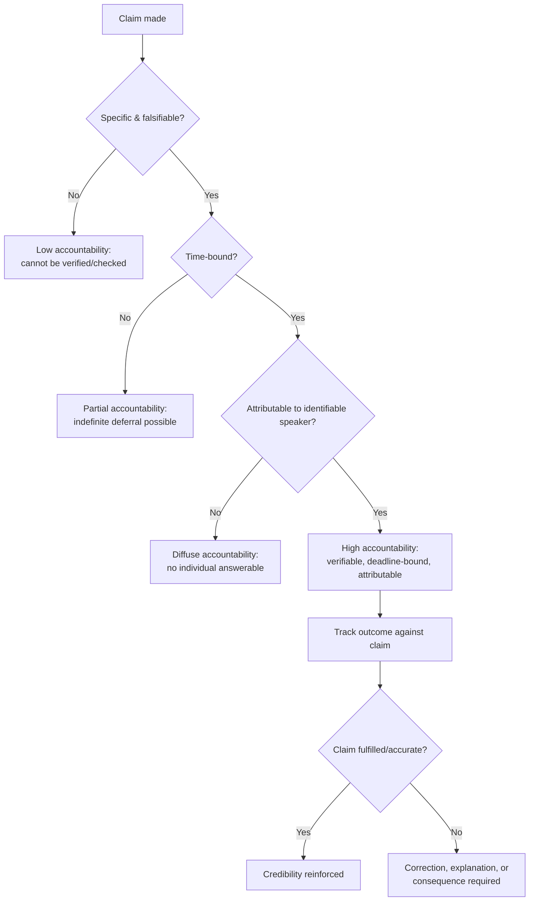

## Accountability for Rhetorical Claims

### Overview

Accountability for rhetorical claims is the set of norms, mechanisms, and practices by which speakers — particularly executives and organizational leaders — are held responsible for the accuracy, consequences, and follow-through of what they publicly assert. This discipline sits downstream of the other ethics-of-rhetoric topics (persuasion/manipulation boundaries, intellectual honesty, disinformation): it addresses what happens *after* a claim is made, rather than how the claim is constructed. It draws on speech act theory (particularly J.L. Austin's and John Searle's work on commissives — utterances that commit the speaker to future action), reputational economics, and corporate governance/disclosure law.

Accountability operates at two levels that are often conflated but should be distinguished: **epistemic accountability** (being answerable for whether a claim was true and well-supported when made) and **practical accountability** (being answerable for delivering on commitments implied or stated by the claim).

### Key Points

- **Speech acts create obligations, not just descriptions**: Following speech act theory, many executive statements function as commissives (promises, commitments) or assertives with implied confidence levels, not merely as neutral descriptions — and each type carries a distinct accountability structure.
- **Accountability requires traceability**: A claim cannot be meaningfully held accountable unless it is specific, attributable, and time-bound enough to be checked later — vague claims are accountability-resistant by design, whether intentionally or not.
- **The "walk-back" problem**: Publicly retracting or revising a prior claim carries reputational cost, which creates a structural incentive to avoid clear, checkable claims in the first place — a tension between accountability and the practical dynamics of public communication.
- **Accountability mechanisms differ by claim type**: Factual claims are accountable to verification and correction; predictive claims are accountable to calibration over time; promissory claims are accountable to delivery; evaluative/opinion claims are accountable primarily to disclosed reasoning and consistency.
- **External accountability structures often outperform self-regulation**: Given documented human tendencies toward motivated reasoning and self-serving bias in self-assessment, external mechanisms (audits, fact-checking, regulatory disclosure requirements, journalistic scrutiny) generally provide more reliable accountability than reliance on speaker self-correction alone [Inference — well-supported directionally, though the relative effectiveness of specific mechanisms varies by context and is actively studied].

### Theoretical Foundation: Speech Act Accountability Types

Building on Austin's and Searle's taxonomy of illocutionary acts, rhetorical claims can be sorted by the type of accountability they generate:

| Speech Act Type | Example | Accountability Standard |
| --- | --- | --- |
| **Assertive** (claims about the world) | "Our error rate decreased 15% this quarter" | Accuracy and verifiability against evidence at time of statement |
| **Commissive** (commitments to future action) | "We will report progress quarterly" | Delivery — did the speaker do what was promised, on the stated timeline |
| **Predictive** (forecasts) | "We expect to be profitable by Q3" | Calibration — was confidence proportionate to actual outcome likelihood, tracked over repeated predictions |
| **Directive** (calls to action) | "I'm asking the board to approve this plan" | Consistency between the ask and the stated justification/evidence |
| **Expressive/Evaluative** (opinions, judgments) | "I believe this is the right path forward" | Disclosed reasoning and consistency with prior stated values, not strict verifiability |

Misclassifying an act — for instance, presenting a commissive as if it were merely expressive ("I'd like to see us hit that target," functioning rhetorically as a near-promise while retaining the escape hatch of mere aspiration) — is a documented technique for claiming credit for commitment while evading commissive accountability.

### Core Accountability Mechanisms

#### 1. Traceability and Specificity Requirements

For a claim to be accountable, it generally requires:

1. **A specific, falsifiable content** — vague claims ("we're committed to excellence") cannot be checked against an outcome.
2. **A time frame** — "we will improve this" without a deadline cannot be judged as fulfilled or unfulfilled.
3. **An attributable source** — claims made anonymously, via unnamed spokespeople, or through diffuse "the company believes" framing are harder to trace back to individual accountability.
4. **A public, durable record** — claims made only in private or ephemeral channels (a since-deleted post, an off-record remark) are harder to hold accountable than those in a durable public record (press release, filed disclosure, recorded statement).

#### 2. Institutional Accountability Structures

- **Regulatory disclosure requirements**: In publicly traded companies, securities law (e.g., SEC Regulation FD, safe harbor provisions for forward-looking statements) creates formal legal accountability for specific categories of claims, particularly financial projections and material information — the exact regulatory requirements vary by jurisdiction and should be confirmed with current legal counsel rather than assumed from general principle.
- **Journalistic and fact-checking scrutiny**: External verification bodies (fact-checking organizations, financial journalists, industry analysts) provide accountability pressure independent of the organization's own disclosure practices.
- **Internal governance mechanisms**: Board oversight, audit committees, and internal compliance functions that review executive claims (particularly forward-looking or performance claims) before and after public release.
- **Track-record aggregation**: Systematic tracking of a speaker's prior predictions/claims against outcomes over time (e.g., prediction market calibration tracking, forecasting accuracy scorecards used in some organizational and political contexts) — this converts isolated claims into a pattern that is harder to obscure than any single statement.

#### 3. The Retraction and Correction Standard

How an organization handles being wrong is itself a distinct accountability practice, related to but distinct from the crisis communication and trust-rebuilding frameworks:

- **Prompt, clear correction**: Acknowledging an inaccurate claim as soon as it is identified, without minimizing or obscuring the correction (e.g., burying it in a footnote or later unrelated communication).
- **Specificity of correction**: Stating precisely what was wrong and what the corrected understanding is, rather than a vague "we've since learned more."
- **Distinguishing genuine new information from foreseeable error**: A claim that was reasonable given information available at the time, later superseded by new facts, carries different accountability weight than a claim that was unreasonable or unsupported when made — this distinction matters for fair accountability but should not be used as a blanket excuse for insufficiently diligent claims.

#### 4. Predictive Claim Calibration

For forecasting and predictive claims specifically, accountability is best assessed over a track record rather than any single instance, since even well-calibrated forecasters will sometimes be wrong on individual predictions by chance.

- **Calibration curves**: Comparing stated confidence levels (e.g., "80% likely") against actual outcome frequency across many predictions — a well-calibrated speaker's 80%-confidence claims should come true roughly 80% of the time.
- **Brier scores and similar scoring rules**: Quantitative methods (developed in forecasting research, notably popularized in organizational contexts by Philip Tetlock's work on expert political judgment and superforecasting) for measuring the accuracy of probabilistic predictions over time.
- **Practical executive application**: While formal Brier scoring is uncommon in day-to-day executive communication, the underlying principle — tracking whether stated confidence levels have historically matched outcomes — is directly applicable to evaluating leadership credibility on recurring claim types (revenue forecasts, timeline estimates, risk assessments).

### Executive Communication Case Applications

#### Case 1: Forward-Looking Statements in Earnings Calls

Public company executives routinely make forward-looking statements accompanied by legally required "safe harbor" disclaimers noting inherent uncertainty. Accountability in this context operates through:

- Formal disclosure requirements (varying by jurisdiction) distinguishing aspirational statements from firm guidance.
- Analyst and investor tracking of guidance accuracy over successive quarters, which directly affects credibility and, in some cases, stock valuation independent of any single quarter's result.

#### Case 2: Diversity, Sustainability, and ESG Commitments

Commitments in these areas are frequently commissive in structure ("we will achieve net-zero by 2040," "we commit to 50% representation by 2025") and have become a focal point for accountability scrutiny, including third-party tracking organizations and, in some jurisdictions, emerging regulatory disclosure requirements. A documented failure pattern is issuing highly specific-sounding commitments without the internal operational mechanisms needed to actually track or deliver progress — sometimes termed "greenwashing" or, more specifically for governance/social claims, "impact-washing" in the accountability literature.

#### Case 3: Crisis-Era Commitments

As covered in crisis and trust-rebuilding contexts, commitments made during acute crisis response ("we will implement X by Y date") carry particularly high accountability salience because they are made under intense scrutiny and are more likely to be actively tracked by media, regulators, and affected stakeholders than routine claims.

### Illustration: Accountability Erosion Patterns (svg_diagram)

<svg xmlns="http://www.w3.org/2000/svg" viewBox="0 0 900 380" font-family="Arial, sans-serif">
<text x="450" y="28" text-anchor="middle" font-size="18" font-weight="bold" fill="#1a1a1a">Accountability Erosion Patterns (svg_diagram)</text>
<rect x="60" y="60" width="240" height="90" rx="8" fill="#fdebd0" stroke="#e67e22" stroke-width="2" />
<text x="180" y="85" text-anchor="middle" font-size="12" font-weight="bold" fill="#a04000">Vagueness</text>
<text x="180" y="108" text-anchor="middle" font-size="11" fill="#a04000">"We're committed to</text>
<text x="180" y="124" text-anchor="middle" font-size="11" fill="#a04000">excellence" — no metric,</text>
<text x="180" y="140" text-anchor="middle" font-size="11" fill="#a04000">no deadline</text>
<rect x="330" y="60" width="240" height="90" rx="8" fill="#fdebd0" stroke="#e67e22" stroke-width="2" />
<text x="450" y="85" text-anchor="middle" font-size="12" font-weight="bold" fill="#a04000">Diffusion of source</text>
<text x="450" y="108" text-anchor="middle" font-size="11" fill="#a04000">"The company believes..."</text>
<text x="450" y="124" text-anchor="middle" font-size="11" fill="#a04000">instead of a named,</text>
<text x="450" y="140" text-anchor="middle" font-size="11" fill="#a04000">attributable speaker</text>
<rect x="600" y="60" width="240" height="90" rx="8" fill="#fdebd0" stroke="#e67e22" stroke-width="2" />
<text x="720" y="85" text-anchor="middle" font-size="12" font-weight="bold" fill="#a04000">Speech act reclassification</text>
<text x="720" y="108" text-anchor="middle" font-size="11" fill="#a04000">Framing a commitment as</text>
<text x="720" y="124" text-anchor="middle" font-size="11" fill="#a04000">mere aspiration to retain</text>
<text x="720" y="140" text-anchor="middle" font-size="11" fill="#a04000">an escape hatch</text>
<line x1="180" y1="150" x2="450" y2="220" stroke="#333" stroke-width="1.5" stroke-dasharray="4,3" />
<line x1="450" y1="150" x2="450" y2="220" stroke="#333" stroke-width="1.5" stroke-dasharray="4,3" />
<line x1="720" y1="150" x2="450" y2="220" stroke="#333" stroke-width="1.5" stroke-dasharray="4,3" />
<rect x="270" y="220" width="360" height="70" rx="8" fill="#fadbd8" stroke="#c0392b" stroke-width="2" />
<text x="450" y="248" text-anchor="middle" font-size="12" font-weight="bold" fill="#943126">Net effect: claim becomes</text>
<text x="450" y="268" text-anchor="middle" font-size="12" font-weight="bold" fill="#943126">unfalsifiable / unenforceable</text>
<line x1="450" y1="290" x2="450" y2="320" stroke="#333" stroke-width="2" marker-end="url(#a4)" />
<rect x="230" y="320" width="440" height="45" rx="8" fill="#d5f5e3" stroke="#1e8449" stroke-width="2" />
<text x="450" y="348" text-anchor="middle" font-size="12" font-weight="bold" fill="#1e8449">Counter: require specificity, timeline, named owner</text>
</svg>

### Common Accountability Evasion Patterns

- **Passive voice agency laundering**: "Mistakes were made" removes the agent from the sentence structure entirely, avoiding attribution of responsibility.
- **Hedge-stacking on commitments**: Layering qualifiers ("we hope to potentially explore possibly moving toward...") until the statement no longer functions as a checkable commitment.
- **Retroactive reframing of predictions as aspirations**: When a forecast fails, recasting it after the fact as merely a "goal" or "ambition" rather than the confident prediction it was presented as at the time.
- **Selective memory in follow-up communication**: Simply not revisiting or referencing prior claims when reporting on the relevant time period, relying on audience attention decay rather than active correction.
- **Diffusing responsibility across committees or "the organization"**: Structuring accountability so broadly (a committee, a culture, "the process") that no identifiable individual bears consequence for an inaccurate or unfulfilled claim.

### Practical Framework for Accountable Claim-Making

1. **Classify the speech act** before making the claim: Is this an assertion of fact, a prediction, or a commitment? Communicate accordingly rather than blurring the category.
2. **Attach specificity and a timeline** wherever the claim type allows it, resisting the temptation toward vagueness as protection.
3. **Maintain a durable, traceable record** of significant claims (internal claim/commitment tracking log is a documented practice in some organizations' governance functions).
4. **Establish a correction protocol in advance**: Define, before an error occurs, how and when corrections will be issued, so correction does not become an ad hoc reputational negotiation in the moment.
5. **Review track record periodically**: Assess calibration and delivery rate on recurring claim types (revenue guidance, project timelines, commitment fulfillment) rather than evaluating each claim in isolation.

### Related Topics

- Truthfulness and Intellectual Honesty in Argument
- Ethical Boundaries Between Persuasion and Manipulation
- Rebuilding Trust and Reputation After a Crisis
- Speech Act Theory and Illocutionary Force in Communication
- Corporate Disclosure Law and Forward-Looking Statement Regulation
- Forecasting Calibration and Superforecasting Methodology
- ESG and Sustainability Commitment Accountability Frameworks
- Governance Structures for Executive Communication Oversight
- Crisis Communication and Reputation Management