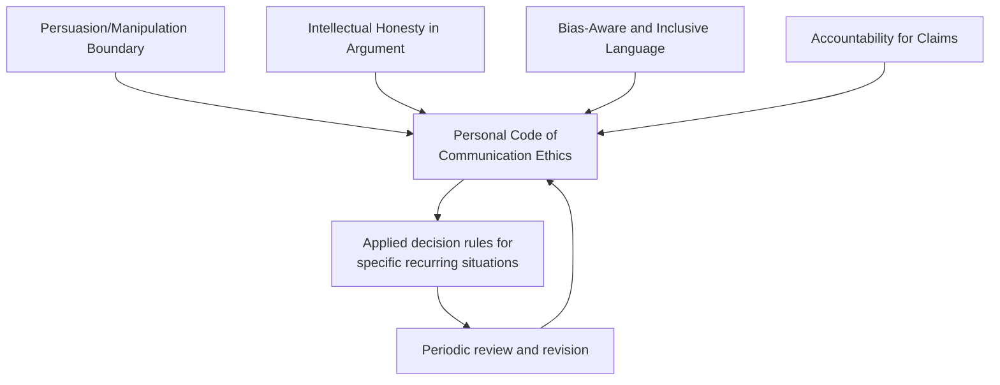

## Building a Personal Code of Communication Ethics

### Overview

Building a personal code of communication ethics is the capstone practice of synthesizing the frameworks covered across rhetorical ethics — persuasion/manipulation boundaries, intellectual honesty, bias-aware language, and accountability for claims — into an explicit, individually-owned set of principles that guide day-to-day communication decisions. Unlike organizational codes of conduct (which are institutional, often compliance-driven, and enforced externally), a personal code of communication ethics is self-authored and internally held, functioning as a decision-making heuristic under time pressure, ambiguity, or incentive conflict, when there is no time to re-derive ethical reasoning from first principles.

This draws on virtue ethics (character as a stable disposition built through practice, per Aristotle), moral psychology research on ethical fading and self-concept maintenance, and practical frameworks from professional ethics codes across law, journalism, and medicine — fields that have long formalized communication-adjacent ethical obligations.

### Key Points

- **A personal code functions as a pre-commitment device**: Behavioral ethics research (e.g., work on ethical fading by Ann Tenbrunsel and David Messick) shows that in-the-moment pressure often erodes ethical reasoning that seemed clear in calm reflection; a codified personal standard, decided in advance, is more resistant to situational erosion than ad hoc judgment.
- **Explicit codes reduce motivated reasoning**: Writing principles down in advance, before a specific conflict of interest arises, makes it harder to rationalize an exception after the fact, since the standard exists independent of the immediate incentive.
- **A code should be specific enough to constrain, not just aspirational**: Vague commitments ("I will communicate with integrity") provide little actual behavioral guidance; effective personal codes specify what the arguer will and will not do in identifiable situations.
- **Codes require periodic revision, not permanence**: As professional context, seniority, and organizational role evolve, so do the specific pressures and dilemmas a code must address — treating a code as a living document under periodic review is more durable than treating it as a fixed, one-time declaration.
- **A personal code is tested most under incentive conflict**: The genuine value of a code is revealed precisely in situations where following it is costly (career risk, relationship strain, short-term persuasive disadvantage) — a code that only aligns with self-interest is not yet doing ethical work.

### Foundational Structure: Synthesizing Prior Frameworks

A coherent personal code of communication ethics typically integrates commitments across the domains covered earlier in this chapter, translated from abstract principle into personal, actionable standards.

| Source Framework | Translated Personal Commitment (Example) |
| --- | --- |
| Persuasion/manipulation boundary | "I will not use a technique whose effectiveness depends on the audience not recognizing it." |
| Intellectual honesty | "I will represent opposing views in their strongest form before rebutting them." |
| Bias-aware language | "I will check current terminology preferences rather than relying on outdated defaults, and prioritize the stated preference of the individual/group over my assumption." |
| Accountability | "I will attach specific timelines to commitments I make publicly, and issue prompt, clear corrections when I am wrong." |

### Core Components of a Personal Code

#### 1. Values Identification

The foundational step: articulating the small number of core values that will govern trade-offs when principles conflict (e.g., transparency vs. compassion, speed vs. accuracy, loyalty vs. honesty). Most working codes name 3–6 core values rather than an exhaustive list, since a longer list tends to reduce practical usability.

**Example value set for an executive communicator**:

- Accuracy over persuasive advantage
- Respect for audience autonomy
- Proportionate emotional appeal
- Timely correction of error
- Consistency between public and private statements

#### 2. Situational Decision Rules

Values alone are insufficiently specific to guide action in the moment; effective codes translate values into if-then decision rules for recurring situations a communicator is likely to face.

**Example situational rules**:

- *If* I am uncertain about a claim's accuracy under deadline pressure, *then* I will explicitly flag the uncertainty rather than state it with unwarranted confidence.
- *If* a persuasive technique would lose effectiveness upon disclosure to the audience, *then* I will not use it, regardless of legality or industry norm.
- *If* I discover a prior public claim of mine was inaccurate, *then* I will issue a correction within [defined timeframe] rather than waiting for it to be discovered externally.
- *If* asked to speak about a group I do not belong to, *then* I will verify current preferred terminology rather than relying on memory, and defer to stated preference over external style guides where they conflict.
- *If* I am pressured to omit material counter-evidence from a presentation, *then* I will either include it or explicitly disclose the omission and reasoning to relevant decision-makers.

#### 3. Redlines vs. Judgment Calls

A well-constructed code distinguishes absolute prohibitions (redlines, non-negotiable regardless of context or pressure) from context-sensitive judgment zones (where the code provides a framework for deliberation rather than a fixed answer).

| Category | Characteristics | Example |
| --- | --- | --- |
| **Redline** | No context justifies violation; violating it is treated as a serious personal failure, not a debatable trade-off | "I will never fabricate data or attribute false quotes." |
| **Strong presumption** | Violable only under extraordinary, specifiable circumstances, with a high justification bar | "I will disclose material risks to stakeholders, absent an overriding legal constraint I have verified with counsel." |
| **Judgment zone** | Genuinely requires case-by-case weighing of competing values | "How much emotional framing is proportionate to the actual stakes of this specific communication?" |

Treating everything as a judgment call weakens the code's function as a pre-commitment device; treating everything as a redline makes the code brittle and impractical to apply consistently across the reality of nuanced situations.

#### 4. Self-Accountability Mechanisms

A personal code is only as effective as the mechanisms that surface violations to the person holding it, given well-documented human tendencies toward self-serving interpretation of ambiguous situations (motivated reasoning, as covered in intellectual honesty).

- **External accountability partner**: A trusted colleague, mentor, or peer explicitly asked to flag perceived departures from stated principles.
- **Periodic self-audit**: Scheduled review (e.g., quarterly) of one's own significant public communications against the code's specific decision rules.
- **Post-hoc reflection triggers**: A habit of reviewing high-stakes communications after the fact, specifically asking which situational rules were tested and whether they held.
- **Written pre-commitment before high-stakes events**: Reviewing the relevant code sections before a known high-pressure situation (a contentious earnings call, a crisis statement, a difficult negotiation) rather than relying on in-the-moment recall.

#### 5. Handling Conflicts Between Code and Institutional Pressure

A realistic personal code anticipates situations where personal ethical commitments conflict with organizational, legal, or career incentives — this is often the most consequential and difficult component to draft honestly.

- **Escalation path**: What does the communicator do when directly instructed to violate a redline (e.g., asked to make a claim known to be false)? Options might include internal escalation, documented dissent, or in extreme cases, declining to deliver the communication or a broader professional exit — the code should specify the communicator's actual intended threshold and response in advance, not merely gesture at "doing the right thing."
- **Distinguishing disagreement from ethical violation**: Not every instance of being overruled on a communication strategy constitutes an ethical violation; the code should help distinguish ordinary professional disagreement (acceptable to lose) from genuine ethical redlines (not acceptable to cross), to avoid both over- and under-reacting.

### Illustration: Personal Code Construction Process (svg_diagram)

<svg xmlns="http://www.w3.org/2000/svg" viewBox="0 0 900 480" font-family="Arial, sans-serif">
<text x="450" y="28" text-anchor="middle" font-size="18" font-weight="bold" fill="#1a1a1a">Personal Code Construction Process (svg_diagram)</text>
<rect x="350" y="55" width="200" height="50" rx="8" fill="#2c3e50" stroke="#1a1a1a" />
<text x="450" y="85" text-anchor="middle" font-size="12" fill="#ffffff">1. Identify core values (3-6)</text>
<line x1="450" y1="105" x2="450" y2="135" stroke="#333" stroke-width="2" marker-end="url(#a5)" />
<rect x="330" y="135" width="240" height="50" rx="8" fill="#2980b9" stroke="#1a1a1a" />
<text x="450" y="165" text-anchor="middle" font-size="12" fill="#ffffff">2. Draft situational if-then rules</text>
<line x1="450" y1="185" x2="450" y2="215" stroke="#333" stroke-width="2" marker-end="url(#a5)" />
<rect x="330" y="215" width="240" height="50" rx="8" fill="#16a085" stroke="#1a1a1a" />
<text x="450" y="245" text-anchor="middle" font-size="12" fill="#ffffff">3. Classify: redline vs. judgment zone</text>
<line x1="450" y1="265" x2="450" y2="295" stroke="#333" stroke-width="2" marker-end="url(#a5)" />
<rect x="330" y="295" width="240" height="50" rx="8" fill="#8e44ad" stroke="#1a1a1a" />
<text x="450" y="325" text-anchor="middle" font-size="12" fill="#ffffff">4. Define escalation path for conflicts</text>
<line x1="450" y1="345" x2="450" y2="375" stroke="#333" stroke-width="2" marker-end="url(#a5)" />
<rect x="330" y="375" width="240" height="50" rx="8" fill="#c0392b" stroke="#1a1a1a" />
<text x="450" y="405" text-anchor="middle" font-size="12" fill="#ffffff">5. Establish accountability mechanism</text>
<line x1="450" y1="425" x2="450" y2="440" stroke="#333" stroke-width="2" />
<line x1="450" y1="440" x2="620" y2="440" stroke="#333" stroke-width="2" />
<line x1="620" y1="440" x2="620" y2="85" stroke="#333" stroke-width="2" stroke-dasharray="4,3" marker-end="url(#a5)" />
<text x="640" y="260" font-size="11" fill="#7f8c8d" transform="rotate(90 640 260)">Periodic revision loop</text>
</svg>

### Worked Example: Draft Personal Code Excerpt

**Core values**: Accuracy, audience respect, proportionality, accountability, consistency.

**Redlines**:

- I will not fabricate data, quotes, or attributions.
- I will not use disinformation techniques (source laundering, coordinated fake amplification) regardless of instruction.

**Strong presumptions**:

- I will disclose material information relevant to a stakeholder decision unless a verified legal constraint prohibits it.
- I will steelman opposing positions in internal deliberation before recommending a rebuttal strategy.

**Judgment zones** (require case-by-case reasoning, not fixed rules):

- The appropriate degree of emotional framing in a given communication, calibrated to actual stakes.
- The specific terminology to use for a given audience where community preference is itself contested or evolving.

**Escalation path**: If directly instructed to violate a redline, I will (1) raise the concern directly with the instructing party and propose an alternative, (2) if unresolved, escalate to [defined authority — legal, compliance, board], (3) document my objection in writing, and (4) if the instruction persists and the redline is non-negotiable, decline to deliver the communication as instructed.

**Accountability mechanism**: Quarterly self-review against this document; annual review with [named accountability partner] of any communications where I felt the code was tested.

### Common Pitfalls in Personal Code Construction

- **Excessive abstraction**: Codes composed entirely of aspirational language ("communicate with integrity and respect") without situational specificity provide no actual decision guidance under pressure.
- **No mechanism for conflict with authority**: Omitting how to handle direct institutional pressure to violate the code leaves the most consequential scenario unaddressed.
- **Treating the code as static**: Failing to revise the code as role, seniority, and context evolve risks either irrelevance (too general for current responsibilities) or unrealistic rigidity (rules calibrated to a prior, lower-stakes role).
- **No self-accountability structure**: A code that exists only as a private, unreviewed document is more vulnerable to motivated-reasoning erosion over time than one with an external check.
- **Confusing personal code with organizational compliance**: A personal code should generally exceed, not merely restate, minimum legal or organizational compliance requirements — compliance codes define floors, not ethical ceilings.

### Related Topics

- Truthfulness and Intellectual Honesty in Argument
- Ethical Boundaries Between Persuasion and Manipulation
- Accountability for Rhetorical Claims
- Virtue Ethics and Character Formation in Professional Practice
- Ethical Fading and Motivated Reasoning in Organizational Decision-Making
- Professional Codes of Ethics (Legal, Journalistic, Medical) as Comparative Models
- Whistleblowing and Ethical Escalation Frameworks
- Moral Courage and Dissent in Organizational Hierarchies