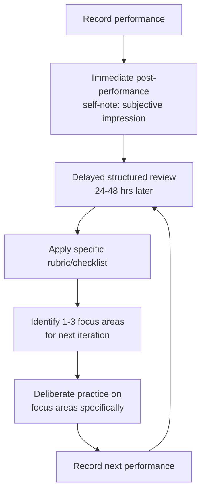

## Recording and Reviewing Your Own Performances

### Overview

Recording and reviewing your own performances is a self-coaching methodology for improving executive and public communication skill through structured self-observation. It is grounded in deliberate practice theory (K. Anders Ericsson's research on expertise development), video-based self-modeling research in behavioral psychology, and applied practices from speech-language pathology, athletic coaching, and media training. The core mechanism is that self-review closes the feedback loop between intended performance and actual perceived performance, which is otherwise inaccessible to a speaker in real time — communicators cannot see or hear themselves the way an audience does while speaking.

This practice differs from live coaching feedback (from a mentor or coach) in that it is self-directed, repeatable at will, and available without scheduling or third-party dependency — though the evidence suggests it is most effective when combined with, not substituted for, external feedback.

### Key Points

- **Self-perception during performance is unreliable**: Communicators systematically misjudge their own delivery in the moment — research on the "illusion of transparency" and related self-perception biases shows speakers often significantly over- or under-estimate how visible their nervousness, filler words, or specific habits are to an audience.
- **Video self-modeling has a substantial evidence base**: Research across sports psychology, clinical psychology, and communication training (going back to foundational work by Peter Dowrick on video self-modeling in the 1970s–80s) demonstrates that structured review of one's own recorded performance produces measurable skill improvement, particularly when paired with explicit, structured analysis rather than passive rewatching.
- **Unstructured review has limited value and can increase anxiety**: Simply rewatching a recording without a specific analytical framework tends to reinforce self-critical rumination rather than produce actionable improvement — deliberate practice research emphasizes that structure and specific focus, not mere repetition, drive skill gains.
- **Audio and video reveal different information**: Audio-only review isolates vocal delivery (pace, filler words, tone, pauses) without the confound of visual self-consciousness; video adds body language, eye contact, and gesture data but can increase self-critical bias if not managed with a structured rubric.
- **Multi-session comparison outperforms single-session analysis**: Tracking specific metrics (filler word frequency, pacing, eye contact duration) across multiple recordings over time reveals trend data that a single review cannot, converting subjective impression into a trackable improvement trajectory.

### Core Methodology

#### 1. The Structured Review Cycle

**Immediate post-performance note**: A brief subjective note captured right after performing, before reviewing the recording — this captures the speaker's real-time self-perception, which can then be directly compared against the recorded reality to calibrate self-assessment accuracy over time.

**Delayed structured review**: Reviewing after a 24–48 hour gap is a widely recommended practice in self-coaching literature, allowing emotional distance from the performance (reducing both defensive minimization and excessive self-criticism) while the specific content is still fresh enough to analyze meaningfully.

**Rubric-based analysis**: Reviewing against a specific, pre-defined checklist rather than open-ended impression, which structures attention toward actionable elements rather than diffuse self-judgment.

**Focused iteration**: Selecting a small number (1–3) of specific focus areas for the next practice attempt, consistent with deliberate practice theory's emphasis on targeted, incremental skill-component work rather than attempting global improvement simultaneously.

#### 2. Review Rubric Dimensions

A comprehensive self-review rubric typically separates analysis into distinct channels, since attempting to assess everything simultaneously reduces the depth of attention to each:

| Dimension | What to Assess | Example Metrics |
| --- | --- | --- |
| **Verbal/Content** | Structure, clarity, argument logic, message consistency | Did the opening establish the core message within the first 30 seconds? Were transitions logical? |
| **Vocal delivery** | Pace, pitch variation, volume, filler words | Words-per-minute; filler word count (um, uh, like, so) per minute; pitch monotony vs. variation |
| **Body language** | Posture, gesture, movement, facial expression | Gesture frequency and appropriateness; stance stability; facial expressiveness matching content tone |
| **Eye contact/engagement** | Audience connection (live) or camera connection (recorded/virtual) | Proportion of time maintaining eye contact vs. looking at notes/screen |
| **Emotional/energy calibration** | Whether energy and tone matched content and context | Did energy flag during a specific section? Was tone appropriate to the gravity of the content? |

#### 3. Quantifiable Self-Tracking Metrics

Converting subjective impressions into trackable numbers enables the multi-session trend analysis that produces the strongest evidence of improvement over time:

- **Filler word rate**: Count of filler words (um, uh, like, you know, so, right) divided by total speaking time or word count, tracked across sessions.
- **Speaking pace**: Words per minute, compared against context-appropriate targets (conversational presentations typically 120–150 wpm; more deliberate, weighty content often benefits from slower pacing).
- **Pause utilization**: Ratio of intentional pauses (for emphasis) vs. hesitation pauses (filled or unfilled, associated with uncertainty) — often distinguishable by listening for whether the pause precedes a key point (likely intentional) or follows a stumble (likely hesitation).
- **Vocal variety index**: Subjective 1–5 rating of pitch/tone variation, since monotone delivery is a well-documented engagement killer even when content quality is high.
- **Time-on-message ratio**: Proportion of total speaking time spent on core message points vs. tangential or filler content, particularly relevant for executive communication where message discipline is a distinct professional skill.

### Practical Recording Setup

#### For Solo Practice (Self-Directed)

- **Camera framing**: Match the framing to the actual delivery context (webcam-level framing for virtual meetings, wider framing with visible hands/body for stage or in-person presentations).
- **Audio quality**: Prioritize clear audio capture over video quality when audio-only analysis (filler words, pacing) is the primary goal — a phone recorder or dedicated microphone often outperforms a laptop's built-in microphone for this purpose.
- **Realistic conditions**: Practicing under conditions resembling the actual performance context (standing if the real context is standing, using actual slides/notes if applicable) produces more transferable skill improvement than idealized practice conditions, consistent with deliberate practice's emphasis on specificity of practice.

#### For Reviewing Actual Past Performances

- **Screen/audio capture of real meetings, calls, or presentations** (with appropriate consent/disclosure per applicable recording laws and organizational policy, which vary significantly by jurisdiction — one-party vs. two-party/all-party consent requirements differ by U.S. state and by country, so this should be confirmed against current local law rather than assumed).
- **Transcription-assisted review**: Automated transcription tools can support systematic filler-word counting and pacing analysis at a scale impractical to do purely by ear, though transcription accuracy should be spot-checked rather than trusted uncritically.

### Illustration: Self-Review Rubric Card (svg_diagram)

<svg xmlns="http://www.w3.org/2000/svg" viewBox="0 0 900 460" font-family="Arial, sans-serif">
<text x="450" y="28" text-anchor="middle" font-size="18" font-weight="bold" fill="#1a1a1a">Self-Review Rubric Card (svg_diagram)</text>
<rect x="60" y="55" width="780" height="60" rx="6" fill="#2c3e50" />
<text x="450" y="80" text-anchor="middle" font-size="13" font-weight="bold" fill="#ffffff">Dimension</text>
<text x="150" y="100" text-anchor="middle" font-size="11" fill="#ffffff">Verbal/Content</text>
<text x="330" y="100" text-anchor="middle" font-size="11" fill="#ffffff">Vocal Delivery</text>
<text x="510" y="100" text-anchor="middle" font-size="11" fill="#ffffff">Body Language</text>
<text x="690" y="100" text-anchor="middle" font-size="11" fill="#ffffff">Eye Contact</text>
<rect x="60" y="125" width="780" height="80" fill="#ecf0f1" stroke="#bdc3c7" />
<text x="150" y="150" text-anchor="middle" font-size="10" fill="#1a1a1a">Message clear</text>
<text x="150" y="168" text-anchor="middle" font-size="10" fill="#1a1a1a">in first 30s?</text>
<text x="150" y="186" text-anchor="middle" font-size="10" fill="#1a1a1a">☐ Yes ☐ No</text>

<text x="330" y="150" text-anchor="middle" font-size="10" fill="`#1a1a1a`">Filler words/min:</text>

<text x="330" y="168" text-anchor="middle" font-size="10" fill="`#1a1a1a`">___</text>

<text x="330" y="186" text-anchor="middle" font-size="10" fill="`#1a1a1a`">Pace: ___ wpm</text>

<text x="510" y="150" text-anchor="middle" font-size="10" fill="`#1a1a1a`">Posture stable?</text>

<text x="510" y="168" text-anchor="middle" font-size="10" fill="`#1a1a1a`">Gestures natural?</text>

<text x="510" y="186" text-anchor="middle" font-size="10" fill="`#1a1a1a`">1-5 rating: ___</text>

<text x="690" y="150" text-anchor="middle" font-size="10" fill="`#1a1a1a`">% time engaged</text>

<text x="690" y="168" text-anchor="middle" font-size="10" fill="`#1a1a1a`">vs. notes/screen:</text>

<text x="690" y="186" text-anchor="middle" font-size="10" fill="`#1a1a1a`">___%</text>

<rect x="60" y="230" width="780" height="60" rx="6" fill="#eafaf1" stroke="#27ae60" />
<text x="450" y="255" text-anchor="middle" font-size="12" font-weight="bold" fill="#1e8449">Top 1-3 focus areas for next session:</text>
<text x="450" y="277" text-anchor="middle" font-size="11" fill="#1e8449">1. ___________ 2. ___________ 3. ___________</text>
<rect x="60" y="310" width="780" height="120" rx="6" fill="#eaf2f8" stroke="#2980b9" />
<text x="450" y="335" text-anchor="middle" font-size="12" font-weight="bold" fill="#1a5276">Trend tracking (across sessions)</text>
<line x1="100" y1="410" x2="800" y2="410" stroke="#2980b9" stroke-width="1.5" />
<line x1="100" y1="410" x2="100" y2="360" stroke="#2980b9" stroke-width="1.5" />
<polyline points="150,395 300,380 450,390 600,365 750,370" fill="none" stroke="#2980b9" stroke-width="2" />
<circle cx="150" cy="395" r="3" fill="#2980b9" />
<circle cx="300" cy="380" r="3" fill="#2980b9" />
<circle cx="450" cy="390" r="3" fill="#2980b9" />
<circle cx="600" cy="365" r="3" fill="#2980b9" />
<circle cx="750" cy="370" r="3" fill="#2980b9" />
<text x="450" y="425" text-anchor="middle" font-size="9" fill="#2980b9">Session 1 → 2 → 3 → 4 → 5 (e.g., filler word rate over time)</text>
</svg>

### Managing the Psychological Challenge of Self-Review

Watching or listening to oneself is a well-documented source of discomfort ("voice confrontation," a term used in some speech pathology and media training literature to describe common negative reactions to hearing one's own recorded voice) that can discourage consistent practice if not managed deliberately.

- **Separate observation from judgment**: Explicitly framing the first pass as neutral data-gathering ("What actually happened?") before any evaluative pass ("Was this good or bad?") reduces the tendency to shut down analysis prematurely out of discomfort.
- **Pair self-critique with acknowledgment of strengths**: A rubric that only captures deficits produces a skewed, demotivating record; effective self-review protocols explicitly log what worked well alongside areas for improvement.
- **Limit review frequency to avoid diminishing returns and rumination**: Reviewing every single interaction in exhaustive detail is neither necessary nor sustainable; applying structured review to selected higher-stakes or representative performances is generally more practical and sufficient for tracking trends.
- **Combine with external feedback periodically**: Since self-review inherits the reviewer's own blind spots (the same biases that affected the original performance can bias its self-assessment), periodic comparison against feedback from a trusted colleague, coach, or trained observer helps calibrate whether self-assessment itself is accurate over time.

### Common Pitfalls

- **Reviewing without a rubric**: Unstructured rewatching tends to fixate on the most emotionally salient moment (often a specific stumble) rather than providing balanced, comprehensive assessment.
- **Reviewing immediately after performing, without delay**: Immediate review while still emotionally activated by the performance tends to skew toward either excessive self-criticism or defensive minimization, compared to review after a short cooling-off period.
- **Attempting too many focus areas simultaneously**: Deliberate practice theory supports narrowing to 1–3 specific, well-defined improvement targets per practice cycle rather than trying to fix everything at once.
- **Treating a single session as diagnostic**: One recording captures one instance, potentially affected by atypical nerves, fatigue, or context; trend data across multiple sessions is more reliable for identifying genuine patterns versus one-off variance.
- **Skipping practice application**: Reviewing without a subsequent deliberate practice attempt on the identified focus areas breaks the feedback loop that produces actual improvement — observation alone, without applied iteration, has limited demonstrated effect on skill development.

### Related Topics

- Deliberate Practice Theory and Skill Acquisition in Communication
- Managing Speech Anxiety and Physiological Arousal
- Seeking and Integrating External Feedback on Communication Style
- Vocal Delivery Techniques: Pace, Pitch, and Pause
- Body Language and Nonverbal Communication in Executive Presence
- Building a Personal Code of Communication Ethics
- Media Training and Adversarial Interview Preparation
- Executive Presence Development Frameworks