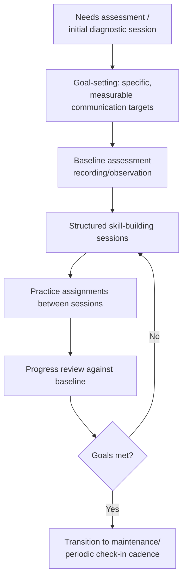

## Working With a Communication or Speech Coach

### Overview

Working with a communication or speech coach is the practice of engaging a trained third-party professional for structured, ongoing skill development in verbal and nonverbal communication, distinct from both self-directed review and ad hoc peer feedback. It draws on adult learning theory (particularly andragogy, per Malcolm Knowles), the coaching psychology literature (distinguishing coaching from therapy, mentoring, and consulting), and applied speech-language pathology techniques for voice and articulation work. Communication coaching sits within the broader executive coaching field but has its own specialized methodology, since it addresses observable behavioral and vocal skill rather than only strategic or leadership judgment.

The engagement differs fundamentally from self-review and peer feedback in three ways: it is delivered by someone with specialized observational training (able to diagnose root causes, not just symptoms, of communication issues), it is typically structured across a sustained engagement rather than a single session, and it usually incorporates deliberate skill-building exercises rather than only diagnostic feedback.

### Key Points

- **Coaching is distinct from therapy, mentoring, and consulting**: The International Coaching Federation and related professional bodies define coaching as a partnership focused on maximizing personal and professional potential through a structured, thought-provoking process — distinct from therapy (which addresses psychological dysfunction), mentoring (which draws on the mentor's own experience/advice), and consulting (which provides expert answers rather than facilitating the client's own solutions). Communication coaching typically blends consulting-style technical instruction (voice, delivery mechanics) with coaching-style reflective facilitation (message clarity, authentic style).
- **Root-cause diagnosis is a key differentiator from self-review or peer feedback**: A trained coach can often identify that a surface symptom (e.g., excessive filler words) stems from a deeper cause (e.g., inadequate structural preparation causing real-time content-generation load) — a distinction self-review and untrained peer feedback often miss, since they tend to address symptoms directly rather than root mechanisms.
- **Voice and articulation coaching draws on clinical speech-language techniques**: Legitimate vocal delivery coaching often incorporates methods with origins in speech-language pathology (breath support, resonance, articulation precision) — though communication coaches without clinical credentials should not attempt to address actual voice disorders or medical conditions, which require a licensed speech-language pathologist.
- **The coaching relationship itself is a variable affecting outcomes**: Coaching psychology research consistently identifies the quality of the coach-client working alliance (trust, mutual respect, shared goal clarity) as a significant factor in coaching effectiveness, independent of the specific technique used — this parallels well-established findings in the psychotherapy outcome literature regarding the therapeutic alliance.
- **Credentialing in this field is fragmented and not uniformly regulated**: Unlike licensed professions (law, medicine, clinical psychology), "communication coach" and "speech coach" are not uniformly regulated titles in most jurisdictions — reputable practitioners often hold credentials from bodies such as the International Coaching Federation (ICF) for coaching methodology, or clinical licensure (e.g., ASHA certification for speech-language pathologists) for voice/articulation work, but credential-checking is the client's responsibility rather than guaranteed by the title alone.

### Coaching Modalities and Specializations

| Modality | Focus | Typical Credential Background |
| --- | --- | --- |
| **Executive/leadership communication coach** | Message strategy, executive presence, stakeholder communication | ICF coaching certification, often combined with organizational psychology or communications background |
| **Media training coach** | Interview technique, message discipline under adversarial questioning, crisis communication | Often former journalists, PR/communications professionals |
| **Voice and vocal delivery coach** | Breath support, pitch, resonance, projection, articulation | Speech-language pathology background, vocal performance/theater training |
| **Presentation/public speaking coach** | Structure, slide design, stage presence, audience engagement | Varied — professional speaking, theater, corporate training backgrounds |
| **Accent modification specialist** | Adjusting speech patterns for specific intelligibility or professional context goals (a distinct and sometimes ethically contested specialization, since accent is tied to identity and this work should always be framed as the client's own choice, not a corrective necessity) | Typically ASHA-certified speech-language pathologists or specialized linguists |
| **Debate/argumentation coach** | Logical structure, rebuttal technique, extemporaneous reasoning | Competitive debate, forensics, or rhetoric academic backgrounds |

### The Coaching Engagement Lifecycle

#### 1. Needs Assessment and Diagnostic Phase

An effective engagement begins with the coach observing the client's actual communication (via recording, live observation, or both) before prescribing any intervention, since generic technique application without diagnosis risks addressing the wrong root cause.

**Diagnostic questions a competent coach typically explores**:

- Is the presenting issue (e.g., excessive filler words, weak vocal projection, disorganized structure) a symptom of a deeper skill gap, a situational/contextual factor (unfamiliarity with the specific format), or an anxiety-driven physiological response?
- Does the issue appear consistently across contexts, or only in specific high-stakes situations?
- What has the client already tried, and why did previous attempts (if any) not resolve the issue?

#### 2. Goal-Setting Using Specific, Measurable Targets

Effective coaching engagements translate vague aspirations ("be a better speaker") into specific, trackable goals, often using frameworks such as SMART goals (Specific, Measurable, Achievable, Relevant, Time-bound), adapted from general performance coaching to communication-specific metrics.

**Example goal translation**:

- Vague: "I want to sound more confident."
- Specific: "Reduce filler word rate from current baseline of 8/minute to under 3/minute within 8 weeks, and increase self-reported and observer-rated vocal steadiness during Q&A specifically."

#### 3. Structured Skill-Building Techniques

Communication coaches draw on a range of applied techniques depending on the specific skill gap identified:

- **Breath support and vocal technique** (drawing from speech-language pathology and vocal performance training): Diaphragmatic breathing exercises to support projection and reduce vocal strain, particularly relevant for executives who speak extensively in high-stakes settings.
- **Structural frameworks for extemporaneous speaking**: Templates (e.g., PREP — Point, Reason, Example, Point restated) to reduce real-time cognitive load during unscripted speaking, directly addressing a common root cause of filler-word overuse (content-generation load, not merely a "bad habit").
- **Video-assisted feedback within session**: Combining the self-review methodology (covered in the prior topic) with real-time coach commentary, which research on video self-modeling suggests is often more effective than either self-review or verbal-only coaching feedback alone.
- **Simulated high-stakes practice**: Mock interviews, mock board presentations, or mock crisis press conferences conducted under conditions approximating real stakes (time pressure, unscripted questions, audience role-play) to build tolerance and skill under realistic conditions rather than only in low-pressure practice.
- **Graduated exposure for anxiety-related issues**: Where communication difficulty stems significantly from anxiety rather than pure skill gaps, coaches may incorporate graduated exposure techniques (starting with lower-stakes practice audiences and progressively increasing stakes) — for clinically significant anxiety, referral to a licensed mental health professional is the appropriate complement to, not a substitute within, communication coaching.

#### 4. Between-Session Practice and Accountability

Consistent with deliberate practice principles, most effective coaching engagements assign specific between-session practice (not merely "practice more") tied to the identified goals, with accountability check-ins at the start of subsequent sessions.

### Illustration: Coach Selection and Fit Assessment (svg_diagram)

<svg xmlns="http://www.w3.org/2000/svg" viewBox="0 0 900 460" font-family="Arial, sans-serif">
<text x="450" y="28" text-anchor="middle" font-size="18" font-weight="bold" fill="#1a1a1a">Coach Selection and Fit Assessment (svg_diagram)</text>
<rect x="60" y="55" width="380" height="180" rx="8" fill="#eaf2f8" stroke="#2980b9" stroke-width="2" />
<text x="250" y="80" text-anchor="middle" font-size="13" font-weight="bold" fill="#1a5276">Credential/Background Check</text>
<text x="80" y="105" font-size="11" fill="#1a1a1a">• ICF certification (coaching methodology)</text>
<text x="80" y="125" font-size="11" fill="#1a1a1a">• ASHA credential (if voice/articulation work)</text>
<text x="80" y="145" font-size="11" fill="#1a1a1a">• Relevant industry/executive background</text>
<text x="80" y="165" font-size="11" fill="#1a1a1a">• References from comparable clients</text>
<text x="80" y="185" font-size="11" fill="#1a1a1a">• Clear scope: coaching vs. therapy</text>
<text x="80" y="205" font-size="11" fill="#1a1a1a"> boundary explicitly acknowledged</text>
<rect x="460" y="55" width="380" height="180" rx="8" fill="#eafaf1" stroke="#27ae60" stroke-width="2" />
<text x="650" y="80" text-anchor="middle" font-size="13" font-weight="bold" fill="#1e8449">Working Alliance Fit</text>
<text x="480" y="105" font-size="11" fill="#1a1a1a">• Diagnostic approach before prescribing</text>
<text x="480" y="125" font-size="11" fill="#1a1a1a">• Comfortable candor in initial session</text>
<text x="480" y="145" font-size="11" fill="#1a1a1a">• Specific, measurable goal-setting</text>
<text x="480" y="165" font-size="11" fill="#1a1a1a">• Clear methodology, not vague promises</text>
<text x="480" y="185" font-size="11" fill="#1a1a1a">• Mutual respect and trust signals</text>
<text x="480" y="205" font-size="11" fill="#1a1a1a"> in initial interaction</text>
<line x1="250" y1="235" x2="450" y2="280" stroke="#333" stroke-width="1.5" stroke-dasharray="4,3" />
<line x1="650" y1="235" x2="450" y2="280" stroke="#333" stroke-width="1.5" stroke-dasharray="4,3" />
<rect x="300" y="280" width="300" height="60" rx="8" fill="#8e44ad" stroke="#1a1a1a" />
<text x="450" y="303" text-anchor="middle" font-size="12" fill="#ffffff">Both must be satisfied —</text>
<text x="450" y="320" text-anchor="middle" font-size="12" fill="#ffffff">credentials alone do not</text>
<text x="450" y="337" text-anchor="middle" font-size="12" fill="#ffffff">guarantee working fit</text>
<line x1="450" y1="340" x2="450" y2="370" stroke="#333" stroke-width="2" marker-end="url(#a7)" />
<rect x="300" y="370" width="300" height="50" rx="8" fill="#16a085" stroke="#1a1a1a" />
<text x="450" y="400" text-anchor="middle" font-size="12" fill="#ffffff">Proceed to trial session/engagement</text>
</svg>

### Boundaries: When Coaching Is Not the Appropriate Intervention

Recognizing the limits of communication coaching is itself a component of using it well:

- **Clinical voice disorders**: Persistent vocal strain, hoarseness, or pain requires evaluation by a licensed speech-language pathologist or otolaryngologist (ENT physician) before or alongside any coaching, since these can indicate underlying medical conditions coaching cannot address.
- **Clinically significant anxiety**: Communication anxiety severe enough to resemble social anxiety disorder or panic-level physiological responses is a matter for licensed mental health treatment; coaching can complement but should not substitute for appropriate clinical care in such cases.
- **Underlying strategic/organizational problems presenting as communication issues**: Sometimes what appears to be a personal communication skill gap is actually a symptom of unclear organizational strategy, unresolved role ambiguity, or unaddressed team dysfunction — a skilled coach should be able to help distinguish a genuine skill-development need from a systemic issue better addressed through organizational consulting or leadership intervention.

### Measuring Coaching Return on Engagement

For organizations sponsoring executive communication coaching (a common practice, distinct from self-funded engagement), evaluating effectiveness benefits from the same rigor applied elsewhere in this curriculum:

- **Baseline-to-endpoint comparison**: Using the quantifiable metrics from the self-review framework (filler word rate, pacing, structured rubric scores) captured before and after the engagement to demonstrate measurable change rather than relying solely on subjective impression.
- **360-style stakeholder feedback pre/post**: Where feasible, comparing structured feedback from consistent raters before and after the engagement.
- **Applied outcome tracking**: Observing whether specific identified behaviors (e.g., reduced evasiveness in media interviews, improved clarity in board presentations) show measurable change in actual high-stakes performances, not only in coaching-session practice.

### Common Pitfalls

- **Selecting a coach based on credentials alone, without assessing working alliance fit**: Strong technical credentials do not guarantee an effective coaching relationship if trust, communication style, or diagnostic approach do not fit the client.
- **Vague goal-setting**: Engagements framed around generic aspirations ("be a better communicator") without specific, measurable targets make it difficult to assess whether the engagement succeeded.
- **Treating coaching as a one-time fix rather than a skill-building process**: Sustainable communication skill development, consistent with deliberate practice principles, typically requires sustained engagement and between-session practice rather than a single session producing lasting change.
- **Misapplying coaching to clinical or organizational issues**: Attempting to coach through what is actually a medical voice condition, clinical anxiety disorder, or organizational dysfunction wastes resources and delays appropriate intervention.
- **Neglecting to verify credentials or scope of practice**: Given the fragmented regulation of coaching titles, failing to verify a practitioner's actual training and appropriate scope (especially for voice/articulation work bordering on clinical territory) creates risk of ineffective or inappropriate intervention.

### Related Topics

- Recording and Reviewing Your Own Performances
- Seeking and Integrating Structured Feedback
- Deliberate Practice Theory and Skill Acquisition in Communication
- Vocal Delivery Techniques: Breath Support, Pitch, and Projection
- Managing Speech Anxiety and Physiological Arousal
- Media Training and Adversarial Interview Preparation
- Executive Presence Development Frameworks
- Coaching Psychology: Working Alliance and Outcome Research