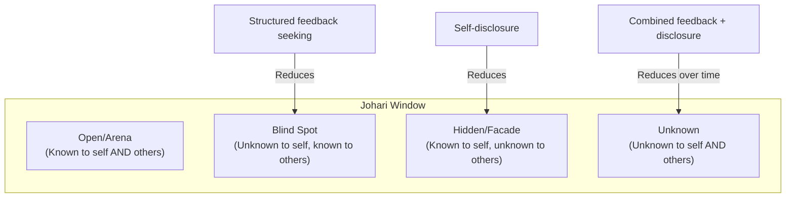

## Communication Style Assessments and Self-Awareness Tools

### Overview

Communication style assessments and self-awareness tools are structured instruments designed to help individuals identify patterns in how they communicate, process information, and interact with others, providing a shared vocabulary and framework for self-reflection and interpersonal adaptation. These tools sit within the broader field of psychometrics and organizational psychology, though they vary enormously in scientific rigor — ranging from instruments with substantial peer-reviewed validation to popular frameworks with limited empirical support. Executive communication development commonly uses these tools not as diagnostic instruments in a clinical sense, but as structured reflection aids and shared-language frameworks for teams and coaching relationships.

A critical framing for this topic: communication style assessments should generally be treated as heuristic frameworks for structured self-reflection and team dialogue, not as scientifically definitive categorizations of fixed personality traits — this distinction matters because popular tools vary widely in their evidentiary basis, and overclaiming their validity is itself a common and documented misuse.

### Key Points

- **Not all popular instruments have equivalent scientific standing**: There is a meaningful and well-documented distinction in the psychometric literature between instruments with substantial peer-reviewed reliability/validity evidence (e.g., the Big Five/OCEAN model) and widely used commercial instruments with more limited or contested empirical support (e.g., the Myers-Briggs Type Indicator) — this is a genuine, long-running debate in psychology, not a fringe position, and should not be flattened in either direction.
- **Communication style tools and personality assessments are related but distinct categories**: Some instruments (DISC, Social Styles) focus specifically on communication and behavioral style rather than broader personality structure, and are generally positioned by their own developers as situational behavioral frameworks rather than fixed trait measures — though the same rigor questions about validation evidence apply across this category.
- **Self-report instruments carry inherent limitations**: Nearly all popular communication style tools rely on self-report, which is subject to social desirability bias, limited self-awareness of one's own patterns, and mood-state or context-dependent variation at the time of taking the assessment.
- **Utility does not require perfect scientific validation**: Even instruments with contested psychometric standing can provide practical value as structured reflection prompts and shared team vocabulary, provided they are used for that purpose (facilitating dialogue and self-reflection) rather than for high-stakes decisions like hiring, promotion, or definitive diagnostic labeling — a distinction the instruments' own publishers frequently emphasize but that is frequently ignored in practice.
- **Categorical typing (fixed "types") is scientifically more contested than dimensional/trait measurement**: Psychometric research generally favors continuous trait dimensions (where most people fall in the middle range) over discrete categorical types (which imply clean either/or boundaries) — instruments that sort people into a small number of fixed types face more consistent criticism on this specific methodological point than dimensional models.

### Major Instrument Categories

#### 1. Trait-Based Personality Models

**Big Five / OCEAN Model** (Openness, Conscientiousness, Extraversion, Agreeableness, Neuroticism/Emotional Stability)

- **Evidentiary basis**: Widely regarded within academic psychology as the most empirically robust general personality framework, with extensive cross-cultural replication, test-retest reliability, and predictive validity for various life and work outcomes documented across decades of peer-reviewed research.
- **Communication relevance**: Extraversion correlates with assertive, expressive communication style preferences; Conscientiousness with structured, detail-oriented communication; Agreeableness with accommodating, harmony-seeking interaction patterns — though these are population-level tendencies, not deterministic predictions for any individual.
- **Limitation for communication-specific use**: Big Five was designed as a general personality framework, not a communication-specific instrument, so translating dimensional scores into specific communication behavior guidance requires additional interpretive framing.

#### 2. Communication/Behavioral Style Frameworks

**DISC Model** (Dominance, Influence, Steadiness, Conscientiousness)

- **Origin**: Loosely derived from psychologist William Marston's 1920s theoretical work on emotions and behavior, though contemporary commercial DISC assessments are developed independently by various publishers and are not direct clinical instruments.
- **Communication application**: Widely used in sales training and team communication contexts to suggest adapted communication approaches (e.g., "D-style" communicators reportedly prefer direct, results-focused messaging; "S-style" communicators reportedly prefer patient, relationship-oriented approaches).
- **Evidentiary status**: Commercial DISC instruments have more limited independent peer-reviewed validation compared to the Big Five; users should treat categorical DISC "types" as a practical communication heuristic rather than a scientifically validated typology, a distinction some but not all commercial providers make clear in their own materials.

**Social Styles Model** (Driver, Expressive, Amiable, Analytical)

- Similar structure and purpose to DISC, developed by David Merrill and Roger Reid, mapping communication preference along assertiveness and responsiveness dimensions; shares similar evidentiary limitations and similar practical utility as a team-communication heuristic.

#### 3. Myers-Briggs Type Indicator (MBTI) and Jungian-Derived Instruments

- **Origin**: Developed by Katharine Briggs and Isabel Briggs Myers, loosely based on Carl Jung's theoretical typology, sorting respondents into 16 discrete types across four binary dimensions (Extraversion/Introversion, Sensing/Intuition, Thinking/Feeling, Judging/Perceiving).
- **Evidentiary status — genuinely contested**: MBTI is one of the most widely used assessment instruments commercially and organizationally, but faces substantial, long-standing criticism within academic psychology regarding test-retest reliability (a meaningful proportion of respondents receive a different type classification on retesting), the validity of forcing continuous traits into binary categories, and limited predictive validity for job performance — this is a mainstream, decades-long critique within psychological science, not a fringe view, though MBTI also retains a substantial base of organizational users and proponents who value it as a reflective/team tool.
- **Practical framing**: Best used, per its own more responsible advocates, as a conversation-starting framework for self-reflection and team dialogue about preferences, rather than as a scientifically definitive or high-stakes decision-making tool.

#### 4. Communication-Specific Self-Awareness Frameworks

**Johari Window** (developed by Joseph Luft and Harrington Ingham)

A conceptual model rather than a psychometric test, mapping self-awareness across four quadrants based on what is known/unknown to self and known/unknown to others:

The model's practical value in communication development is its direct link to the feedback-seeking practices covered in the prior topic: soliciting structured feedback specifically targets reducing the "blind spot" quadrant — patterns visible to others but invisible to oneself, which self-review alone structurally cannot access.

**Communication Style Inventories (custom/organizational)**

Many organizations develop internal, role-specific communication assessments tailored to their own competency models rather than relying on commercial off-the-shelf instruments — these trade broad validation evidence for specificity to the actual communication demands of the role or organization.

### Illustration: Instrument Selection by Evidentiary Rigor and Purpose (svg_diagram)

<svg xmlns="http://www.w3.org/2000/svg" viewBox="0 0 900 460" font-family="Arial, sans-serif">
<text x="450" y="28" text-anchor="middle" font-size="18" font-weight="bold" fill="#1a1a1a">Instrument Selection: Rigor vs. Purpose (svg_diagram)</text>
<line x1="100" y1="400" x2="800" y2="400" stroke="#333" stroke-width="2" />
<line x1="100" y1="400" x2="100" y2="60" stroke="#333" stroke-width="2" />
<text x="450" y="425" text-anchor="middle" font-size="12" fill="#1a1a1a">Peer-reviewed evidentiary strength →</text>
<text x="50" y="230" text-anchor="middle" font-size="12" fill="#1a1a1a" transform="rotate(-90 50 230)">Stakes of decision →</text>
<rect x="130" y="330" width="150" height="60" rx="6" fill="#f9e79f" stroke="#d4ac0d" />
<text x="205" y="355" text-anchor="middle" font-size="11" fill="#1a1a1a">MBTI-style</text>
<text x="205" y="372" text-anchor="middle" font-size="11" fill="#1a1a1a">team icebreaker</text>
<rect x="330" y="330" width="150" height="60" rx="6" fill="#fadbd8" stroke="#c0392b" />
<text x="405" y="355" text-anchor="middle" font-size="11" fill="#1a1a1a">DISC/Social Styles</text>
<text x="405" y="372" text-anchor="middle" font-size="11" fill="#1a1a1a">reflection framework</text>
<rect x="530" y="230" width="150" height="60" rx="6" fill="#d5f5e3" stroke="#27ae60" />
<text x="605" y="255" text-anchor="middle" font-size="11" fill="#1a1a1a">Big Five</text>
<text x="605" y="272" text-anchor="middle" font-size="11" fill="#1a1a1a">structured coaching input</text>
<rect x="330" y="130" width="150" height="60" rx="6" fill="#fadbd8" stroke="#c0392b" />
<text x="405" y="150" text-anchor="middle" font-size="11" fill="#1a1a1a">MBTI-style for</text>
<text x="405" y="167" text-anchor="middle" font-size="11" fill="#1a1a1a">hiring decisions</text>
<text x="405" y="184" text-anchor="middle" font-size="10" fill="#943126">(discouraged — high stakes,</text>
<text x="405" y="198" text-anchor="middle" font-size="10" fill="#943126">low validated predictive power)</text>
<rect x="530" y="80" width="150" height="60" rx="6" fill="#d5f5e3" stroke="#27ae60" />
<text x="605" y="102" text-anchor="middle" font-size="11" fill="#1a1a1a">Big Five/validated</text>
<text x="605" y="119" text-anchor="middle" font-size="11" fill="#1a1a1a">instruments for</text>
<text x="605" y="136" text-anchor="middle" font-size="11" fill="#1a1a1a">structured org research</text>
</svg>

### Applications in Executive Communication Development

#### 1. Team Communication Norm-Setting

Sharing communication style assessment results across a team (regardless of the underlying instrument's scientific rigor) can establish useful shared vocabulary for discussing preferences — "I tend to want the bottom line first" vs. "I prefer full context before the conclusion" — that facilitates adapted communication without requiring the instrument itself to carry strong predictive validity.

#### 2. Coaching Intake and Reflection Starting Point

As referenced in the coaching topic, many communication coaches use style assessments as an intake tool to structure initial conversation about the client's self-perceived patterns, generating discussion material rather than definitive diagnosis.

#### 3. Adapting Message Delivery to Audience Style

A practical executive application involves using a shared style framework (whatever instrument a team has adopted) to consciously adapt delivery — for example, providing more upfront data/detail for audience members who self-identify as detail-oriented, or leading with bottom-line conclusions for those who identify as results-focused — while remaining aware this is a heuristic adaptation, not a scientifically precise prediction of what any specific individual will respond to.

### Common Misuses and Pitfalls

- **Using low-validity instruments for high-stakes decisions**: Employing MBTI-style categorical results for hiring, promotion, or role-assignment decisions is a well-documented misuse inconsistent with the instruments' own evidentiary limitations and, in many cases, the publishers' own stated appropriate-use guidance.
- **Treating type/style labels as fixed, deterministic identity**: Communication style, like most psychological traits, shows meaningful within-person variation across contexts and over time; treating a single assessment result as a permanent, context-independent label overstates what any instrument can validly claim.
- **Confirmation bias in self-report**: Because most instruments rely on self-report, respondents' existing self-concept can bias how they answer, producing results that confirm pre-existing self-narrative rather than revealing genuinely new information — a limitation particularly relevant to the "blind spot" quadrant of the Johari Window, which self-report alone cannot access.
- **Overgeneralizing from population-level correlations to individual prediction**: Even well-validated instruments like the Big Five describe population-level tendencies and correlations; using them to make confident predictions about a specific individual's behavior in a specific situation overstates their appropriate use.
- **Ignoring the evidentiary rigor spectrum**: Treating all popular commercial assessments as equivalently scientific, when the field contains a genuine and substantial range from well-validated (Big Five) to contested (MBTI) to largely unvalidated novelty instruments.

### Practical Framework for Selecting and Using These Tools

1. **Clarify the purpose first**: Team reflection and shared vocabulary building tolerate lower evidentiary rigor than any decision with material consequences for an individual (hiring, promotion, compensation).
2. **Check the evidentiary basis appropriate to the stakes**: For high-stakes applications, prioritize instruments with substantial independent peer-reviewed validation; for low-stakes reflection and dialogue tools, evidentiary rigor matters less than practical usability and team buy-in.
3. **Pair self-report instruments with external feedback**: Given self-report limitations, combining any style assessment with structured external feedback (per the prior topic) provides a more complete picture than self-report alone.
4. **Treat results as a starting conversation, not a conclusion**: The most defensible use of contested instruments (MBTI, DISC) is as a prompt for structured dialogue about preferences and working styles, not as a definitive, final characterization of an individual.
5. **Revisit periodically**: Given documented variation in retest results for some instruments and genuine change in communication style over a career, treating assessment results as time-bound snapshots rather than permanent labels better reflects both the evidence and lived experience.

### Related Topics

- Seeking and Integrating Structured Feedback
- Working With a Communication or Speech Coach
- The Big Five Personality Model and Communication Behavior
- Psychometric Validity and Reliability: Core Concepts
- The Johari Window and Self-Awareness Development
- Team Communication Norms and Adapted Messaging
- Building a Personal Code of Communication Ethics
- Executive Presence Development Frameworks