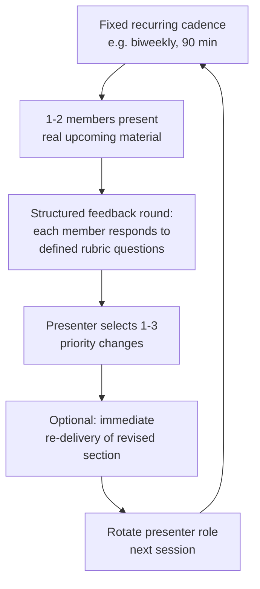

## Peer Practice Groups and Rehearsal Circles

### Overview

Peer practice groups and rehearsal circles are structured, recurring gatherings of communicators who practice, critique, and refine each other's presentations or messages outside of any formal coaching or organizational hierarchy. This methodology draws on cooperative learning theory, communities-of-practice research (particularly the work of Etienne Wenger on situated social learning), and the long-established organizational model of Toastmasters International, which has operated peer-led public speaking practice groups since 1924 and remains the most widely referenced example of this format. Unlike one-on-one coaching, peer practice groups distribute both the feedback-giving and feedback-receiving roles across all participants, which produces distinct learning benefits (and distinct limitations) compared to expert-coach or self-review models.

The defining structural feature of this modality is reciprocity: participants alternate between performer and evaluator roles within the same group, which research on peer learning suggests produces skill benefits for the evaluator as well as the performer — articulating specific, structured feedback to someone else reinforces the evaluator's own understanding of the communication principles being applied.

### Key Points

- **Peer feedback benefits both directions of the exchange**: Educational research on peer assessment (e.g., work by David Nicol and Debra Macfarlane-Dick on formative assessment) finds that the act of evaluating a peer's work using explicit criteria strengthens the evaluator's internalization of those criteria, meaning peer practice groups build skill through the act of giving feedback, not only through receiving it.
- **Structured formats outperform unstructured "just practice and chat" groups**: Groups with defined roles, explicit feedback rubrics, and structured time allocation produce more consistent skill development than informal groups that lack a clear format, since unstructured groups tend to drift toward social conversation or unfocused generic praise.
- **Psychological safety is a prerequisite for useful peer feedback**: Communities-of-practice and team-learning research (including Amy Edmondson's foundational work on psychological safety) indicates that peer critique is only genuinely useful when group members feel safe giving and receiving candid feedback without social or professional risk — a factor that must be deliberately cultivated, particularly in groups where members have ongoing working relationships outside the practice group.
- **Peer groups fill a different niche than expert coaching, not a lesser one**: Peer practice groups generally cannot provide the root-cause diagnostic expertise of a trained coach, but they offer high-frequency, low-cost, socially reinforcing practice opportunities that most people cannot access as often through paid coaching alone — the two modalities are complementary rather than substitutes.
- **Regular cadence and low-stakes repetition drive the core benefit**: Consistent with deliberate practice principles, the primary value of a rehearsal circle often comes from frequent, low-stakes repetition (allowing rapid iteration and comfort with vulnerability) rather than any single high-quality feedback session.

### Structural Models

#### 1. Toastmasters-Style Structured Meeting Format

The most widely referenced peer practice model, refined over decades of use, typically includes distinct role assignments within each meeting:

| Role | Function |
| --- | --- |
| **Speaker(s)** | Deliver a prepared or impromptu speech |
| **Evaluator(s)** | Provide structured, specific feedback on an assigned speaker's speech using a defined framework |
| **Timer** | Tracks and signals speaking time, building time-discipline as an explicit skill |
| **"Ah-counter" / filler-word tracker** | Tracks filler words and verbal tics across all speakers, providing quantified feedback |
| **Table Topics facilitator** | Leads impromptu speaking exercises, building extemporaneous speaking skill under mild pressure |
| **General evaluator** | Evaluates the meeting's overall function, providing meta-level feedback on the practice format itself |

This role-rotation model ensures that over time, every participant practices not only formal speaking but also structured evaluation, time management, and impromptu speaking — a deliberately broad skill-development structure rather than narrow focus on prepared-speech delivery alone.

#### 2. Small Cohort Rehearsal Circles (Executive/Professional Context)

A more informal adaptation common in executive and professional development contexts, typically 4–8 participants meeting on a defined recurring cadence:

**Presenting real, upcoming material**: A key practical advantage over generic practice speeches — participants rehearse an actual upcoming board presentation, earnings call opening, or high-stakes pitch, making the practice directly transferable rather than abstract.

**Structured feedback rounds**: Each participant responds to the same defined set of questions (mirroring the structured feedback principles from the prior topic) rather than open-ended commentary, ensuring consistent, comparable input across the group.

**Immediate re-delivery**: Some rehearsal circle formats include an immediate second attempt incorporating feedback within the same session, providing rapid-cycle deliberate practice rather than waiting until the next live performance to apply changes.

#### 3. Asynchronous/Distributed Peer Review Groups

An adaptation for distributed or time-constrained groups, using recorded video/audio submissions reviewed asynchronously by peer group members using a shared structured rubric, with feedback compiled and shared before or instead of a live discussion — trading the real-time energy and immediate follow-up of live groups for scheduling flexibility.

### Designing Effective Feedback Protocols for Peer Groups

Given that unstructured peer feedback tends toward vague, low-value commentary, effective rehearsal circles typically adopt an explicit protocol:

#### The "Specific-Impact-Suggestion" (SIS) Framework

A structured peer feedback format used in many rehearsal circle contexts:

1. **Specific observation**: Cite a precise, observable moment ("At the two-minute mark, when you transitioned to the budget numbers...") rather than a global impression.
2. **Impact statement**: Describe the effect on the listener ("...I lost track of the connection to your opening point").
3. **Suggestion**: Offer a concrete alternative or question ("Would restating the core thesis before the numbers help bridge that?") rather than only identifying the problem.

This structure parallels the "Situation-Behavior-Impact" (SBI) model used broadly in management feedback training, adapted here for communication-specific peer review.

#### Balancing Critical and Affirming Feedback

Unlike the contested "feedback sandwich" debate covered in the structured feedback topic, peer practice groups have a somewhat different consideration: because peer relationships are ongoing and reciprocal (today's evaluator is tomorrow's presenter), maintaining a sustainable group culture that includes genuine acknowledgment of strengths — not merely as a softening device but as accurate, complete feedback — tends to support long-term group participation and psychological safety better than a purely critique-focused culture.

### Illustration: Peer Group vs. Solo Practice vs. Coaching Comparison (svg_diagram)

<svg xmlns="http://www.w3.org/2000/svg" viewBox="0 0 900 420" font-family="Arial, sans-serif">
<text x="450" y="28" text-anchor="middle" font-size="18" font-weight="bold" fill="#1a1a1a">Practice Modality Comparison (svg_diagram)</text>
<rect x="60" y="60" width="240" height="320" rx="8" fill="#eaf2f8" stroke="#2980b9" stroke-width="2" />
<text x="180" y="90" text-anchor="middle" font-size="13" font-weight="bold" fill="#1a5276">Solo Self-Review</text>
<text x="80" y="120" font-size="10" fill="#1a1a1a">+ Fully self-directed, no</text>
<text x="80" y="135" font-size="10" fill="#1a1a1a"> scheduling dependency</text>
<text x="80" y="160" font-size="10" fill="#1a1a1a">+ Repeatable at will</text>
<text x="80" y="190" font-size="10" fill="#1a1a1a">− Cannot access own</text>
<text x="80" y="205" font-size="10" fill="#1a1a1a"> blind spots</text>
<text x="80" y="230" font-size="10" fill="#1a1a1a">− No external</text>
<text x="80" y="245" font-size="10" fill="#1a1a1a"> accountability</text>
<rect x="330" y="60" width="240" height="320" rx="8" fill="#eafaf1" stroke="#27ae60" stroke-width="2" />
<text x="450" y="90" text-anchor="middle" font-size="13" font-weight="bold" fill="#1e8449">Peer Practice Group</text>
<text x="350" y="120" font-size="10" fill="#1a1a1a">+ High frequency, low cost</text>
<text x="350" y="150" font-size="10" fill="#1a1a1a">+ Benefits evaluator too</text>
<text x="350" y="180" font-size="10" fill="#1a1a1a">+ Builds social/psychological</text>
<text x="350" y="195" font-size="10" fill="#1a1a1a"> safety with practice</text>
<text x="350" y="225" font-size="10" fill="#1a1a1a">− No expert root-cause</text>
<text x="350" y="240" font-size="10" fill="#1a1a1a"> diagnosis</text>
<text x="350" y="265" font-size="10" fill="#1a1a1a">− Quality depends on group's</text>
<text x="350" y="280" font-size="10" fill="#1a1a1a"> structure and safety</text>
<rect x="600" y="60" width="240" height="320" rx="8" fill="#f4ecf7" stroke="#8e44ad" stroke-width="2" />
<text x="720" y="90" text-anchor="middle" font-size="13" font-weight="bold" fill="#6c3483">Professional Coaching</text>
<text x="620" y="120" font-size="10" fill="#1a1a1a">+ Expert root-cause</text>
<text x="620" y="135" font-size="10" fill="#1a1a1a"> diagnosis</text>
<text x="620" y="160" font-size="10" fill="#1a1a1a">+ Individualized methodology</text>
<text x="620" y="190" font-size="10" fill="#1a1a1a">− Higher cost, lower</text>
<text x="620" y="205" font-size="10" fill="#1a1a1a"> frequency typically</text>
<text x="620" y="230" font-size="10" fill="#1a1a1a">− Scheduling dependency</text>

<text x="450" y="405" text-anchor="middle" font-size="11" fill="`#7f8c8d`">Complementary, not mutually exclusive — most robust development combines all three</text>

</svg>

### Special Considerations for Executive-Level Peer Groups

#### Confidentiality and Power Dynamics

Executive peer practice groups raise distinct considerations not present in general public-speaking clubs:

- **External, cross-organizational groups**: Executives from different, non-competing organizations forming a peer group can reduce the internal political risk of exposing draft material or perceived communication weaknesses to direct colleagues or subordinates.
- **Confidentiality agreements**: Given that rehearsal material may include genuinely sensitive strategic content (draft earnings announcements, unreleased strategic pivots), formal or informal confidentiality understandings are often necessary and should be established explicitly rather than assumed.
- **Status-leveling within the group**: Groups composed of peers at genuinely comparable seniority levels tend to produce more candid mutual feedback than mixed-seniority groups, where hierarchy (even outside a direct reporting relationship) can suppress candor in either direction.

#### Avoiding Groupthink and Feedback Homogenization

A documented risk in any recurring peer group is the gradual convergence toward shared blind spots or an overly agreeable feedback culture as members become socially comfortable with each other over time — group facilitators or rotating leadership roles can mitigate this by periodically reintroducing structured, criteria-based feedback formats rather than allowing feedback to drift toward purely affirming social exchange.

### Common Pitfalls

- **Unstructured "just wing it" format**: Groups without defined roles, rubrics, or time structure tend to drift toward generic, low-value feedback or social conversation rather than deliberate skill practice.
- **Insufficient psychological safety**: Groups where members fear social or professional consequences for candid feedback (particularly relevant when peer group members also work together professionally) produce diluted, unhelpful feedback regardless of the format's structural quality.
- **Feedback homogenization over time**: Long-running groups can gradually converge toward comfortable, non-challenging feedback patterns unless deliberately counteracted with periodic format refresh or rotating facilitation.
- **Treating peer feedback as a substitute for, rather than complement to, expert input**: Peer groups generally lack the diagnostic expertise to identify root causes of persistent, non-obvious communication issues — sustained specific problems may still warrant professional coaching input.
- **Neglecting confidentiality considerations for sensitive material**: Rehearsing genuinely sensitive strategic content without explicit confidentiality understanding creates organizational risk independent of the practice group's communication-development value.
- **Uneven participation**: Groups where the same few members dominate speaking or evaluation roles fail to distribute the reciprocal evaluator-benefit that is a core mechanism of the modality's value.

### Related Topics

- Recording and Reviewing Your Own Performances
- Seeking and Integrating Structured Feedback
- Working With a Communication or Speech Coach
- Deliberate Practice Theory and Skill Acquisition in Communication
- Psychological Safety in Team and Group Learning Contexts
- Communities of Practice and Situated Social Learning Theory
- Toastmasters and Structured Public Speaking Practice Models
- Media Training and Adversarial Interview Preparation