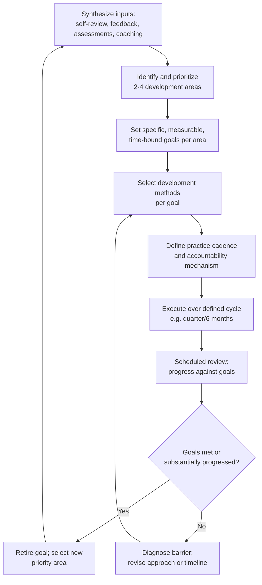

## Building a Personal Development Plan

### Overview

Building a personal development plan (PDP) is the capstone practice of this chapter: converting the diagnostic and improvement tools covered previously — self-review, structured feedback, coaching, style assessments, and peer practice — into a coherent, prioritized, time-bound plan for sustained communication skill development. It draws on goal-setting theory (particularly the work of Edwin Locke and Gary Latham on goal-setting and task performance), adult learning theory, and applied practices from executive development and instructional design. Where the previous topics addressed individual mechanisms of feedback and practice, this topic addresses the meta-skill of sequencing, prioritizing, and sustaining a development effort across those mechanisms over time.

A personal development plan differs from an organizational performance improvement plan (PIP) in both origin and tone: a PDP is self-authored and growth-oriented (even when informed by external feedback or organizational expectations), while a PIP is typically employer-initiated and remediation-focused, often in response to a specific performance deficiency — conflating the two can undermine the developmental, non-punitive framing that makes a PDP effective as a genuine growth tool.

### Key Points

- **Specific, measurable goals outperform vague aspirations**: Locke and Latham's goal-setting theory, one of the most extensively replicated frameworks in organizational psychology, consistently finds that specific, challenging goals produce higher performance than vague ("do your best") or unchallenging goals, provided the goal is perceived as achievable and the person is committed to it.
- **A PDP should integrate, not duplicate, the mechanisms already covered**: An effective plan explicitly sequences self-review, structured feedback-seeking, coaching engagement, and peer practice rather than treating the plan itself as a separate, additional activity disconnected from these tools.
- **Prioritization is necessary because attention and practice time are finite**: Attempting simultaneous development across many communication dimensions dilutes the deliberate practice focus that research suggests drives genuine skill improvement — most effective plans identify a small number (often 2–4) of priority development areas per cycle.
- **Plans require built-in review and revision points**: Given that priorities, roles, and available evidence about progress evolve, a PDP that is drafted once and never revisited tends to become stale or disconnected from actual current development needs.
- **Accountability structure is as important as plan content**: A well-designed plan with no mechanism for tracking progress or maintaining commitment (an accountability partner, scheduled check-ins, or milestone reviews) is significantly less likely to be sustained than one with explicit accountability built in, consistent with broader behavior-change research on implementation intentions and commitment devices.

### Core Structure of a Personal Development Plan

#### 1. Synthesizing Inputs Across Development Tools

An effective PDP draws on the accumulated evidence from the other mechanisms in this chapter rather than starting from an unexamined guess about development priorities:

- **Self-review trend data**: Quantified metrics (filler word rate, pacing, rubric scores) tracked over multiple sessions, revealing genuine patterns rather than single-instance impressions.
- **Structured feedback patterns**: Convergent, multi-source feedback themes (per the feedback-integration framework), distinguished from single-rater idiosyncratic input.
- **Coaching diagnostic findings**: Root-cause assessments from a trained coach, where engaged, which often reveal underlying mechanisms (e.g., structural preparation gaps) behind surface symptoms.
- **Style assessment reflection**: Structured self-awareness prompts from communication style tools, used as reflective input rather than deterministic categorization.
- **Peer practice observations**: Recurring feedback themes surfaced across rehearsal circle sessions.

#### 2. Prioritization Frameworks

Given finite attention and practice capacity, selecting which development areas to prioritize in a given cycle benefits from an explicit framework rather than addressing whatever feels most salient at plan-drafting time.

| Prioritization Criterion | Guiding Question |
| --- | --- |
| **Impact** | Which development area, if improved, would most affect actual professional outcomes (stakeholder trust, decision quality, career advancement)? |
| **Frequency of exposure** | Which skill gap surfaces most often in recurring high-stakes situations (e.g., weekly leadership meetings vs. an annual board presentation)? |
| **Convergence of evidence** | Which issues are confirmed by multiple independent sources (self-review, peer feedback, coach diagnosis) rather than a single data point? |
| **Foundational vs. downstream** | Is this a root-cause skill (e.g., structural preparation habits) whose improvement would resolve multiple downstream symptoms (filler words, pacing, confidence), or a narrow symptom-level fix? |
| **Readiness/feasibility** | Is this a skill the person has sufficient opportunity and support to practice within the plan cycle, or does it require conditions (a coach, a specific recurring venue) not yet available? |

#### 3. Goal Formulation Using SMART-Adapted Criteria

Consistent with goal-setting theory's emphasis on specificity, PDP goals should generally specify the target behavior, the measurement method, and the timeframe:

**Example goal transformation**:

- Vague: "Get better at handling difficult questions."
- Structured: "Reduce use of hedging language ('I think maybe,' 'sort of') during Q&A sessions from a self-review baseline of [X] instances per session to under [Y] by the end of Q2, verified through recorded session review and confirmed by at least two peer practice group observers."

#### 4. Method Selection per Goal

Different development goals are better served by different mechanisms from this chapter — a mature PDP is explicit about matching method to goal type rather than defaulting to a single modality for everything.

| Goal Type | Best-Suited Primary Method(s) |
| --- | --- |
| Vocal delivery/articulation mechanics | Speech/voice coach, self-review with audio focus |
| Message structure and content clarity | Self-review with content rubric, peer practice group critique |
| Handling adversarial/unscripted questions | Media training coach, simulated mock interviews, peer practice |
| Broad self-awareness of communication patterns | Structured 360 feedback, communication style assessment as reflection prompt |
| Confidence/anxiety under high-stakes conditions | Graduated exposure via peer practice, coaching, possibly complemented by clinical support if anxiety is clinically significant |
| Ethical/ argumentation rigor (steelmanning, calibration) | Structured self-review against the personal code of communication ethics, peer critique |

#### 5. Cadence and Accountability Design

- **Practice cadence**: Defining a specific, realistic recurring cadence (e.g., biweekly peer group, monthly coaching session, self-review after each significant public communication) rather than an unscheduled "as often as possible" intention, which behavior-change research consistently finds less likely to be sustained.
- **Accountability mechanism**: Options include a coach, a peer practice group, a designated accountability partner/mentor, or scheduled formal review points (e.g., tied to existing performance review cycles) — the specific mechanism matters less than that one exists and is calendared, not left to spontaneous follow-through.
- **Milestone check-ins**: Interim review points within the plan cycle (e.g., a midpoint check at 6 weeks within a 12-week cycle) allow course correction before the full cycle elapses, rather than only discovering at the end whether the approach worked.

### Illustration: Sample Personal Development Plan Template (svg_diagram)

<svg xmlns="http://www.w3.org/2000/svg" viewBox="0 0 900 480" font-family="Arial, sans-serif">
<text x="450" y="28" text-anchor="middle" font-size="18" font-weight="bold" fill="#1a1a1a">Personal Development Plan Template (svg_diagram)</text>
<rect x="60" y="55" width="780" height="40" rx="6" fill="#2c3e50" />
<text x="450" y="80" text-anchor="middle" font-size="12" fill="#ffffff">Cycle: Q1-Q2 2027 (12 weeks) | Review points: Week 6, Week 12</text>
<rect x="60" y="105" width="255" height="150" rx="6" fill="#eaf2f8" stroke="#2980b9" stroke-width="2" />
<text x="187" y="128" text-anchor="middle" font-size="12" font-weight="bold" fill="#1a5276">Priority Area 1</text>
<text x="75" y="150" font-size="10" fill="#1a1a1a">Reduce hedging language</text>
<text x="75" y="167" font-size="10" fill="#1a1a1a">in Q&amp;A</text>
<text x="75" y="190" font-size="10" fill="#1a1a1a">Method: self-review +</text>
<text x="75" y="205" font-size="10" fill="#1a1a1a">peer practice group</text>
<text x="75" y="228" font-size="10" fill="#1a1a1a">Target: &lt;Y instances/session</text>
<text x="75" y="243" font-size="10" fill="#1a1a1a">by Week 12</text>
<rect x="322" y="105" width="255" height="150" rx="6" fill="#eafaf1" stroke="#27ae60" stroke-width="2" />
<text x="450" y="128" text-anchor="middle" font-size="12" font-weight="bold" fill="#1e8449">Priority Area 2</text>
<text x="337" y="150" font-size="10" fill="#1a1a1a">Improve steelmanning of</text>
<text x="337" y="167" font-size="10" fill="#1a1a1a">dissent in team settings</text>
<text x="337" y="190" font-size="10" fill="#1a1a1a">Method: personal code</text>
<text x="337" y="205" font-size="10" fill="#1a1a1a">review + peer feedback</text>
<text x="337" y="228" font-size="10" fill="#1a1a1a">Target: confirmed by 2+</text>
<text x="337" y="243" font-size="10" fill="#1a1a1a">peer observers by Week 12</text>
<rect x="584" y="105" width="255" height="150" rx="6" fill="#f4ecf7" stroke="#8e44ad" stroke-width="2" />
<text x="712" y="128" text-anchor="middle" font-size="12" font-weight="bold" fill="#6c3483">Priority Area 3</text>
<text x="599" y="150" font-size="10" fill="#1a1a1a">Vocal projection in</text>
<text x="599" y="167" font-size="10" fill="#1a1a1a">large-room settings</text>
<text x="599" y="190" font-size="10" fill="#1a1a1a">Method: voice coach</text>
<text x="599" y="205" font-size="10" fill="#1a1a1a">(biweekly sessions)</text>
<text x="599" y="228" font-size="10" fill="#1a1a1a">Target: coach-confirmed</text>
<text x="599" y="243" font-size="10" fill="#1a1a1a">improvement by Week 12</text>
<rect x="60" y="275" width="780" height="70" rx="6" fill="#fdebd0" stroke="#e67e22" stroke-width="2" />
<text x="450" y="298" text-anchor="middle" font-size="12" font-weight="bold" fill="#a04000">Accountability structure</text>
<text x="450" y="318" text-anchor="middle" font-size="10" fill="#1a1a1a">Biweekly peer practice group | Monthly voice coach session |</text>
<text x="450" y="333" text-anchor="middle" font-size="10" fill="#1a1a1a">Mentor check-in at Week 6 and Week 12</text>
<rect x="60" y="365" width="780" height="90" rx="6" fill="#ecf0f1" stroke="#95a5a6" stroke-width="2" />
<text x="450" y="388" text-anchor="middle" font-size="12" font-weight="bold" fill="#1a1a1a">Review protocol</text>
<text x="450" y="410" text-anchor="middle" font-size="10" fill="#1a1a1a">Week 6: Progress check against baseline metrics; adjust method if off-track</text>
<text x="450" y="428" text-anchor="middle" font-size="10" fill="#1a1a1a">Week 12: Full review; retire met goals, select next cycle's priorities</text>
</svg>

### Sustaining the Plan Over Time

#### Avoiding Common Motivational Decay Patterns

Behavior-change research (including work on implementation intentions by Peter Gollwitzer) identifies specific structural supports that improve follow-through beyond initial intention:

- **If-then implementation planning**: Specifying not just the goal but the exact trigger and action ("If I have a board presentation scheduled, then I will complete a self-review within 48 hours after") improves follow-through more reliably than a general intention alone.
- **Public or semi-public commitment**: Sharing plan goals with an accountability partner, coach, or peer group creates social commitment pressure that supports sustained effort, consistent with commitment-device research in behavioral science.
- **Celebrating and logging incremental progress**: Explicitly noting progress at milestone points (not only at final goal achievement) sustains motivation across a longer development cycle, since purely outcome-focused framing can produce discouragement during the inevitable slower-progress periods.

#### Revision and Cycle Renewal

A living PDP should be explicitly revisited at defined intervals rather than treated as a static document:

- **Retire achieved goals** and replace with new priority areas rather than accumulating an ever-growing list.
- **Revise unmet goals** by diagnosing the specific barrier (was the goal too ambitious for the timeframe? Was the chosen method mismatched to the actual root cause? Did external circumstances limit practice opportunity?) rather than simply extending the same approach indefinitely without adjustment.
- **Reassess priorities as role and context evolve**: A development plan calibrated to a director-level role's communication demands will likely need revision upon promotion to a role with substantially different stakeholder exposure (e.g., increased media or board interaction).

### Common Pitfalls

- **Overloading the plan with too many simultaneous priorities**: Diluting practice attention across many goals reduces the deliberate-practice focus needed for genuine improvement in any one area.
- **Vague, unmeasurable goals**: Goals lacking specific behavioral targets and measurement methods cannot be meaningfully assessed at the review point, undermining the accountability structure.
- **No accountability mechanism**: A plan that exists only as a private document, with no external check-in or partner, is significantly more vulnerable to abandonment under competing priorities.
- **Treating the plan as a one-time document**: Drafting a PDP once without scheduled revision points allows it to become disconnected from actual current development needs as circumstances change.
- **Confusing the PDP with a remediation/performance-improvement plan**: Importing a punitive, deficiency-focused tone from organizational PIP frameworks undermines the growth-oriented framing that makes self-authored development plans effective and sustainable.
- **Selecting methods mismatched to the actual root cause**: Applying a generic method (e.g., "practice more") to a goal whose real barrier is a specific diagnosable issue (e.g., inadequate structural preparation) wastes practice cycles without addressing the underlying mechanism.

### Related Topics

- Recording and Reviewing Your Own Performances
- Seeking and Integrating Structured Feedback
- Working With a Communication or Speech Coach
- Communication Style Assessments and Self-Awareness Tools
- Peer Practice Groups and Rehearsal Circles
- Goal-Setting Theory and Task Performance (Locke and Latham)
- Implementation Intentions and Behavior Change
- Building a Personal Code of Communication Ethics