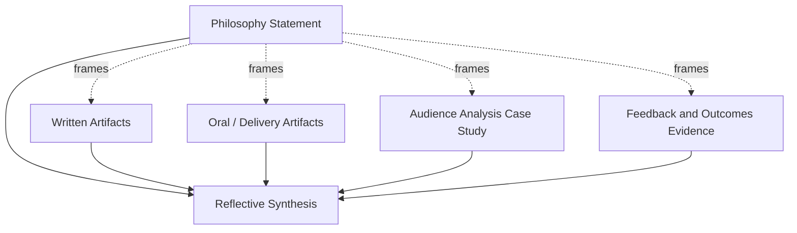

## Assembling a Personal Rhetoric and Communication Portfolio

### Purpose and Function

A rhetoric and communication portfolio is a curated, evidence-based collection of artifacts that demonstrates competency across the core domains of persuasive and executive communication: argumentation, audience adaptation, delivery, written composition, and strategic message design. Unlike a resume, which asserts claims about ability, a portfolio provides direct evidence of ability through work samples, reflective analysis, and documented outcomes.

**Key Points**

- Functions as a credibility artifact for job applications, promotions, speaking engagements, consulting pitches, and academic admission
- Shifts evaluation from self-report ("I am a strong communicator") to demonstration (annotated speech transcripts, video, writing samples)
- Forces the portfolio-builder to articulate their own rhetorical theory of practice — why they made the choices they made
- Serves a dual audience: external evaluators (hiring committees, clients) and the builder's own ongoing self-assessment

### Structural Components

A complete portfolio is typically organized into six functional sections. Each maps to a distinct rhetorical competency and should contain both an artifact and a short reflective commentary.

#### 1. Philosophy Statement

A one- to two-page statement articulating the builder's approach to communication. This is the portfolio's thesis — it should reference specific rhetorical frameworks (e.g., Aristotle's three appeals, Toulmin's model of argument, Cialdini's principles of influence) and explain how the builder applies them.

**Example**

> "I treat every executive briefing as an exercise in inverted-pyramid argumentation: the recommendation precedes the reasoning, because senior audiences allocate attention in inverse proportion to their seniority. My use of ethos is deliberately restrained — I front-load credibility signals (data provenance, prior outcomes) rather than personal authority claims, because [Inference] audiences in technical organizations tend to discount self-asserted expertise relative to demonstrated expertise."

#### 2. Written Artifacts

Three to five samples spanning different genres:

- A persuasive memo or business case (demonstrates the Toulmin claim–data–warrant structure under space constraints)
- An executive summary of a longer report (demonstrates compression and audience triage)
- A crisis or difficult-message communication (demonstrates tone calibration and face-saving strategy)
- A long-form analytical or opinion piece (demonstrates sustained argument construction)

#### 3. Oral/Delivery Artifacts

Video or audio recordings, ideally with a transcript, covering:

- A prepared formal presentation (e.g., a pitch, keynote excerpt, or briefing)
- An extemporaneous or Q&A segment (demonstrates real-time argument adaptation)
- If available, a recording with visible audience reaction or feedback (demonstrates responsiveness)

Each recording should be accompanied by a **rhetorical annotation** — a marked-up transcript identifying appeals used, structural devices (anaphora, tricolon, antithesis), and pacing/delivery choices at specific timestamps.

#### 4. Audience Analysis Case Study

A document showing the builder's process for adapting a single message to two or more distinct audiences (e.g., the same product announcement written for engineers vs. investors). This demonstrates the core executive-communication skill of *message invariance with expression variance* — holding the substantive claim constant while varying appeals, vocabulary, and evidence type.

#### 5. Feedback and Outcomes Evidence

Concrete evidence that communication produced a measurable effect:

- 360-degree or peer feedback excerpts
- Before/after examples showing revision based on critique
- Outcome data where available (e.g., "proposal was approved," "open rate increased," "audience comprehension score")

This section is what separates a portfolio from a portfolio-of-good-writing — it ties rhetoric to consequence.

#### 6. Reflective Synthesis

A closing statement (distinct from the opening philosophy) that reviews the portfolio as a whole, identifies a specific weakness or growth edge, and states a concrete developmental plan.

### Portfolio Architecture Diagram

### Curation Principles

**Key Points**

- **Selectivity over exhaustiveness**: five strong artifacts outperform fifteen mediocre ones; evaluators read portfolios in minutes, not hours
- **Genre range over genre depth**: a reviewer should see the builder handle a memo, a speech, and a crisis message — not three variations of the same genre
- **Annotate, don't just display**: an unannotated writing sample shows output; an annotated one shows *reasoning*, which is what distinguishes rhetorical competence from mere fluency
- **Recency weighting**: artifacts should skew toward the last 12–24 months unless an older piece demonstrates a milestone (first major keynote, first published op-ed)
- **Consistency of framing**: use the same analytical vocabulary (e.g., always referring to ethos/pathos/logos, or always referring to Toulmin's terms) across annotations so the portfolio reads as a coherent system rather than disconnected samples

### Rhetorical Self-Annotation Method

When annotating a sample, apply a structured tagging pass rather than free-form commentary. A practical schema:

| Tag | What It Marks | Example |
| --- | --- | --- |
| `[ETHOS]` | Credibility-building move | Citing prior track record before the ask |
| `[PATHOS]` | Emotional/values appeal | Framing a layoff memo around continuity of mission |
| `[LOGOS]` | Evidence/logic move | Citing a data comparison to support a claim |
| `[STRUCT]` | Structural device | Use of the rule of three, inverted pyramid, antithesis |
| `[ADAPT]` | Audience-adaptation choice | Simplifying technical jargon for a board audience |
| `[RISK]` | A deliberately taken rhetorical risk | Opening with a concession to a counterargument |

Applying this schema consistently across the portfolio creates a searchable, comparable index of technique — useful both for the evaluator and for the builder's own longitudinal tracking of skill development.

### Executive Communication Considerations

For portfolios aimed specifically at executive or leadership contexts, additional emphasis should be placed on:

- **Brevity under authority**: samples demonstrating the ability to be persuasive in fewer words as audience seniority increases
- **Bad-news delivery**: at least one artifact demonstrating direct, respectful delivery of unwelcome information (a hallmark executive skill often absent from academic portfolios)
- **Cross-functional translation**: evidence of translating specialist content (financial, legal, technical) into decision-ready language for non-specialist stakeholders
- **Composure under scrutiny**: a Q&A or objection-handling clip showing the ability to maintain message discipline while conceding valid points — this is frequently the single most persuasive artifact to executive evaluators, since it cannot be rehearsed away

### Common Failure Modes

**Key Points**

- **Volume over curation**: including every writing sample ever produced signals poor self-editing, which undermines the portfolio's own rhetorical credibility
- **No reflection, only artifacts**: a portfolio that is purely a folder of documents fails to demonstrate metacognitive command of rhetorical theory
- **Uniform genre**: five persuasive essays does not demonstrate range; evaluators are typically assessing adaptability, not raw writing quality
- **Stale artifacts**: samples from early student work presented without context read as outdated rather than foundational
- **Missing outcomes**: rhetoric without evidence of effect reads as craft for its own sake rather than applied communication skill

### Assembly Workflow

```mermaid
flowchart LR
    A[Inventory existing work] --> B[Map artifacts to competency categories]
    B --> C[Identify gaps]
    C --> D[Produce new artifacts to fill gaps]
    D --> E[Annotate each artifact]
    E --> F[Draft philosophy statement]
    F --> G[Draft reflective synthesis]
    G --> H[Assemble in final medium: PDF, site, or deck]
    H --> I[Pilot with 2-3 trusted reviewers]
    I --> J[Revise based on feedback]
```

### Delivery Medium Options

| Medium | Strengths | Trade-offs |
| --- | --- | --- |
| PDF document | Portable, printable, controlled layout | No embedded video; static |
| Personal website | Supports embedded audio/video, hyperlinked navigation | Requires maintenance; hosting dependency |
| Slide deck (e.g., PowerPoint/Keynote export) | Familiar executive-review format, good for in-person walkthroughs | Less suited for asynchronous deep review |
| Hybrid (site with downloadable PDF) | Covers both async and live-review use cases | Higher setup effort |

The choice of medium is itself a rhetorical decision: [Inference] a portfolio submitted to a design- or media-adjacent role likely benefits from a website format that demonstrates production competence, whereas a portfolio for a policy or legal-adjacent role may be better served by a clean, conservative PDF that signals restraint.

**Next Steps**

- Draft the philosophy statement first — it clarifies selection criteria for every subsequent artifact
- Conduct an inventory audit of all existing writing, recordings, and feedback to identify what already exists vs. what must be newly produced
- Build the annotation schema and apply it retroactively to existing artifacts before producing new ones
- Pilot the assembled portfolio with two or three reviewers from different professional contexts (a peer, a senior mentor, and someone outside the field) to test clarity and impact
- Establish a recurring review cadence (e.g., every six months) to refresh artifacts and retire outdated ones
- Explore related capstone topics: **Rhetorical Self-Audit and Skills Gap Analysis**, **Constructing a Signature Executive Narrative**, **Video Self-Critique Methodology for Public Speaking**, **Building a Feedback Loop for Continuous Rhetorical Improvement**