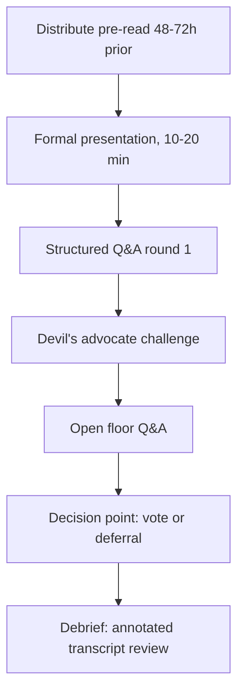
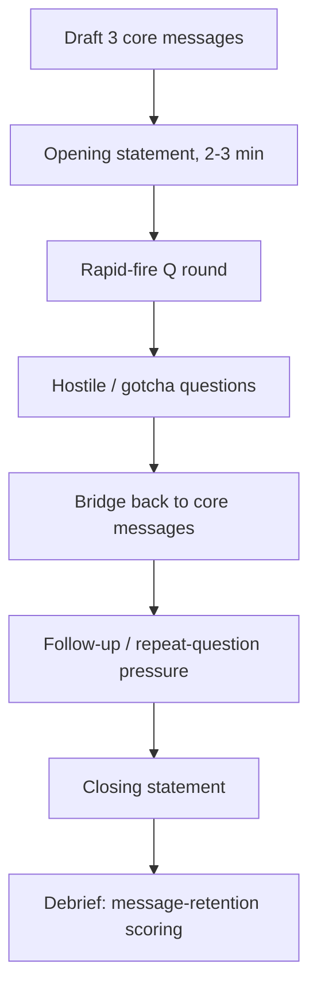

## High-Stakes Simulations: Board Meetings and Press Conferences

### Purpose and Function

High-stakes communication simulations are structured rehearsal environments that replicate the adversarial pressure, time constraints, and scrutiny of executive-level communication events. Unlike standard presentation practice, simulations deliberately introduce hostility, ambiguity, and time pressure to train responses that hold up under conditions ordinary rehearsal cannot replicate.

**Key Points**

- Targets the gap between *prepared content competence* and *live composure under adversarial pressure*
- Trains pattern-recognition for question types (hostile, leading, hypothetical, multi-part) so responses become semi-automatic rather than freshly constructed under stress
- Builds institutional muscle memory for message discipline — the ability to return to a core message despite deflection attempts or repeated pressure
- Produces reviewable artifacts (recordings, transcripts) that feed directly into a communication portfolio's delivery-artifact section

### Board Meeting Simulation

#### Structural Elements

A board simulation replicates the dynamics of reporting to a body with fiduciary oversight, asymmetric information, and the authority to reject a proposal outright.

| Element | Function |
| --- | --- |
| Pre-read materials | Tests whether presenter's live remarks reward or merely repeat the pre-read (redundant repetition signals poor audience calibration) |
| Formal presentation segment | Tests structured argumentation under a time cap, typically 10-20 minutes |
| Open Q&A | Tests real-time defense of assumptions, numbers, and recommendations |
| Devil's advocate role | A designated participant whose sole function is to attack the weakest point in the proposal |
| Silence/skeptic role | A participant who says little but whose body language and occasional pointed question tests the presenter's ability to read an unreadable audience member |
| Vote or decision point | Forces closure — an unresolved simulation teaches nothing about how the presenter handles an actual outcome |

#### Common Board Question Archetypes

**Key Points**

- **The "why not" question**: "Why didn't you consider [alternative]?" — tests whether the presenter did due diligence or is defensive about scope
- **The numbers-pressure question**: repeated drilling into a single assumption to test whether the presenter's confidence is grounded or performative
- **The risk-inversion question**: "What happens if this fails?" — tests whether the presenter has a genuine contingency plan or only a success narrative
- **The scope-creep question**: an attempt to expand the proposal's ask mid-meeting, testing whether the presenter holds boundaries
- **The silent stare**: no question at all — deliberate silence after an answer, testing whether the presenter fills silence with unforced concessions

#### Board Simulation Flow

### Press Conference Simulation

#### Structural Elements

A press conference simulation replicates public-facing scrutiny where the audience is not the questioner but the broader public consuming the exchange secondhand. This changes the rhetorical calculus: the presenter is answering the journalist but persuading the audience.

| Element | Function |
| --- | --- |
| Opening statement | Tests ability to set frame and pre-empt obvious questions before reactive mode begins |
| Rapid-fire question round | Tests composure and message consistency under volume and pace pressure |
| Hostile/gotcha questions | Tests the bridging technique and refusal to be baited into an unintended soundbite |
| Follow-up/repeat questions | Tests whether the presenter holds the line on a message or drifts under repetition |
| Off-topic/personal questions | Tests boundary-setting without appearing evasive |

#### Core Techniques for Press Contexts

**Bridging**

A technique for redirecting from an unwanted question to the intended message without appearing to dodge. Structure:

$$\text{Acknowledge} \rightarrow \text{Bridge phrase} \rightarrow \text{Intended message}$$

**Example**

> Question: "Isn't this layoff a sign the company is failing?"
>
> Response: "I understand why that's the question on people's minds. What I can tell you is that this decision reflects a deliberate shift in resource allocation toward [specific initiative], and here's the data behind that."

**Flagging**

Explicitly signaling the key message before or after delivering it, so it survives editing into a short clip: "The most important thing to understand here is..." — [Inference] this technique is widely taught in media training programs because broadcast and online editors tend to preserve explicitly flagged statements over embedded ones, though actual editorial selection varies by outlet and cannot be guaranteed.

**The Three-Message Rule**

Limiting the entire session to three core messages, repeated in varied phrasing across different questions, rather than generating new content per question. This is a standard technique in crisis communications and political press training.

#### Press Conference Simulation Flow

### Comparative Analysis: Board vs. Press Simulation

| Dimension | Board Meeting | Press Conference |
| --- | --- | --- |
| Primary audience | Present decision-makers | Absent public, via media intermediary |
| Information asymmetry | Audience often has pre-read; deep domain knowledge | Audience/journalist may have partial or adversarial information |
| Success metric | Decision obtained (approval, resource commitment) | Message survival (accurate, on-message coverage) |
| Dominant risk | Being out-argued on substance | Being misquoted or baited into a damaging soundbite |
| Silence handling | Silence often signals skepticism to probe | Silence is rare; pace pressure is the dominant stressor |
| Time structure | Extended, can be renegotiated | Fixed, external control (journalist sets pace) |

### Designing the Simulation

**Key Points**

- **Role brief the adversarial participants** in writing — vague instructions like "be tough" produce inconsistent pressure; specific personas ("skeptical CFO focused on downside risk," "journalist looking for a controversy angle") produce reproducible training conditions
- **Cap and disclose the time limit** in advance to replicate real constraint without making the simulation unfair as a training tool
- **Record every simulation** — self-perception of performance under stress is notoriously unreliable; video review closes the gap between felt performance and observed performance
- **Debrief using a structured rubric**, not general impressions, to keep feedback actionable (see rubric below)
- **Escalate difficulty across repetitions** — first pass with cooperative questioners, later passes with adversarial roles, so skill-building is scaffolded rather than immediately overwhelming

### Debrief Rubric

| Criterion | Weak Signal | Strong Signal |
| --- | --- | --- |
| Message consistency | Core message changes across answers | Same 2-3 messages recur in varied phrasing |
| Composure | Voice pitch rises, filler words increase under pressure | Steady pace and tone maintained |
| Concession handling | Over-concedes or flatly denies valid criticism | Concedes accurately, then redirects |
| Silence tolerance | Fills silence with unforced additional claims | Comfortable pausing before answering |
| Data command | Cannot answer follow-up numeric drilling | Cites specific figures confidently or names a follow-up path |
| Boundary setting | Answers questions outside scope/mandate | Declines cleanly without appearing evasive |

### Annotated Transcript Example

**Example**

> **Q (hostile):** "You're telling us to trust these projections when last year's forecast missed by 20%."
>
> **A [ETHOS/logos]:** "That's a fair comparison to raise. [CONCEDE] Last year's model underweighted the supply disruption — [DATA] we've since added a volatility band to this year's projection specifically to account for that kind of miss. [BRIDGE] The core recommendation doesn't depend on hitting the point estimate; it depends on the range holding, and the range has a wider confidence interval built in for exactly this reason."

This response sequence — concede, cite corrective action, bridge to a resilience argument — is a standard pattern for handling track-record attacks in both board and press contexts.

### Facilitator Considerations

[Inference] Organizations that run these simulations most effectively typically use a neutral third-party facilitator rather than a direct manager, since direct reporting relationships can suppress the intensity of adversarial questioning needed for realistic pressure — though this varies by organizational culture and is not universally necessary.

**Next Steps**

- Draft written persona briefs for at least two adversarial roles (skeptic, hostile journalist) before the first simulation run
- Build a reusable question bank organized by archetype (why-not, numbers-pressure, risk-inversion, gotcha, off-topic)
- Run a baseline simulation, score it against the debrief rubric, then run a second simulation focused only on the lowest-scoring criterion
- Incorporate simulation recordings into the personal communication portfolio's delivery-artifact section with rhetorical annotation
- Explore related capstone topics: **Crisis Communication and Message Discipline Under Pressure**, **The Bridging Technique in Media Training**, **Reading Nonverbal Signals in Adversarial Q&A**, **Constructing a Three-Message Communication Strategy**