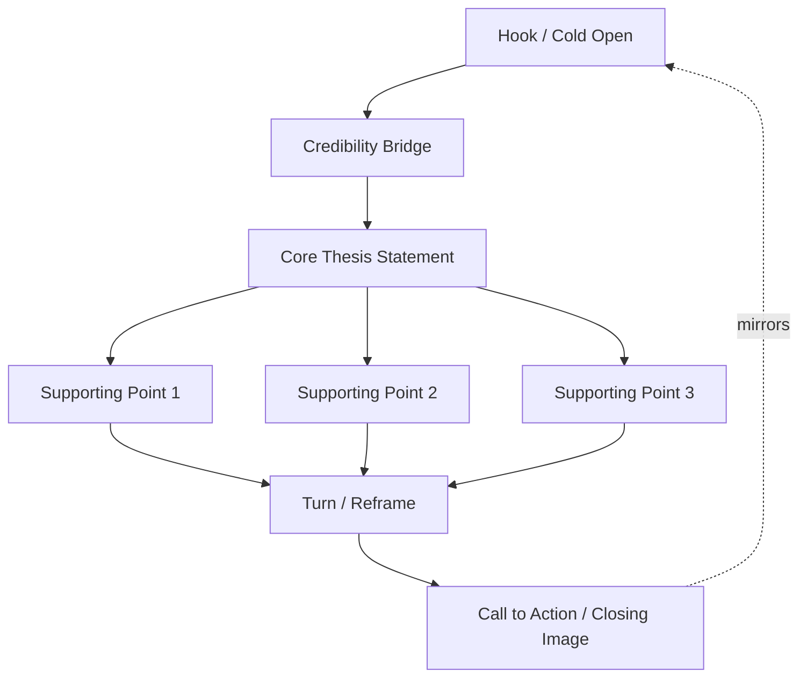
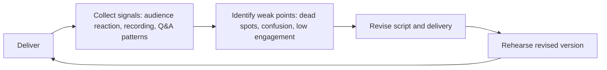

## Delivering and Refining a Signature Speech

### Purpose and Function

A signature speech is a reusable, highly polished piece of rhetoric that represents a speaker's core message, personal narrative, or area of authority — delivered, refined, and re-delivered across multiple contexts over time (e.g., a TEDx-style talk, a recurring keynote, a founder's origin story, a thought-leadership standard). Unlike a one-off presentation, it is treated as a living asset that improves through iterative performance.

**Key Points**

- Distinguishes itself from single-use presentations by being designed for repeated delivery and long-term refinement
- Functions as a personal brand anchor — audiences and referrers begin to associate the speaker with the specific argument or story
- Requires a different drafting process than a one-time briefing: word-level precision matters because the same phrasing will be delivered dozens of times
- Refinement occurs through live performance data, not just desk editing — each delivery generates feedback the next revision incorporates

### Structural Anatomy of a Signature Speech

| Component | Function | Typical Proportion |
| --- | --- | --- |
| Hook/cold open | Captures attention before establishing credibility; often a story, statistic, or provocative claim | 5-10% |
| Personal credibility bridge | Brief, non-resume-style establishment of why the speaker is positioned to make this argument | 5% |
| Core thesis statement | The single sentence the audience should retain | 5% |
| Three-part development | Supporting arguments/stories/evidence, typically structured in threes for memorability | 60-70% |
| Turn/reframe | A moment that recontextualizes the argument, often via a story pivot or a challenge to assumption | 5-10% |
| Call to action / closing image | A memorable closing that mirrors the opening hook | 5-10% |

### Speech Architecture Diagram

### Drafting Process

#### Phase 1: Thesis Isolation

Before drafting prose, isolate the single sentence the speech exists to deliver. If this sentence cannot be stated in under 20 words, the argument is not yet compressed enough for repeated delivery.

**Example**

> Diffuse: "Today I want to talk about how organizations can improve their communication practices in various ways across different departments and functions."
>
> Isolated thesis: "Clarity is a leadership obligation, not a communication style."

#### Phase 2: Story-Argument Mapping

Map each supporting point to a concrete story or data anchor. Abstract claims without anchors are the primary cause of forgettable speeches — audiences retain narrative and imagery far more reliably than propositional claims alone.

#### Phase 3: Oral Drafting

Draft by speaking aloud and transcribing, rather than writing prose first and reading it aloud after. Written prose tends to produce subordinate clauses and passive constructions that are difficult to deliver naturally; oral-first drafting produces sentence rhythms suited to the ear rather than the eye.

#### Phase 4: Line-Level Rhetorical Devices

Incorporate classical devices deliberately at key retention points (opening, thesis, closing):

- **Tricolon** (rule of three): "Clear thinking, clear language, clear action."
- **Anaphora** (repeated opening phrase): "We didn't wait for permission. We didn't wait for consensus. We didn't wait at all."
- **Antithesis** (contrast structure): "Not louder — clearer."
- **Chiasmus** (inverted repetition): "Ask not what your message can do for you, but what you can do for your message." [Inference — illustrative construction, not asserting rhetorical superiority over plain statement in all contexts]

### Delivery Mechanics

**Key Points**

- **Vocal variety**: deliberate variation in pace, pitch, and volume mapped to content — slowing for the thesis statement, quickening for narrative momentum, pausing before the turn
- **Physical staging**: for stage-based delivery, blocking (where the speaker stands/moves) should be mapped to structural transitions, not random movement
- **Strategic pause placement**: pauses before key statements increase perceived importance and give the audience processing time; pauses after key statements let a line land before moving on
- **Eye contact patterning**: for live audiences, systematic scanning (not fixed-point staring or rapid scanning) sustains perceived connection across a room
- **Memorization vs. internalization**: word-perfect memorization risks a mechanical delivery collapse if a line is dropped; internalizing the *structure and key phrases* while allowing minor wording flexibility produces more resilient delivery

### The Refinement Loop

A signature speech improves through a structured cycle of delivery, data collection, and revision — distinct from one-off speech preparation, which ends at delivery.

#### Signal Sources for Revision

| Signal | What It Indicates |
| --- | --- |
| Audience laughter/reaction timing | Whether a planned beat is landing where intended |
| Post-talk questions | Which points were unclear or under-explained |
| Video review of own delivery | Filler words, pacing inconsistency, physical tics |
| Engagement drop points (fidgeting, phone use, if observable) | Sections that run too long or lose thread |
| Repeat-invitation requests | Whether the speech is generating referral value, a proxy for overall effectiveness |

**Example**

> A speaker notices in three consecutive deliveries that the audience's biggest laugh occurs at an unplanned aside rather than the scripted joke. Revision: promote the aside into the scripted version and cut or shorten the original joke, since live data has demonstrated where the audience's actual engagement peak occurs. [Unverified — audience response patterns are context- and audience-dependent and cannot be assumed to generalize identically to a new audience]

### Version Control for a Signature Speech

Because a signature speech is delivered repeatedly and adapted per context (time limits, audience type, venue formality), treating it as a version-controlled asset is standard practice among professional speakers:

- **Master version**: the fullest, most complete version (e.g., 20-25 minutes)
- **Compressed version**: a 5-8 minute cut retaining hook, thesis, one supporting point, and closing — for time-constrained contexts
- **Audience-adapted variants**: versions with substituted examples or vocabulary calibrated to different audience types (technical vs. general, internal vs. public)
- **Changelog**: a running log of what changed between deliveries and why, mirroring the refinement-loop signal that drove each change

### Common Failure Modes

**Key Points**

- **Over-memorization brittleness**: word-for-word memorization without structural internalization causes visible recovery failure when a line is missed
- **Static refinement**: treating the first successful delivery as final, rather than continuing to refine using aggregated multi-delivery data
- **Thesis drift**: allowing the core sentence to change subtly across revisions until the speech loses a single retainable takeaway
- **Story-evidence imbalance**: relying entirely on narrative with no substantiating data, or entirely on data with no narrative anchor — both reduce persuasive durability
- **Ignoring venue constraints**: delivering the master version unedited in a time-constrained slot, resulting in a rushed or truncated closing that undermines the intended final image

### Rehearsal Protocol

| Stage | Focus | Method |
| --- | --- | --- |
| Solo read-through | Content accuracy, thesis clarity | Read aloud, no audience |
| Recorded solo delivery | Pacing, filler words, timing | Record and self-review against rubric |
| Small trusted audience | Story landing, clarity of turn/reframe | 2-3 people, structured feedback |
| Full dress rehearsal | Full delivery under realistic constraints (venue, time cap, no notes) | As close to actual conditions as possible |
| Live delivery | Real audience data collection | Record for post-delivery review |

**Next Steps**

- Isolate and write down the single-sentence thesis before drafting any further content
- Draft the first version orally and transcribe rather than writing prose first
- Deliver to a small trusted audience and collect structured feedback before any public delivery
- Build a version-control log to track changes across deliveries and the signal that prompted each
- Add the strongest recorded delivery, with rhetorical annotation, to the personal communication portfolio's delivery-artifact section
- Explore related capstone topics: **Story-Argument Mapping for Persuasive Speech**, **Classical Rhetorical Devices for Oral Delivery**, **Building a Reusable Thought-Leadership Narrative**, **Video Self-Critique Methodology for Public Speaking**