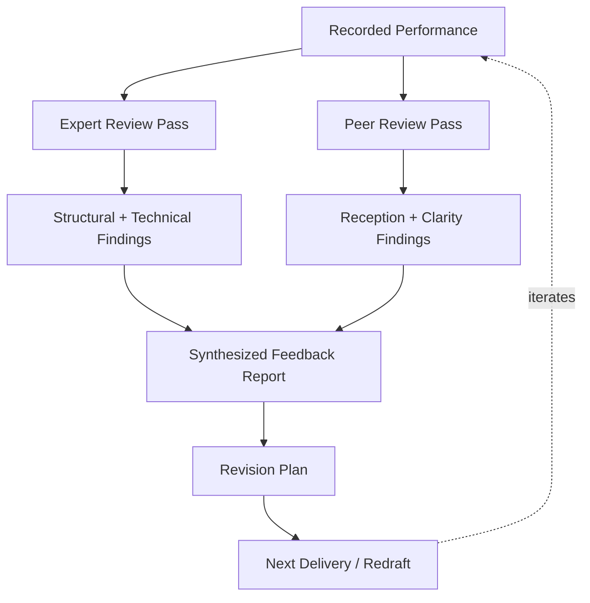
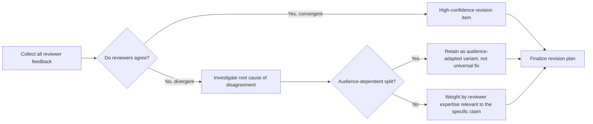

## Expert and Peer Review of Recorded Performances

### Purpose and Function

Expert and peer review of recorded performances is the systematic process of evaluating captured communication artifacts — speeches, briefings, negotiations, interviews — against explicit rhetorical criteria, using structured feedback protocols rather than impressionistic reaction. It is the mechanism that converts a recording from a passive archive into an active driver of skill improvement.

**Key Points**

- Distinguishes itself from informal feedback ("that was good") by using named criteria, timestamped reference, and calibrated reviewer roles
- Serves two distinct functions depending on reviewer type: **expert review** (calibrated against professional/technical standards) and **peer review** (calibrated against audience-level reception and relatability)
- Closes the gap between self-perception and observed performance, which research on skill acquisition consistently identifies as unreliable without external input [Inference — self-assessment accuracy varies by individual and domain and should not be assumed uniformly poor]
- Produces a structured artifact (annotated review) suitable for inclusion in a communication portfolio's feedback-and-outcomes section

### Expert Review vs. Peer Review

| Dimension | Expert Review | Peer Review |
| --- | --- | --- |
| Reviewer background | Domain specialist (rhetoric coach, communications professional, senior executive) | Colleague or audience-representative, similar level to the speaker |
| Primary calibration | Technical correctness against rhetorical/professional standards | Actual audience reception, relatability, clarity |
| Typical focus | Structure, argument validity, strategic framing, delivery mechanics | Comprehension, engagement, emotional resonance |
| Risk if used alone | Feedback may be technically correct but miscalibrated to the real target audience | Feedback may be enthusiastic but lack diagnostic precision |
| Best paired use | Combined, expert review catches structural/technical flaws while peer review validates real-world reception | — |

### Review Architecture

### Structured Review Protocol

A rigorous review process moves through four passes rather than a single holistic viewing, since a single pass tends to produce shallow, recency-biased impressions (the ending disproportionately shapes reaction if only one viewing occurs).

#### Pass 1: Content and Argument Structure

Reviewed with sound off or transcript only, isolating the argument from delivery. Evaluates:

- Whether the thesis is identifiable within the first 60-90 seconds
- Whether supporting points follow a coherent structure (Toulmin's claim-data-warrant, problem-solution, chronological)
- Whether the argument holds if delivery polish is removed — a common diagnostic for over-reliance on charisma to carry weak content

#### Pass 2: Delivery Mechanics

Reviewed with video and audio, evaluating vocal variety, pacing, filler word frequency, physical gesture, and eye contact patterning, timestamped against specific moments.

#### Pass 3: Audience Impact Simulation

Reviewer adopts the perspective of a specific target-audience persona (e.g., a skeptical board member, a first-time customer) and evaluates whether the performance would land as intended for that specific audience — not for the reviewer's own preferences.

#### Pass 4: Comparative Pass

Reviewed against either a prior recording of the same speaker (longitudinal comparison) or an exemplar performance (benchmark comparison), to anchor feedback in relative rather than purely absolute terms.

### Feedback Rubric

| Criterion | 1 (Weak) | 3 (Adequate) | 5 (Strong) |
| --- | --- | --- | --- |
| Thesis clarity | Unclear or absent within first 90 seconds | Identifiable but not memorable | Stated crisply and repeated for retention |
| Structural coherence | Points appear disconnected | Logical order present but transitions weak | Clear signposted structure throughout |
| Evidence quality | Anecdotal or unsupported claims | Mixed evidence, some unsupported | Strong, well-sourced, appropriately cited evidence |
| Delivery composure | Frequent filler words, visible nerves | Occasional lapses, generally controlled | Fully composed, deliberate pacing and pause use |
| Audience calibration | Language/examples mismatched to audience | Generally appropriate, some misses | Precisely tuned vocabulary and appeals for the specific audience |
| Emotional resonance | Flat or overwrought | Present but inconsistent | Well-modulated, appropriately placed |

### Timestamped Annotation Method

Reviews should be delivered as timestamp-referenced notes rather than general summary, to allow direct correlation between feedback and the specific moment in the recording.

**Example**

> `03:12` — Thesis restated here almost verbatim from the opening; consider varying phrasing to avoid sounding rehearsed rather than reinforced.
>
> `07:45` — Strongest moment in the recording: pause before the key statistic gives it noticeable weight.
>
> `11:20` — Filler word cluster ("um," "you know") appears during the transition into the second argument; likely indicates this transition is not yet fully internalized.
>
> `14:05` — Q&A response concedes too much ground before pivoting; the concession undercuts the subsequent claim rather than strengthening it.

### Calibrating Reviewer Selection

**Key Points**

- **Match reviewer expertise to the specific claim being evaluated** — a rhetoric coach can assess structure, but only a subject-matter expert can assess whether technical claims within the speech are accurate and well-supported
- **Include at least one reviewer outside the speaker's own field or organization** to catch jargon, assumed knowledge, or blind spots specific to an internal culture
- **Avoid single-reviewer dependency** — one reviewer's feedback, however expert, reflects one perspective; triangulating across 2-3 reviewers of different types reduces the risk of overfitting to one person's preferences
- **Disclose reviewer role explicitly** (expert vs. peer) so the speaker can weight feedback appropriately rather than treating all input as equivalent

### Common Failure Modes in Review Practice

| Failure Mode | Description | Mitigation |
| --- | --- | --- |
| Recency bias | Feedback dominated by the closing moments alone | Enforce multi-pass review with structured note-taking throughout |
| Halo effect | Strong delivery mechanics cause reviewers to overlook weak argument structure | Separate content-only pass (transcript/audio-off) from delivery pass |
| Excessive politeness | Reviewers soften criticism to avoid discomfort, reducing diagnostic value | Use anonymous or written rubric-based feedback alongside live discussion |
| Single-axis fixation | Reviewer fixates on one flaw (e.g., filler words) at the expense of structural issues | Require rubric coverage across all criteria, not free-form commentary alone |
| No comparative anchor | Feedback given in isolation without reference to prior performance or benchmark | Always include a comparative pass against prior recordings or exemplars |

### Synthesizing Multi-Reviewer Feedback

When feedback arrives from multiple reviewers, conflicting input is common and should be triaged rather than averaged uncritically.

**Example**

> An expert reviewer flags a data point as under-explained; a peer reviewer found the same section clear. Rather than treating this as contradictory, the speaker recognizes the split reflects differing baseline knowledge — the expert wanted more rigor, the peer had enough context already. Resolution: retain the current explanation for peer-level audiences but prepare an expanded version for expert-audience deliveries.

### Building a Review Archive

To make review data cumulative rather than disposable, structure archived reviews so longitudinal comparison is possible:

- Store recordings, transcripts, and rubric scores together per delivery
- Track rubric scores over time to visualize improvement trends across specific criteria
- Maintain a running "known issues" list (e.g., persistent filler word patterns, recurring structural weakness) to check whether repeated feedback is actually being resolved across iterations
- Feed the strongest reviewed-and-revised performance, along with its annotated review, into the personal communication portfolio's feedback-and-outcomes section

**Next Steps**

- Select at least one expert reviewer and one peer reviewer for the next recorded performance
- Build or adopt a rubric (using the structure above) before the review session, rather than relying on unstructured discussion
- Conduct the four-pass review protocol (content-only, delivery, audience-simulation, comparative) on the most recent recording
- Establish a review archive to track rubric scores across deliveries over time
- Explore related capstone topics: **Building a Longitudinal Skill-Tracking Rubric**, **Triangulating Conflicting Feedback Sources**, **Video Self-Critique Methodology for Public Speaking**, **Constructing Audience Personas for Rehearsal and Review**