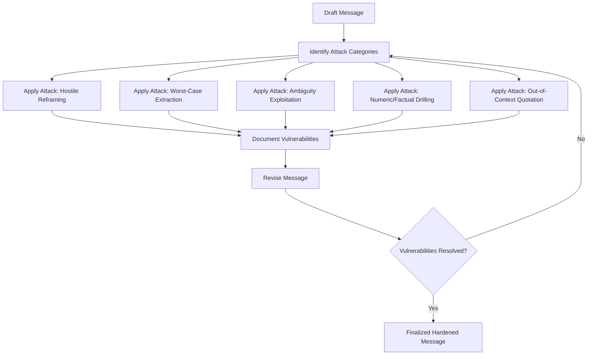

## Stress-Testing Messages Under Simulated Pressure

### Purpose and Function

Stress-testing a message is the deliberate practice of subjecting a draft communication (a statement, memo, speech, or key message) to adversarial conditions before its real deployment, in order to surface weaknesses invisible under calm, cooperative review. It is distinct from ordinary editing: editing improves a message on its own terms, while stress-testing attacks the message to find where it fails under hostile interpretation, incomplete information, or rapid-fire challenge.

**Key Points**

- Targets failure modes that only emerge under adversarial or time-pressured conditions, not under calm read-throughs
- Treats the message as a system to be attacked, with named attack categories, rather than a document to be proofread
- Produces a revised, hardened version plus a documented list of vulnerabilities and their fixes
- Complements (but does not replace) live simulations such as board or press rehearsals — stress-testing can be applied to a message in isolation, before a full simulation is staged

### The Core Distinction: Editing vs. Stress-Testing

| Dimension | Editing | Stress-Testing |
| --- | --- | --- |
| Goal | Improve clarity, structure, tone | Find where the message breaks under attack |
| Method | Read-through, revision | Adversarial questioning, worst-case framing, misquotation attempts |
| Reviewer posture | Supportive, constructive | Deliberately hostile or skeptical |
| Output | Polished draft | Polished draft + documented vulnerability list |
| Typical timing | Throughout drafting | After a draft is substantially complete, before delivery |

### Stress-Testing Framework

### Attack Categories

#### 1. Hostile Reframing

A reviewer restates the message's core claim in the least charitable possible terms, testing whether the framing survives an uncharitable read.

**Example**

> Original: "We're restructuring the team to focus on our highest-impact priorities."
>
> Hostile reframe: "So you're saying this is a layoff dressed up in strategy language."
>
> Diagnostic value: reveals whether the euphemism will be perceived as evasive; forces a decision between more direct language or a stronger justification for the chosen framing.

#### 2. Worst-Case Extraction

The reviewer searches the message for the single phrase most likely to be extracted and used against the speaker if taken out of context (a "gotcha soundbite" test), since real audiences — journalists, opposing counsel, hostile stakeholders — perform this same extraction.

#### 3. Ambiguity Exploitation

The reviewer identifies any phrase with more than one plausible reading and adopts the least favorable interpretation, testing whether the message's precision holds under deliberately uncharitable parsing.

**Example**

> Original: "We take these concerns seriously and will review our practices."
>
> Ambiguity exploited: "Review" commits to no specific action or timeline; a skeptical audience will read this as a placeholder for inaction.

#### 4. Numeric and Factual Drilling

Repeated, granular questioning of any specific number, date, or factual claim in the message, testing whether the underlying support is solid enough to survive follow-up (this mirrors the numbers-pressure question archetype used in board simulations).

#### 5. Out-of-Context Quotation

The reviewer extracts a single sentence from the middle of the message, strips surrounding context, and evaluates how damaging or confusing it appears in isolation — testing resilience to selective quotation.

#### 6. Silence and Non-Response Testing

The reviewer withholds reaction after the message is delivered, testing whether the speaker fills the silence with unforced additional claims that were not part of the intended message (a common self-sabotage pattern under pressure).

### Vulnerability Documentation Template

| Attack Applied | Vulnerability Found | Severity | Proposed Fix |
| --- | --- | --- | --- |
| Hostile reframing | Euphemism ("restructuring") invites a harsher counter-framing | High | Either use more direct language or add explicit justification for scope/scale |
| Worst-case extraction | Phrase "acceptable losses" isolates as callous | High | Replace with specific, human-centered language |
| Ambiguity exploitation | "Review our practices" has no committed action | Medium | Add a specific next step and timeframe |
| Numeric drilling | Growth figure cited without source attribution | Medium | Add source citation or caveat on methodology |
| Out-of-context quotation | Mid-message sentence reads as an admission when isolated | Low | Reorder so the qualifying context precedes the vulnerable sentence |

### Severity Triage

$$\text{Severity} = f(\text{Likelihood of extraction} \times \text{Reputational/relational cost if extracted})$$

**Key Points**

- **High severity**: vulnerabilities likely to be found by any hostile reader and costly if surfaced — these must be fixed before delivery
- **Medium severity**: vulnerabilities requiring a motivated or expert adversary to find — worth fixing but not always blocking
- **Low severity**: theoretically exploitable but low likelihood or low cost if surfaced — track but may not require immediate revision
- Triage prevents over-editing a message into blandness by fixing only what a specific, plausible adversary would plausibly find and use

### Structured Stress-Test Protocol

#### Adversary Persona Design

Effective stress-testing requires specific, briefed adversary roles rather than generic "be critical" instructions — vague instructions produce inconsistent, low-value pressure.

| Persona | Attack Focus |
| --- | --- |
| The skeptical journalist | Worst-case extraction, out-of-context quotation |
| The hostile stakeholder | Hostile reframing, emotional escalation |
| The detail-obsessed analyst | Numeric/factual drilling, internal consistency |
| The literalist | Ambiguity exploitation, precise wording gaps |
| The silent evaluator | Silence testing, unforced-error detection |

### Applying Stress-Testing to Different Message Types

| Message Type | Priority Attack Categories | Rationale |
| --- | --- | --- |
| Crisis/apology statement | Hostile reframing, worst-case extraction | High extraction risk; every phrase is scrutinized publicly |
| Internal restructuring announcement | Ambiguity exploitation, hostile reframing | Employees parse euphemism carefully; trust is at stake |
| Investor/board update | Numeric drilling, ambiguity exploitation | Fiduciary audience will challenge every figure and commitment |
| Product launch messaging | Worst-case extraction, out-of-context quotation | Media and competitors will mine for a negative angle |
| Legal/compliance-adjacent statement | Numeric drilling, ambiguity exploitation | Precision has direct legal consequence |

### Revision Patterns That Emerge from Stress-Testing

**Key Points**

- **Euphemism replacement**: vague, softened language is frequently the top source of hostile-reframing vulnerability; direct language paired with clear justification often survives better than euphemism
- **Front-loaded qualification**: moving caveats and context before the vulnerable claim, rather than after, reduces damage from out-of-context extraction
- **Commitment specificity**: replacing vague action language ("we will review") with a specific action and timeframe closes ambiguity-exploitation vulnerabilities
- **Source attribution**: adding explicit sourcing to every cited figure closes numeric-drilling vulnerabilities before they are raised
- **Planned silence tolerance**: rehearsing comfortable pauses after delivery reduces the risk of unforced elaboration during real silence pressure

### Common Failure Modes

| Failure Mode | Description | Mitigation |
| --- | --- | --- |
| Testing too late | Stress-testing only after the message is fully locked, leaving no time to revise | Build stress-testing into the drafting timeline as a mandatory gate, not an afterthought |
| Over-fixing low-severity issues | Sanding every possible edge case produces bland, overly hedged language | Apply the severity triage; fix high severity, track but don't over-correct low severity |
| Homogeneous adversary panel | All reviewers share the same background and miss the same blind spots | Recruit adversaries from varied roles (legal, comms, an outside-field peer) |
| No re-test after revision | Assuming a single revision pass resolves all vulnerabilities without re-attack | Re-run the specific attack category against the revised section before finalizing |
| Confusing stress-testing with sign-off | Treating "it survived the stress test" as a guarantee of real-world reception | [Inference] a stress test reduces but does not eliminate risk, since real adversaries and audiences may raise attack vectors the simulation did not anticipate |

**Next Steps**

- Draft the message to a substantially complete state before beginning stress-testing, rather than testing early fragments
- Assign at least three distinct adversary personas relevant to the message's actual likely audience
- Run the full attack sequence (hostile reframing, worst-case extraction, ambiguity exploitation, numeric drilling, out-of-context quotation, silence testing) and document findings using the vulnerability template
- Triage findings by severity before revising, to avoid over-hedging the message into blandness
- Re-test only the revised sections rather than assuming the full message is now resistant to all attack categories
- Explore related capstone topics: **Crisis Communication and Message Discipline Under Pressure**, **The Bridging Technique in Media Training**, **Constructing a Three-Message Communication Strategy**, **High-Stakes Simulations: Board Meetings and Press Conferences**