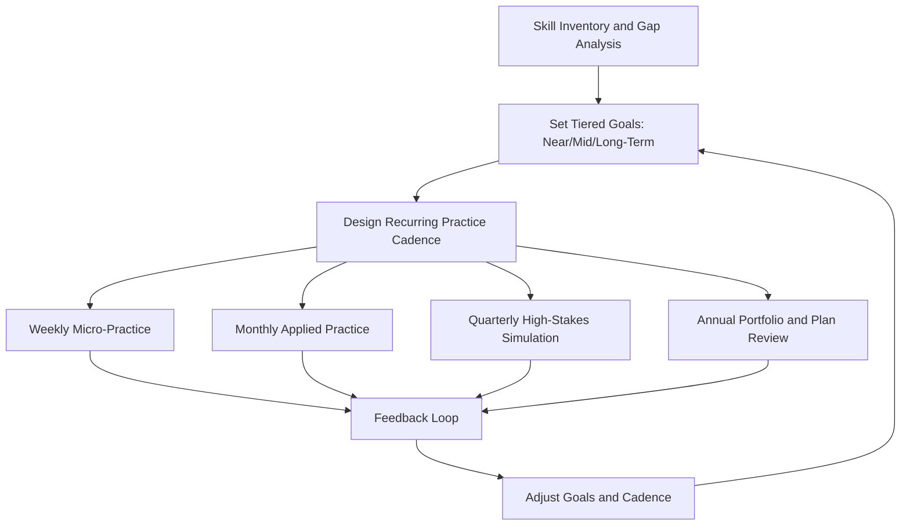
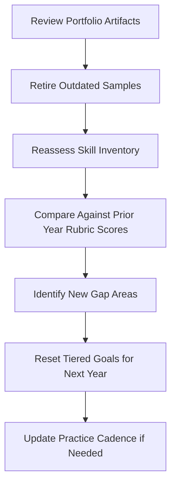

## Designing a Lifelong Practice and Mastery Plan

### Purpose and Function

A lifelong practice and mastery plan is a structured, self-directed system for maintaining and advancing rhetorical and executive communication skill after formal instruction ends. Communication competence, unlike a one-time credential, decays without deliberate maintenance and plateaus without deliberate escalation — a mastery plan formalizes the ongoing inputs (practice, feedback, exposure) required to keep improving indefinitely rather than settling at a competent-but-static level.

**Key Points**

- Addresses the "competent plateau" problem: most communicators reach an adequate level through normal work experience and then stop improving because normal work rarely forces further stretch
- Converts rhetorical development from an event-driven activity (preparing for a specific speech) into a maintained practice (ongoing skill-building independent of any single upcoming event)
- Integrates the other capstone components — portfolio, simulations, signature speech, peer review, stress-testing — into a recurring cycle rather than one-time capstone exercises
- Requires explicit design because, unlike physical skills with obvious feedback (a missed shot, a dropped weight), communication skill decay is often invisible without deliberate measurement

### The Deliberate Practice Framework Applied to Rhetoric

Deliberate practice, as a construct, is distinguished from mere repetition by four features: specific goals, immediate feedback, a challenge level slightly beyond current ability, and focused repetition on discrete sub-skills rather than only whole-performance rehearsal.

| Deliberate Practice Feature | Application to Rhetoric |
| --- | --- |
| Specific goals | "Reduce filler words in Q&A responses" rather than "get better at speaking" |
| Immediate feedback | Recorded self-review or live coach feedback within the same session |
| Stretch challenge | Practicing under a harder condition than typically encountered (shorter time limit, more hostile questioner) |
| Sub-skill isolation | Drilling a single component (bridging technique, pause placement) rather than always rehearsing full speeches |

### Mastery Plan Architecture

### Phase 1: Skill Inventory and Gap Analysis

Before designing a practice cadence, conduct an honest audit across core rhetorical competencies, using external feedback (from the peer/expert review process) rather than self-assessment alone, since self-assessment of communication skill is [Inference] frequently miscalibrated relative to observed performance, particularly in areas of unconscious habit such as filler words or pacing.

| Competency Domain | Assessment Method |
| --- | --- |
| Argument construction | Review written artifacts against Toulmin/structural criteria |
| Delivery mechanics | Review recorded performances against a delivery rubric |
| Adversarial composure | Score performance in simulated board/press pressure conditions |
| Audience adaptation | Compare the same message across two audience-adapted variants for quality gap |
| Written concision | Compare draft-to-final ratio and editor/reviewer cut rates |

### Phase 2: Tiered Goal-Setting

**Key Points**

- **Near-term goals (weeks)**: address a single, narrowly defined weakness identified in the gap analysis (e.g., eliminate a specific filler word pattern)
- **Mid-term goals (months)**: build or refine a reusable asset (a signature speech, a hardened crisis-statement template, an expanded portfolio section)
- **Long-term goals (years)**: develop a recognized domain of communication authority (e.g., becoming the go-to internal voice for a specific type of message, or an external speaking reputation in a subject area)
- Goals at each tier should be explicitly linked — near-term goals should visibly ladder up into mid-term assets, which ladder into the long-term positioning goal

### Phase 3: Recurring Practice Cadence

A sustainable plan distributes different practice types across different time horizons, since high-intensity simulation (board/press-style pressure testing) is not sustainable weekly, while micro-drills on sub-skills are low-cost enough to sustain indefinitely.

| Cadence | Activity Type | Example |
| --- | --- | --- |
| Weekly | Micro-practice on an isolated sub-skill | 10-minute recorded drill on pause placement or bridging phrases |
| Monthly | Applied practice in a real or near-real context | Volunteer to lead a meeting, give an internal update, or write a persuasive memo with self-review |
| Quarterly | High-stakes simulation | Full board-meeting or press-conference style simulation with adversarial roles |
| Annually | Portfolio and plan review | Refresh portfolio artifacts, reassess skill inventory, reset tiered goals |

### Practice Cadence Timeline

### Feedback Loop Design

A mastery plan is only as effective as its feedback mechanism; without external calibration, self-directed practice risks reinforcing existing habits rather than correcting them.

**Key Points**

- **Maintain a standing reviewer relationship** (a mentor, coach, or peer group) rather than seeking ad hoc feedback only before major events
- **Track quantifiable proxies** where possible — filler-word counts per minute, Q&A response length, audience question-to-comprehension ratio — to make improvement visible over time rather than relying on impression alone
- **Revisit the annotated review archive** (from the expert/peer review process) periodically to check whether previously identified issues have actually resolved or merely gone unaddressed
- **Seek escalating difficulty** in feedback sources over time — early feedback from supportive peers, later feedback from more senior or more critical reviewers, mirroring the escalating-difficulty principle used in simulation design

### Skill Decay and Maintenance

[Inference] Communication skills that are not regularly exercised under realistic pressure — particularly composure under hostile questioning and extemporaneous argument construction — tend to atrophy faster than prepared-content skills, since prepared content can be rehearsed offline while adversarial composure specifically requires live-pressure conditions to maintain. This is a primary justification for the quarterly high-stakes simulation cadence rather than relying on infrequent real-world high-stakes events alone, which may occur too rarely to maintain sharpness.

### Long-Term Positioning Strategy

Beyond skill maintenance, a mastery plan typically incorporates a deliberate positioning goal — the specific domain or context in which the communicator intends to be recognized as authoritative.

| Positioning Element | Design Question |
| --- | --- |
| Subject domain | What specific topic or function should this person become known for communicating about? |
| Format | Will authority be built through writing, speaking, or both? |
| Venue | Internal (organizational reputation) or external (industry, public) recognition? |
| Signature asset | Which recurring artifact (a talk, a newsletter, a briefing style) will carry this positioning forward? |
| Review cycle | How will the signature asset be refined over time using the refinement-loop method? |

### Annual Review Protocol

### Common Failure Modes

| Failure Mode | Description | Mitigation |
| --- | --- | --- |
| Event-only practice | Only practicing communication skills when a specific high-stakes event looms | Maintain the weekly/monthly cadence independent of upcoming events |
| Feedback stagnation | Relying on the same one or two reviewers indefinitely | Periodically rotate in new or more senior reviewers as skill develops |
| Vague goals | Goals framed as general improvement rather than specific, measurable sub-skills | Use the tiered goal structure with explicit, narrow near-term targets |
| No portfolio refresh | Allowing portfolio artifacts to become stale while skill has advanced | Enforce the annual review protocol as a non-negotiable checkpoint |
| Neglecting adversarial maintenance | Practicing only prepared content, never pressure conditions | Maintain the quarterly high-stakes simulation regardless of real-world event frequency |

**Next Steps**

- Conduct an initial skill inventory using external feedback rather than self-assessment alone
- Set one near-term, one mid-term, and one long-term goal, explicitly linked to each other
- Establish the four-tier practice cadence (weekly, monthly, quarterly, annual) and calendar the first quarterly simulation
- Identify a standing reviewer or small reviewer group willing to provide recurring feedback over time
- Schedule the first annual portfolio and plan review date at the outset, rather than leaving it undefined
- Explore related capstone topics: **Deliberate Practice Principles Applied to Communication Skill**, **Building a Longitudinal Skill-Tracking Rubric**, **Constructing a Signature Executive Narrative**, **Assembling a Personal Rhetoric and Communication Portfolio**