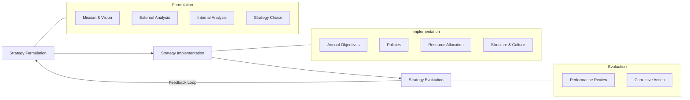
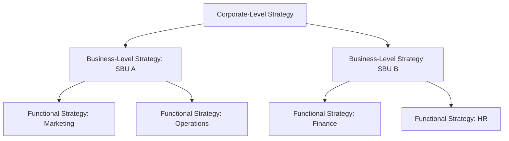

## Definition and Scope of Strategic Management

### Definition

**Strategic Management** is the ongoing process of formulating, implementing, and evaluating cross-functional decisions that enable an organization to achieve its long-term objectives and sustain competitive advantage.

It integrates the functional areas of a business (marketing, finance, operations, human resources, R&D) into a coordinated set of actions aimed at fitting the organization to its external environment while leveraging its internal capabilities.

Commonly cited formal definitions include:

- **Fred R. David**: Strategic management is *"the art and science of formulating, implementing, and evaluating cross-functional decisions that enable an organization to achieve its objectives."*
- **Alfred Chandler**: Strategy is *"the determination of the long-run goals and objectives of an enterprise, and the adoption of courses of action and the allocation of resources necessary for carrying out these goals."*
- **Michael Porter**: Strategy is about *"deliberately choosing a different set of activities to deliver a unique mix of value"* — competitive positioning rather than operational effectiveness alone.

**Key Points**

- Strategic management is a **process**, not a one-time event — it is continuous and iterative.
- It is **cross-functional**, requiring integration across departments rather than siloed decision-making.
- It concerns **long-term direction**, distinguishing it from short-term operational management.
- It involves both **analysis** (understanding environment and capability) and **action** (implementation and control).

---

### Nature of Strategic Management

Strategic management exhibits several defining characteristics:

1. **Future-oriented** — deals with anticipated conditions over a multi-year horizon (typically 3–5+ years).
2. **Organization-wide impact** — decisions affect the entire enterprise, not a single unit.
3. **Resource-intensive** — commits significant capital, human, and time resources.
4. **Top-management driven** — primarily the responsibility of the board and C-suite, though input flows from all levels.
5. **Environment-dependent** — shaped by external forces (economic, technological, regulatory, competitive) that are only partially controllable.
6. **Multidimensional** — blends economic, behavioral, and analytical considerations.

---

### The Three Core Processes

Strategic management is typically modeled as three interrelated stages.

#### 1. Strategy Formulation

Developing the organization's mission and vision, identifying opportunities and threats, assessing strengths and weaknesses, setting long-term objectives, and choosing among strategic alternatives (e.g., diversification, market penetration, joint ventures).

#### 2. Strategy Implementation

Translating formulated strategy into action through annual objectives, policies, employee motivation, and resource allocation. Often considered the most difficult stage because it requires organization-wide behavioral change, not just analytical decisions.

#### 3. Strategy Evaluation

Reviewing internal and external factors that form the basis for current strategies, measuring performance against expectations, and taking corrective action. This stage closes the loop, feeding back into formulation.

---

### Scope of Strategic Management

The scope defines *what* strategic management covers across organizational levels and functions.

#### Levels of Strategy

| Level | Focus | Typical Decision-Maker | Example Decision |
| --- | --- | --- | --- |
| **Corporate-level** | Which businesses to compete in | Board / CEO | Diversify into a new industry |
| **Business-level (SBU)** | How to compete within an industry | Division/SBU heads | Choose cost leadership vs. differentiation |
| **Functional-level** | How to support business strategy | Department managers | Design a supply chain to enable low-cost strategy |

#### Domains Encompassed by Strategic Management

- **External environment analysis** — macro-environment (PESTEL), industry structure (Porter's Five Forces), competitor analysis.
- **Internal environment analysis** — resources, capabilities, core competencies (VRIO framework), value chain analysis.
- **Strategy formulation techniques** — SWOT, TOWS matrix, BCG matrix, Ansoff matrix.
- **Corporate governance** — role of the board of directors, stakeholder management, agency theory.
- **Strategic leadership** — vision-setting, organizational culture shaping, change management.
- **Global and international strategy** — market entry modes, global integration vs. local responsiveness.
- **Strategy execution** — organizational structure, control systems, incentive alignment.
- **Sustainability and ethics** — increasingly incorporated as CSR, ESG, and stakeholder capitalism become mainstream considerations. [Inference: the relative weight given to ESG within core strategic management curricula varies by institution and is still evolving as a standardized component.]

---

### Illustrative Model: Strategic Management as a System

<svg xmlns="http://www.w3.org/2000/svg" viewBox="0 0 800 420" font-family="Arial, sans-serif">
<text x="400" y="30" font-size="18" font-weight="bold" text-anchor="middle" fill="#1a1a1a">Strategic Management System (svg_diagram)</text>

<rect x="30" y="60" width="220" height="100" rx="8" fill="#e8f0fe" stroke="#4a86e8" stroke-width="2" />
<text x="140" y="90" font-size="14" font-weight="bold" text-anchor="middle" fill="#1a1a1a">External Environment</text>
<text x="140" y="112" font-size="12" text-anchor="middle" fill="#333">Opportunities</text>
<text x="140" y="130" font-size="12" text-anchor="middle" fill="#333">Threats</text>
<text x="140" y="148" font-size="12" text-anchor="middle" fill="#333">(PESTEL, Five Forces)</text>

<rect x="30" y="260" width="220" height="100" rx="8" fill="#fce8e6" stroke="#db4437" stroke-width="2" />
<text x="140" y="290" font-size="14" font-weight="bold" text-anchor="middle" fill="#1a1a1a">Internal Environment</text>
<text x="140" y="312" font-size="12" text-anchor="middle" fill="#333">Strengths</text>
<text x="140" y="330" font-size="12" text-anchor="middle" fill="#333">Weaknesses</text>
<text x="140" y="348" font-size="12" text-anchor="middle" fill="#333">(Resources, VRIO)</text>

<rect x="310" y="160" width="180" height="100" rx="8" fill="#fef7e0" stroke="#f4b400" stroke-width="2" />
<text x="400" y="190" font-size="14" font-weight="bold" text-anchor="middle" fill="#1a1a1a">Mission,</text>
<text x="400" y="208" font-size="14" font-weight="bold" text-anchor="middle" fill="#1a1a1a">Vision &amp; Objectives</text>
<text x="400" y="235" font-size="12" text-anchor="middle" fill="#333">Strategic Intent</text>

<rect x="560" y="60" width="210" height="80" rx="8" fill="#e6f4ea" stroke="#0f9d58" stroke-width="2" />
<text x="665" y="90" font-size="13" font-weight="bold" text-anchor="middle" fill="#1a1a1a">Formulation</text>
<text x="665" y="110" font-size="11" text-anchor="middle" fill="#333">Choose strategic option</text>
<rect x="560" y="170" width="210" height="80" rx="8" fill="#e6f4ea" stroke="#0f9d58" stroke-width="2" />
<text x="665" y="200" font-size="13" font-weight="bold" text-anchor="middle" fill="#1a1a1a">Implementation</text>
<text x="665" y="220" font-size="11" text-anchor="middle" fill="#333">Execute via structure,</text>
<text x="665" y="235" font-size="11" text-anchor="middle" fill="#333">culture, budgets</text>
<rect x="560" y="280" width="210" height="80" rx="8" fill="#e6f4ea" stroke="#0f9d58" stroke-width="2" />
<text x="665" y="310" font-size="13" font-weight="bold" text-anchor="middle" fill="#1a1a1a">Evaluation</text>
<text x="665" y="330" font-size="11" text-anchor="middle" fill="#333">Measure &amp; adjust</text>

<line x1="250" y1="110" x2="310" y2="190" stroke="#555" stroke-width="2" marker-end="url(#arrow)" />
<line x1="250" y1="310" x2="310" y2="230" stroke="#555" stroke-width="2" marker-end="url(#arrow)" />
<line x1="490" y1="200" x2="560" y2="100" stroke="#555" stroke-width="2" marker-end="url(#arrow)" />
<line x1="490" y1="210" x2="560" y2="210" stroke="#555" stroke-width="2" marker-end="url(#arrow)" />
<line x1="490" y1="220" x2="560" y2="320" stroke="#555" stroke-width="2" marker-end="url(#arrow)" />

<path d="M 665 360 C 665 400, 140 400, 140 360" stroke="#999" stroke-width="2" fill="none" stroke-dasharray="5,4" marker-end="url(#arrow)" />
<text x="400" y="405" font-size="11" text-anchor="middle" fill="#666">Feedback loop informs future formulation</text>
</svg>

---

### Distinguishing Strategic Management from Related Concepts

| Concept | Distinction |
| --- | --- |
| **Strategic Planning** | A subset activity — the analytical process of setting long-term goals; strategic management additionally includes implementation and evaluation. |
| **Operations Management** | Focuses on efficiency of day-to-day processes; strategic management concerns long-term positioning and direction. |
| **Business Policy** | An older, narrower term historically used interchangeably; strategic management is the modern, broader successor incorporating environmental analysis and stakeholder theory. |
| **Tactics** | Short-term, specific actions that implement strategy; strategy is the overarching long-term plan. |

---

### Example

A retail chain observes (external analysis) that e-commerce penetration is rising and physical foot traffic is declining. Internal analysis reveals strong brand equity but weak digital infrastructure (internal analysis). Formulation stage: leadership decides on an omnichannel strategy (strategy choice). Implementation: capital is reallocated to build a digital platform, staff are retrained, and store layouts are redesigned to support click-and-collect (implementation). Evaluation: quarterly KPIs (online conversion rate, same-store sales) are tracked against targets, with corrective budget shifts made if online growth lags (evaluation) — illustrating the full scope of strategic management operating as a continuous cycle.

---

### Benefits of Strategic Management

- Provides clear direction and a shared sense of purpose across the organization.
- Improves proactive rather than reactive decision-making.
- Enhances resource allocation efficiency by aligning spend with priorities.
- Facilitates coordination and communication among functional units.
- Associated in empirical strategy research with higher organizational performance, though the strength and universality of this relationship is [Inference: findings vary across industries, methodologies, and time periods studied in the strategic management literature].

---

**Related Topics**

- Vision, Mission, and Objectives Statements
- External Environment Analysis (PESTEL, Porter's Five Forces)
- Internal Environment Analysis (VRIO, Value Chain)
- SWOT and TOWS Matrix
- Corporate-Level Strategy (Diversification, Vertical Integration)
- Business-Level Strategy (Porter's Generic Strategies)
- Strategy Implementation and Organizational Structure
- Strategic Control and Balanced Scorecard
- Corporate Governance and Stakeholder Theory
- Global/International Strategy