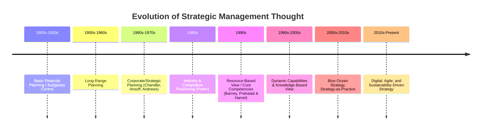

## Evolution and History of Strategic Management Thought

### Overview

The field of strategic management evolved from military strategy concepts and basic budgeting practices into a sophisticated, multidisciplinary body of theory spanning economics, sociology, and organizational behavior. Its history is generally organized into distinct eras, each dominated by a different conceptual paradigm about how organizations should compete and achieve superior performance.

**Note:** Mermaid `timeline` syntax is rendered here as raw text per the no-render requirement; treat it as a structured outline, not an executable diagram.

---

### Phase 1: Early Foundations — Budgeting and Financial Control (Pre-1950s)

Before formal "strategy" existed as a discipline, organizations relied on:

- **Annual financial budgeting** as the primary planning tool.
- **Military strategy analogies** — the term "strategy" itself derives from the Greek *strategos* (the art of the general), applied metaphorically to business competition.
- **Scientific Management** (Frederick Taylor, early 1900s) — focused on operational efficiency rather than long-term direction, but laid groundwork for systematic management thinking.

**Key Points**

- Planning during this era was short-term and internally focused.
- There was no formal integration of external environmental analysis.
- Strategy was largely intuitive, reactive, and centered on production efficiency.

---

### Phase 2: Corporate Planning Era (1950s–1960s)

This era marks the formal birth of strategic management as an academic and managerial discipline.

#### Key Contributors and Concepts

- **Alfred D. Chandler (1962)** — *Strategy and Structure*: introduced the seminal thesis that **"structure follows strategy"** — organizational design should be adapted to support chosen strategic direction, based on historical studies of firms like DuPont and General Motors.
- **Philip Selznick (1957)** — introduced the concept of **distinctive competence**, an early precursor to the resource-based view.
- **Igor Ansoff (1965)** — *Corporate Strategy*: developed the **Ansoff Matrix** (market penetration, market development, product development, diversification) and formalized the gap-analysis approach to strategic planning.
- **Kenneth Andrews / Harvard Business School (1965)** — developed the **Learned, Christensen, Andrews, Guth (LCAG) framework**, precursor to SWOT analysis, emphasizing the fit between organizational capability and environmental opportunity.

**Key Points**

- Strategy formalized as deliberate, long-range planning conducted by top management.
- Emergence of the "design school" — strategy as a conscious, structured thought process.
- SWOT-style analysis (strengths/weaknesses matched to opportunities/threats) became foundational.

---

### Phase 3: Corporate/Strategic Planning Boom (Late 1960s–1970s)

Strategic planning became formalized within large corporations, often centralized in dedicated planning departments.

- **Boston Consulting Group (BCG) Growth-Share Matrix** (1968) — introduced by Bruce Henderson, portfolio-planning tool classifying business units as Stars, Cash Cows, Question Marks, and Dogs.
- **GE/McKinsey Nine-Box Matrix** — extended portfolio analysis using industry attractiveness and competitive strength dimensions.
- **PIMS (Profit Impact of Market Strategy) Project** — large-scale empirical database linking strategic variables (e.g., market share) to profitability.

**Key Points**

- Strategy viewed as a top-down, quantitative, portfolio-management exercise.
- Diversification and conglomerate strategies were popular, driven by portfolio logic.
- Criticism emerged that this approach was overly formulaic and disconnected from execution realities (Mintzberg's later critique of "the fall of strategic planning").

---

### Phase 4: Industry and Competitive Positioning Era (1980s)

Michael Porter's work shifted the field toward **industrial organization economics**, emphasizing industry structure as the primary determinant of firm profitability.

- **Michael Porter (1980)** — *Competitive Strategy*: introduced the **Five Forces Framework** for industry analysis and the concept that industry structure shapes competitive intensity and profit potential.
- **Porter (1985)** — *Competitive Advantage*: introduced the **Value Chain** analysis and the three **Generic Strategies** — cost leadership, differentiation, and focus.

**Key Points**

- Strategy formulation centered on **positioning** the firm favorably within its industry.
- Emphasis shifted to external, industry-level analysis over internal capability.
- This era is often called the **"Positioning School"** in Mintzberg's taxonomy of strategy schools.

---

### Phase 5: Resource-Based View and Core Competencies (Late 1980s–1990s)

A theoretical counter-movement shifted focus back inside the firm, arguing that sustainable competitive advantage stems primarily from internal resources rather than industry positioning alone.

- **Birger Wernerfelt (1984)** — *"A Resource-Based View of the Firm"*: foundational paper proposing that firm-specific resources drive performance differences.
- **Jay Barney (1991)** — formalized the **VRIN/VRIO framework** (Valuable, Rare, Inimitable, Non-substitutable/Organized) as criteria for resources to generate sustained competitive advantage.
- **C.K. Prahalad and Gary Hamel (1990)** — *"The Core Competence of the Corporation"*: introduced **core competencies** as the collective learning and coordinated skills underlying competitive advantage, exemplified by firms like Honda and Canon.

**Key Points**

- Strategy formulation shifted from "which industry to compete in" to "what unique capabilities do we possess."
- Laid groundwork for later capability-based theories.
- Complements rather than fully replaces Porter's positioning logic; many practitioners integrate both perspectives.

---

### Phase 6: Dynamic Capabilities and Knowledge-Based View (1990s–2000s)

Recognizing that static resource advantages erode over time, scholars emphasized the capacity to adapt.

- **David Teece, Gary Pisano, Amy Shuen (1997)** — *"Dynamic Capabilities and Strategic Management"*: defined dynamic capabilities as the firm's ability to **integrate, build, and reconfigure** internal and external competencies to address rapidly changing environments.
- **Knowledge-Based View (KBV)** — extended RBV by treating knowledge (particularly tacit, hard-to-imitate knowledge) as the most strategically important resource (Grant, 1996).

**Key Points**

- Relevant especially in fast-changing technology-driven industries.
- Shifted emphasis from "having" resources to the organizational processes of sensing, seizing, and transforming.

---

### Phase 7: Alternative and Contemporary Perspectives (2000s–Present)

Multiple parallel schools of thought have emerged, reflecting a more pluralistic and pragmatic field.

| Framework/School | Key Proponents | Core Idea |
| --- | --- | --- |
| **Blue Ocean Strategy** | W. Chan Kim & Renée Mauborgne (2005) | Create uncontested market space rather than competing in existing ("red ocean") markets. |
| **Strategy-as-Practice** | Whittington, Jarzabkowski | Strategy is an activity people *do*, embedded in everyday organizational practice, not just a document. |
| **Complexity/Emergent Strategy** | Henry Mintzberg | Strategy often emerges organically from patterns of action rather than being solely deliberately planned ("emergent vs. deliberate strategy"). |
| **Platform and Ecosystem Strategy** | Parker, Van Alstyne, Choudary | Value creation through multi-sided platforms and network effects rather than traditional value chains. |
| **Stakeholder Theory / ESG-Integrated Strategy** | R. Edward Freeman | Strategy formulated to balance interests of all stakeholders, not just shareholders. |

**Key Points**

- Digital transformation and platform business models have introduced new strategic logics (network effects, data as a resource).
- Growing integration of sustainability, ESG, and stakeholder capitalism into mainstream strategic frameworks.
- Agile and iterative strategy processes have gained traction, especially in technology sectors, contrasting with the long-horizon planning of earlier eras. [Inference: the degree to which "agile strategy" constitutes a distinct theoretical school versus a practical adaptation of existing frameworks remains debated among academics.]

---

### Summary Table: Dominant Paradigm by Era

| Era | Dominant Question | Primary Unit of Analysis |
| --- | --- | --- |
| Pre-1950s | How do we control costs and operations? | Department/Function |
| 1950s–60s | How do we plan long-term growth? | Corporation |
| 1970s | How do we allocate resources across businesses? | Business Unit Portfolio |
| 1980s | Which industry/position is most attractive? | Industry |
| 1990s | What unique resources/capabilities do we hold? | Firm-specific Resources |
| 2000s | How do we adapt capabilities to change? | Organizational Processes |
| 2010s–Present | How do we create new markets/ecosystems responsibly? | Ecosystem/Network/Stakeholder |

---

### Example

A useful illustration of this evolution is General Electric (GE) across decades: in the 1970s, GE was a pioneer of the **BCG-style portfolio planning** approach, using the GE/McKinsey matrix to manage a sprawling conglomerate. Under Jack Welch in the 1980s–90s, GE pivoted toward **Porter-style competitive positioning** (the "be #1 or #2 in every market" doctrine) combined with **core competency** thinking (Six Sigma as an organizational capability). In more recent years, large diversified conglomerates including GE have faced pressure to simplify structures, reflecting critiques of pure portfolio-based diversification strategies and a shift toward focused, capability-driven business models. [Unverified: specific current GE strategic positioning should be checked against up-to-date sources, as corporate strategy is time-sensitive and GE underwent a major three-way split in 2024.]

---

**Related Topics**

- Design School vs. Positioning School vs. Resource-Based School (Mintzberg's 10 Schools of Strategy)
- Porter's Five Forces Framework
- Resource-Based View and VRIO Analysis
- Dynamic Capabilities Framework
- Blue Ocean Strategy
- Deliberate vs. Emergent Strategy (Mintzberg)
- Stakeholder Theory and ESG in Strategy
- Platform and Ecosystem Business Models