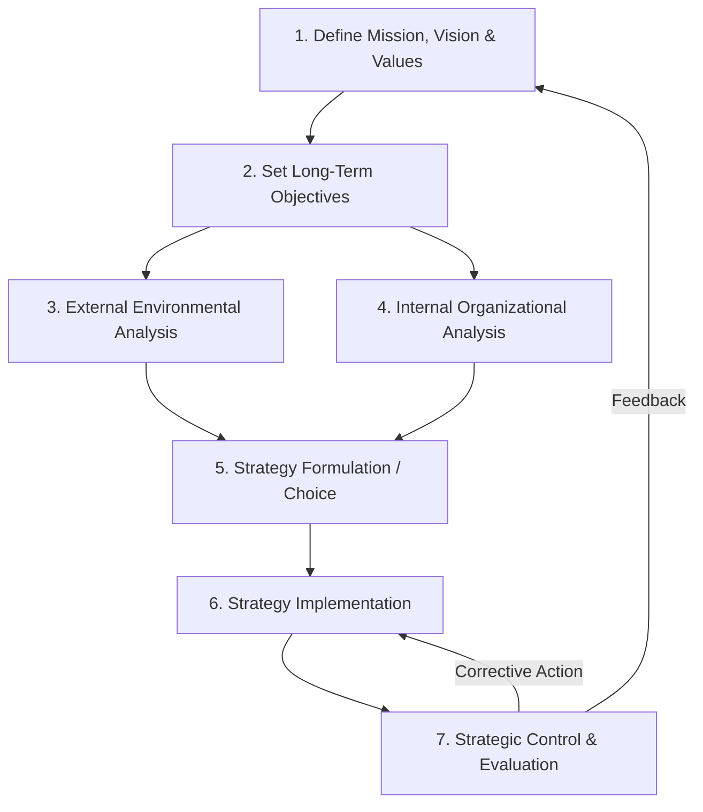
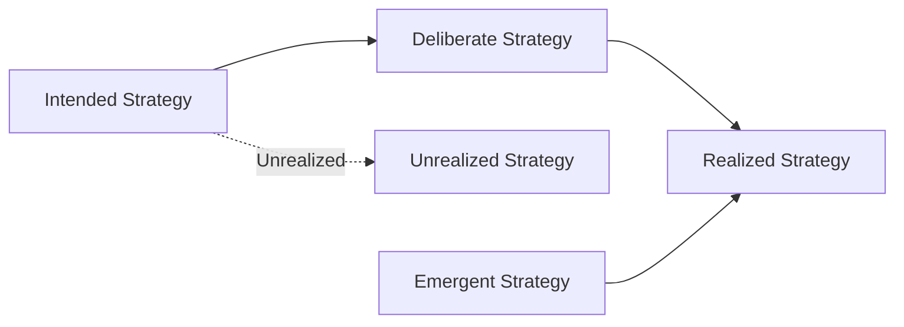

## The Strategic Management Process

### Overview

The strategic management process is a systematic, cyclical sequence of activities through which organizations analyze their environment, formulate direction, implement chosen strategies, and evaluate outcomes. While formulation, implementation, and evaluation are the three broad stages, the process is more granularly decomposed into a series of interdependent steps that feed back into one another continuously rather than running linearly once.

---

### Step 1: Establishing Mission, Vision, and Values

The process begins with defining organizational identity and aspiration.

- **Mission Statement** — articulates the organization's current purpose, scope of operations, and reason for existence.
- **Vision Statement** — describes the desired future state the organization aspires to achieve.
- **Core Values** — the guiding principles that shape organizational culture and decision-making behavior.

**Key Points**

- Mission and vision provide the philosophical foundation against which all subsequent strategic choices are tested for alignment.
- These statements should be specific enough to guide decisions yet broad enough to allow strategic flexibility.

---

### Step 2: Setting Long-Term Objectives

Objectives translate the mission/vision into measurable targets, typically covering a 3–5 year (or longer) horizon.

Effective strategic objectives are commonly evaluated against **SMART** criteria:

- **S**pecific
- **M**easurable
- **A**chievable
- **R**elevant
- **T**ime-bound

Common objective categories include profitability, market share, growth rate, innovation output, and social/environmental responsibility metrics.

---

### Step 3: External Environmental Analysis

This step identifies **opportunities** and **threats** arising outside the organization's direct control.

#### Macro-Environment (PESTEL)

| Factor | Examples |
| --- | --- |
| **P**olitical | Regulation, trade policy, political stability |
| **E**conomic | Inflation, interest rates, GDP growth, exchange rates |
| **S**ocial | Demographics, cultural trends, consumer behavior |
| **T**echnological | Innovation rate, automation, digital disruption |
| **E**nvironmental | Climate regulation, sustainability expectations |
| **L**egal | Labor law, antitrust, intellectual property law |

#### Industry/Competitive Environment

- **Porter's Five Forces** — threat of new entrants, bargaining power of suppliers, bargaining power of buyers, threat of substitutes, and competitive rivalry.
- **Competitor Profiling** — analyzing rivals' objectives, strategies, capabilities, and assumptions.
- **Strategic Group Mapping** — clustering competitors by strategic similarity (e.g., price vs. quality positioning).

---

### Step 4: Internal Organizational Analysis

This step identifies **strengths** and **weaknesses** within the organization's control.

- **Resource Audit** — tangible (financial, physical) and intangible (brand, patents, culture) resources.
- **VRIO Framework** — assessing whether resources are Valuable, Rare, Inimitable, and supported by Organization to determine if they yield sustained competitive advantage.
- **Value Chain Analysis** (Porter) — examining primary activities (inbound logistics, operations, outbound logistics, marketing/sales, service) and support activities (procurement, technology development, HR, infrastructure) to locate sources of cost or differentiation advantage.
- **Financial Ratio Analysis** — liquidity, profitability, leverage, and efficiency ratios benchmarked against industry norms.

---

### Step 5: Strategy Formulation (Strategic Choice)

Combining external and internal analysis (commonly synthesized via **SWOT** or **TOWS matrix**) to generate and select among strategic alternatives.

#### Levels of Strategic Choice

- **Corporate-level** — which industries/businesses to compete in (diversification, vertical integration, mergers & acquisitions, divestiture).
- **Business-level** — how to compete within a chosen industry (Porter's generic strategies: cost leadership, differentiation, focus).
- **Functional-level** — how departments (marketing, operations, HR, finance) support the chosen business strategy.

#### Common Strategy Formulation Tools

- **TOWS Matrix** — pairs internal Strengths/Weaknesses against external Opportunities/Threats to generate SO, WO, ST, WT strategic options.
- **BCG Growth-Share Matrix** — portfolio classification (Stars, Cash Cows, Question Marks, Dogs) for multi-business firms.
- **Ansoff Matrix** — growth strategy selection along product/market dimensions (market penetration, market development, product development, diversification).
- **Grand Strategy Selection Matrix** — links strategic options to industry growth rate and competitive position.

**Key Points**

- Strategic choice involves generating multiple feasible alternatives before selecting one, rather than jumping to a single option.
- Selection criteria typically include suitability (does it address the analysis?), acceptability (will stakeholders accept the risk/return?), and feasibility (can it be resourced and executed?).

---

### Step 6: Strategy Implementation

Implementation translates the chosen strategy into operational reality — often regarded as the most challenging stage due to organizational and behavioral complexity.

#### Key Implementation Levers

- **Annual Objectives and Policies** — cascading long-term goals into short-term, actionable targets.
- **Resource Allocation** — budgeting capital, personnel, and technology to strategic priorities.
- **Organizational Structure** — aligning structure to strategy (per Chandler's "structure follows strategy" thesis); e.g., functional, divisional, matrix, or network structures.
- **Leadership and Culture** — securing top management commitment and shaping culture to support strategic direction.
- **Change Management** — managing resistance to change through communication, training, and incentive alignment.
- **Reward Systems** — aligning compensation and performance metrics with strategic objectives.

$$\text{Implementation Effectiveness} \approx f(\text{Structure}, \text{Culture}, \text{Leadership}, \text{Resources}, \text{Incentives})$$

[Inference: this is a conceptual heuristic, not a validated quantitative model — implementation effectiveness in the literature is generally discussed qualitatively rather than as a precise mathematical function.]

---

### Step 7: Strategic Evaluation and Control

The final (and continuously recurring) stage measures whether the strategy is achieving its intended objectives and triggers corrective action when it is not.

#### Core Evaluation Activities (per Fred David's model)

1. **Reviewing external and internal factors** that formed the basis for the current strategy (have they changed?).
2. **Measuring organizational performance** against established objectives.
3. **Taking corrective actions** when performance deviates from expectations.

#### Common Evaluation Tools

- **Balanced Scorecard** (Kaplan & Norton) — measures performance across four perspectives: Financial, Customer, Internal Business Process, and Learning & Growth.
- **Key Performance Indicators (KPIs)** — quantifiable metrics tied to strategic objectives.
- **Strategic Audits** — periodic comprehensive reviews of strategy relevance and execution.

---

### Deliberate vs. Emergent Process (Mintzberg's Critique)

Henry Mintzberg's research challenged the purely linear, sequential model above, distinguishing:

- **Deliberate Strategy** — intended strategy that is realized largely as planned.
- **Emergent Strategy** — patterns of action that arise organically from unplanned responses to unforeseen circumstances, later recognized and formalized as strategy.

**Key Points**

- In practice, most realized strategies are a blend of deliberate planning and emergent adaptation.
- This model tempers the "rational planning" view of the strategic management process with a more realistic, iterative perspective. [Inference: the exact proportion of emergent vs. deliberate elements in any real strategy is not precisely measurable and is a matter of qualitative interpretation.]

---

### Example

A mid-sized software company works through the process as follows: **(1)** it articulates a vision to become the leading project-management SaaS provider for SMEs; **(2)** sets a five-year objective of $50M ARR; **(3)** external analysis reveals a growing PESTEL trend toward remote-work tools and identifies Five Forces pressure from low switching costs among buyers; **(4)** internal analysis via VRIO finds strong engineering talent (valuable, rare) but weak sales infrastructure; **(5)** it formulates a differentiation strategy targeting a niche vertical (e.g., construction project management) via a TOWS-derived SO strategy; **(6)** implementation involves reallocating budget to build a vertical-specific sales team and restructuring into a divisional model; **(7)** evaluation tracks ARR growth and churn quarterly via a Balanced Scorecard, with corrective budget reallocation if targets are missed.

---

**Related Topics**

- SWOT and TOWS Matrix Analysis
- PESTEL Analysis
- Porter's Five Forces Framework
- VRIO Framework and Resource-Based View
- Value Chain Analysis
- Balanced Scorecard
- Organizational Structure and Strategy Alignment (Chandler's Thesis)
- Deliberate vs. Emergent Strategy (Mintzberg)
- Strategic Control Systems