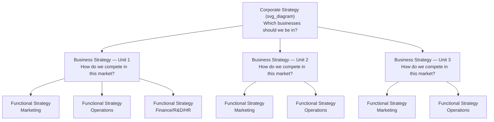

## Levels of Strategy: Corporate, Business, and Functional

### Overview and Conceptual Foundation

Strategy in a multi-business or multi-unit organization does not exist as a single, monolithic plan. It is formulated and executed at distinct organizational levels, each addressing different questions, involving different decision-makers, and operating over different scopes. The three-tier hierarchy of **corporate**, **business**, and **functional** strategy provides a structural framework for decomposing the overall strategic task of an organization into manageable, coherent layers.

The core logic of this hierarchy rests on a nested scope of decision rights: corporate strategy defines the arenas in which the firm competes, business strategy defines how the firm competes within a given arena, and functional strategy defines how specific organizational capabilities are deployed to support that competitive approach. Each level is meant to be internally consistent and externally aligned with the levels above and below it — a property often called **vertical fit** or **strategic alignment**.

This layered structure is most visible in diversified, multi-business corporations, but the same logic applies, in compressed form, to single-business firms, where the corporate and business levels effectively collapse into one.

### The Strategy Hierarchy: Structural Diagram

### Corporate-Level Strategy

**Defining Question:** "What businesses should we be in, and how should we manage the portfolio of businesses as a whole?"

Corporate strategy is formulated by the top management team and board of directors, and it addresses the scope of the firm — the set of industries, markets, and value-chain activities in which the organization will participate. It is fundamentally concerned with creating value across business units that would not exist if those units operated as independent, unrelated firms. This value creation logic is often referred to as the **parenting advantage** or the search for **corporate-level synergies**.

**Core Decision Domains:**

- **Portfolio composition** — which industries and markets to enter, retain, or exit
- **Diversification strategy** — related versus unrelated diversification, and the degree of relatedness across businesses
- **Vertical integration** — how much of the value chain to own versus source externally
- **Resource allocation** — how capital, talent, and managerial attention are distributed across business units
- **Corporate parenting** — what value the corporate center adds beyond the sum of standalone business units (shared services, brand, capital access, managerial expertise transfer)
- **Mode of growth** — organic development, mergers and acquisitions, strategic alliances, or joint ventures
- **Governance and control structures** — how business units are organized, evaluated, and incentivized

**Illustrative Example:**

A conglomerate operating in consumer electronics, financial services, and healthcare equipment makes a corporate-level decision when it chooses to divest its financial services arm to concentrate capital and management focus on electronics and healthcare, judging that these two businesses share more transferable capabilities (engineering talent, regulatory navigation, hardware supply chains) than either shares with financial services.

**Analytical Tools Commonly Associated with This Level:**

- BCG Growth-Share Matrix
- GE-McKinsey Nine-Box Matrix
- Ansoff Matrix (for growth-direction decisions)
- Parenting-fit frameworks (Goold, Campbell, and Alexander's "parenting advantage" framework)

$$\text{Corporate Value Added} = \sum_{i=1}^{n} V_i(\text{as part of portfolio}) - \sum_{i=1}^{n} V_i(\text{as standalone entity})$$

Where $V_i$ represents the value of business unit $i$. A positive result indicates the corporate parent is creating value through its portfolio management; a negative or near-zero result suggests a **conglomerate discount**, where the market values the sum of standalone units more highly than the combined entity.

### Business-Level Strategy

**Defining Question:** "How do we compete successfully in this particular market or industry?"

Business strategy — sometimes called **competitive strategy** — is formulated at the level of the strategic business unit (SBU) and addresses how that unit will build and sustain a competitive advantage within its specific industry or market segment. Where corporate strategy asks "which games to play," business strategy asks "how to win the game we're in."

**Core Decision Domains:**

- **Generic competitive positioning** — cost leadership, differentiation, or focus (per Porter's generic strategies framework)
- **Competitive scope** — broad market versus niche segment targeting
- **Value proposition design** — the specific combination of price, quality, features, and service offered to target customers
- **Competitive dynamics** — how to respond to rivals' moves, deter entry, and defend market position
- **Resource and capability deployment** — which firm-specific resources are marshaled to support the chosen positioning

**Illustrative Example:**

Within the electronics division mentioned above, the business unit responsible for premium wireless headphones may pursue a **differentiation strategy**, competing on audio engineering quality, industrial design, and brand prestige rather than on price — while a sister unit selling budget electronics accessories pursues a **cost leadership strategy**, competing on manufacturing efficiency and supply-chain scale.

**Analytical Tools Commonly Associated with This Level:**

- Porter's Five Forces (industry attractiveness analysis)
- Porter's Generic Strategies (cost leadership, differentiation, focus)
- Resource-Based View (VRIN/VRIO framework for sustainable advantage)
- Value chain analysis
- Strategic group mapping

**[Inference]** The boundary between corporate and business strategy becomes analytically ambiguous in single-business firms, where some scholars argue the two levels effectively merge, since portfolio-composition decisions and competitive-positioning decisions are made by the same leadership team over the same scope of activity.

### Functional-Level Strategy

**Defining Question:** "How does this specific function or department execute its activities to support the business unit's competitive strategy?"

Functional strategy is the most granular level of the hierarchy, formulated by department or functional-area managers (marketing, operations, finance, human resources, R&D, IT) to translate business-level competitive positioning into concrete operational plans. Functional strategies are the mechanisms through which higher-level strategic intent becomes day-to-day organizational action.

**Core Decision Domains by Function:**

| Function | Representative Strategic Decisions |
| --- | --- |
| Marketing | Segmentation, targeting, positioning, pricing strategy, channel strategy, brand architecture |
| Operations | Capacity planning, process design, quality management approach, make-or-buy decisions, supply chain configuration |
| Finance | Capital structure, dividend policy, investment appraisal criteria, working capital management |
| Human Resources | Talent acquisition strategy, compensation philosophy, training and development investment, succession planning |
| R&D | Innovation intensity, build-versus-buy for technology, IP strategy, research portfolio balance |
| Information Technology | Systems architecture, data strategy, digital transformation roadmap, cybersecurity posture |

**Illustrative Example:**

If the premium headphones business unit has chosen a differentiation strategy centered on audio quality and design, its functional strategies must reinforce that positioning: R&D invests disproportionately in acoustic engineering talent and patents; marketing pursues premium-tier positioning and selective retail partnerships rather than mass-market discount channels; operations sources higher-cost, higher-tolerance components rather than optimizing purely for unit cost; and HR recruits and retains specialized acoustic engineers, offering compensation structures competitive with that niche labor market.

A functional strategy that contradicts the business strategy — for instance, an operations function that aggressively cuts component costs in ways that degrade sound quality — represents a **vertical misalignment** that undermines the coherence of the overall strategic architecture.

### Vertical Fit and Cross-Level Consistency

**Key Points**

- **Vertical fit** refers to the degree of consistency and mutual reinforcement across corporate, business, and functional strategies.
- Strong vertical fit means functional decisions operationally enable the business-level competitive positioning, which in turn operationally serves the corporate-level portfolio logic.
- Misalignment at any level creates strategic drag: for example, a corporate strategy pursuing unrelated diversification for financial engineering reasons may starve a business unit of the R&D investment its differentiation strategy requires, because corporate resource allocation criteria (e.g., short-term ROI hurdles applied uniformly across a diverse portfolio) do not match the business unit's competitive needs.
- Fit is not static — it must be re-evaluated as industry conditions, corporate portfolio composition, and competitive dynamics evolve. This is a recurring theme in strategic management: strategy formulation at all three levels is iterative rather than a one-time top-down cascade.

### Comparative Summary Table

| Dimension | Corporate Strategy | Business Strategy | Functional Strategy |
| --- | --- | --- | --- |
| Primary Question | Which businesses/markets to compete in? | How to compete within a given market? | How to execute to support competitive positioning? |
| Typical Decision-Makers | CEO, board, corporate executives | Business unit general managers | Functional/departmental managers |
| Scope | Entire organization, multiple businesses | Single business unit or industry segment | Single functional area within a business unit |
| Time Horizon | Long-term (often 5+ years) | Medium-term (typically 2-5 years) | Short-to-medium-term (often 1-3 years) |
| Primary Output | Portfolio composition, diversification scope | Competitive positioning, value proposition | Operational plans, resource deployment within function |
| Representative Tools | BCG Matrix, GE-McKinsey Matrix, Parenting Framework | Five Forces, Generic Strategies, VRIO | Function-specific operational frameworks |

### Common Misconceptions and Clarifications

- **Misconception:** Functional strategy is merely "implementation" and involves no genuine strategic choice.

  **Clarification:** Functional managers make consequential trade-offs (e.g., which capabilities to build, which markets to prioritize within a channel strategy) that materially shape whether the business-level strategy succeeds; it is strategic decision-making, constrained by a narrower scope, not the absence of strategy.
- **Misconception:** The three levels operate in strict top-down sequence, with corporate strategy fully determined before business strategy, and business strategy fully determined before functional strategy.

  **Clarification:** In practice, strategy formulation is iterative and often emergent (per Mintzberg's concept of emergent strategy) — functional-level insights (e.g., an R&D breakthrough or an operational capability) can inform and reshape business-level and even corporate-level strategic choices, a bottom-up influence sometimes called **strategy as a learning process**.
- **Misconception:** All three levels are equally relevant to every firm.

  **Clarification:** Single-business firms still perform corporate-level reasoning (e.g., vertical integration decisions, geographic expansion) but the distinction between corporate and business strategy is less operationally salient than in diversified conglomerates.

**Related Topics**

- Strategic Business Unit (SBU) design and boundary-setting criteria
- Diversification strategy: related versus unrelated diversification and the diversification-performance relationship
- The Resource-Based View (RBV) and VRIO framework for sustainable competitive advantage
- Porter's Five Forces Framework for industry structure analysis
- Corporate parenting theory and the parenting-fit matrix
- Vertical integration versus outsourcing decisions
- Mintzberg's deliberate versus emergent strategy
- Strategic alignment and the balanced scorecard as a cross-level coordination mechanism