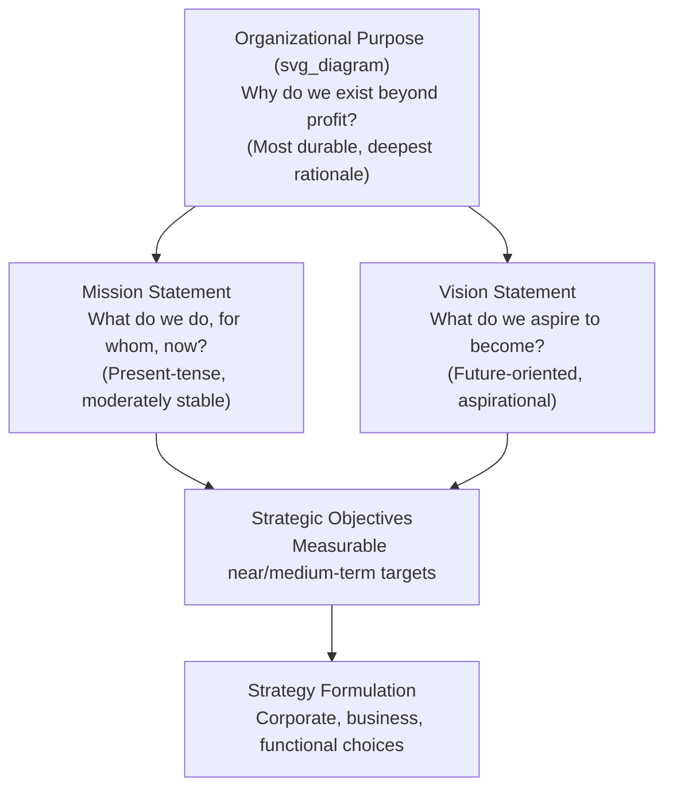

## Vision, Mission, and Organizational Purpose

### Overview and Conceptual Foundation

Vision, mission, and organizational purpose form the normative anchor of the strategic management process — the set of statements and underlying commitments that define why an organization exists, what it is trying to become, and what boundaries guide its choices. While often treated as boilerplate corporate communications, these constructs perform a substantive strategic function: they constrain the space of acceptable strategic alternatives, provide a criterion against which strategic options can be evaluated, and serve as a coordination device that aligns decentralized decision-making across business units and functions without requiring constant top-down direction.

These three constructs are related but analytically distinct, and conflating them is one of the most common errors in both practitioner and introductory strategy work.

### Distinguishing the Three Constructs

**Mission Statement**

The mission answers: **"What do we do, for whom, and why does it matter, right now?"**

A mission statement is a present-tense articulation of the organization's core business, its primary stakeholders, and its fundamental reason for existing in its current form. It is meant to be relatively stable over time but is not necessarily eternal — missions can and do evolve as the organization's scope of activity changes.

**Vision Statement**

The vision answers: **"What do we aspire to become in the future?"**

A vision statement is future-oriented and aspirational. It describes a desired end state — often one that is ambitious, somewhat distant in time, and not fully achievable with current capabilities. Effective vision statements function as a form of **strategic stretch**, creating productive tension between current capability and future ambition (a concept closely related to Hamel and Prahalad's notion of **strategic intent**).

**Organizational Purpose**

Purpose answers a deeper question: **"Why does this organization exist, beyond profit generation, and what value does it contribute to stakeholders and society?"**

Purpose has gained prominence in strategic management literature as a construct distinct from mission and vision — it is meant to articulate a more fundamental, often more durable rationale for existence, one that can persist even as mission (what the organization does) and vision (what it aspires to become) evolve. Purpose is closely associated with stakeholder theory and the argument that firms with a clearly articulated, authentic purpose can achieve superior long-term performance by aligning employee motivation, customer loyalty, and investor confidence around a shared sense of meaning.

### Structural Relationship Diagram

### Characteristics of Effective Statements

**Key Points**

- **Mission statements** are typically evaluated on: clarity of the core business definition, identification of primary customers/stakeholders, and distinctiveness relative to competitors' missions. A mission so generic it could apply to any firm in the industry ("to provide quality products and excellent service") fails to perform a differentiating strategic function.
- **Vision statements** are typically evaluated on: ambition (does it stretch beyond current capability?), clarity (is the desired end state concrete enough to guide decisions?), and time-boundedness (is there an implicit or explicit horizon?). Collins and Porras, in their influential work on visionary companies, emphasized the importance of a **BHAG (Big Hairy Audacious Goal)** — a vivid, compelling long-term target — as a component of effective vision.
- **Purpose statements** are typically evaluated on authenticity (is it reflected in actual firm behavior and resource allocation, or is it purely rhetorical — a distinction often referred to as "purpose-washing" when the gap is wide) and stakeholder relevance (does it articulate value creation for multiple stakeholder groups, not solely shareholders).

### Illustrative Example

Consider a hypothetical firm in sustainable packaging:

- **Purpose:** "To eliminate the environmental cost of disposable packaging for future generations."
- **Mission:** "We design and manufacture compostable packaging solutions for food and consumer goods companies, replacing petroleum-based plastics with plant-derived alternatives."
- **Vision:** "By 2035, to be the default packaging standard for the top 100 global consumer packaged goods companies."

Note the layered specificity: purpose is the most abstract and durable; mission grounds that purpose in a specific current business activity and customer set; vision translates both into a concrete, time-bound, measurable aspiration that can subsequently be decomposed into strategic objectives.

### Functional Role in the Strategic Management Process

Vision, mission, and purpose are not merely communication artifacts — they perform specific functions within the broader strategic management process:

1. **Directional function** — they narrow the space of strategic alternatives under consideration, ruling out options inconsistent with the stated mission or purpose (e.g., a mission centered on sustainable packaging would rule out diversification into conventional plastics manufacturing, absent a formal mission revision).
2. **Motivational function** — particularly for vision and purpose, these statements are theorized to increase employee engagement and discretionary effort by connecting day-to-day work to a larger meaning, a linkage studied extensively in organizational behavior research on **meaningful work**.
3. **Coordination function** — in decentralized organizations, a shared, internalized sense of mission and purpose can substitute for costly formal coordination mechanisms, allowing business units and functions to make locally autonomous decisions that remain globally consistent with organizational intent.
4. **Evaluative function** — vision statements, because they are more measurable and time-bound than purpose, provide a benchmark against which strategic progress can be assessed, feeding into the objective-setting and strategic control stages of the strategic management process.

**[Inference]** The empirical relationship between having a formally articulated vision/mission/purpose and firm performance is contested in the literature; some studies find a positive association, but causality is difficult to establish, since well-managed firms may simply be more likely to both articulate clear statements and perform well, without the statements themselves being causally responsible for the performance.

### Common Pitfalls in Practice

- **Statement proliferation without differentiation** — many organizations produce mission and vision statements so generic and interchangeable with competitors' statements that they provide no actual strategic guidance or differentiation.
- **Purpose-mission-vision misalignment** — a stated purpose that is inconsistent with actual resource allocation and strategic choices (e.g., a firm articulating an environmental purpose while its core business model depends on activities that contradict that purpose) undermines both external credibility and internal motivational effects.
- **Vision without stretch** — a vision statement that simply restates current capability rather than articulating genuine aspiration fails to perform the motivational and directional functions associated with effective vision-setting.
- **Static treatment** — treating these statements as fixed-forever artifacts rather than periodically revisiting them as the competitive environment, technology, and stakeholder expectations evolve.

### Comparative Summary Table

| Dimension | Purpose | Mission | Vision |
| --- | --- | --- | --- |
| Core Question | Why do we exist beyond profit? | What do we do, for whom, now? | What do we aspire to become? |
| Time Orientation | Timeless/durable | Present | Future |
| Typical Stability | Most stable | Moderately stable | Revised periodically as achieved or environment shifts |
| Primary Function | Meaning and stakeholder alignment | Scope definition and differentiation | Directional stretch and motivation |
| Measurability | Low (qualitative, values-based) | Low-to-moderate | Higher (often paired with concrete milestones) |

**Related Topics**

- Stakeholder theory and its relationship to organizational purpose
- Strategic intent (Hamel and Prahalad) and the concept of productive misalignment between resources and ambition
- Collins and Porras's BHAG framework and "visionary company" research
- Objective-setting and the translation of vision into measurable strategic objectives
- Corporate culture as a mechanism for internalizing mission and purpose
- Stakeholder capitalism versus shareholder primacy debates in strategic management theory