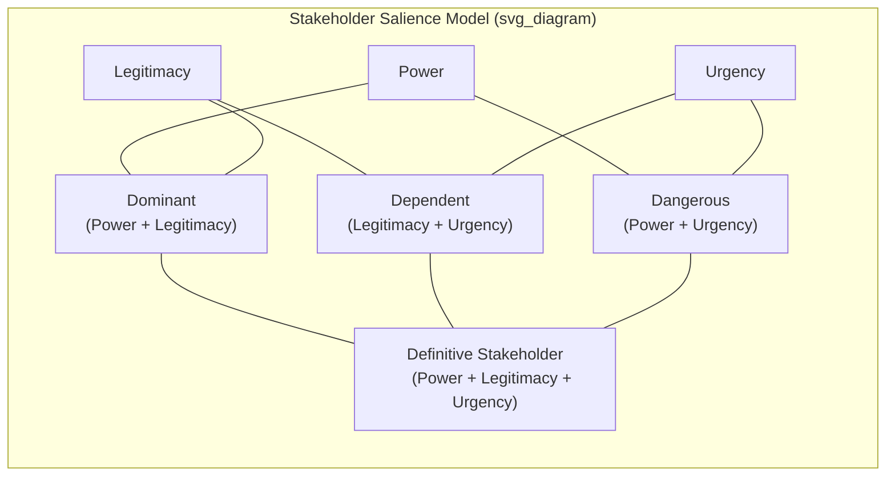

## Stakeholder Theory and Analysis

### Overview and Conceptual Foundation

Stakeholder theory holds that a firm's strategic obligations and value-creation activities extend beyond shareholders to encompass all groups and individuals who affect, or are affected by, the achievement of the organization's objectives. The theory was most influentially systematized by R. Edward Freeman in his 1984 work *Strategic Management: A Stakeholder Approach*, which reframed strategic management as fundamentally about managing relationships with a network of interdependent stakeholders rather than solely maximizing shareholder wealth.

Stakeholder theory occupies a contested position in strategic management: it functions simultaneously as a descriptive account of how organizations actually operate, an instrumental argument about what drives superior firm performance, and a normative claim about what firms ethically ought to do. Distinguishing these three uses — a distinction formalized by Donaldson and Preston (1995) — is essential to using the theory rigorously.

### The Three Uses of Stakeholder Theory

**Descriptive Use**

Stakeholder theory as a description of organizational reality: firms are, as an empirical matter, embedded in networks of relationships with employees, customers, suppliers, communities, governments, and shareholders, and managerial decision-making observably accounts for multiple stakeholder interests rather than shareholder interests alone.

**Instrumental Use**

Stakeholder theory as a causal claim about performance: firms that manage stakeholder relationships effectively achieve superior financial and competitive outcomes relative to firms that focus narrowly on shareholders, because stakeholder cooperation (employee discretionary effort, supplier reliability, customer loyalty, community license to operate) is a source of competitive advantage.

**Normative Use**

Stakeholder theory as an ethical claim: stakeholders possess legitimate interests in the firm independent of the firm's capacity to serve shareholder interests, and management has a fiduciary-like duty to balance these interests rather than subordinate them to shareholder wealth maximization.

**[Inference]** Most contemporary academic treatments of stakeholder theory blend instrumental and normative justifications, arguing that ethical stakeholder management and superior performance are complementary rather than competing — though this complementarity is itself an empirically and philosophically contested claim, not a settled finding.

### Stakeholder Identification and Mapping

**Primary Stakeholder Categories**

| Stakeholder Group | Primary Interest | Typical Influence Mechanism |
| --- | --- | --- |
| Shareholders/Investors | Financial return, capital appreciation | Voting rights, capital withdrawal, board influence |
| Employees | Compensation, job security, meaningful work, career development | Labor supply, discretionary effort, unionization, turnover |
| Customers | Product/service value, quality, price | Purchasing decisions, brand loyalty, word-of-mouth |
| Suppliers | Reliable demand, fair payment terms, long-term relationships | Contract terms, supply reliability, exclusivity |
| Communities | Local economic impact, environmental quality, employment | Regulatory advocacy, social license to operate, protest |
| Governments/Regulators | Tax revenue, legal compliance, public policy objectives | Legislation, licensing, enforcement action |
| Creditors/Lenders | Debt repayment, covenant compliance | Interest rates, credit terms, covenant restrictions |
| Competitors | Industry stability, fair competitive practices | Market actions, industry association participation |

### Stakeholder Salience Framework (Mitchell, Agle, and Wood)

A widely used analytical tool for prioritizing among stakeholders classifies them along three attributes:

- **Power** — the stakeholder's ability to impose its will on the organization (e.g., through coercive, utilitarian, or normative means)
- **Legitimacy** — the socially accepted and expected validity of the stakeholder's claim on the organization
- **Urgency** — the degree to which the stakeholder's claim calls for immediate attention, based on time sensitivity and criticality

Stakeholders possessing all three attributes are classified as **definitive stakeholders**, warranting the highest managerial priority. Those possessing two attributes fall into **expectant** categories (dominant, dangerous, or dependent, depending on which two attributes are present), while those possessing only one attribute are **latent stakeholders** (dormant, discretionary, or demanding).

### Stakeholder Analysis Process

**Key Points**

A structured stakeholder analysis typically proceeds through four stages:

1. **Identification** — comprehensively mapping all parties who affect or are affected by the organization's strategic decisions, avoiding the common error of limiting analysis to the most visible or vocal stakeholders.
2. **Assessment** — evaluating each stakeholder's interests, expectations, power/legitimacy/urgency, and current level of support or opposition toward the organization's strategy.
3. **Prioritization** — using frameworks such as the power-interest matrix to allocate managerial attention proportionate to each stakeholder's salience.
4. **Engagement strategy design** — determining the appropriate mode of engagement for each stakeholder category, ranging from active collaboration to monitoring with minimal effort.

**Power-Interest Matrix**

A commonly used prioritization tool plots stakeholders along two dimensions:

$$\text{Engagement Priority} = f(\text{Power}, \text{Interest})$$

|  | Low Interest | High Interest |
| --- | --- | --- |
| **High Power** | Keep Satisfied | Manage Closely |
| **Low Power** | Monitor (Minimal Effort) | Keep Informed |

### Illustrative Example

A mining company evaluating a new extraction site conducts stakeholder analysis and identifies: shareholders expecting return on capital deployed (high power, high interest — manage closely); the local indigenous community whose ancestral land is affected (moderate formal power but high legitimacy and urgency — a definitive stakeholder requiring direct engagement and consent-seeking processes); environmental regulators (high power, moderate interest until a compliance issue arises — keep satisfied, monitor for urgency shifts); and downstream industrial customers dependent on the mineral output (moderate power, high interest — keep informed on production timelines). A stakeholder analysis that treated only shareholders and regulators as salient, ignoring the indigenous community's legitimate and urgent claim, would expose the firm to significant operational, reputational, and legal risk — illustrating the instrumental argument for comprehensive stakeholder analysis even from a pure risk-management standpoint.

### Stakeholder Theory Versus Shareholder Primacy

Stakeholder theory is frequently positioned in contrast to **shareholder primacy** (associated with Milton Friedman's argument that the social responsibility of business is to increase its profits within the rules of the game). The debate centers on several points of tension:

- **Fiduciary duty** — shareholder primacy holds that management's fiduciary duty runs to shareholders alone; stakeholder theory holds that fiduciary-like obligations extend to a broader constituency.
- **Objective function clarity** — critics of stakeholder theory (notably Michael Jensen, who proposed "enlightened value maximization" as a synthesis) argue that a single-objective function (shareholder value) provides clearer decision criteria than a multi-stakeholder balancing act, which can leave managers without a tractable basis for trade-off decisions.
- **Residual claimant logic** — shareholder primacy arguments often invoke the idea that shareholders bear residual risk (being paid only after all other stakeholder claims are satisfied) and therefore have the strongest claim to control rights and residual value; stakeholder theorists dispute that this justifies exclusive priority in strategic decision-making.

**[Unverified]** The relative empirical performance of stakeholder-oriented versus shareholder-primacy-oriented firms remains an active and unresolved area of research, complicated by measurement challenges in defining and quantifying "stakeholder orientation" consistently across studies.

### Integration with Strategic Management Process

Stakeholder analysis feeds directly into multiple stages of strategic management: it informs mission and purpose articulation (Item: Vision, Mission, and Organizational Purpose), shapes the external environmental analysis by identifying which external actors most materially affect strategic options, and provides an ongoing input to strategic control, since shifts in stakeholder power, legitimacy, or urgency can necessitate strategic reformulation even absent changes in traditional competitive conditions.

**Related Topics**

- Corporate social responsibility (CSR) and its relationship to stakeholder theory
- Environmental, Social, and Governance (ESG) frameworks and stakeholder analysis in investment decision-making
- Agency theory and its contrast with stakeholder theory
- Corporate governance structures and stakeholder representation
- Shared value creation (Porter and Kramer) as a synthesis of stakeholder and competitive-advantage logic
- Legitimacy theory and organizational social license to operate