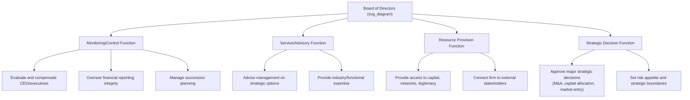

## Corporate Governance and the Board's Strategic Role

### Overview and Conceptual Foundation

Corporate governance refers to the system of structures, processes, and relationships through which an organization is directed, controlled, and held accountable to its stakeholders — most centrally its shareholders, but increasingly a broader constituency as well. Within strategic management, corporate governance is not a peripheral legal or compliance function; it is a core determinant of how strategic decisions are made, who has authority over them, and what mechanisms exist to correct strategic errors or managerial self-dealing.

The foundational problem corporate governance addresses is the **agency problem**: the separation of ownership (shareholders) from control (professional management) creates the potential for managers to pursue objectives that diverge from shareholder or stakeholder interests — empire-building, excessive risk aversion to protect personal job security, or resource consumption for private benefit. Governance structures, and particularly the board of directors, exist substantially to mitigate this divergence.

### Agency Theory Foundations

**Key Points**

- **Agency theory**, formalized by Jensen and Meckling (1976), models the relationship between shareholders (principals) and managers (agents) as one in which information asymmetry and misaligned incentives create **agency costs** — the costs of monitoring management, bonding mechanisms that align managerial incentives with shareholder interests, and residual losses from imperfect alignment.
- Corporate governance mechanisms are best understood as a portfolio of responses to the agency problem, spanning internal mechanisms (board oversight, executive compensation design, internal audit) and external mechanisms (market for corporate control, regulatory oversight, credit rating agencies, activist investors).

$$\text{Agency Costs} = \text{Monitoring Costs} + \text{Bonding Costs} + \text{Residual Loss}$$

### The Board of Directors: Structure and Composition

**Board Structures**

Governance systems vary internationally in board structure:

- **Unitary (one-tier) board** — a single board comprising both executive (inside) directors and non-executive (outside/independent) directors, common in the United States and United Kingdom.
- **Two-tier board** — a supervisory board (typically composed of non-executives, and in some jurisdictions including employee representatives) oversees a separate management board of executives, common in Germany and several other European systems.

**Director Independence**

A central governance design question concerns the proportion and role of **independent directors** — board members with no material financial or employment relationship with the firm beyond board service, intended to provide objective oversight of management. Governance codes and stock exchange listing requirements in most major markets mandate minimum independence thresholds, particularly for board committees handling audit, compensation, and nominating functions.

**CEO Duality**

**CEO duality** refers to the practice of a single individual holding both the Chief Executive Officer and Board Chair roles. This arrangement is contested in governance research: proponents argue it provides unified strategic leadership and decisive decision-making; critics argue it concentrates excessive power and undermines the board's capacity to hold the CEO accountable, since the CEO effectively chairs the body responsible for evaluating their own performance.

**[Inference]** Empirical findings on the performance consequences of CEO duality are mixed across studies, and the relationship likely depends on contextual factors such as industry dynamism and the strength of other governance mechanisms, rather than reflecting a universal effect in either direction.

### The Board's Strategic Functions

Governance scholarship (notably the work synthesized by Johnson, Daily, and Ellstrand) identifies four overlapping board functions relevant to strategy:

1. **Monitoring/control function** (rooted in agency theory) — overseeing management performance, evaluating and compensating the CEO, and safeguarding against managerial opportunism.
2. **Service/advisory function** (rooted in stewardship theory, which assumes managers are inherently motivated to act as good stewards) — providing counsel and expertise to management on strategic questions.
3. **Resource provision function** (rooted in resource dependence theory) — leveraging directors' networks, reputations, and expertise to secure critical resources, legitimacy, and external relationships.
4. **Strategic decision function** — direct board involvement in ratifying, and in some governance models actively shaping, major strategic choices such as acquisitions, divestitures, and large capital commitments.

### Board Committees and Their Strategic Relevance

| Committee | Primary Mandate | Strategic Relevance |
| --- | --- | --- |
| Audit Committee | Financial reporting integrity, internal controls, external auditor oversight | Ensures reliable information underlies strategic decision-making |
| Compensation Committee | Executive pay design, incentive alignment | Shapes managerial risk appetite and strategic time horizon via incentive structure |
| Nominating/Governance Committee | Director recruitment, board composition, succession planning | Determines the expertise and independence available for strategic oversight |
| Risk Committee (where separate) | Enterprise risk oversight | Sets boundaries on strategic risk-taking, particularly in regulated industries |

### Executive Compensation as a Governance and Strategy Lever

Executive compensation design functions as a primary **bonding mechanism** linking managerial incentives to shareholder and stakeholder interests. Common structural elements include:

- **Base salary** — fixed compensation, generally a minority of total pay for senior executives in large public firms
- **Short-term incentives (annual bonus)** — typically tied to annual financial or operational targets
- **Long-term incentives (equity-based compensation)** — stock options, restricted stock units, or performance shares, intended to align executive wealth with long-term shareholder value creation and to counteract short-termism
- **Clawback provisions** — mechanisms allowing the firm to recover previously paid compensation in cases of financial restatement or misconduct

**[Inference]** The design of long-term incentive structures materially shapes strategic risk-taking behavior — for example, heavy weighting toward stock options (which have asymmetric payoff structures) is often argued to encourage more aggressive risk-taking than restricted stock, though the magnitude of this effect likely varies by firm and industry context and is not a fixed, universally quantifiable relationship.

### Illustrative Example

A publicly traded technology firm's board faces a proposed acquisition that would roughly double the company's size. The board's governance functions activate simultaneously: the strategic decision function requires formal board approval given the transaction's materiality; the monitoring function requires independent directors to scrutinize management's valuation assumptions and challenge potential empire-building motives, since a larger firm typically increases CEO compensation and status independent of whether the deal creates shareholder value; the service/advisory function draws on directors with relevant M&A or industry experience to stress-test integration risk; and the resource provision function may be activated if directors' networks can facilitate financing or post-merger relationships. A board lacking sufficient independent, informed directors in this scenario is structurally weaker in its capacity to check a CEO strongly motivated to complete the deal.

### External Governance Mechanisms Complementing the Board

- **Market for corporate control** — the threat of hostile takeover disciplines underperforming management, since acquirers can remove entrenched leadership perceived as destroying shareholder value.
- **Institutional investor activism** — large shareholders (pension funds, activist hedge funds) engaging directly with management and boards, including proxy contests to replace directors.
- **Credit rating agencies and debt covenants** — creditors impose governance-relevant constraints through covenant terms restricting certain strategic actions (e.g., leverage limits, asset sale restrictions).
- **Regulatory and disclosure requirements** — securities regulators mandate governance disclosures (director independence, compensation structure, related-party transactions) that increase transparency and enable external monitoring.

### Comparative Summary: Governance Theories Underlying Board Function

| Theory | Core Assumption | Implication for Board Role |
| --- | --- | --- |
| Agency Theory | Managers may act opportunistically absent oversight | Board as monitor/controller; favors independence, separate CEO/Chair |
| Stewardship Theory | Managers are inherently motivated stewards of firm value | Board as advisor/partner; less emphasis on control mechanisms |
| Resource Dependence Theory | Firm success depends on securing external resources | Board as boundary-spanner; favors directors with valuable external ties |
| Stakeholder Theory | Firm accountable to broad stakeholder set, not shareholders alone | Board balances multiple constituencies' interests in strategic decisions |

**Related Topics**

- Agency theory and the principal-agent problem in organizational design
- Executive compensation structure and pay-for-performance sensitivity
- The market for corporate control and hostile takeover defenses
- Board diversity and its relationship to strategic decision-making quality
- ESG governance and board oversight of sustainability strategy
- Family business governance and founder-controlled firm structures
- Institutional investor activism and proxy contests