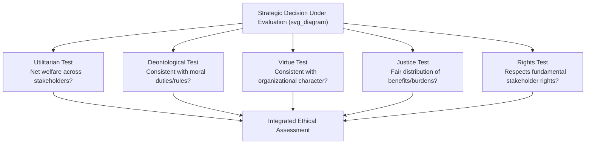

## Business Ethics in Strategic Decision-Making

### Overview and Conceptual Foundation

Business ethics in strategic decision-making concerns the frameworks, principles, and processes by which organizations evaluate the moral dimensions of their strategic choices — not as a constraint layered on top of strategy after the fact, but as an integral input into decisions about which markets to enter, how to compete, how to treat stakeholders, and how to allocate the value the organization creates. Where corporate governance (Item: Corporate Governance and the Board's Strategic Role) addresses the structures that hold decision-makers accountable, and stakeholder theory (Item: Stakeholder Theory and Analysis) addresses whose interests strategy should serve, business ethics addresses the normative criteria by which specific strategic choices should be judged right or wrong, and how those criteria can be systematically incorporated into the strategic management process.

Ethical considerations enter strategic decision-making at every level of the strategy hierarchy: corporate-level decisions about which industries to enter (e.g., weapons manufacturing, tobacco, fossil fuels) carry ethical weight independent of their financial attractiveness; business-level competitive decisions (e.g., predatory pricing, deceptive marketing) raise questions of fairness toward rivals and customers; and functional-level decisions (e.g., supply chain labor practices, environmental discharge) raise questions of harm to third parties not party to the immediate transaction.

### Major Ethical Frameworks Applied to Strategy

**Key Points**

Strategic management scholarship draws on several classical ethical frameworks, each yielding different guidance when applied to strategic choices:

- **Utilitarianism (Consequentialist)** — evaluates strategic decisions by their net consequences for aggregate welfare across affected parties. A strategic decision is ethical if it produces the greatest good for the greatest number, even if it imposes costs on some stakeholders. Criticized for potentially justifying harm to minority stakeholders if aggregate benefit is sufficiently large, and for the practical difficulty of measuring and comparing welfare across heterogeneous stakeholders.
- **Deontological Ethics (Duty-Based)** — evaluates strategic decisions by whether they adhere to moral duties and rules (e.g., honesty, respect for persons, non-maleficence) regardless of consequences. Kantian formulations emphasize treating stakeholders as ends in themselves, not merely as means to strategic objectives. Criticized for potential rigidity when duties conflict or when strict rule adherence produces poor outcomes.
- **Virtue Ethics** — evaluates strategic decisions by reference to the character and practical wisdom of the decision-maker, asking what a person or organization of good character would do, emphasizing traits such as integrity, fairness, courage, and prudence. Increasingly influential in discussions of organizational culture and ethical leadership.
- **Justice and Fairness Theories** — drawing substantially on Rawlsian principles, evaluate strategic decisions by their distributive effects, asking whether the resulting distribution of benefits and burdens across stakeholders is fair, with particular attention to the position of the least advantaged affected parties.
- **Rights-Based Approaches** — evaluate strategic decisions by whether they respect the fundamental rights of affected parties (e.g., privacy, safety, fair labor treatment), treating certain protections as non-negotiable regardless of aggregate benefit calculations.

**[Inference]** In practice, these frameworks frequently yield conflicting guidance on the same strategic decision, and most organizational ethics processes rely on some form of pluralistic, multi-framework reasoning rather than a single decisive test — a characteristic that makes systematic ethical evaluation genuinely difficult to formalize compared to purely financial decision criteria.

### Ethical Decision-Making Models in Strategic Contexts

A widely referenced structured approach to embedding ethical analysis within strategic decision processes includes the following stages:

1. **Issue recognition** — identifying that a strategic decision carries a material ethical dimension, which itself requires organizational sensitivity, since ethical issues embedded in routine strategic analysis (e.g., a sourcing decision framed purely in cost terms) are easily overlooked if not explicitly flagged.
2. **Stakeholder impact assessment** — mapping which stakeholders are affected by the decision and how, drawing directly on stakeholder analysis methodology.
3. **Framework-based evaluation** — applying multiple ethical frameworks (utilitarian, deontological, virtue-based, justice-based) to generate a range of perspectives on the decision.
4. **Alternative generation** — where a proposed strategic option raises significant ethical concerns, generating alternative strategic paths that achieve similar strategic objectives with less ethical cost.
5. **Decision and justification** — making the strategic choice with an explicit, documented ethical rationale, rather than treating the ethical dimension as an unstated afterthought.
6. **Outcome monitoring** — tracking the actual stakeholder consequences of the decision post-implementation, feeding back into future ethical decision-making.

### Illustrative Example

A pharmaceutical company developing a life-saving treatment for a disease concentrated in low-income countries faces a strategic pricing decision. A purely financial analysis might favor pricing at the level that maximizes expected shareholder return, potentially placing the treatment beyond the financial reach of most affected patients. Applying the ethical frameworks:

- **Utilitarian analysis** weighs the aggregate welfare gain from higher access (more lives saved, more disease burden reduced) against the reduced R&D incentive for future treatments if margins are compressed.
- **Deontological analysis** may invoke a duty of non-maleficence or a duty to provide access to essential medicines, independent of the consequentialist calculation.
- **Justice-based analysis** examines whether the resulting access pattern disproportionately burdens the least-advantaged populations who cannot afford treatment.
- **Rights-based analysis** may treat access to essential healthcare as a fundamental right constraining the acceptable pricing range regardless of aggregate welfare optimization.

A firm working through this structured process might arrive at a **tiered pricing strategy** — differential pricing by country income level — as a strategic option that better balances commercial sustainability (funding future R&D) against the ethical weight of access, illustrating how ethical analysis can generate genuinely new strategic alternatives rather than simply constraining a predetermined choice.

### Ethics and the Sources of Competitive Advantage

**Instrumental Arguments for Ethical Strategy**

- **Reputation and trust capital** — ethical conduct can function as an intangible, difficult-to-imitate resource (consistent with the Resource-Based View) that supports premium pricing, customer loyalty, and employee retention.
- **Risk mitigation** — unethical practices carry tail-risk exposure (litigation, regulatory sanction, reputational collapse) that can materially destroy firm value, making ethical strategy a component of enterprise risk management.
- **Talent attraction** — particularly among younger workforce cohorts, organizational ethical reputation is frequently cited as a factor in employment decisions, linking ethics to human capital strategy.

**Tensions and Critiques**

- **Ethics-performance link is contested** — as with stakeholder theory broadly, the empirical relationship between ethical conduct and financial performance is not uniformly positive across studies, and causality is difficult to establish.
- **Ethics-washing risk** — organizations may adopt the language and symbolic markers of ethical strategy (codes of conduct, CSR reports) without corresponding substantive changes to strategic decision-making, a critique closely paralleling the "purpose-washing" concern discussed in relation to organizational purpose.
- **Cross-cultural variation** — ethical frameworks and norms vary across the cultural and legal contexts in which multinational firms operate, raising difficult questions about whether strategic ethics should be governed by home-country norms, host-country norms, or a claimed set of universal minimum standards.

### Institutionalizing Ethics in Strategic Processes

| Mechanism | Function |
| --- | --- |
| Codes of conduct/ethics | Articulate explicit behavioral standards guiding strategic and operational choices |
| Ethics/compliance committees | Provide dedicated organizational capacity for evaluating ethical dimensions of major decisions |
| Ethical due diligence in M&A | Extends standard financial/legal due diligence to assess target company ethical risk exposure |
| Whistleblower mechanisms | Surface ethical concerns from within the organization that might not reach senior strategic decision-makers otherwise |
| Ethics training and leadership modeling | Builds organizational capacity (virtue-ethics oriented) for ethical judgment in decentralized strategic and operational decisions |

### Common Misconceptions and Clarifications

- **Misconception:** Business ethics and legal compliance are equivalent — an action that is legal is therefore ethical.

  **Clarification:** Legal minimums represent a floor, not an ethical ceiling; many widely recognized ethical failures in strategic decision-making (e.g., aggressive but technically legal tax avoidance, legal but exploitative labor practices in weakly regulated jurisdictions) occur within the bounds of law.
- **Misconception:** Ethical strategy is inherently in tension with, and typically subordinate to, financial performance objectives.

  **Clarification:** While genuine trade-offs exist in specific cases, much of the strategic management literature on ethics frames the relationship as more complex than a simple trade-off, with ethical failures frequently destroying substantial financial value (regulatory penalties, reputational damage, loss of stakeholder trust) — meaning the two objectives are not uniformly opposed.

**Related Topics**

- Corporate social responsibility (CSR) and its integration with corporate strategy
- Environmental, Social, and Governance (ESG) criteria in strategic and investment decision-making
- Cross-cultural ethics and strategy in multinational enterprises
- Whistleblowing and organizational ethical voice mechanisms
- Ethical leadership and its relationship to organizational culture
- Corporate scandals as case studies in strategic ethical failure