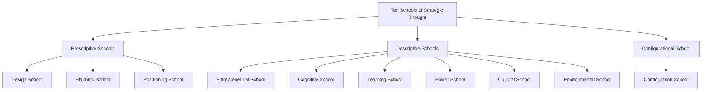

## Mintzberg's Ten Schools of Strategic Thought

### Overview

Henry Mintzberg, Bruce Ahlstrand, and Joseph Lampel classified strategic management theory into ten schools of thought in *Strategy Safari* (1998). The framework divides these schools into three groups: **prescriptive** (how strategy *should* be formulated), **descriptive** (how strategy actually *forms*), and one **configurational** school that integrates the rest across organizational life-cycle stages.

### Classification Structure

### The Three Prescriptive Schools

**Key Points**

| School | Core Premise | Central Metaphor | Key Proponent(s) |
| --- | --- | --- | --- |
| Design | Strategy formation as a conceptual process of fit between internal capability and external environment | Achieving fit | Andrews, Selznick |
| Planning | Strategy formation as a formal, structured planning process with discrete steps | A systematic process | Ansoff |
| Positioning | Strategy formation as an analytical process of selecting generic positions in the market | An analytical exercise | Porter |

#### Design School

The Design School treats strategy formulation as a deliberate process of conscious thought, best known through the **SWOT framework** (Strengths, Weaknesses, Opportunities, Threats). Strategy formation matches internal organizational capability to external possibility, producing a unique, explicit, and simple strategy that senior management then implements.

**Example**

A CEO and top team conduct a structured internal audit (distinctive competencies) and external scan (industry opportunities/threats), then converge on a single strategic statement before it cascades down for implementation.

Criticisms include an artificial separation of formulation from implementation ("thinking" vs. "doing"), and an assumption that strategy must be explicit before action, which the Learning School directly challenges.

#### Planning School

Developed largely by Igor Ansoff, the Planning School formalizes the Design School's premises into a rigorous sequence: goal-setting → external/internal audit → strategy evaluation → strategy operationalization, typically executed by planning staff rather than line managers, using detailed timetables, budgets, and programs.

Mintzberg's own critique — the "fallacies of planning" — identifies three failures:

1. **Fallacy of predetermination**: assumes the environment is predictable enough to plan for.
2. **Fallacy of detachment**: separates thinking (planners) from doing (managers), disconnecting strategy from operational reality.
3. **Fallacy of formalization**: assumes intuition and creativity can be replaced by formal procedure — "hard data" cannot substitute soft insight.

#### Positioning School

Popularized by Michael Porter's *Competitive Strategy* (1980), this school narrows strategy formation to selecting a **generic position** within an industry based on analytical assessment of structural forces.

**Key Points**

- Uses analytical tools: **Five Forces** (threat of new entrants, bargaining power of suppliers/buyers, threat of substitutes, competitive rivalry), **generic strategies** (cost leadership, differentiation, focus), and the **value chain**.
- Strategy content (the actual positions chosen) becomes as important as the process of forming it — a shift from the prior two schools' pure process focus.
- Criticized for being retrospective (fits mature/stable industries), reliant on hard quantifiable data over soft insight, and for narrowing strategy to a generic checklist rather than accommodating true novelty.

### The Six Descriptive Schools

**Key Points**

| School | Core Premise | Strategy Formation Process |
| --- | --- | --- |
| Entrepreneurial | Strategy as vision held intuitively by a single leader | Visionary, intuitive |
| Cognitive | Strategy as a mental/cognitive process | Mental framing, biases |
| Learning | Strategy as an emergent process | Incremental, trial-and-error |
| Power | Strategy as a process of negotiation | Political, coalition-based |
| Cultural | Strategy as a collective, social process | Rooted in shared beliefs |
| Environmental | Strategy as a reactive process | Environment-driven, deterministic |

#### Entrepreneurial School

Strategy formation centers on a single leader's **vision** — a semi-conscious mental representation of direction, often intuitive rather than analytically derived. Strategy is deliberate in its broad outline (the vision) but emergent in the details, since the leader adapts execution to circumstances as they unfold.

[Inference] Applicability is strongest in founder-led or small/young organizations where power is centralized, since the model depends on a single dominant vision-holder.

#### Cognitive School

Draws on cognitive psychology to examine strategy formation as occurring inside the strategist's mind — through information processing, mental frames, schemas, and cognitive biases (e.g., anchoring, groupthink, overconfidence). Two wings exist:

- **Objectivist wing**: the mind processes and reconstructs an objective reality, subject to distortion.
- **Subjectivist wing**: strategy is a subjective construction — the strategist interprets/creates reality rather than merely mapping it.

#### Learning School

Rooted in Charles Lindblom's incrementalism and later Mintzberg's own "crafting strategy" work, this school holds that strategies **emerge** as organizations learn over time through action, experimentation, and feedback, rather than being fully formulated in advance.

**Key Points**

- Introduces the well-known distinction between **deliberate strategy** (intended and realized as planned) and **emergent strategy** (a pattern that forms in the absence of, or despite, intentions).
- Related concept: **logical incrementalism** (Quinn) — strategy evolves through a series of small, logically-connected steps.
- Related concept: **absorptive capacity / core competence dynamics** — organizational learning capacity shapes what strategies are even conceivable.

$$\text{Realized Strategy} = \text{Deliberate Strategy} + \text{Emergent Strategy}$$

#### Power School

Views strategy formation as a process of **negotiation and political bargaining** among individuals, groups, and coalitions with competing interests. Two levels:

- **Micro power**: internal politicking, bargaining, and coalition-building within the organization.
- **Macro power**: the organization's use of its power over external stakeholders (suppliers, alliances, joint ventures) and its environment to negotiate favorable outcomes or collectively determined strategies.

#### Cultural School

The mirror image of the Power School — strategy formation is a **collective, cooperative process** rooted in the shared beliefs, values, and understandings (culture) of the organization's members. Strategy tends toward stability and resistance to fundamental change, since it is embedded in deeply held, often unconscious, organizational assumptions. Related to the **resource-based view (RBV)** in that culture can be a source of sustained competitive advantage that is difficult for competitors to imitate.

#### Environmental School

Positions the **environment** — not leadership, planning, or culture — as the central actor driving strategy, drawing on **organizational ecology / contingency theory**. The organization is viewed as passive, responding and adapting to external forces (economic, political, competitive), with leadership's role reduced largely to reading the environment and ensuring adaptation, or facing selection pressure (elimination) if it fails to adapt.

### The Configurational School (Integrative)

**Key Points**

- Argues organizations settle into stable **configurations** (structure, strategy, context, and process types) for extended periods, punctuated by occasional, often dramatic **transformation** to a different configuration.
- Integrates the other nine schools by proposing that each describes strategy formation appropriate to a *particular configuration or life-cycle stage* — e.g., the Entrepreneurial School fits a startup configuration, the Planning School fits a mature/machine-bureaucracy configuration, and the Power School fits a configuration in political crisis or turnaround.
- Draws heavily on Mintzberg's own earlier structural typology (simple structure, machine bureaucracy, professional bureaucracy, divisionalized form, adhocracy).

### Comparative Synthesis (svg_diagram)

<svg xmlns="http://www.w3.org/2000/svg" viewBox="0 0 760 300">
<text x="380" y="25" text-anchor="middle" font-size="15" font-weight="bold" fill="#222">Ten Schools — Process Nature (svg_diagram)</text>
<line x1="40" y1="60" x2="720" y2="60" stroke="#999" stroke-width="1" />
<text x="40" y="50" font-size="11" fill="#555">Deliberate</text>
<text x="680" y="50" font-size="11" fill="#555">Emergent</text>
<circle cx="90" cy="150" r="6" fill="#2b6cb0" />
<text x="90" y="175" text-anchor="middle" font-size="10">Design</text>
<circle cx="160" cy="150" r="6" fill="#2b6cb0" />
<text x="160" y="175" text-anchor="middle" font-size="10">Planning</text>
<circle cx="230" cy="150" r="6" fill="#2b6cb0" />
<text x="230" y="175" text-anchor="middle" font-size="10">Positioning</text>
<circle cx="310" cy="150" r="6" fill="#805ad5" />
<text x="310" y="175" text-anchor="middle" font-size="10">Entrepreneurial</text>
<circle cx="390" cy="150" r="6" fill="#805ad5" />
<text x="390" y="175" text-anchor="middle" font-size="10">Cognitive</text>
<circle cx="470" cy="150" r="6" fill="#c05621" />
<text x="470" y="175" text-anchor="middle" font-size="10">Learning</text>
<circle cx="540" cy="150" r="6" fill="#c05621" />
<text x="540" y="175" text-anchor="middle" font-size="10">Power</text>
<circle cx="600" cy="150" r="6" fill="#c05621" />
<text x="600" y="175" text-anchor="middle" font-size="10">Cultural</text>
<circle cx="660" cy="150" r="6" fill="#c05621" />
<text x="660" y="175" text-anchor="middle" font-size="10">Environmental</text>
<circle cx="380" cy="230" r="6" fill="#38a169" />
<text x="380" y="255" text-anchor="middle" font-size="10">Configurational (integrates all)</text>
</svg>

### Applications in Strategic Management Practice

- **Diagnostic use**: Practitioners can identify which school(s) implicitly dominate their organization's actual strategy process — useful for surfacing blind spots (e.g., an organization that only "plans" may neglect emergent learning).
- **Multi-lens analysis**: Case studies benefit from applying multiple schools simultaneously — e.g., a strategic decision can be analyzed through Positioning (industry structure), Power (internal negotiation), and Cultural (why the "obvious" analytical choice was resisted) lenses concurrently.
- **Life-cycle matching**: The Configurational School suggests matching formulation style to organizational stage — Entrepreneurial/Cognitive suits founding-stage ventures; Planning/Positioning suits mature, stable-industry firms; Learning/Power suits firms in turbulent transformation.

### Common Misconceptions

[Inference] The schools are frequently mistaught as sequential historical stages ("first Design, then Planning, then Positioning..."), when Mintzberg's original intent frames them as coexisting, competing lenses on the same phenomenon, not a linear evolution — though there is loose chronological emergence in when each school rose to academic prominence.

### Related Topics

- Deliberate vs. Emergent Strategy (Mintzberg & Waters, 1985)
- Porter's Five Forces Framework
- SWOT Analysis and the Design School
- Logical Incrementalism (Quinn)
- Resource-Based View (RBV) of the Firm
- Mintzberg's Organizational Configurations (Simple Structure, Machine Bureaucracy, Adhocracy, etc.)
- Strategic Planning Fallacies (Ansoff vs. Mintzberg debate)
- Organizational Ecology and Population Ecology Theory
- Blue Ocean Strategy (as a critique/extension of Positioning)
- Dynamic Capabilities Framework