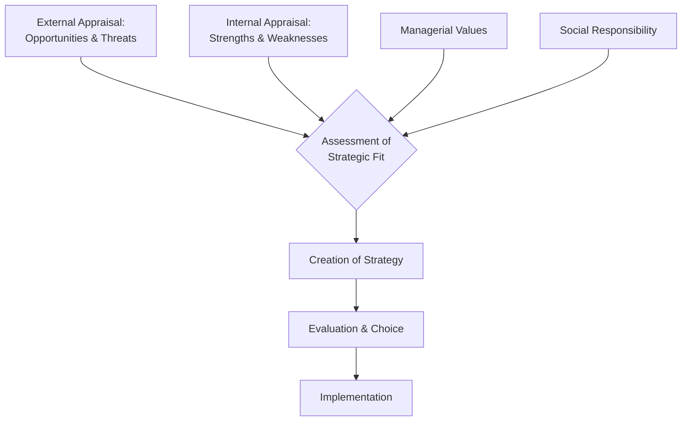
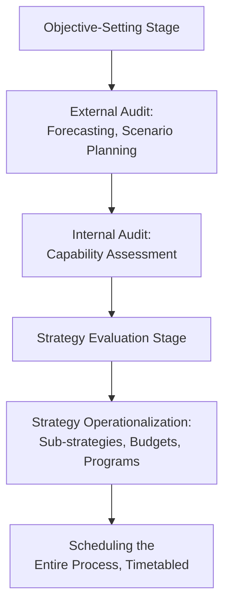

## The Design School and Planning School

### Overview

Both schools belong to the **prescriptive** group in Mintzberg's taxonomy — concerned with *how strategies should be formed* rather than how they actually form. The Planning School emerged directly from the Design School's premises, formalizing its basic model into an elaborate, staged procedure. Understanding them together highlights how a simple conceptual model can be extended into a rigid bureaucratic system — and why that extension drew heavy criticism.

### The Design School

#### Core Premise

Strategy formation is a process of **conscious, deliberate thought** — not an emergent, intuitive, or formally programmed process. A single senior architect (typically the CEO) conceives strategy as a considered response that achieves **fit** between the organization's internal situation and its external environment.

**Key Points**

- Originators: Philip Selznick (leadership/distinctive competence), Kenneth Andrews (Harvard Policy Model).
- Strategy formulation is kept distinct from strategy implementation ("think, then act").
- Strategy should be explicit, simple, and unique to the specific organization.
- The process is deliberate and controlled by a single strategist or small top team.

#### The SWOT / Fit Model

**Example**

A regional bank's leadership identifies external opportunities (deregulation opening new markets) and threats (fintech disruption), weighs these against internal strengths (branch network, regulatory relationships) and weaknesses (legacy IT), and converges on a single strategic direction — e.g., "become the digital-first community bank" — before implementation begins.

#### Premises and Criteria for a Good Strategy

Under the Design School, a strategy should satisfy several evaluative criteria (Andrews' framework):

1. **Consistency** — does not present mutually inconsistent goals/policies.
2. **Consonance** — represents an adaptive response to the external environment.
3. **Advantage** — creates/maintains competitive advantage in the chosen area.
4. **Feasibility** — neither overtaxes resources nor creates unsolvable problems.

#### Criticisms of the Design School

- **Separation of thinking and doing**: assumes formulation must complete before implementation begins, precluding learning during execution.
- **Structure follows strategy, rigidly**: assumes the organization's structure must ultimately conform to strategy, ignoring cases where existing structure constrains realistic strategic options.
- **Explicitness requirement**: assumes strategy must be made fully explicit, which may sacrifice the flexibility and ambiguity that supports adaptation.
- **Neglects emergent learning**: unlike the Learning School, it gives no room for strategy to form gradually through action.

### The Planning School

#### Core Premise

Strategy formation is a **formal, systematic planning process**, decomposable into clearly articulated steps, each supported by techniques (goal-setting checklists, budgets, operating plans), and typically executed with heavy involvement of dedicated **corporate planners/planning staff** rather than line managers alone.

**Key Points**

- Chief architect: H. Igor Ansoff (*Corporate Strategy*, 1965).
- Rose to prominence in the late 1960s/1970s, alongside the growth of formal corporate planning departments.
- Retains the Design School's fit logic but embeds it in a rigorous, procedural, quasi-bureaucratic sequence.
- Produces highly detailed output: hierarchies of objectives, budgets, sub-strategies, and operating programs — not just a single strategic statement.

#### The Formal Planning Sequence

**Example**

A multinational manufacturer runs an annual planning cycle: corporate planners issue guidelines and forecasts to divisions in Q1; divisions submit five-year strategic plans with quantified targets in Q2; corporate reviews and consolidates plans in Q3; approved plans convert into detailed operating budgets and capital allocation programs for the following fiscal year in Q4.

#### Ansoff's Contributions

- **Ansoff Matrix**: a 2×2 growth-strategy framework — market penetration, market development, product development, diversification — cross-tabulating existing/new products against existing/new markets.

$$\text{Growth Vector} = f(\text{Product}, \text{Market})$$

- **Gap Analysis**: comparing desired performance trajectory against a forecast "as-is" trajectory to identify the strategic gap requiring closure.
- **Synergy concept**: the "2+2=5" effect sought through diversification or combination of business units.

#### Mintzberg's Critique — The Three Fallacies of Planning

**Key Points**

| Fallacy | Description | Consequence |
| --- | --- | --- |
| Predetermination | Assumes the environment can be forecast accurately enough to plan around | Plans break down under real discontinuity/uncertainty |
| Detachment | Separates planners (thinkers) from managers (doers) | Strategy loses touch with operational reality |
| Formalization | Assumes formal procedures/hard data can substitute for intuition and soft information | Loses tacit knowledge, creativity, and adaptive insight |

[Inference] Mintzberg's broader argument — captured in the phrase "planning is not strategic thinking" — is that formal planning systems are best suited to *programming* an already-formulated strategy (translating it into budgets and schedules), not to *creating* it in the first place, since genuine strategic insight tends to arise from synthesis rather than decomposition.

### Comparative Analysis

**Key Points**

| Dimension | Design School | Planning School |
| --- | --- | --- |
| Process nature | Conceptual, informal | Formal, decomposed into steps |
| Key actor | CEO/chief strategist | Planning staff + management |
| Core tool | SWOT | Forecasting, gap analysis, Ansoff Matrix |
| Output | Single unique perspective | Detailed hierarchy of plans/budgets |
| Time orientation | Point-in-time synthesis | Extended, scheduled cycle |
| Degree of formality | Low-moderate | High |
| Primary critique | Formulation/implementation separation | Predetermination, detachment, formalization fallacies |

### Applications in Strategic Management Practice

- **Design School logic** persists today in strategy workshops, SWOT-based strategic reviews, and executive off-sites where a leadership team seeks a unifying strategic statement.
- **Planning School logic** persists in formal annual strategic planning cycles, corporate budgeting processes, and balanced scorecard cascades used by large, mature organizations — particularly where regulatory or investor reporting demands documented, quantified plans.
- [Inference] Organizations facing high environmental turbulence (e.g., fast-moving tech markets) tend to rely less on pure Planning School procedures and more on Learning School or Entrepreneurial School approaches, since Ansoff-style forecasting loses reliability as volatility increases.

### Related Topics

- SWOT Analysis Framework
- Ansoff Matrix and Growth Vector Analysis
- Mintzberg's Critique of Strategic Planning (*The Rise and Fall of Strategic Planning*, 1994)
- Deliberate vs. Emergent Strategy
- Positioning School (Porter) — the third prescriptive school
- Corporate Planning Departments and Strategic Control Systems
- Scenario Planning and Forecasting Techniques
- Gap Analysis in Strategic Management