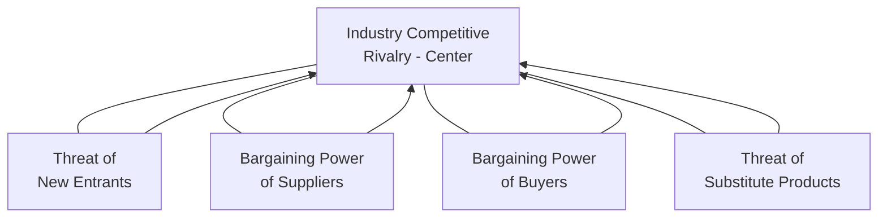
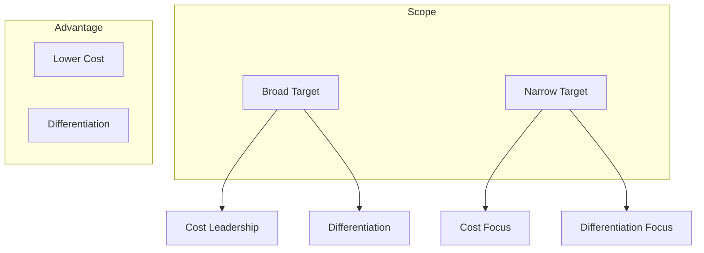
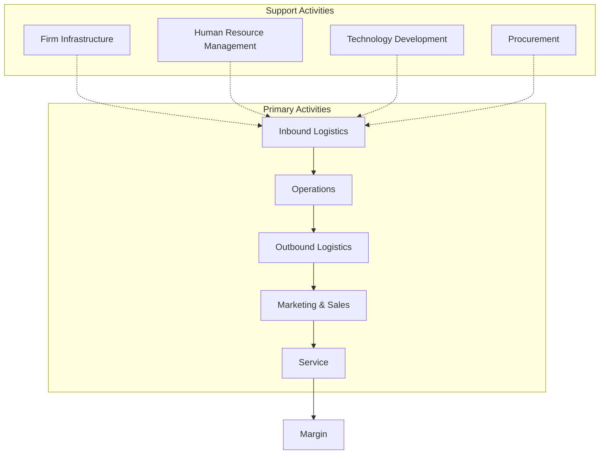

## The Positioning School and Porter's Contributions

### Overview

The Positioning School is the third of Mintzberg's prescriptive schools, following the Design and Planning schools chronologically and conceptually. It narrows strategy formation to the **analytical selection of a generic position** within an industry, based on rigorous structural analysis. Michael Porter's work — beginning with *Competitive Strategy* (1980) — became so dominant within this school that the two are often treated as nearly synonymous.

### Core Premise of the Positioning School

**Key Points**

- Strategies are **generic**, identifiable positions in the marketplace — not unique creations, as the Design School assumed.
- The industry (its economic and competitive structure) is the primary unit of analysis, not the individual firm alone.
- The strategy-formation process is one of **analytical calculation and selection**, performed by analysts who hand results to management, echoing the Planning School's staff-driven structure.
- Strategy content — the substantive choices themselves — becomes central, marking a shift from the prior two schools' focus purely on process.
- Emerged from military strategy and economics traditions, drawing heavily on Industrial Organization (IO) economics.

### Porter's Five Forces Framework

Analyzes industry attractiveness/profitability potential by examining five structural forces.

**Key Points**

| Force | Key Drivers |
| --- | --- |
| Threat of new entrants | Economies of scale, capital requirements, brand loyalty, switching costs, government policy, access to distribution |
| Bargaining power of suppliers | Supplier concentration, switching costs, availability of substitute inputs, importance of volume to supplier |
| Bargaining power of buyers | Buyer concentration, price sensitivity, switching costs, availability of substitute products |
| Threat of substitutes | Relative price-performance of substitutes, buyer propensity to substitute |
| Competitive rivalry | Number/balance of competitors, industry growth rate, fixed costs, product differentiation, exit barriers |

**Example**

Analyzing the commercial airline industry: high fixed costs and slow growth intensify rivalry; high capital requirements and regulatory approval create moderate entry barriers; buyer power is high due to price comparison platforms; supplier power is high where aircraft manufacturers form a near-duopoly (Boeing/Airbus) — together indicating a structurally low-profitability industry regardless of individual firm execution.

### Porter's Generic Strategies

Firms should choose one of three positions to avoid being "stuck in the middle" (a position Porter argued yields below-average returns).

**Key Points**

- **Cost Leadership**: becoming the lowest-cost producer in the industry, typically via scale economies, process efficiency, and tight cost control (e.g., discount retailers).
- **Differentiation**: offering unique attributes (quality, brand, technology, service) that customers value and will pay a premium for (e.g., premium consumer brands).
- **Focus (Cost or Differentiation)**: targeting a narrow segment with either a cost or differentiation advantage tailored to that niche, rather than competing industry-wide.

$$\text{Competitive Advantage} = f(\text{Scope}, \text{Cost/Differentiation Position})$$

### The Value Chain

Decomposes firm activities into **primary** and **support** categories to identify sources of cost advantage and differentiation.

**Example**

A specialty coffee roaster differentiates through procurement (direct-trade sourcing), operations (small-batch roasting), and marketing (storytelling around origin) — each value-chain activity contributing to a differentiated position that supports premium pricing.

### Additional Porter Contributions

- **Diamond Model (National Competitive Advantage)**: explains why certain nations/regions become globally competitive in specific industries, based on four interrelated determinants — factor conditions, demand conditions, related/supporting industries, and firm strategy/structure/rivalry.
- **Strategic Groups**: clusters of firms within an industry following similar strategies, useful for analyzing competitive dynamics at a finer grain than the full industry.
- **Shared Value concept** (later work, with Mark Kramer): reframes competitive strategy to simultaneously create economic and societal value, addressing critiques that pure competitive positioning ignores stakeholder/social concerns. [Unverified] The degree of adoption and practical rigor of shared-value initiatives across industries varies and is contested in academic literature.

### Criticisms of the Positioning School

**Key Points**

- **Retrospective bias**: analytical frameworks are built on historical/quantifiable industry data, making them well-suited to stable, mature industries but weaker for anticipating discontinuous change or genuinely novel strategies.
- **Overemphasis on hard data**: privileges quantifiable analysis over soft, tacit organizational knowledge — echoing the Planning School's "formalization fallacy."
- **Narrowing of strategy to generic categories**: risks reducing rich, firm-specific strategic creativity to a checklist of predetermined positions.
- **Assumes industry structure is relatively fixed**: newer views (e.g., Hypercompetition, Blue Ocean Strategy) argue firms can reshape industry structure rather than merely position within it.
- [Inference] The framework's popularity in MBA curricula and consulting practice likely stems from its clarity and teachability relative to more process-oriented schools, even where its explanatory power for fast-moving or emergent industries is more limited.

### Comparative Position Within Mintzberg's Framework

**Key Points**

| Attribute | Design | Planning | Positioning |
| --- | --- | --- | --- |
| Focus | Conceptual fit | Formal process | Analytical content |
| Key question | "What is our unique strategy?" | "How do we systematize planning?" | "Which generic position should we occupy?" |
| Primary tool | SWOT | Ansoff Matrix, gap analysis | Five Forces, generic strategies, value chain |
| Data orientation | Qualitative synthesis | Quantitative + qualitative | Heavily quantitative/analytical |
| Best suited to | Novel, unique situations | Complex, resource-heavy firms | Stable, mature, well-defined industries |

### Applications in Strategic Management Practice

- Industry attractiveness assessments before market entry or investment decisions commonly start with a Five Forces analysis.
- Business unit strategy reviews frequently use generic strategy positioning to check for "stuck in the middle" risk.
- Value chain analysis remains a standard diagnostic tool for identifying cost-reduction or differentiation opportunities during operational strategy reviews.

### Related Topics

- Five Forces Framework — Deep Dive
- Generic Competitive Strategies and the "Stuck in the Middle" Trap
- Value Chain Analysis and Activity Mapping
- Porter's Diamond Model of National Advantage
- Blue Ocean Strategy as a Critique of Positioning
- Industrial Organization (IO) Economics Foundations
- Strategic Groups Analysis
- Shared Value and Stakeholder-Inclusive Strategy