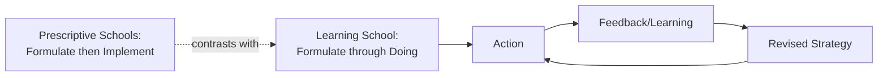
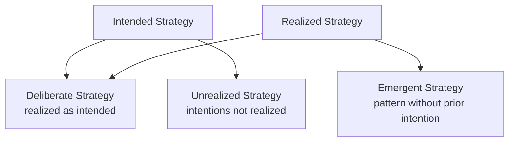

## The Learning School and Emergent Strategy

### Overview

The Learning School represents one of Mintzberg's most influential descriptive schools, fundamentally challenging the prescriptive schools' assumption that strategy must be fully formulated before implementation begins. Instead, it holds that strategies **emerge** over time as organizations act, experiment, and learn from the outcomes of their actions — formulation and implementation become intertwined rather than sequential.

### Core Premise

**Key Points**

- Strategy formation is a process of **learning over time**, in which formulation and implementation become virtually indistinguishable.
- Complex, unpredictable environments preclude full deliberate control — organizations must proceed incrementally and adjust as they learn.
- Key contributors: Charles Lindblom (incrementalism), James Brian Quinn (logical incrementalism), Karl Weick (enactment/sensemaking), and Mintzberg himself (crafting strategy, emergent strategy).
- Strategic initiatives can arise from anywhere in the organization, not solely from top leadership — "grassroots" strategy formation.

### Deliberate vs. Emergent Strategy

Mintzberg and Waters' (1985) foundational distinction, central to the Learning School's theoretical contribution.

**Key Points**

| Type | Definition | Example |
| --- | --- | --- |
| Deliberate Strategy | Intentions that are realized exactly as planned | A formal five-year expansion plan executed as written |
| Unrealized Strategy | Intended strategy that fails to be realized | A planned merger that falls through |
| Emergent Strategy | A consistent pattern in actions that forms without explicit prior intention | A pattern of product features emerging from repeated ad hoc customer requests, later recognized and codified as strategy |
| Realized Strategy | The strategy actually carried out, composed of both deliberate and emergent elements | The organization's actual competitive pattern over a period |

$$\text{Realized Strategy} = \text{Deliberate Strategy} + \text{Emergent Strategy}$$

**Example**

A mid-sized software firm intends to focus exclusively on enterprise clients (deliberate strategy). Over eighteen months, sales representatives repeatedly close smaller deals with mid-market clients out of short-term necessity. Leadership notices this recurring pattern, recognizes unexpected traction, and formally adopts a mid-market product line — an emergent strategy that was never part of the original intent but became part of the realized strategy.

### Logical Incrementalism (Quinn)

James Brian Quinn's concept describes how effective strategists deliberately proceed **incrementally**, building strategy through a series of small, tentative, logically-sequenced steps, testing commitment and gathering information before making larger commitments.

**Key Points**

- Bridges deliberate intent (the strategist retains overall direction) with emergent flexibility (specific steps adapt as new information arrives).
- Allows organizations to build internal consensus and manage political resistance gradually, rather than through abrupt top-down mandates.
- Contrasts with Lindblom's "disjointed incrementalism," which describes a more reactive, politically-driven process without a guiding logic.

### Related Concepts

**Key Points**

- **Enactment / Sensemaking (Weick)**: organizations partly *create* the environments they respond to through their own actions and interpretations, rather than passively perceiving an objective external reality — strategy formation is thus retrospective sensemaking as much as prospective planning.
- **Organizational Learning Capacity**: the organization's capacity to absorb, interpret, and act on new information shapes which strategies are conceivable at all (related to the later concept of **absorptive capacity**, Cohen & Levinthal).
- **Core Competence Dynamics (Prahalad & Hamel)**: often associated with the Learning School's evolutionary strand — competitive advantage builds cumulatively from collective organizational learning around core capabilities rather than from a single deliberate positioning choice.
- **Strategy-as-Practice**: a later academic movement extending Learning School ideas, examining strategy as something people *do* through everyday micro-activities, rather than something an organization simply *has*.

### Process Comparison: Prescriptive vs. Learning Approach

**Key Points**

| Dimension | Prescriptive Schools (Design/Planning/Positioning) | Learning School |
| --- | --- | --- |
| Sequencing | Formulation precedes implementation | Formulation and implementation intertwined |
| Strategist role | Central architect or planning staff | Distributed across the organization |
| Adaptability | Low once plan is set | High, continuous adjustment |
| Best suited to | Stable, predictable environments | Complex, novel, or rapidly changing environments |
| Risk | Rigidity, missed emergent opportunities | Drift, lack of coherent direction if unchecked |

### Criticisms of the Learning School

- **Risk of strategic drift**: without any deliberate anchoring, purely emergent processes can produce incoherent or directionless strategy — critics argue pure emergence abdicates leadership responsibility.
- **Retrospective bias in recognition**: emergent patterns are often only recognized as "strategy" after the fact, raising the question of whether this constitutes genuine strategic management or post-hoc rationalization.
- **Scalability concerns**: incremental, learning-based approaches may struggle in situations demanding decisive, large-scale strategic moves (e.g., major acquisitions, crisis turnarounds) where deliberate top-down direction is more effective.
- [Inference] In practice, most real organizations likely blend deliberate and emergent elements rather than adhering purely to either mode, which is consistent with Mintzberg's own framing of the realized-strategy equation rather than treating the schools as mutually exclusive.

### Applications in Strategic Management Practice

- **Agile/lean strategy processes**: modern iterative planning cycles (e.g., quarterly OKR reviews, build-measure-learn loops in lean startup methodology) operationalize Learning School principles.
- **Innovation management**: organizations often deliberately create space for emergent strategy by funding exploratory initiatives without rigid upfront business cases, then formalizing successful patterns.
- **Post-merger integration and turnarounds**: leaders frequently combine a deliberate overarching direction with incremental, learning-based execution steps, echoing Quinn's logical incrementalism.

### Related Topics

- Mintzberg & Waters' Deliberate/Emergent Strategy Typology (1985)
- Logical Incrementalism (Quinn)
- Sensemaking and Enactment Theory (Weick)
- Core Competence and Resource-Based View
- Strategy-as-Practice Perspective
- Agile Strategic Planning and OKRs
- Absorptive Capacity (Cohen & Levinthal)
- Planning School (contrast case)