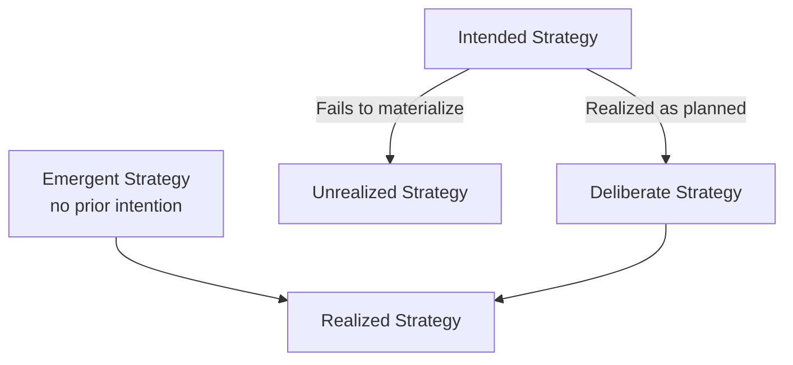
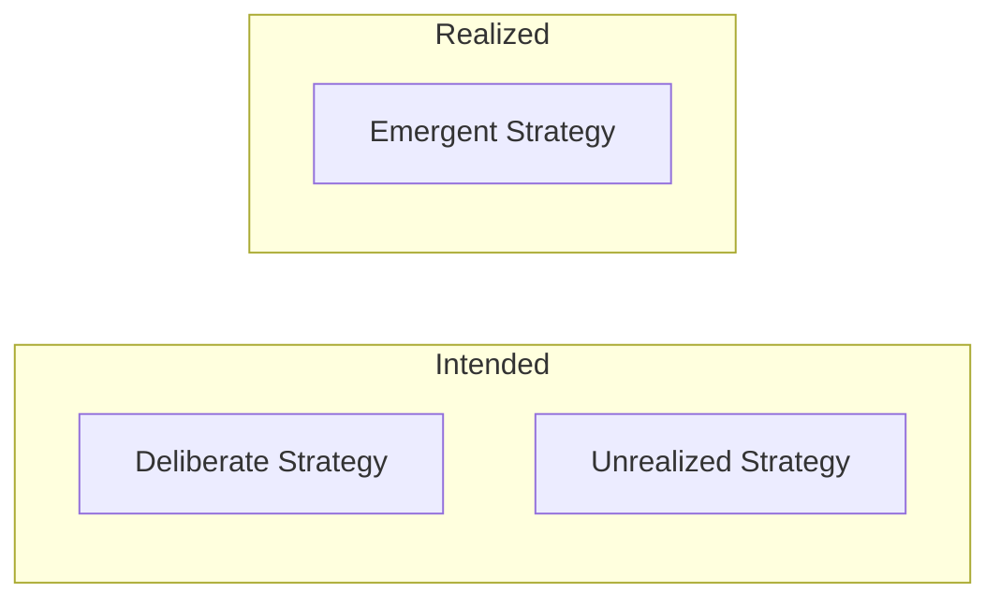
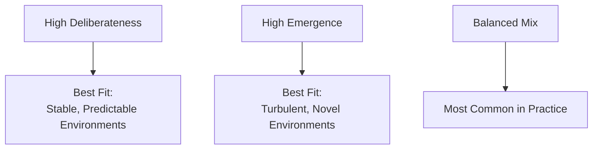

## Deliberate versus Emergent Strategy

### Overview

Introduced by Henry Mintzberg and James Waters in their 1985 paper "Of Strategies, Deliberate and Emergent," this distinction is one of the most widely cited frameworks in strategic management. It reframes strategy not as a singular plan but as a **pattern in a stream of actions**, decomposable into how much of that pattern was intended in advance versus how much formed without prior intention.

### Foundational Definition of Strategy

Mintzberg's broader definition underlies this framework: strategy is **"a pattern in a stream of decisions/actions"** — not merely a document or a stated plan. This shifts the analytical question from "what did leadership intend?" to "what pattern actually occurred?"

$$\text{Strategy} = \text{Pattern}(\text{Actions}_1, \text{Actions}_2, \ldots, \text{Actions}_n)$$

**Key Points**

- A strategy can exist even without being consciously intended, as long as consistent behavior over time reveals a pattern.
- This definition enables the deliberate/emergent split — intention (plan) and pattern (realized behavior) are analytically separable and empirically often diverge.

### The Four Components

**Key Points**

| Component | Definition | Requires Prior Intent? | Actually Realized? |
| --- | --- | --- | --- |
| Deliberate Strategy | Intentions fully realized as planned | Yes | Yes |
| Unrealized Strategy | Intentions that fail to materialize | Yes | No |
| Emergent Strategy | A pattern that forms without explicit prior intent | No | Yes |
| Realized Strategy | The actual strategy carried out (= Deliberate + Emergent) | Mixed | Yes |

### Conditions for a Purely Deliberate Strategy

Mintzberg and Waters specify that pure deliberateness requires:

1. Precise, articulated intentions existing at the organization's collective level in advance.
2. Those intentions being common/shared across the entire organization (not merely held by one individual).
3. Those collective intentions being realized exactly as intended — with no interference from external market, technological, or political forces during implementation.

[Inference] These conditions are stringent enough that Mintzberg and Waters themselves argue **purely deliberate strategy is rare in practice** — most real-world organizational strategies combine deliberate and emergent elements to varying degrees.

### The Continuum: Types of Strategy

Mintzberg and Waters identified several strategy types positioned along the deliberate-emergent continuum, rather than treating it as a strict binary.

**Key Points**

| Strategy Type | Description |
| --- | --- |
| Planned | Precise intentions from central leadership, controlled implementation, highly deliberate |
| Entrepreneurial | Vision held by a single leader, adaptable in detail — deliberate in broad direction, emergent in specifics |
| Ideological | Shared beliefs/vision held collectively by organizational members, controlled through strong culture |
| Umbrella | Leadership sets broad boundaries/guidelines; specifics emerge within them — deliberately constrained, emergently detailed |
| Process | Leadership controls the process of strategy-making (who's involved, structure) but not its content — process deliberate, content emergent |
| Unconnected | Sub-units produce their own patterns disconnected from or contradicting central intentions |
| Consensus | Pattern emerges through mutual adjustment among actors without central direction, converging by consensus |
| Imposed | Pattern is imposed by an external environment/actor rather than chosen internally |

**Example**

A large tech conglomerate sets a broad "umbrella" directive — all business units must pursue AI-enabled features — but leaves the specific products, technical approaches, and go-to-market tactics to individual product teams. The overarching directive is deliberate; the resulting mix of specific AI features that actually reach market is emergent within that boundary.

### Deliberate–Emergent Balance in Practice

**Key Points**

- High deliberateness suits environments where forecasting is reliable and the organization can exert strong control (regulated industries, capital-intensive infrastructure projects).
- High emergence suits environments with rapid, unpredictable change (early-stage ventures, disruptive technology markets), where rigid adherence to an initial plan risks obsolescence.
- [Inference] Most established organizations likely operate with a blend — deliberate strategic direction at a broad level (umbrella/process types), combined with emergent adaptation in execution detail — consistent with the "realized = deliberate + emergent" equation rather than occupying either pure extreme.

### Relationship to Mintzberg's Ten Schools

**Key Points**

- The prescriptive schools (Design, Planning, Positioning) implicitly assume high deliberateness — strategy is fully conceived before action.
- The Learning School is built directly on the emergent half of this framework — organizations discover strategy through action and only recognize the pattern afterward.
- The Entrepreneurial School corresponds closely to the "entrepreneurial strategy" type — deliberate vision, emergent detail.
- The Cultural School corresponds to "ideological strategy" — a collectively-held, deliberately reinforced pattern.

### Managerial Implications

- **Strategic control systems** should track not only whether intended plans were executed (deliberate strategy tracking) but also whether new, unplanned patterns of success are emerging that merit formal recognition and resourcing.
- **Leadership's role in emergence** is not passive — Mintzberg argues effective leaders recognize valuable emergent patterns and choose whether to formalize, redirect, or curtail them, rather than either rigidly enforcing the original plan or losing control entirely.
- **Balancing risk**: overreliance on deliberate strategy risks missing valuable opportunities that arise organically; overreliance on emergence risks incoherence and loss of strategic direction — a tension the Configurational School addresses by suggesting the appropriate balance shifts with organizational life-cycle stage.

### Criticisms and Limitations

- **Measurement difficulty**: distinguishing genuinely emergent patterns from retrospectively rationalized ones is empirically difficult — organizations may claim strategies were "emergent" as a post-hoc narrative rather than an accurate description.
- **Attribution ambiguity**: in large, complex organizations, determining whether a given pattern was truly unintended (emergent) or quietly intended by some but not communicated organization-wide (deliberate but undisclosed) can be unclear.
- [Unverified] The precise proportion of deliberate versus emergent elements in any given firm's realized strategy is inherently difficult to quantify empirically and is typically assessed qualitatively through case analysis rather than precise measurement.

### Related Topics

- Learning School (Mintzberg's Ten Schools)
- Logical Incrementalism (Quinn)
- Entrepreneurial School and Visionary Leadership
- Strategy-as-Practice Perspective
- Strategic Control and Performance Tracking Systems
- Mintzberg's Definition of Strategy (5 Ps: Plan, Ploy, Pattern, Position, Perspective)
- Organizational Sensemaking (Weick)