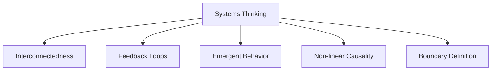
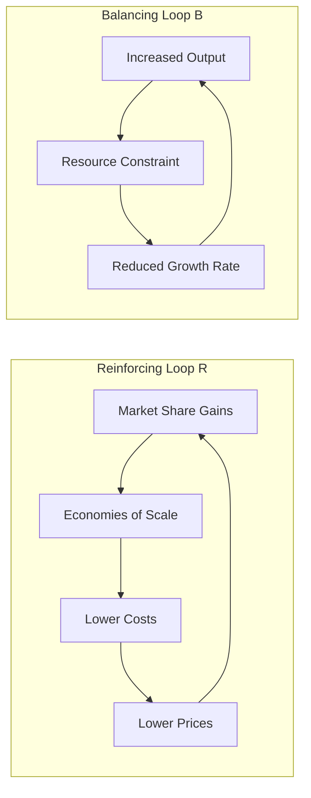

## Systems Thinking in Strategy

### Overview

Systems thinking applies a holistic, interconnected view of organizations to strategic management — treating the firm not as a collection of independent parts but as a complex system of interdependent elements (people, processes, resources, structures) interacting with a broader external environment. Where analytical schools like Positioning decompose strategy into discrete components, systems thinking emphasizes **feedback loops, interdependencies, emergent behavior, and non-linear causality**.

### Core Principles

**Key Points**

- **Holism**: the system's behavior cannot be fully understood by analyzing its parts in isolation — the whole exhibits properties that individual components do not (emergence).
- **Interdependence**: elements within the organization (and between the organization and its environment) mutually influence one another; a change in one part propagates through the system.
- **Feedback loops**: outputs of a process feed back as inputs, either amplifying change (**reinforcing loops**) or counteracting it (**balancing loops**).
- **Boundaries**: systems thinkers explicitly define what is inside versus outside the system under study, since boundary choice shapes which interdependencies are considered.
- **Delays**: effects of strategic actions often manifest with time lags, complicating cause-effect attribution and increasing risk of overcorrection.

### Feedback Loop Structures

**Example**

A ride-sharing platform experiences a reinforcing loop: more drivers → shorter wait times → more riders → higher driver earnings → more drivers join. This same platform faces a balancing loop: rapid growth → regulatory scrutiny → new compliance costs → slower expansion — the balancing loop counteracts unchecked reinforcement.

### Systems Archetypes

Common recurring feedback structures identified in systems thinking literature (rooted in Peter Senge's *The Fifth Discipline*, 1990), useful for diagnosing recurring strategic problems.

**Key Points**

| Archetype | Pattern | Strategic Example |
| --- | --- | --- |
| Limits to Growth | A reinforcing loop drives growth until a balancing loop (resource constraint) caps it | Rapid customer acquisition eventually strained by support-team capacity |
| Shifting the Burden | A quick symptomatic fix is used repeatedly instead of addressing root cause, weakening long-term capability | Relying on discounting to boost sales instead of fixing product-market fit |
| Success to the Successful | Resources flow disproportionately to already-successful units, starving others of investment | A conglomerate over-investing in its star business unit while neglecting emerging ones |
| Tragedy of the Commons | Shared resources are over-exploited by individually rational actors, degrading the resource for all | Business units competing for a shared brand's reputation, each maximizing short-term unit performance at brand's expense |
| Fixes that Fail | A fix produces short-term relief but unintended long-term consequences that worsen the original problem | Cost-cutting layoffs that erode institutional knowledge, ultimately raising long-term costs |

### Systems Thinking Applied to Strategy Formation

**Key Points**

- **Complements the Learning School**: both view organizations as adaptive, evolving entities; systems thinking adds explicit causal-loop modeling to the Learning School's more qualitative emergent-pattern recognition.
- **Contrasts with linear prescriptive models**: the Design/Planning/Positioning schools' step-by-step sequences assume relatively linear cause-effect chains; systems thinking explicitly models circular causality and delayed feedback that linear models miss.
- **Scenario planning integration**: systems thinking underpins robust scenario planning by mapping how multiple environmental variables interact dynamically rather than treating them as independent forecast inputs.
- **Root-cause diagnosis**: used to move beyond addressing symptoms (e.g., declining sales) to identifying underlying structural drivers (e.g., a reinforcing loop of underinvestment in R&D leading to product staleness).

### Causal Loop Diagram Example (svg_diagram)

<svg xmlns="http://www.w3.org/2000/svg" viewBox="0 0 720 320">
<text x="360" y="25" text-anchor="middle" font-size="15" font-weight="bold" fill="#222">Reinforcing Growth Loop with Balancing Constraint (svg_diagram)</text>
<circle cx="150" cy="150" r="50" fill="none" stroke="#2b6cb0" stroke-width="2" />
<text x="150" y="145" text-anchor="middle" font-size="11">Customer</text>
<text x="150" y="160" text-anchor="middle" font-size="11">Acquisition</text>
<circle cx="360" cy="80" r="50" fill="none" stroke="#2b6cb0" stroke-width="2" />
<text x="360" y="75" text-anchor="middle" font-size="11">Revenue</text>
<text x="360" y="90" text-anchor="middle" font-size="11">Growth</text>
<circle cx="570" cy="150" r="50" fill="none" stroke="#2b6cb0" stroke-width="2" />
<text x="570" y="145" text-anchor="middle" font-size="11">Marketing</text>
<text x="570" y="160" text-anchor="middle" font-size="11">Investment</text>
<circle cx="360" cy="250" r="50" fill="none" stroke="#c05621" stroke-width="2" />
<text x="360" y="245" text-anchor="middle" font-size="11">Support</text>
<text x="360" y="260" text-anchor="middle" font-size="11">Capacity Strain</text>
<line x1="195" y1="130" x2="320" y2="95" stroke="#2b6cb0" stroke-width="1.5" marker-end="url(#arrow1)" />
<line x1="400" y1="95" x2="530" y2="135" stroke="#2b6cb0" stroke-width="1.5" marker-end="url(#arrow1)" />
<line x1="545" y1="195" x2="405" y2="232" stroke="#c05621" stroke-width="1.5" marker-end="url(#arrow2)" />
<line x1="330" y1="225" x2="185" y2="180" stroke="#c05621" stroke-width="1.5" marker-end="url(#arrow2)" />

<text x="255" y="100" font-size="10" fill="`#2b6cb0`">+</text>

<text x="465" y="105" font-size="10" fill="`#2b6cb0`">+</text>

<text x="480" y="220" font-size="10" fill="`#c05621`">+</text>

<text x="255" y="215" font-size="10" fill="`#c05621`">-</text>

</svg>

### Relationship to Mintzberg's Schools of Thought

**Key Points**

- Systems thinking is not one of Mintzberg's original ten schools, but conceptually aligns most closely with the **Environmental School** (organization as an open system responding to external forces) and the **Learning School** (adaptive, feedback-driven strategy formation).
- Provides analytical rigor that pure Learning School narrative description often lacks — formalizing "learning" through explicit causal-loop and stock-flow modeling.
- Complements the **Configurational School** by helping explain *why* organizations settle into stable configurations (self-reinforcing loops) and *why* transformations are often abrupt (balancing loops reaching a tipping point, or reinforcing loops finally breaking down).

### Tools and Techniques

- **Causal Loop Diagrams (CLDs)**: visual maps of reinforcing (R) and balancing (B) feedback loops among strategic variables.
- **Stock-and-Flow Models**: quantify accumulations (stocks — e.g., installed customer base) and their rates of change (flows — e.g., acquisition rate, churn rate) to simulate strategic dynamics over time.
- **System Dynamics Simulation**: computer-based modeling (e.g., using Vensim, Stella) to simulate how strategic variables evolve given specified feedback structures — used in scenario testing and policy analysis.
- **The Iceberg Model**: a diagnostic tool distinguishing observable *events* (visible tip) from underlying *patterns*, *structures*, and *mental models* (submerged, root-cause layers) — encourages strategists to address structural/mental-model layers rather than merely reacting to events.

$$\text{Rate of Change of Stock} = \text{Inflow Rate} - \text{Outflow Rate}$$

### Applications in Strategic Management Practice

- **Diagnosing chronic strategic problems**: using archetypes like "Shifting the Burden" to identify why repeated tactical fixes (e.g., price discounts) fail to resolve underlying competitiveness issues.
- **Scenario and risk modeling**: system dynamics simulations help executives stress-test strategic plans against interacting variables (e.g., supply chain, demand, regulatory shifts) rather than isolated single-variable forecasts.
- **Organizational design**: understanding feedback loops between structure, incentives, and behavior helps avoid unintended consequences when redesigning organizational systems (e.g., incentive schemes triggering unintended "success to the successful" dynamics).
- [Inference] Firms operating in complex, interconnected industries (e.g., platform businesses with network effects) likely benefit disproportionately from explicit systems modeling, since network-effect dynamics are inherently reinforcing-loop-driven and poorly captured by static analytical frameworks like Five Forces alone.

### Criticisms and Limitations

- **Modeling complexity**: building accurate causal-loop or system dynamics models requires significant expertise and can become so complex that practical decision-usefulness declines.
- **Data and calibration challenges**: quantitative system dynamics models require reliable historical data to calibrate relationships, which may be unavailable for novel strategic situations.
- **Risk of false precision**: simulation outputs can appear authoritative while resting on uncertain or simplified assumptions about feedback strengths and delays.
- [Unverified] The comparative predictive accuracy of formal system dynamics models versus simpler qualitative systems thinking in actual corporate strategic decision-making has not been definitively established in the literature and likely varies by industry and model quality.

### Related Topics

- Learning School and Emergent Strategy
- Environmental School (Mintzberg's Ten Schools)
- Senge's Fifth Discipline and Systems Archetypes
- Causal Loop Diagramming and System Dynamics Modeling
- Scenario Planning
- Network Effects and Platform Strategy
- Organizational Design and Feedback-Driven Incentive Systems
- Complexity Theory in Strategic Management