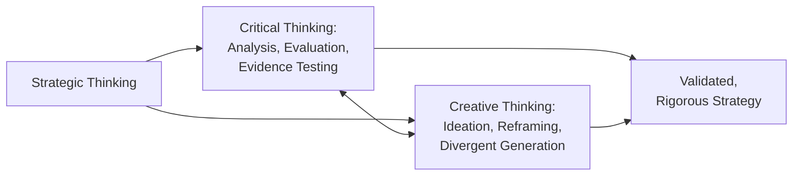
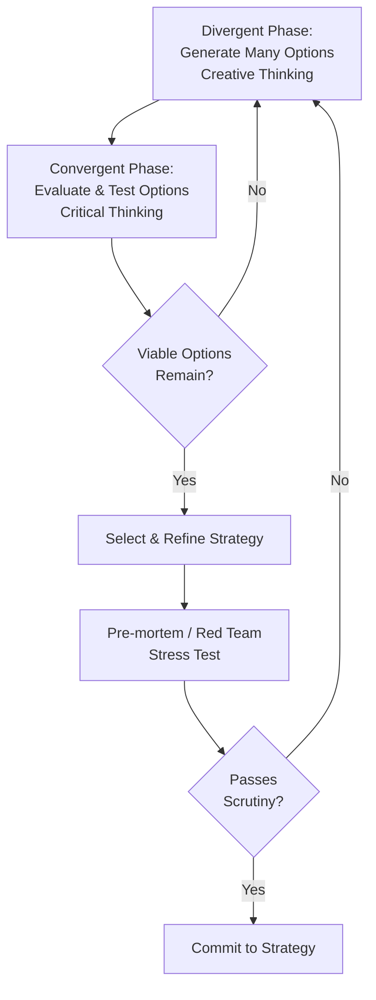

## Critical and Creative Thinking for Strategists

### Overview

Strategic thinking rests on two complementary cognitive modes: **critical thinking**, which rigorously analyzes, evaluates, and tests assumptions and evidence; and **creative thinking**, which generates novel possibilities and reframes problems beyond conventional patterns. Effective strategists deliberately cycle between these modes rather than relying exclusively on either — pure critical thinking without creativity produces incremental optimization within existing paradigms, while pure creativity without critical rigor produces unvalidated, unworkable ideas.

### Critical Thinking in Strategy

#### Core Elements

**Key Points**

- **Assumption identification**: surfacing implicit assumptions underlying a strategic argument (e.g., "we assume the market will keep growing at 8% annually") so they can be explicitly tested rather than silently accepted.
- **Evidence evaluation**: assessing the quality, relevance, and reliability of data supporting a strategic claim, distinguishing correlation from causation.
- **Logical consistency**: checking that strategic conclusions follow validly from premises, and that different parts of a strategy do not contradict one another.
- **Bias awareness**: recognizing cognitive biases that distort strategic judgment (confirmation bias, sunk-cost fallacy, overconfidence, anchoring, groupthink).
- **Devil's advocacy / red-teaming**: deliberately assigning individuals or teams to challenge a proposed strategy, surfacing weaknesses before commitment.

#### Common Cognitive Biases Affecting Strategic Decisions

**Key Points**

| Bias | Description | Strategic Risk |
| --- | --- | --- |
| Confirmation bias | Favoring information that confirms existing beliefs | Ignoring disconfirming market signals |
| Sunk-cost fallacy | Continuing investment based on past (irrecoverable) costs | Persisting with failing strategies |
| Overconfidence | Overestimating the accuracy of one's judgments/forecasts | Underestimating risk in bold strategic bets |
| Anchoring | Over-relying on the first piece of information encountered | Distorted valuation or forecast estimates |
| Groupthink | Suppressing dissent to maintain group harmony | Homogeneous, unchallenged strategic decisions |
| Availability heuristic | Overweighting easily recalled/recent events | Overreacting to recent competitor moves or crises |

**Example**

A retail chain's leadership, having successfully expanded via a particular store format for a decade, continues opening new locations of that format even as e-commerce erodes foot traffic — confirmation bias and sunk-cost reasoning suppress critical reassessment of the underlying model.

#### Critical Thinking Frameworks

- **Toulmin's Argumentation Model**: structures strategic arguments into claim, grounds (evidence), warrant (the logical connection), and rebuttal (counter-considerations), making implicit reasoning explicit and testable.
- **Pre-mortem Analysis** (Gary Klein): before committing to a strategy, the team imagines it has already failed and works backward to identify plausible causes — surfaces risks that forward-looking analysis often misses.
- **Red Team / Blue Team exercises**: one group defends the proposed strategy (Blue Team) while another actively attacks its assumptions and logic (Red Team), stress-testing robustness.

### Creative Thinking in Strategy

#### Core Elements

**Key Points**

- **Divergent thinking**: generating a wide range of possible strategic options before narrowing down, resisting premature convergence on the first plausible idea.
- **Reframing**: viewing a strategic problem from a fundamentally different perspective (e.g., reframing "how do we beat competitor X" as "how do we make competitor X's advantage irrelevant").
- **Analogical reasoning**: drawing insight by mapping patterns from unrelated domains onto the strategic problem (e.g., applying biological ecosystem dynamics to platform business strategy).
- **Combinatorial creativity**: generating novelty by combining existing ideas, technologies, or business models in new configurations rather than inventing entirely from scratch.
- **Tolerance for ambiguity**: sustaining productive exploration of ill-defined problems without prematurely forcing a single "correct" answer.

#### Creative Thinking Techniques

**Key Points**

| Technique | Description | Strategic Use |
| --- | --- | --- |
| Brainstorming / Brainwriting | Generating many ideas without early judgment (verbally or in writing) | Broad option generation in strategy workshops |
| SCAMPER | Substitute, Combine, Adapt, Modify, Put to other use, Eliminate, Reverse — prompts for idea generation | Reworking existing business models or products |
| Six Thinking Hats (de Bono) | Structured role-based thinking (facts, emotions, caution, optimism, creativity, process) | Ensures multiple perspectives are deliberately considered in strategy sessions |
| Scenario Planning | Constructing multiple plausible future narratives to stress-test strategic options | Preparing strategy for a range of uncertain futures |
| Blue Ocean "Four Actions Framework" | Eliminate, Reduce, Raise, Create — reconstructing value curves | Escaping direct competition by reshaping the value proposition |
| Design Thinking | Empathize, Define, Ideate, Prototype, Test — human-centered iterative problem-solving | Reframing strategy around unmet customer needs |

**Example**

Applying SCAMPER to a legacy print publisher: "Put to other use" prompts the question of whether decades of archived content could be repurposed as a licensed data asset for AI training — a creative reframing distinct from incremental improvements to the print business itself.

### The Critical-Creative Cycle in Practice

**Key Points**

- Effective strategy sessions deliberately separate divergent (creative, judgment-suspended) phases from convergent (critical, evaluative) phases — mixing them prematurely tends to suppress creative output, since critical evaluation inhibits free idea generation.
- Iteration between the two modes is expected and healthy — a strategy that fails critical stress-testing should trigger a return to creative reframing rather than forced acceptance of a flawed option.

### Relationship to Mintzberg's Schools of Thought

**Key Points**

- **Critical thinking** aligns closely with the Positioning School's analytical rigor and the Planning School's systematic evaluation stages.
- **Creative thinking** aligns closely with the Entrepreneurial School's visionary leaps and the Cognitive School's subjectivist wing (strategy as a constructed, reframed interpretation of reality).
- The **Cognitive School** most directly studies the mental processes underlying both modes — examining how strategists' mental frames both enable creative reframing and can produce critical-thinking-distorting biases.
- [Inference] Mintzberg's broader argument that strategy-making benefits from combining "left-brain" (analytical) and "right-brain" (intuitive/creative) processes closely parallels this critical-creative distinction, suggesting the two capacities are complementary rather than substitutable in effective strategic practice.

### Organizational Practices Supporting Both Modes

- **Diverse team composition**: cognitively and experientially diverse teams tend to generate both a wider range of creative options and more rigorous critical scrutiny of those options, since differing perspectives challenge shared assumptions.
- **Psychological safety**: team members must feel safe voicing unconventional ideas (supporting creativity) and dissenting critiques (supporting critical thinking) without fear of punishment.
- **Structured facilitation**: techniques like Six Thinking Hats or formally separated brainstorming/evaluation sessions help prevent premature convergence or unchecked groupthink.
- **Dedicated "devil's advocate" roles**: institutionalizing critical challenge (e.g., a rotating red-team role) counteracts natural organizational tendencies toward consensus-seeking.

### Common Pitfalls

- **Premature convergence**: critically evaluating ideas too early in the process suppresses the volume and novelty of creative options generated.
- **Unchecked creativity**: generating bold strategic options without subsequent rigorous testing risks costly commitment to unworkable ideas.
- **False dichotomy**: treating critical and creative thinking as opposing skill sets possessed by different specialists (the "analyst" vs. the "visionary"), rather than cultivating both capacities within strategists and teams.
- [Inference] Organizations with strong analytical cultures (e.g., heavily quantitative, finance-driven firms) may be more prone to over-indexing on critical thinking at creativity's expense, while organizations with strong innovation cultures may show the reverse pattern — though the degree of this tendency likely varies significantly by firm and industry.

### Applications in Strategic Management Practice

- Strategy off-sites commonly structure agendas to explicitly separate creative ideation sessions from critical evaluation/prioritization sessions.
- Pre-mortem analysis is increasingly used before major strategic commitments (acquisitions, market entries) as a lightweight critical-thinking safeguard.
- Scenario planning combines both modes directly — creatively constructing plausible divergent futures, then critically assessing strategic robustness against each.

### Related Topics

- Cognitive School (Mintzberg's Ten Schools)
- Cognitive Biases in Strategic Decision-Making
- Scenario Planning Methodology
- Blue Ocean Strategy and Value Innovation
- Design Thinking for Business Strategy
- Pre-mortem Analysis and Risk Anticipation
- Six Thinking Hats and Structured Facilitation Techniques
- Entrepreneurial School and Visionary Leadership