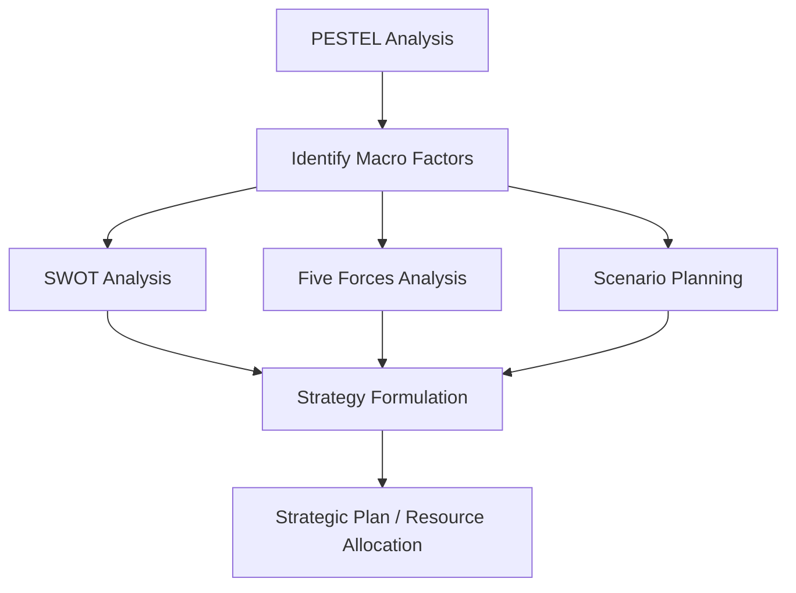

## PESTEL Analysis Framework

### Overview

PESTEL (also PEST, PESTLE, or STEEPLE in variant forms) is a macro-environmental scanning framework used in strategic management to identify and analyze external forces that influence an organization's performance, strategy, and long-term viability. The acronym expands to: **P**olitical, **E**conomic, **S**ocial, **T**echnological, **E**nvironmental, and **L**egal factors.

The framework operates on the premise that firms do not compete in a vacuum. Strategy formulation (per Porter's positioning school and the broader industrial organization view of strategy) requires understanding not only industry-level competitive dynamics (addressed separately by Porter's Five Forces) but also the broader societal, governmental, and macroeconomic context that shapes industry structure itself. PESTEL sits at the macro-environmental layer of the standard three-tier environmental scanning model:

1. **Macro-environment** — PESTEL factors (broad, largely uncontrollable)
2. **Industry/competitive environment** — Five Forces, strategic groups
3. **Internal environment** — resources, capabilities, VRIO

### Purpose and Strategic Function

**Key Points**

- Identifies opportunities and threats (the "O" and "T" in SWOT) originating outside the firm's direct control
- Supports scenario planning and strategic foresight by surfacing trend trajectories
- Informs market entry decisions, particularly for international expansion
- Provides input into risk assessment and contingency planning
- Establishes contextual assumptions underlying financial forecasts and strategic plans

PESTEL analysis is typically not an end in itself; it is an input to subsequent frameworks. Common downstream integrations include feeding identified factors into a SWOT analysis, using them to stress-test Five Forces assumptions, or grounding scenario planning exercises where multiple PESTEL trajectories are combined into distinct future-state narratives.

### The Six Dimensions

#### Political Factors

Political factors capture the degree and nature of government intervention in the economy and in specific industries.

**Key Points**

- Government stability and political risk (coups, regime change, civil unrest)
- Tax policy (corporate tax rates, tax incentives, tariffs)
- Trade policy and international relations (trade agreements, sanctions, embargoes)
- Regulatory bodies and their enforcement posture
- Government spending priorities and subsidies
- Bureaucratic quality and ease of doing business
- Lobbying environment and industry-government relationships

**Example**

A pharmaceutical company evaluating entry into a new market must assess whether the national health authority favors generic drug substitution policies, since this directly affects pricing strategy and expected margins.

#### Economic Factors

Economic factors describe the macroeconomic conditions that affect consumer purchasing power, cost structures, and capital availability.

**Key Points**

- GDP growth rate and business cycle stage (expansion, peak, contraction, trough)
- Inflation rate and price stability
- Interest rates and cost of capital
- Exchange rate volatility (critical for exporters/importers)
- Unemployment rate and labor market tightness
- Disposable income levels and income distribution
- Access to credit and capital markets

**Example**

Rising interest rates increase the discount rate used in net present value (NPV) calculations for capital projects:

$$NPV = \sum_{t=0}^{n} \frac{CF_t}{(1+r)^t}$$

where an increase in $r$ (the cost of capital, influenced by central bank policy) reduces the present value of future cash flows $CF_t$, making previously viable expansion projects marginal or unattractive.

#### Social Factors

Social (sometimes "sociocultural") factors capture demographic and cultural shifts that affect demand patterns and workforce characteristics.

**Key Points**

- Demographic shifts (aging population, urbanization, migration)
- Cultural attitudes and values (attitudes toward work, consumption, sustainability)
- Lifestyle trends (health consciousness, remote work preferences)
- Education levels and skill availability in the labor pool
- Consumer behavior shifts (e.g., preference for experiences over goods)
- Social mobility and class structure

**Example**

The shift toward remote and hybrid work following 2020–2022 restructured demand for commercial real estate, corporate relocation services, and enterprise collaboration software, while also altering the geographic distribution of the available labor pool for knowledge-work employers.

#### Technological Factors

Technological factors assess the rate and direction of innovation relevant to the industry, including disruptive threats.

**Key Points**

- Rate of technological change and innovation cycles
- Automation and its effect on cost structures
- R&D activity, both industry-wide and government-funded
- Technology adoption lifecycle position (per Rogers' diffusion of innovation)
- Emergence of substitute technologies (a direct link to Porter's "threat of substitutes")
- Intellectual property regimes and patent activity
- Digital infrastructure maturity (broadband penetration, cloud availability)

**Example**

The maturation of large language model APIs materially lowered the cost of building conversational customer-support tooling; firms that delayed technology adoption assessment in this category faced a widening cost-structure gap against early adopters. [Inference — the magnitude and timing of competitive impact vary by industry and firm-specific execution]

#### Environmental Factors

Environmental factors (ecological factors) have grown in strategic weight due to climate policy, resource scarcity, and stakeholder pressure (ESG — Environmental, Social, Governance).

**Key Points**

- Climate change policy and carbon pricing mechanisms (cap-and-trade, carbon taxes)
- Resource scarcity and raw material availability
- Waste management and circular economy regulations
- Consumer and investor pressure for sustainability disclosure
- Physical climate risk (extreme weather affecting supply chains)
- Environmental compliance costs

**Example**

An apparel manufacturer sourcing cotton must evaluate water-stress projections in growing regions, since prolonged drought can disrupt raw material supply chains years before it appears as a line-item cost.

#### Legal Factors

Legal factors are distinct from political factors: political factors describe the policy-making process and government posture, while legal factors describe the specific, codified rules the firm must comply with.

**Key Points**

- Employment law (minimum wage, working hours, worker classification)
- Consumer protection law
- Antitrust and competition law
- Health and safety regulation
- Data protection and privacy law (e.g., GDPR-type regimes)
- Industry-specific licensing requirements
- Intellectual property law enforcement

**Example**

Data protection statutes that mandate specific consent mechanisms and data portability rights directly constrain product design choices for any firm handling personal data, independent of that firm's political risk exposure in the jurisdiction.

### Political vs. Legal: A Common Point of Confusion

**Key Points**

- Political = the direction, stability, and intent of the governing body (forward-looking, discretionary)
- Legal = the codified, currently enforceable rules (backward-looking, binding)
- A change in political factors (e.g., a new administration) is often a leading indicator of future legal factors (new legislation)

### Relationship to Other Strategic Frameworks

- **PESTEL → SWOT**: Political, economic, social, technological, environmental, and legal findings populate the Opportunities and Threats quadrants
- **PESTEL → Five Forces**: Macro factors can shift industry structure — e.g., deregulation (political/legal) lowers barriers to entry; a carbon tax (environmental) raises supplier costs industry-wide
- **PESTEL → Scenario Planning**: Where a single factor's future trajectory is highly uncertain (e.g., trade policy), multiple PESTEL-informed scenarios are constructed rather than a single forecast

### Methodology: Conducting a PESTEL Analysis

**Steps**

1. **Define scope** — specify the geographic market, time horizon, and industry boundary being analyzed
2. **Gather data** — use secondary sources (government statistics, industry reports, trade publications) and primary sources (expert interviews) for each of the six categories
3. **Identify factors** — list specific, named factors under each category rather than generic statements (e.g., "EU Carbon Border Adjustment Mechanism" rather than "environmental regulation")
4. **Assess impact and probability** — rate each factor's likely magnitude of impact on the firm and its probability of occurring, often on a simple High/Medium/Low scale or a numeric matrix
5. **Prioritize** — filter to the factors with the highest combined impact and probability
6. **Integrate** — feed prioritized factors into SWOT, Five Forces, or scenario planning as appropriate
7. **Monitor** — establish a recurring review cadence, since macro-environmental factors shift over time (PESTEL is a snapshot, not a static artifact)

### Impact-Probability Prioritization Matrix (svg_diagram)

<svg xmlns="http://www.w3.org/2000/svg" viewBox="0 0 520 400" font-family="Helvetica, Arial, sans-serif">
<text x="260" y="20" text-anchor="middle" font-size="15" font-weight="bold" fill="#1a1a1a">PESTEL Factor Impact-Probability Matrix (svg_diagram)</text>

<line x1="80" y1="350" x2="480" y2="350" stroke="#333" stroke-width="2" />
<line x1="80" y1="350" x2="80" y2="50" stroke="#333" stroke-width="2" />

<text x="280" y="380" text-anchor="middle" font-size="13" fill="#333">Probability of Occurrence →</text>

<text x="30" y="200" text-anchor="middle" font-size="13" fill="#333" transform="rotate(-90 30 200)">Impact on Firm →</text>

<line x1="280" y1="50" x2="280" y2="350" stroke="#ccc" stroke-dasharray="4,4" />
<line x1="80" y1="200" x2="480" y2="200" stroke="#ccc" stroke-dasharray="4,4" />

<text x="380" y="100" text-anchor="middle" font-size="12" fill="`#b02a2a`" font-weight="bold">Monitor Closely</text>

<text x="380" y="115" text-anchor="middle" font-size="10" fill="#555">(High Impact, High Prob.)</text>

<text x="180" y="100" text-anchor="middle" font-size="12" fill="`#b0722a`" font-weight="bold">Contingency Plan</text>

<text x="180" y="115" text-anchor="middle" font-size="10" fill="#555">(High Impact, Low Prob.)</text>

<text x="380" y="280" text-anchor="middle" font-size="12" fill="`#2a7a2a`" font-weight="bold">Track Periodically</text>

<text x="380" y="295" text-anchor="middle" font-size="10" fill="#555">(Low Impact, High Prob.)</text>

<text x="180" y="280" text-anchor="middle" font-size="12" fill="#555" font-weight="bold">Low Priority</text>

<text x="180" y="295" text-anchor="middle" font-size="10" fill="#555">(Low Impact, Low Prob.)</text>

<circle cx="400" cy="90" r="6" fill="#c0392b" />
<text x="410" y="85" font-size="10" fill="#333">Carbon tax (E)</text>
<circle cx="200" cy="140" r="6" fill="#d35400" />
<text x="210" y="135" font-size="10" fill="#333">Trade embargo (P)</text>
<circle cx="360" cy="250" r="6" fill="#27ae60" />
<text x="370" y="245" font-size="10" fill="#333">Wage inflation (Eco)</text>
<circle cx="150" cy="320" r="6" fill="#7f8c8d" />
<text x="160" y="315" font-size="10" fill="#333">Minor labeling law (L)</text>
</svg>

### Worked Example: Applying PESTEL to a Ride-Sharing Platform Entering a New National Market

| Factor | Category | Assessment |
| --- | --- | --- |
| Licensing regime for transport network companies | Political/Legal | High impact; requires regulatory lobbying strategy before launch |
| Fuel subsidy policy | Economic | Affects driver cost structure and platform commission viability |
| Urban population density and smartphone penetration | Social/Technological | Determines addressable market size and adoption speed |
| Worker classification law (employee vs. contractor) | Legal | Directly affects unit economics via labor cost and benefits obligations |
| Emissions standards for vehicle fleets | Environmental | Long-term constraint on vehicle sourcing; may require EV incentive alignment |
| Payment infrastructure maturity | Technological | Determines whether cash, card, or mobile wallet rails must be built first |

**Conclusion**

This example illustrates that individual PESTEL factors rarely operate in isolation — the worker classification (legal) factor interacts directly with the economic factor of driver cost structure, and the political factor of licensing determines whether the venture can operate at all prior to any economic analysis being relevant.

### Limitations and Critiques

**Key Points**

- **Static snapshot problem**: a PESTEL analysis reflects conditions at the time of analysis and can become outdated quickly in volatile environments
- **Lacks weighting mechanism**: the basic framework does not inherently prioritize factors; analysts must layer on impact-probability scoring themselves
- **Data quality dependency**: analysis quality is bounded by the quality and recency of available macro data sources
- **Risk of superficial application**: practitioners can generate long factor lists without synthesis, producing a list rather than actionable insight — the "output" of PESTEL is only useful if translated into implications for strategy
- **No causal modeling**: PESTEL identifies factors but does not model interactions or second-order effects between them; scenario planning is typically needed to address this
- **Boundary ambiguity**: some factors are difficult to cleanly categorize (e.g., cybersecurity regulation spans Technological and Legal)

[Unverified] — No universally agreed-upon quantitative weighting scheme for PESTEL factors exists in the academic literature; weighting approaches are typically firm- or industry-specific and vary by consulting methodology.

### Variants of the Framework

**Key Points**

- **PEST** — the original four-factor version (Political, Economic, Social, Technological), predating explicit inclusion of Environmental and Legal
- **PESTLE** — identical to PESTEL, differing only in acronym ordering convention (common in UK-originated literature)
- **STEEPLE** — adds Ethical factors as a distinct seventh category
- **STEEPLED** — adds both Ethical and Demographic as distinct categories
- **SLEPT** — an early reordering emphasizing Social and Legal factors first

### Related Topics

- Porter's Five Forces Framework
- SWOT Analysis
- Scenario Planning and Strategic Foresight
- Industry Life Cycle Analysis
- Strategic Group Mapping
- VRIO Framework (internal resource analysis, complementary to PESTEL's external focus)
- Political Risk Analysis and Country Risk Ratings
- ESG (Environmental, Social, Governance) Reporting Frameworks
- Diffusion of Innovation Theory (Rogers)
- Global Market Entry Strategy Frameworks