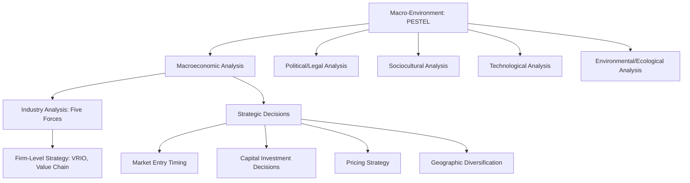
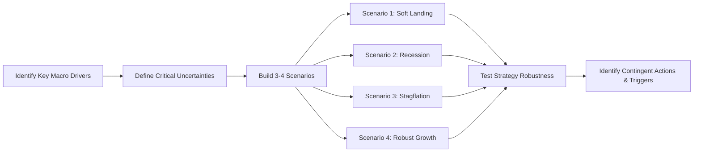
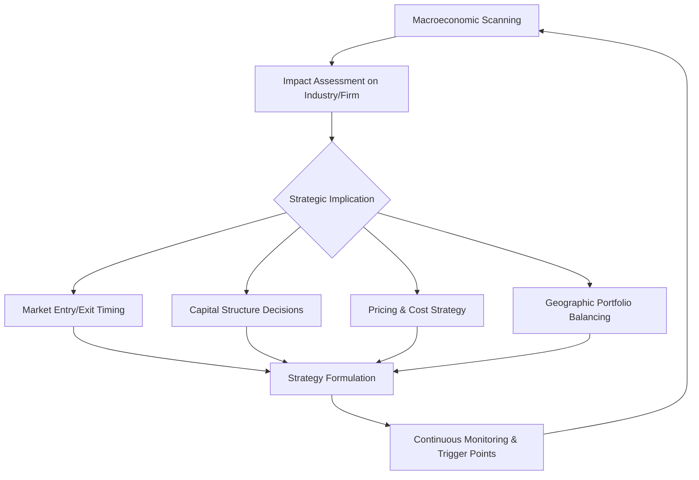

## Macroeconomic Analysis for Strategic Planning

### Definition and Strategic Purpose

Macroeconomic analysis is the systematic study of economy-wide variables—growth, inflation, interest rates, employment, exchange rates, and fiscal/monetary policy—to identify how broad economic forces shape an organization's opportunities and threats. Within strategic management, it forms a core pillar of external environment analysis (alongside industry/competitive analysis), feeding directly into frameworks like PESTEL, SWOT, and scenario planning. The purpose is not to forecast the economy with precision but to build strategic sensitivity: understanding how macroeconomic shifts alter demand, cost structures, capital availability, and competitive dynamics.

Macroeconomic analysis operates at the broadest layer of the external environment, above industry structure (Porter's Five Forces) and above firm-specific factors (VRIO, value chain). It answers: "What economic conditions will our strategy have to survive and succeed in?"

### Position in the External Environment Hierarchy

### Core Macroeconomic Variables

**Key Points**

- **GDP growth rate**: Indicates aggregate demand trajectory; strategists use it to forecast market size expansion or contraction across sectors.
- **Inflation rate (CPI/PPI)**: Affects input costs, pricing power, real wages, and purchasing behavior; high inflation compresses margins unless pricing power exists.
- **Interest rates (policy rate, yield curve)**: Determine cost of capital, discount rates for NPV/valuation, borrowing feasibility, and consumer credit-driven demand (housing, autos).
- **Unemployment rate**: Signals labor market tightness, wage pressure, and consumer discretionary spending capacity.
- **Exchange rates**: Critical for firms with cross-border revenue, costs, or competition; currency appreciation/depreciation alters competitiveness and translated earnings.
- **Fiscal policy**: Government spending and taxation influence disposable income, public-sector demand, and industry subsidies/regulation.
- **Monetary policy**: Central bank actions (rate changes, quantitative easing/tightening) shape liquidity, credit availability, and asset prices.
- **Business cycle phase**: Expansion, peak, contraction, trough—each phase implies different strategic postures (aggressive growth vs. defensive consolidation).
- **Trade balance and current account**: Reflects structural competitiveness and currency pressure over time.
- **Consumer/business confidence indices**: Leading indicators of near-term spending and investment intentions.

### Analytical Frameworks

**PESTEL (Macroeconomic Component)**

Macroeconomic analysis constitutes the "E" (Economic) in PESTEL. Analysts scan and rate the impact/uncertainty of each economic variable on the specific industry and firm, often using an Issues Priority Matrix (impact × probability) to focus attention on high-impact, high-uncertainty factors.

**Business Cycle Analysis**

Strategy adapts to cycle phase:

| Cycle Phase | Demand Pattern | Typical Strategic Response |
| --- | --- | --- |
| Expansion | Rising demand, easy credit | Capacity expansion, market entry, aggressive investment |
| Peak | Demand plateau, tight labor market | Efficiency focus, selective investment, margin protection |
| Contraction | Falling demand, credit tightening | Cost control, portfolio pruning, cash preservation |
| Trough | Demand bottoming, low asset prices | Opportunistic M&A, counter-cyclical investment |

**Leading, Lagging, and Coincident Indicators**

- **Leading indicators** (predict future activity): stock market indices, new orders, building permits, yield curve slope, consumer confidence.
- **Coincident indicators** (move with the economy): GDP, industrial production, personal income, retail sales.
- **Lagging indicators** (confirm trends after the fact): unemployment rate, CPI, corporate profits.

Strategists prioritize leading indicators for proactive positioning and use coincident/lagging indicators to validate whether an anticipated turn has actually occurred.

**Scenario Planning**

Because macroeconomic forecasting has inherently wide error bands, strategists build multiple plausible futures (e.g., soft landing, recession, stagflation) rather than a single-point forecast, then stress-test strategy against each. This is standard practice in strategic planning under uncertainty (Shell's scenario planning methodology is the classic reference case).

### The Yield Curve as a Strategic Signal

The yield curve—the relationship between interest rates and bond maturities—is widely used as a forward-looking macroeconomic indicator. Normally upward-sloping (long-term rates > short-term rates), an inversion (short-term > long-term) has historically preceded many recessions, though the timing lag varies and false signals occur. [Inference: the predictive lead time and reliability of yield curve inversion signals vary across economic cycles and should not be treated as a precise forecasting tool.]

$$\text{Term Spread} = r_{10yr} - r_{2yr}$$

A negative term spread is commonly monitored by corporate strategy and treasury functions as an early warning signal for tightening credit conditions.

### Quantitative Tools for Strategic Forecasting

**Elasticity Analysis**

Firms estimate how demand responds to macroeconomic changes, particularly income elasticity of demand:

$$E_i = \frac{\%\Delta Q_d}{\%\Delta \text{Income}}$$

- $E_i > 1$: Luxury/discretionary goods—highly sensitive to GDP growth and recessions (e.g., travel, luxury retail).
- $0 < E_i < 1$: Necessity goods—demand grows slower than income (e.g., groceries, utilities).
- $E_i < 0$: Inferior goods—demand falls as income rises (e.g., discount retailers may see counter-cyclical gains).

This classification helps strategists determine which business lines are cyclical versus defensive.

**Real vs. Nominal Adjustments**

Strategic financial projections must distinguish nominal from real values to avoid inflation distorting decision-making:

$$r_{real} \approx r_{nominal} - \pi$$

where $\pi$ is the inflation rate (Fisher approximation). For more precision:

$$1 + r_{real} = \frac{1 + r_{nominal}}{1 + \pi}$$

**Purchasing Power Parity (PPP)**

For firms evaluating international market attractiveness or currency exposure:

$$S = \frac{P_{domestic}}{P_{foreign}}$$

where $S$ is the theoretical exchange rate implied by relative price levels—useful for long-run currency valuation assessment, though short-run rates deviate substantially due to capital flows and speculation.

### Macroeconomic Sensitivity Analysis (Practical Example)

**Example**

A mid-sized industrial equipment manufacturer conducts macroeconomic sensitivity analysis before a five-year capacity expansion decision:

1. **Baseline scenario**: GDP growth 2.2%, inflation 2.5%, policy rate 3.5% → projected revenue growth 6% annually.
2. **Stress scenario (recession)**: GDP contracts -1.5%, unemployment rises to 7%, policy rate cut to 1% → projected revenue growth falls to -8%, but lower rates reduce financing costs for the expansion.
3. **Stress scenario (stagflation)**: GDP growth 0.5%, inflation 6%, policy rate held at 5.5% → input costs rise sharply while demand stagnates and financing costs stay high—identified as the worst-case scenario for the capital project.

**Output**: The firm sets a trigger-based contingency plan: if the yield curve inverts and leading indicators (new orders index, ISM PMI) fall below 45 for two consecutive quarters, capital expenditure is phased rather than committed in full, preserving optionality.

### Macroeconomic Analysis Across the Strategy Process

### Sectoral Sensitivity to Macroeconomic Cycles (SVG Diagram)

<svg xmlns="http://www.w3.org/2000/svg" viewBox="0 0 760 420" font-family="Arial, sans-serif">
<text x="380" y="30" text-anchor="middle" font-size="18" font-weight="bold" fill="#1a1a1a">Sector Sensitivity to the Business Cycle (svg_diagram)</text>
<line x1="80" y1="360" x2="720" y2="360" stroke="#333" stroke-width="2" />
<line x1="80" y1="360" x2="80" y2="60" stroke="#333" stroke-width="2" />
<text x="400" y="400" text-anchor="middle" font-size="13" fill="#333">Business Cycle Sensitivity (Low → High)</text>
<text x="35" y="220" text-anchor="middle" font-size="13" fill="#333" transform="rotate(-90 35 220)">Sector</text>
<rect x="90" y="80" width="120" height="30" fill="#4a7c59" />
<text x="220" y="100" font-size="13" fill="#1a1a1a">Utilities (Defensive)</text>
<rect x="90" y="130" width="180" height="30" fill="#4a7c59" />
<text x="280" y="150" font-size="13" fill="#1a1a1a">Consumer Staples (Defensive)</text>
<rect x="90" y="180" width="220" height="30" fill="#7c9d4a" />
<text x="320" y="200" font-size="13" fill="#1a1a1a">Healthcare (Mildly Defensive)</text>
<rect x="90" y="230" width="340" height="30" fill="#c9a227" />
<text x="440" y="250" font-size="13" fill="#1a1a1a">Technology (Moderately Cyclical)</text>
<rect x="90" y="280" width="450" height="30" fill="#c9682f" />
<text x="550" y="300" font-size="13" fill="#1a1a1a">Industrials (Cyclical)</text>
<rect x="90" y="330" width="580" height="30" fill="#a33b2c" />
<text x="600" y="322" font-size="13" fill="#1a1a1a" text-anchor="end">Luxury Goods / Travel / Real Estate (Highly Cyclical)</text>
</svg>

### Data Sources for Macroeconomic Scanning

- **National statistical agencies**: e.g., Bureau of Economic Analysis (BEA), Bureau of Labor Statistics (BLS) for the US; equivalent national statistics offices elsewhere.
- **Central banks**: Federal Reserve, European Central Bank, Bangko Sentral ng Pilipinas—publish policy rates, minutes, and forward guidance.
- **International organizations**: IMF (World Economic Outlook), World Bank, OECD Economic Outlook—useful for cross-country comparison and global growth projections.
- **Leading indices**: Purchasing Managers' Index (PMI), Conference Board Leading Economic Index.
- **Market-based indicators**: Bond yields, credit spreads, commodity prices, currency futures.

[Unverified: Specific current data values and forecasts should always be verified against the latest releases from these sources, as macroeconomic data is revised frequently and conditions change continuously.]

### Common Pitfalls in Macroeconomic Analysis

- **Point-forecast overreliance**: Treating a single GDP or inflation forecast as certain rather than building a range of scenarios.
- **Ignoring lag effects**: Monetary policy changes typically affect the real economy with a lag of multiple quarters; strategists who expect immediate effects misjudge timing.
- **Conflating correlation with causation**: Historical indicator relationships (e.g., yield curve inversions) are probabilistic patterns, not deterministic laws.
- **Domestic bias**: Multinational firms failing to conduct macroeconomic analysis per relevant geography, missing divergent regional cycles.
- **Static analysis**: Treating macroeconomic conditions as fixed inputs rather than continuously monitoring and updating strategic assumptions.

### Integration with Strategic Decision-Making

**Conclusion**

Macroeconomic analysis is not a standalone forecasting exercise but an input discipline that conditions nearly every major strategic decision—market entry timing, capital budgeting discount rates, pricing latitude, workforce planning, and geographic diversification. Its strategic value lies less in precise prediction and more in building organizational sensitivity: recognizing regime shifts early, stress-testing strategy against multiple macroeconomic futures, and establishing trigger points that convert monitoring into timely action. Firms that embed macroeconomic scanning into routine strategic review cycles (typically quarterly, aligned with GDP and central bank releases) are better positioned to exploit downturns as consolidation opportunities and expansions as growth windows, rather than reacting only after the cycle has already turned.

**Related Topics**

- PESTEL Analysis (full framework, not limited to economic factors)
- Industry Life Cycle Analysis
- Porter's Five Forces and Competitive Environment Analysis
- Scenario Planning and Strategic Foresight
- Political and Regulatory Risk Analysis
- Country Risk Assessment for Market Entry
- Currency Risk Management and Hedging Strategy
- Capital Budgeting Under Macroeconomic Uncertainty
- Competitive Dynamics During Recessions
- Global Value Chain Reconfiguration and Economic Shocks